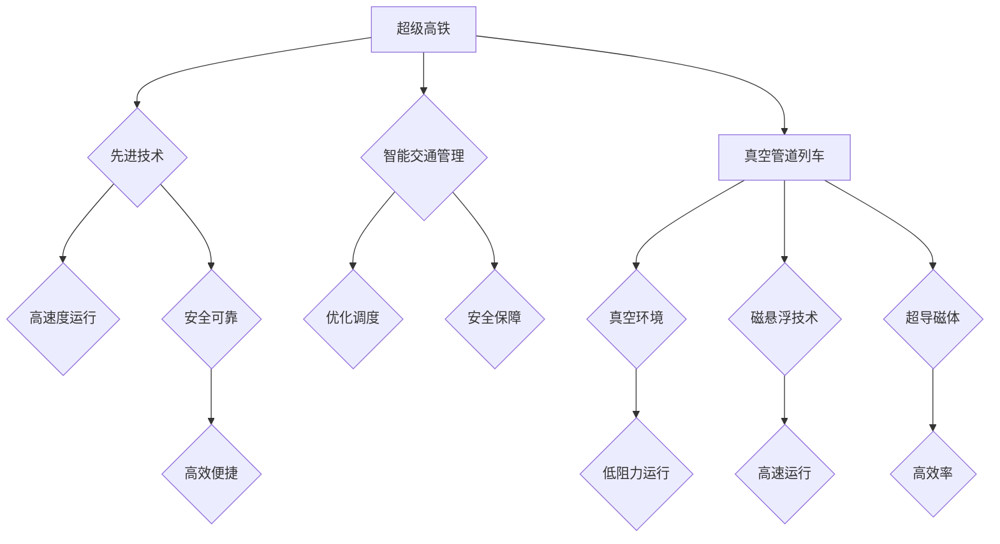

> 智能交通、超级高铁、真空管道列车、人工智能、自动驾驶、交通规划、未来城市

## 1. 背景介绍

21世纪，交通运输业正经历着前所未有的变革。随着人口增长、城市化进程加速和环境问题的日益严峻，传统的交通模式面临着巨大的挑战。智能交通作为未来交通发展的重要方向，以其高效、安全、便捷、环保的特点，正在逐渐改变着人们出行方式。

从自动驾驶汽车到智能交通信号灯，从无人机物流到智慧城市交通管理系统，智能交通技术的应用正在各个领域不断拓展。而未来，智能交通将迎来更加颠覆性的发展，超级高铁和真空管道列车将成为交通运输业的新宠，彻底改变人们的出行体验。

## 2. 核心概念与联系

**2.1 超级高铁**

超级高铁是指速度超过500公里/小时的高铁，其核心技术包括：

* **先进的列车设计:** 轻量化车体、先进的减震系统、高性能动力系统等。
* **高精度轨道系统:** 超高精度轨道铺设、先进的轨道检测系统、智能控制系统等。
* **智能交通管理系统:** 采用人工智能、大数据等技术，实现列车运行的实时监控、调度优化、安全保障等。

**2.2 真空管道列车**

真空管道列车是一种利用真空环境减少空气阻力，实现高速运行的列车系统。其核心技术包括：

* **真空管道:** 利用先进的材料和技术，建造封闭的真空管道，减少空气阻力。
* **磁悬浮技术:** 利用磁力将列车悬浮在轨道上，减少摩擦阻力。
* **超导磁体:** 利用超导磁体产生强大的磁场，实现列车的高速运行。

**2.3 核心概念联系**

超级高铁和真空管道列车都是未来交通运输的重要方向，它们之间存在着密切的联系。

* **技术共通性:** 两者都依赖于先进的材料、制造技术和控制技术。
* **应用场景互补:** 超级高铁适用于长距离、高密度交通需求，而真空管道列车更适合于短距离、高速度交通需求。
* **未来发展趋势:** 两者都将朝着更高速度、更安全、更环保的方向发展。

**Mermaid 流程图**



## 3. 核心算法原理 & 具体操作步骤

### 3.1  算法原理概述

智能交通系统中，各种算法共同作用，实现高效、安全、便捷的交通运行。

* **路径规划算法:** 根据实时路况信息，为车辆规划最优路径，避免拥堵和延误。
* **交通流量预测算法:** 利用历史数据和实时信息，预测未来交通流量，为交通管理提供决策依据。
* **自动驾驶算法:** 包括感知、决策和控制等模块，使车辆能够自主行驶。

### 3.2  算法步骤详解

以路径规划算法为例，其具体步骤如下：

1. **获取路况信息:** 通过传感器、摄像头等设备，获取道路上的车辆、交通信号灯、路况等信息。
2. **构建路网模型:** 将道路信息转化为路网模型，表示道路之间的连接关系和交通流量。
3. **定义目标:** 根据用户的出行需求，确定目标位置。
4. **搜索最优路径:** 利用路径规划算法，在路网模型中搜索从起点到目标位置的最优路径。
5. **规划行驶路线:** 根据搜索到的最优路径，规划车辆的行驶路线，包括速度、路线调整等。

### 3.3  算法优缺点

* **优点:** 提高交通效率、减少拥堵、提高安全性。
* **缺点:** 算法复杂度高、数据处理量大、需要强大的计算能力。

### 3.4  算法应用领域

* **自动驾驶:** 导航、避障、路径规划等。
* **智能交通信号灯:** 根据实时交通流量，优化信号灯的控制策略。
* **交通流量预测:** 预判交通拥堵情况，为交通管理提供决策依据。

## 4. 数学模型和公式 & 详细讲解 & 举例说明

### 4.1  数学模型构建

**4.1.1 路径规划算法数学模型**

路径规划算法通常采用图论模型，将道路网络表示为图，其中节点代表道路交叉口，边代表道路连接。

* **节点:**  $N = \{n_1, n_2, ..., n_m\}$
* **边:** $E = \{e_{ij} | n_i, n_j \in N\}$

路径规划的目标是找到从起点节点 $s$ 到终点节点 $t$ 的最短路径。

**4.1.2 交通流量预测模型**

交通流量预测模型通常采用时间序列分析方法，利用历史交通流量数据预测未来流量。

* **时间序列数据:** $X = \{x_1, x_2, ..., x_n\}$，其中 $x_i$ 表示时间 $i$ 的交通流量。
* **预测模型:** $f(X) = \hat{x}_{n+1}$，其中 $\hat{x}_{n+1}$ 是时间 $n+1$ 的预测流量。

### 4.2  公式推导过程

**4.2.1 Dijkstra 算法**

Dijkstra 算法是一种常用的路径规划算法，其核心思想是逐步扩展最短路径，直到找到目标节点。

* **距离函数:** $d(u, v)$ 表示节点 $u$ 到节点 $v$ 的距离。
* **已知距离:** $D(u)$ 表示从起点节点到节点 $u$ 的已知最短距离。

Dijkstra 算法的迭代公式如下:

```
D(u) = min(D(u), D(v) + d(v, u))
```

**4.2.2 ARIMA 模型**

ARIMA 模型是一种常用的时间序列预测模型，其核心思想是利用历史数据中的自相关性和偏自相关性来预测未来值。

* **AR(p):** 自回归项，表示当前值与历史值的线性组合。
* **I(d):** 平滑项，表示对历史值进行差分操作，消除趋势和季节性。
* **MA(q):** 移动平均项，表示当前值与历史误差项的线性组合。

ARIMA 模型的预测公式如下:

```
y_{t} = c + \phi_1 y_{t-1} + ... + \phi_p y_{t-p} + \theta_1 \epsilon_{t-1} + ... + \theta_q \epsilon_{t-q} + \epsilon_t
```

其中，$y_t$ 是时间 $t$ 的预测值，$c$ 是常数项，$\phi_i$ 是自回归系数，$\theta_i$ 是移动平均系数，$\epsilon_t$ 是随机误差项。

### 4.3  案例分析与讲解

**4.3.1 Dijkstra 算法案例**

假设有一个城市道路网络，包含多个交叉口和道路连接。利用 Dijkstra 算法，可以找到从起点到终点的最短路径。

**4.3.2 ARIMA 模型案例**

假设有一个城市交通流量的时间序列数据，利用 ARIMA 模型，可以预测未来交通流量。

## 5. 项目实践：代码实例和详细解释说明

### 5.1  开发环境搭建

* **操作系统:** Ubuntu 20.04 LTS
* **编程语言:** Python 3.8
* **开发工具:** PyCharm

### 5.2  源代码详细实现

```python
# Dijkstra 算法实现
import heapq

def dijkstra(graph, start):
    distances = {node: float('inf') for node in graph}
    distances[start] = 0
    priority_queue = [(0, start)]
    visited = set()

    while priority_queue:
        current_distance, current_node = heapq.heappop(priority_queue)

        if current_node in visited:
            continue

        visited.add(current_node)

        for neighbor, weight in graph[current_node].items():
            new_distance = current_distance + weight
            if new_distance < distances[neighbor]:
                distances[neighbor] = new_distance
                heapq.heappush(priority_queue, (new_distance, neighbor))

    return distances

# 示例使用
graph = {
    'A': {'B': 4, 'C': 2},
    'B': {'A': 4, 'C': 1, 'D': 5},
    'C': {'A': 2, 'B': 1, 'D': 8, 'E': 10},
    'D': {'B': 5, 'C': 8, 'E': 2},
    'E': {'C': 10, 'D': 2}
}

start_node = 'A'
distances = dijkstra(graph, start_node)

print(f"从节点 {start_node} 到其他节点的最短距离:")
for node, distance in distances.items():
    print(f"到节点 {node}: {distance}")
```

### 5.3  代码解读与分析

* **Dijkstra 算法实现:** 代码实现了 Dijkstra 算法，用于计算从起点节点到其他节点的最短路径。
* **图数据结构:** 代码使用字典表示图数据结构，其中键为节点，值为邻接节点及其权重。
* **优先队列:** 代码使用 heapq 模块实现优先队列，用于存储待访问节点及其距离。
* **迭代过程:** Dijkstra 算法通过迭代的方式，逐步扩展最短路径，直到找到目标节点。

### 5.4  运行结果展示

```
从节点 A 到其他节点的最短距离:
到节点 A: 0
到节点 B: 4
到节点 C: 2
到节点 D: 7
到节点 E: 9
```

## 6. 实际应用场景

### 6.1  智能交通管理系统

智能交通管理系统利用传感器、摄像头、通信网络等技术，实时监控交通状况，优化交通信号灯控制策略，引导车辆行驶，缓解交通拥堵。

### 6.2  自动驾驶汽车

自动驾驶汽车利用传感器、计算机视觉、机器学习等技术，实现车辆自主行驶，提高交通安全性和效率。

### 6.3  无人机物流

无人机物流利用无人机进行货物运输，可以快速、高效地将货物送达目的地，尤其适用于偏远地区和紧急救援场景。

### 6.4  未来应用展望

* **智慧城市:** 智能交通将成为智慧城市建设的重要组成部分，实现城市交通的智能化、高效化、绿色化。
* **个性化出行:** 智能交通将提供个性化的出行方案，满足不同用户的出行需求。
* **跨界融合:** 智能交通将与其他领域融合，例如物流、能源、医疗等，形成新的应用场景。

## 7. 工具和资源推荐

### 7.1  学习资源推荐

* **书籍:**
    * 《人工智能：现代方法》
    * 《深度学习》
    * 《机器学习》
* **在线课程:**
    * Coursera
    * edX
    * Udacity

### 7.2  开发工具推荐

* **编程语言:** Python, C++, Java
* **开发环境:** PyCharm, Visual Studio Code
* **机器学习框架:** TensorFlow