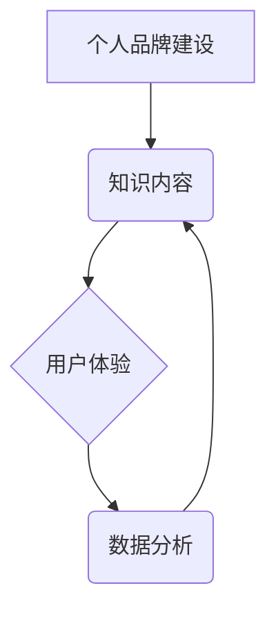

> 个人品牌，知识获取，APP开发，人工智能，数据分析，用户体验，内容推荐，个性化学习

## 1. 背景介绍

在当今信息爆炸的时代，获取高质量知识变得越来越重要。个人品牌APP作为一种新型的知识获取渠道，正逐渐受到人们的关注。它可以帮助个人建立自己的知识体系，分享自己的经验和见解，并与志同道合的人建立联系。

然而，开发一个成功的个人品牌APP并非易事。需要考虑用户需求、内容质量、技术实现、运营推广等多个方面。本文将从技术角度出发，探讨如何开发一个功能强大、用户体验良好的个人品牌APP，提供便捷的知识获取渠道。

## 2. 核心概念与联系

个人品牌APP的核心概念包括：

* **个人品牌建设:**  APP是个人展示自我、分享知识、建立影响力的平台。
* **知识内容:**  APP提供丰富的知识内容，涵盖多个领域，满足用户多样化的学习需求。
* **用户体验:**  APP界面简洁易用，操作流畅，能够提供良好的用户体验。
* **数据分析:**  APP收集用户行为数据，进行分析和挖掘，为个性化内容推荐和用户运营提供支持。

**核心概念架构图:**



## 3. 核心算法原理 & 具体操作步骤

### 3.1  算法原理概述

个人品牌APP的核心算法主要包括内容推荐算法、用户画像算法和个性化学习算法。

* **内容推荐算法:**  根据用户的兴趣爱好、阅读历史、浏览行为等数据，推荐相关的内容，提高用户粘性和参与度。常用的算法包括协同过滤、内容过滤和混合推荐算法。
* **用户画像算法:**  通过分析用户的行为数据，构建用户的兴趣爱好、知识水平、学习习惯等画像，为个性化内容推荐和用户运营提供依据。常用的算法包括聚类算法、关联规则挖掘算法和深度学习算法。
* **个性化学习算法:**  根据用户的学习进度、知识掌握情况、学习风格等信息，定制个性化的学习路径和学习内容，提高学习效率和效果。常用的算法包括知识图谱、路径规划算法和智能辅导系统。

### 3.2  算法步骤详解

**内容推荐算法步骤:**

1. 收集用户行为数据，包括阅读记录、点赞、评论、收藏等。
2. 利用协同过滤算法，根据用户的兴趣爱好和相似用户的行为，推荐相关内容。
3. 利用内容过滤算法，根据内容的主题、标签、关键词等信息，推荐与用户兴趣相关的文章、视频等。
4. 利用混合推荐算法，结合协同过滤和内容过滤算法，提高推荐的准确性和个性化程度。

**用户画像算法步骤:**

1. 收集用户的行为数据，包括注册信息、浏览记录、阅读记录、评论等。
2. 利用聚类算法，将用户按照兴趣爱好、知识水平、学习习惯等特征进行分组。
3. 利用关联规则挖掘算法，发现用户行为之间的关联关系，例如哪些用户同时阅读了哪些类型的文章。
4. 利用深度学习算法，构建用户的兴趣爱好、知识水平、学习习惯等多维度的用户画像。

**个性化学习算法步骤:**

1. 收集用户的学习进度、知识掌握情况、学习风格等信息。
2. 利用知识图谱，构建知识体系，并根据用户的学习进度，推荐相关的学习内容。
3. 利用路径规划算法，规划用户的学习路径，确保学习内容的逻辑性和循序渐进性。
4. 利用智能辅导系统，根据用户的学习情况，提供个性化的学习指导和帮助。

### 3.3  算法优缺点

**内容推荐算法:**

* **优点:**  能够根据用户的兴趣爱好推荐相关内容，提高用户粘性和参与度。
* **缺点:**  容易陷入“信息茧房”现象，用户只能看到自己感兴趣的内容，缺乏多元化视野。

**用户画像算法:**

* **优点:**  能够深入了解用户的兴趣爱好、知识水平、学习习惯等信息，为个性化内容推荐和用户运营提供依据。
* **缺点:**  需要收集大量的用户数据，并进行复杂的算法处理，存在数据隐私和安全问题。

**个性化学习算法:**

* **优点:**  能够根据用户的学习进度、知识掌握情况、学习风格等信息，定制个性化的学习路径和学习内容，提高学习效率和效果。
* **缺点:**  需要复杂的算法模型和大量的学习数据，开发和维护成本较高。

### 3.4  算法应用领域

* **教育领域:**  个性化学习、智能辅导、知识图谱构建等。
* **商业领域:**  精准营销、用户画像分析、内容推荐等。
* **医疗领域:**  疾病诊断、个性化治疗方案、健康管理等。

## 4. 数学模型和公式 & 详细讲解 & 举例说明

### 4.1  数学模型构建

**内容推荐算法的数学模型:**

假设用户集合为U，物品集合为I，用户对物品的评分矩阵为R。

* **协同过滤算法:**  利用用户的评分历史数据，计算用户之间的相似度，并推荐相似用户喜欢的物品。
    * 用户相似度计算公式:

$$
Sim(u_i, u_j) = \frac{\sum_{i \in I} R(u_i, i) * R(u_j, i)}{\sqrt{\sum_{i \in I} R(u_i, i)^2} * \sqrt{\sum_{i \in I} R(u_j, i)^2}}
$$

* **内容过滤算法:**  根据物品的特征向量，计算物品之间的相似度，并推荐与用户兴趣相似的物品。
    * 物品相似度计算公式:

$$
Sim(i_k, i_l) = \frac{\sum_{f \in F} V(i_k, f) * V(i_l, f)}{\sqrt{\sum_{f \in F} V(i_k, f)^2} * \sqrt{\sum_{f \in F} V(i_l, f)^2}}
$$

### 4.2  公式推导过程

**协同过滤算法的相似度计算公式推导:**

1. 计算用户u_i和u_j对物品i的评分。
2. 将用户u_i和u_j对所有物品的评分相乘，得到两个用户的评分向量之间的点积。
3. 将用户u_i和u_j对所有物品的评分平方和，得到两个用户的评分向量的模长。
4. 将点积除以两个向量的模长乘积，得到用户u_i和u_j之间的相似度。

**内容过滤算法的相似度计算公式推导:**

1. 计算物品i_k和i_l的特征向量。
2. 将两个特征向量的对应元素相乘，得到两个物品的特征向量之间的点积。
3. 将两个特征向量的每个元素平方和，得到两个物品的特征向量的模长。
4. 将点积除以两个向量的模长乘积，得到物品i_k和i_l之间的相似度。

### 4.3  案例分析与讲解

**案例分析:**

假设有一个用户评分矩阵R，其中用户集合为U = {u1, u2, u3}, 物品集合为I = {i1, i2, i3}, 评分矩阵为:

$$
R = \begin{bmatrix}
5 & 3 & 4 \\
4 & 5 & 2 \\
3 & 2 & 5
\end{bmatrix}
$$

**协同过滤算法:**

计算用户u1和u2之间的相似度:

$$
Sim(u1, u2) = \frac{(5 * 4) + (3 * 5) + (4 * 2)}{\sqrt{(5^2 + 3^2 + 4^2)} * \sqrt{(4^2 + 5^2 + 2^2)}} = 0.8
$$

**内容过滤算法:**

假设物品i1、i2、i3的特征向量分别为:

$$
V(i1) = [1, 0, 1]
V(i2) = [0, 1, 1]
V(i3) = [1, 1, 0]
$$

计算物品i1和i2之间的相似度:

$$
Sim(i1, i2) = \frac{(1 * 0) + (0 * 1) + (1 * 1)}{\sqrt{(1^2 + 0^2 + 1^2)} * \sqrt{(0^2 + 1^2 + 1^2)}} = 0.71
$$

## 5. 项目实践：代码实例和详细解释说明

### 5.1  开发环境搭建

* **操作系统:**  Windows/macOS/Linux
* **编程语言:**  Python
* **框架:**  Django/Flask
* **数据库:**  MySQL/PostgreSQL
* **工具:**  Git、Docker

### 5.2  源代码详细实现

```python
# app/models.py
from django.db import models

class User(models.Model):
    username = models.CharField(max_length=255)
    password = models.CharField(max_length=255)
    # ... 其他用户属性

class Article(models.Model):
    title = models.CharField(max_length=255)
    content = models.TextField()
    author = models.ForeignKey(User, on_delete=models.CASCADE)
    # ... 其他文章属性

# app/views.py
from django.shortcuts import render
from .models import Article

def index(request):
    articles = Article.objects.all()
    return render(request, 'index.html', {'articles': articles})

# templates/index.html
<h1>个人品牌APP</h1>
<ul>
    
    <li>
        <h2>{{ article.title }}</h2>
        <p>{{ article.content }}</p>
    </li>
    
</ul>
```

### 5.3  代码解读与分析

* **models.py:**  定义了用户和文章的模型，用于存储用户和文章数据。
* **views.py:**  定义了首页的视图函数，用于获取所有文章并渲染模板。
* **index.html:**  定义了首页的模板，用于展示文章列表。

### 5.4  运行结果展示

运行上述代码，可以访问个人品牌APP的首页，查看所有文章列表。

## 6. 实际应用场景

### 6.1  个人知识管理

个人品牌APP可以帮助用户建立自己的知识体系，记录学习笔记、收藏重要文章、分享学习心得，方便随时回顾和复习。

### 6.2  专业技能提升

个人品牌APP可以帮助用户学习专业技能，获取行业资讯、参与在线课程、与专家交流，提升专业能力。

### 6.3  个人品牌建设

个人品牌APP可以帮助用户建立个人品牌，展示自己的专业能力、分享自己的经验和见解，吸引关注者和合作机会。

### 6.4  未来应用展望

未来，个人品牌APP将更加智能化、个性化和社交化。

* **智能化:**  利用人工智能技术，提供更精准的知识推荐、个性化的学习路径和智能辅导。
* **个性化:**  根据用户的兴趣爱好、学习习惯和知识水平，定制个性化的学习内容和体验。
* **社交化:**  鼓励用户之间互动交流，分享学习资源和经验，构建知识共享社区。

## 7. 工具和资源推荐

### 7.1  学习资源推荐

* **在线课程平台:**  Coursera、edX、Udemy
* **技术博客:**  Medium、Hacker News、Stack Overflow
* **开源项目:**  GitHub、GitLab

### 7.2  开发工具推荐

* **IDE:**  PyCharm、VS Code
* **数据库:**  MySQL、PostgreSQL
* **云平台:**  AWS、Azure、GCP

### 7.3  相关论文推荐

* **