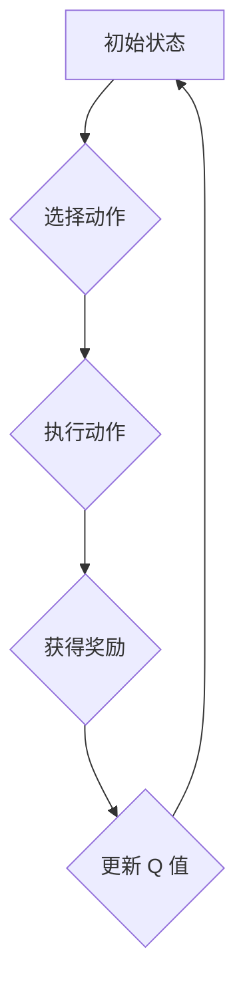

> 强化学习，Q-learning，算法原理，代码实现，应用场景，案例分析

## 1. 背景介绍

强化学习 (Reinforcement Learning, RL) 作为机器学习的一个重要分支，近年来在人工智能领域取得了显著进展。它与监督学习和无监督学习不同，强化学习算法通过与环境的交互学习，通过不断尝试和反馈，逐步优化策略，最终达到预期的目标。

Q-learning 作为强化学习中最经典的算法之一，其核心思想是通过学习一个 Q 值表，来评估在当前状态下采取不同动作的长期回报。Q 值表可以看作是智能体对环境的知识库，它记录了在每个状态下采取每个动作所能获得的期望回报。

## 2. 核心概念与联系

**2.1 核心概念**

* **状态 (State):** 智能体所处的环境描述，例如游戏中的棋盘状态、机器人手臂的位置等。
* **动作 (Action):** 智能体可以采取的行动，例如在游戏中移动棋子、机器人手臂伸缩等。
* **奖励 (Reward):** 环境对智能体采取动作的反馈，可以是正向奖励或负向惩罚。
* **策略 (Policy):** 智能体在不同状态下选择动作的规则。
* **价值函数 (Value Function):** 评估智能体在特定状态下采取特定策略的长期回报。

**2.2  Q-learning 的工作原理**

Q-learning 通过迭代更新 Q 值表，最终学习出一个最优策略。



**2.3  Q-learning 的优势**

* **模型免费:** Q-learning 不需要事先构建环境模型，可以直接从环境交互中学习。
* **离线学习:** Q-learning 可以使用历史数据进行离线学习，无需实时与环境交互。
* **广泛应用:** Q-learning 在各种领域都有应用，例如游戏、机器人控制、推荐系统等。

## 3. 核心算法原理 & 具体操作步骤

### 3.1  算法原理概述

Q-learning 的核心思想是通过迭代更新 Q 值表，来评估在每个状态下采取每个动作的长期回报。

Q 值表是一个二维数组，其中每一行代表一个状态，每一列代表一个动作。Q 值表中的每个元素 Q(s, a) 表示在状态 s 下采取动作 a 的期望回报。

Q-learning 算法通过以下公式更新 Q 值表：

$$
Q(s, a) = Q(s, a) + \alpha [r + \gamma \max_{a'} Q(s', a') - Q(s, a)]
$$

其中：

* $Q(s, a)$ 是状态 s 下动作 a 的当前 Q 值。
* $\alpha$ 是学习率，控制着学习速度。
* $r$ 是从状态 s 执行动作 a 后获得的奖励。
* $\gamma$ 是折扣因子，控制着未来回报的权重。
* $s'$ 是执行动作 a 后进入的下一个状态。
* $a'$ 是在下一个状态 $s'$ 中选择的最优动作。

### 3.2  算法步骤详解

1. 初始化 Q 值表，将所有 Q 值设置为 0。
2. 选择一个初始状态。
3. 在当前状态下选择一个动作，并执行该动作。
4. 从环境中获得奖励和下一个状态。
5. 更新 Q 值表，使用公式 (1) 计算新的 Q 值。
6. 重复步骤 2-5，直到达到终止条件。

### 3.3  算法优缺点

**优点:**

* 模型免费，无需事先构建环境模型。
* 离线学习，可以使用历史数据进行学习。
* 广泛应用，在各种领域都有应用。

**缺点:**

* 学习速度可能较慢，尤其是在复杂的环境中。
* 需要设置学习率和折扣因子，这些参数的选择对算法性能有很大影响。
* 可能会陷入局部最优解。

### 3.4  算法应用领域

Q-learning 算法在以下领域有广泛的应用：

* **游戏:** 训练游戏 AI，例如 AlphaGo。
* **机器人控制:** 训练机器人执行复杂的任务，例如导航、抓取等。
* **推荐系统:** 建议用户感兴趣的内容，例如电影、音乐等。
* **金融:** 预测股票价格、管理投资组合等。

## 4. 数学模型和公式 & 详细讲解 & 举例说明

### 4.1  数学模型构建

Q-learning 的数学模型可以描述为一个马尔可夫决策过程 (MDP)，其中包含以下元素：

* 状态空间 S：所有可能的智能体状态的集合。
* 动作空间 A：智能体在每个状态下可以采取的所有动作的集合。
* 转移概率矩阵 P：描述从一个状态到另一个状态的概率，取决于采取的动作。
* 奖励函数 R：描述在每个状态下采取每个动作后获得的奖励。
* 折扣因子 γ：控制着未来回报的权重，通常取值在 0 到 1 之间。

### 4.2  公式推导过程

Q-learning 算法的目标是学习一个最优策略 π，使得在任何状态下采取该策略的动作可以获得最大的长期回报。

最优策略 π* 可以通过以下 Bellman 方程来定义：

$$
V^*(s) = \max_a \sum_{s'} P(s'|s,a) [r(s,a,s') + \gamma V^*(s')]
$$

其中：

* $V^*(s)$ 是状态 s 下的最优价值函数。

Q-learning 算法通过迭代更新 Q 值表来逼近最优价值函数。

更新公式为：

$$
Q(s, a) = Q(s, a) + \alpha [r + \gamma \max_{a'} Q(s', a') - Q(s, a)]
$$

其中：

* $Q(s, a)$ 是状态 s 下动作 a 的 Q 值。
* $\alpha$ 是学习率。
* $r$ 是从状态 s 执行动作 a 后获得的奖励。
* $\gamma$ 是折扣因子。
* $s'$ 是执行动作 a 后进入的下一个状态。
* $a'$ 是在下一个状态 $s'$ 中选择的最优动作。

### 4.3  案例分析与讲解

假设有一个简单的环境，智能体可以处于两个状态：状态 0 和状态 1。智能体可以采取两个动作：动作 0 和动作 1。

* 从状态 0 执行动作 0，获得奖励 1，转移到状态 1。
* 从状态 0 执行动作 1，获得奖励 -1，转移到状态 0。
* 从状态 1 执行动作 0，获得奖励 0，转移到状态 0。
* 从状态 1 执行动作 1，获得奖励 0，转移到状态 1。

我们可以使用 Q-learning 算法学习一个最优策略。

初始 Q 值表：

| 状态 | 动作 0 | 动作 1 |
|---|---|---|
| 0 | 0 | 0 |
| 1 | 0 | 0 |

通过迭代更新 Q 值表，最终可以得到最优策略：

* 在状态 0，采取动作 0。
* 在状态 1，采取动作 0 或动作 1。

## 5. 项目实践：代码实例和详细解释说明

### 5.1  开发环境搭建

* Python 3.x
* NumPy
* Matplotlib

### 5.2  源代码详细实现

```python
import numpy as np

# 环境参数
states = [0, 1]
actions = [0, 1]
rewards = np.array([[1, -1], [0, 0]])  # 状态转移矩阵
gamma = 0.9  # 折扣因子
alpha = 0.1  # 学习率

# Q 值表初始化
q_table = np.zeros((len(states), len(actions)))

# 训练循环
for episode in range(1000):
    state = 0  # 初始状态
    while state != 1:
        # 选择动作
        action = np.argmax(q_table[state, :])
        # 执行动作
        next_state, reward = get_next_state_and_reward(state, action)
        # 更新 Q 值
        q_table[state, action] = q_table[state, action] + alpha * (reward + gamma * np.max(q_table[next_state, :]) - q_table[state, action])
        state = next_state

# 打印 Q 值表
print(q_table)
```

### 5.3  代码解读与分析

* **环境参数:** 定义了环境的状态空间、动作空间、奖励函数和折扣因子。
* **Q 值表初始化:** 将 Q 值表初始化为零。
* **训练循环:** 迭代训练 Q 值表，直到达到预定的训练次数。
* **选择动作:** 在当前状态下选择 Q 值最大的动作。
* **执行动作:** 执行选择的动作，并获得下一个状态和奖励。
* **更新 Q 值:** 使用 Q-learning 公式更新 Q 值表。

### 5.4  运行结果展示

运行代码后，会输出一个 Q 值表，其中每个元素代表在对应状态下采取对应动作的期望回报。

## 6. 实际应用场景

Q-learning 算法在许多实际应用场景中都有广泛的应用，例如：

* **游戏 AI:** 训练游戏 AI 玩家，例如 AlphaGo、AlphaZero 等。
* **机器人控制:** 训练机器人执行复杂的任务，例如导航、抓取、组装等。
* **推荐系统:** 建议用户感兴趣的内容，例如电影、音乐、商品等。
* **金融:** 预测股票价格、管理投资组合等。

### 6.4  未来应用展望

随着人工智能技术的不断发展，Q-learning 算法的应用场景将会更加广泛。例如：

* **自动驾驶:** 训练自动驾驶汽车，使其能够在复杂道路环境中安全行驶。
* **医疗诊断:** 帮助医生诊断疾病，提高诊断准确率。
* **个性化教育:** 根据学生的学习情况，提供个性化的学习方案。

## 7. 工具和资源推荐

### 7.1  学习资源推荐

* **书籍:**
    * Reinforcement Learning: An Introduction by Richard S. Sutton and Andrew G. Barto
    * Deep Reinforcement Learning Hands-On by Maxim Lapan
* **在线课程:**
    * Coursera: Reinforcement Learning Specialization by David Silver
    * Udacity: Deep Reinforcement Learning Nanodegree

### 7.2  开发工具推荐

* **OpenAI Gym:** 一个用于强化学习研究和开发的开源库。
* **TensorFlow:** 一个用于深度学习的开源库。
* **PyTorch:** 另一个用于深度学习的开源库。

### 7.3  相关论文推荐

* **Playing Atari with Deep Reinforcement Learning** by Mnih et al. (2013)
* **Deep Q-Network** by Mnih et al. (2015)
* **Asynchronous Methods for Deep Reinforcement Learning** by Mnih et al. (2016)

## 8. 总结：未来发展趋势与挑战

### 8.1  研究成果总结

Q-learning 算法作为强化学习领域的重要算法，取得了显著的成果，在游戏、机器人控制、推荐系统等领域都有广泛的应用。

### 8.2  未来发展趋势

* **深度强化学习:** 将深度神经网络与 Q-learning 算法结合，提高算法的学习能力和泛化能力。
* **多智能体强化学习:** 研究多个智能体在同一个环境中交互学习的算法。
* **安全强化学习:** 研究如何在不损害安全的情况下训练强化学习算法。

### 8.3  面临的挑战

* **样本效率:** 强化学习算法通常需要大量的样本数据才能训练，这在现实世界