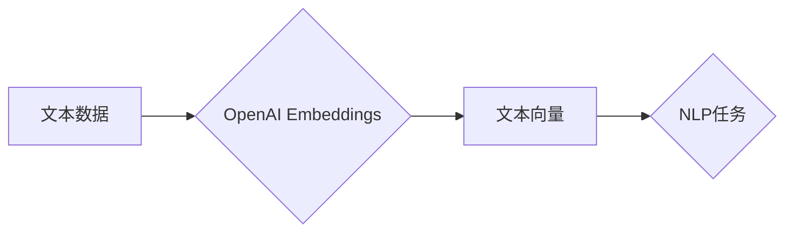

> OpenAI Embeddings, 文本嵌入, 自然语言处理, 机器学习, 向量化, 应用场景

## 1. 背景介绍

在当今数据爆炸的时代，文本数据已成为重要的信息资源。如何有效地理解和处理这些文本数据是自然语言处理 (NLP) 领域的核心挑战。OpenAI Embeddings 作为一种强大的文本嵌入技术，为我们提供了将文本转换为向量表示的有效途径，为后续的 NLP 任务提供了基础。

OpenAI Embeddings 由 OpenAI 公司开发，基于 Transformer 架构，能够捕捉文本中的语义关系和上下文信息，生成高质量的文本向量表示。这些向量可以用于各种 NLP 任务，例如文本分类、情感分析、信息检索、机器翻译等。

## 2. 核心概念与联系

### 2.1 文本嵌入

文本嵌入是指将文本转换为低维向量表示的技术。每个单词或句子都对应一个唯一的向量，向量中的每个维度代表单词或句子的某个特征。通过这种向量化表示，我们可以将文本数据转化为机器可理解的形式，并利用机器学习算法进行分析和处理。

### 2.2 OpenAI Embeddings

OpenAI Embeddings 是基于 Transformer 架构的文本嵌入模型，能够捕捉文本中的语义关系和上下文信息，生成高质量的文本向量表示。

**OpenAI Embeddings 与其他文本嵌入技术的比较:**

| 特性 | Word2Vec | GloVe | FastText | OpenAI Embeddings |
|---|---|---|---|---|
| 模型架构 | 循环神经网络 (RNN) | 统计模型 | 循环神经网络 (RNN) | Transformer |
| 语义捕捉能力 | 有限 | 较强 | 较强 | 最强 |
| 上下文理解能力 | 有限 | 有限 | 有限 | 较强 |
| 向量维度 | 低维 | 中等维 | 中等维 | 高维 |

**Mermaid 流程图:**



## 3. 核心算法原理 & 具体操作步骤

### 3.1 算法原理概述

OpenAI Embeddings 基于 Transformer 架构，其核心是自注意力机制 (Self-Attention)。自注意力机制能够捕捉文本序列中不同单词之间的关系，并赋予每个单词不同的权重，从而更好地理解文本的语义和上下文信息。

### 3.2 算法步骤详解

1. **输入文本序列:** 将文本序列拆分成单词或子词，并将其转换为数字表示。
2. **嵌入层:** 将每个单词或子词映射到一个低维向量空间。
3. **多头自注意力层:** 使用多头自注意力机制计算每个单词与其他单词之间的关系，并生成每个单词的上下文表示。
4. **前馈神经网络层:** 对每个单词的上下文表示进行进一步的处理，提取更深层的语义信息。
5. **输出层:** 将每个单词的最终表示输出，作为文本的向量嵌入。

### 3.3 算法优缺点

**优点:**

* 能够捕捉文本中的长距离依赖关系。
* 语义捕捉能力强，能够生成高质量的文本向量表示。
* 训练效率高，能够在大型数据集上进行训练。

**缺点:**

* 计算复杂度高，需要较大的计算资源。
* 模型参数量大，需要较大的存储空间。

### 3.4 算法应用领域

* 文本分类
* 情感分析
* 信息检索
* 机器翻译
* 问答系统
* 文本生成

## 4. 数学模型和公式 & 详细讲解 & 举例说明

### 4.1 数学模型构建

OpenAI Embeddings 的数学模型主要包括以下几个部分:

* **嵌入层:** 将每个单词映射到一个低维向量空间。
* **多头自注意力层:** 计算每个单词与其他单词之间的关系，并生成每个单词的上下文表示。
* **前馈神经网络层:** 对每个单词的上下文表示进行进一步的处理，提取更深层的语义信息。

### 4.2 公式推导过程

**多头自注意力机制的公式:**

$$
Attention(Q, K, V) = softmax(\frac{QK^T}{\sqrt{d_k}})V
$$

其中:

* $Q$ 是查询矩阵
* $K$ 是键矩阵
* $V$ 是值矩阵
* $d_k$ 是键向量的维度
* $softmax$ 是归一化函数

### 4.3 案例分析与讲解

假设我们有一个句子 "The cat sat on the mat"，我们使用 OpenAI Embeddings 将其转换为向量表示。

1. 首先，我们将句子拆分成单词: ["The", "cat", "sat", "on", "the", "mat"]。
2. 然后，我们将每个单词映射到一个低维向量空间，例如 128 维。
3. 使用多头自注意力机制计算每个单词与其他单词之间的关系，并生成每个单词的上下文表示。
4. 最后，将每个单词的最终表示输出，作为句子的向量嵌入。

## 5. 项目实践：代码实例和详细解释说明

### 5.1 开发环境搭建

* Python 3.7+
* PyTorch 1.7+
* OpenAI API 

### 5.2 源代码详细实现

```python
import openai

# 设置 OpenAI API 密钥
openai.api_key = "YOUR_API_KEY"

# 定义输入文本
text = "The cat sat on the mat."

# 使用 OpenAI Embeddings 生成文本向量
response = openai.Embedding.create(
    input=text,
    model="text-embedding-ada-002"
)

# 获取文本向量
embedding = response['data'][0]['embedding']

# 打印文本向量
print(embedding)
```

### 5.3 代码解读与分析

* 我们首先导入 `openai` 库，并设置 OpenAI API 密钥。
* 然后，我们定义输入文本，并使用 `openai.Embedding.create()` 函数调用 OpenAI Embeddings API，生成文本向量。
* `model` 参数指定使用的模型，这里使用的是 `text-embedding-ada-002` 模型。
* `response` 对象包含 API 返回的 JSON 数据，其中包含生成的文本向量。
* 我们从 `response` 对象中提取文本向量，并将其打印出来。

### 5.4 运行结果展示

运行代码后，会输出一个包含 1536 个浮点数的列表，代表文本向量的 1536 维表示。

## 6. 实际应用场景

### 6.1 文本分类

OpenAI Embeddings 可以用于文本分类任务，例如情感分析、主题分类、垃圾邮件过滤等。将文本转换为向量表示后，可以使用机器学习算法进行分类。

### 6.2 情感分析

OpenAI Embeddings 可以用于情感分析任务，例如判断文本表达的情感倾向，例如积极、消极、中性等。

### 6.3 信息检索

OpenAI Embeddings 可以用于信息检索任务，例如根据用户查询找到相关的文档或网页。将用户查询和文档向量化后，可以使用余弦相似度等方法计算相似度，找到最相关的文档。

### 6.4 未来应用展望

OpenAI Embeddings 在 NLP 领域具有广泛的应用前景，未来可能应用于:

* 更智能的聊天机器人
* 更精准的机器翻译
* 更个性化的内容推荐
* 更有效的文本摘要

## 7. 工具和资源推荐

### 7.1 学习资源推荐

* OpenAI Embeddings 文档: https://platform.openai.com/docs/guides/embeddings
* Transformer 架构论文: https://arxiv.org/abs/1706.03762

### 7.2 开发工具推荐

* Python
* PyTorch
* TensorFlow

### 7.3 相关论文推荐

* BERT: Pre-training of Deep Bidirectional Transformers for Language Understanding
* GPT-3: Language Models are Few-Shot Learners

## 8. 总结：未来发展趋势与挑战

### 8.1 研究成果总结

OpenAI Embeddings 作为一种强大的文本嵌入技术，在 NLP 领域取得了显著的成果，为各种 NLP 任务提供了高效的解决方案。

### 8.2 未来发展趋势

* 模型规模和性能的提升
* 多模态文本嵌入
* 更高效的训练和推理算法

### 8.3 面临的挑战

* 数据标注成本高
* 模型解释性差
* 应对对抗样本攻击

### 8.4 研究展望

未来，OpenAI Embeddings 将继续朝着更强大、更智能的方向发展，为 NLP 领域带来更多创新和突破。

## 9. 附录：常见问题与解答

### 9.1 如何选择合适的 OpenAI Embeddings 模型？

OpenAI 提供了多种不同的 Embeddings 模型，选择合适的模型取决于具体的应用场景和需求。例如，对于需要高精度文本分类任务，可以选择 `text-embedding-ada-002` 模型；对于需要快速推理的应用场景，可以选择 `text-embedding-ada-001` 模型。

### 9.2 如何处理长文本的嵌入？

对于长文本，可以使用分段嵌入的方法，将长文本分割成多个短文本段落，分别生成嵌入向量，然后将这些嵌入向量进行聚合，得到长文本的最终嵌入向量。

### 9.3 如何评估 OpenAI Embeddings 的性能？

可以使用各种评估指标来评估 OpenAI Embeddings 的性能，例如余弦相似度、准确率、F1 分数等。具体的评估指标选择取决于具体的应用场景和需求。


作者：禅与计算机程序设计艺术 / Zen and the Art of Computer Programming 
<end_of_turn>