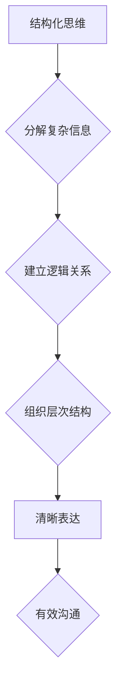

> 结构化思维，表达能力，算法设计，代码实现，数学建模，项目实践，人工智能，深度学习

## 1. 背景介绍

在当今以技术为驱动的时代，清晰的思维和有效的表达能力已成为至关重要的技能。无论是软件开发、数据分析还是人工智能研究，都需要我们能够将复杂的概念转化为结构化的思维模型，并将其清晰地表达出来。

传统的编程教育往往侧重于语法和代码实现，而忽略了思维和表达能力的培养。然而，优秀的程序员不仅需要精通代码，更需要具备清晰的逻辑思维、结构化的表达能力和强大的问题解决能力。

## 2. 核心概念与联系

**结构化思维**是指将复杂的信息分解成更小的、相互关联的单元，并通过逻辑关系和层次结构进行组织和表达。它是一种系统化的思维方式，能够帮助我们更好地理解和处理复杂问题。

**表达能力**是指将思维和知识清晰、准确地传达给他人或记录下来的能力。在技术领域，良好的表达能力不仅体现在代码的编写上，还体现在文档撰写、技术交流和项目管理等方面。

结构化思维和表达能力是相互关联的，它们共同构成了一个完整的技术思维体系。结构化的思维方式能够帮助我们更好地组织和表达我们的想法，而有效的表达能力则能够帮助我们更清晰地传达我们的思维模型。

**Mermaid 流程图：**



## 3. 核心算法原理 & 具体操作步骤

### 3.1  算法原理概述

算法是一种解决特定问题的步骤序列，它可以被计算机执行。结构化思维在算法设计中至关重要，它帮助我们将复杂问题分解成更小的、可管理的子问题，并设计出清晰、高效的解决方案。

### 3.2  算法步骤详解

1. **问题分析:** 首先，我们需要仔细分析问题，明确其输入、输出和约束条件。
2. **分解问题:** 将问题分解成更小的、相互关联的子问题。
3. **设计算法:** 为每个子问题设计相应的算法，并考虑算法的效率和可读性。
4. **算法实现:** 将算法转化为代码，并进行测试和调试。

### 3.3  算法优缺点

**优点:**

* **清晰易懂:** 结构化算法易于理解和维护。
* **高效可靠:** 结构化算法通常具有较高的效率和可靠性。
* **可复用性强:** 结构化算法可以被应用于不同的场景。

**缺点:**

* **设计复杂:** 对于复杂问题，设计结构化算法可能比较困难。
* **效率有限:** 一些算法可能无法达到最佳的效率。

### 3.4  算法应用领域

结构化算法广泛应用于各个领域，例如：

* **软件开发:** 算法设计是软件开发的基础，它用于实现各种功能和逻辑。
* **数据分析:** 算法用于处理和分析大规模数据，提取有价值的信息。
* **人工智能:** 算法是人工智能的核心，用于机器学习、深度学习等领域。

## 4. 数学模型和公式 & 详细讲解 & 举例说明

### 4.1  数学模型构建

数学模型可以用来描述和分析复杂系统，它将现实世界的问题转化为数学语言，并通过公式和方程进行建模。

### 4.2  公式推导过程

例如，我们可以使用线性回归模型来预测房价。线性回归模型的公式如下：

$$y = mx + c$$

其中：

* $y$ 是房价
* $x$ 是房屋面积
* $m$ 是斜率
* $c$ 是截距

我们可以通过最小二乘法来求解 $m$ 和 $c$ 的值。

### 4.3  案例分析与讲解

通过线性回归模型，我们可以预测不同面积的房屋价格。例如，如果一个房屋面积为 100 平方米，我们可以使用公式计算出其预测价格。

## 5. 项目实践：代码实例和详细解释说明

### 5.1  开发环境搭建

我们可以使用 Python 语言和 Scikit-learn 库来实现线性回归模型。

### 5.2  源代码详细实现

```python
from sklearn.linear_model import LinearRegression
import pandas as pd

# 加载数据
data = pd.read_csv('house_data.csv')

# 训练模型
model = LinearRegression()
model.fit(data[['面积']], data['价格'])

# 预测价格
new_area = 100
predicted_price = model.predict([[new_area]])
print(f'房屋面积为 {new_area} 平方米的预测价格为：{predicted_price[0]}')
```

### 5.3  代码解读与分析

* 我们首先加载数据，并使用 Scikit-learn 库中的 LinearRegression 类来创建线性回归模型。
* 然后，我们使用 `fit()` 方法训练模型，将房屋面积作为特征，房屋价格作为目标变量。
* 最后，我们使用 `predict()` 方法预测新房屋面积的价格。

### 5.4  运行结果展示

运行代码后，我们可以得到新房屋面积的价格预测结果。

## 6. 实际应用场景

结构化思维和表达能力在各个技术领域都有广泛的应用场景，例如：

* **软件开发:** 设计清晰的软件架构、编写可读易懂的代码、撰写详细的技术文档。
* **数据分析:** 分析数据趋势、构建数据模型、生成数据可视化图表。
* **人工智能:** 设计机器学习算法、解释模型结果、撰写论文发表研究成果。

### 6.4  未来应用展望

随着人工智能和数据科学的快速发展，结构化思维和表达能力将变得更加重要。未来，我们将看到更多基于结构化思维和表达能力的工具和技术出现，帮助我们更好地理解和处理复杂信息。

## 7. 工具和资源推荐

### 7.1  学习资源推荐

* **书籍:** 《设计模式：复用面向对象软件的建模》
* **在线课程:** Coursera 上的《算法导论》课程

### 7.2  开发工具推荐

* **代码编辑器:** VS Code、Sublime Text
* **版本控制系统:** Git

### 7.3  相关论文推荐

* **《结构化编程》**
* **《算法设计与分析》**

## 8. 总结：未来发展趋势与挑战

### 8.1  研究成果总结

结构化思维和表达能力是技术领域不可或缺的技能，它们共同构成了一个完整的技术思维体系。

### 8.2  未来发展趋势

未来，我们将看到更多基于结构化思维和表达能力的工具和技术出现，帮助我们更好地理解和处理复杂信息。

### 8.3  面临的挑战

培养结构化思维和表达能力需要长期坚持和实践，需要从教育、培训和实践三个方面入手。

### 8.4  研究展望

未来，我们需要继续探索结构化思维和表达能力的本质，并开发出更有效的培养方法。

## 9. 附录：常见问题与解答

**常见问题:**

* 如何培养结构化思维？
* 如何提高表达能力？
* 如何将结构化思维应用于实际项目中？

**解答:**

* 培养结构化思维可以通过练习分解问题、建立逻辑关系和组织层次结构来实现。
* 提高表达能力可以通过阅读、写作、演讲和沟通等方式来练习。
* 将结构化思维应用于实际项目中可以通过设计清晰的软件架构、编写可读易懂的代码、撰写详细的技术文档等方式来实现。


作者：禅与计算机程序设计艺术 / Zen and the Art of Computer Programming 
<end_of_turn>