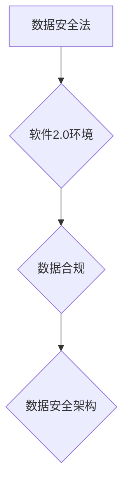

> 数据安全法,软件2.0,数据合规,隐私保护,人工智能,数据治理,安全架构

## 1. 背景介绍

近年来，随着数字化转型和人工智能技术的快速发展，数据已成为企业和个人最重要的资产。然而，数据也面临着越来越多的安全威胁和隐私风险。为了保障数据安全和公民隐私，各国纷纷出台相关法律法规。

在中国，2020年9月1日，中国《个人信息保护法》正式实施，2021年11月1日，《数据安全法》正式实施。这两部法律法规对个人信息和数据安全提出了明确的要求，对企业的数据处理活动带来了新的挑战。

同时，软件行业也在经历着深刻的变革。传统的软件开发模式正在向敏捷开发、微服务架构、云原生等新模式转变，这使得软件系统更加复杂，数据安全和合规性面临新的挑战。

## 2. 核心概念与联系

**2.1 数据安全法与软件2.0环境**

* **数据安全法:**  旨在保护个人信息和数据安全，规范数据处理活动，保障公民隐私权。主要内容包括：
    * 个人信息收集、使用、存储、传输等方面的规定
    * 数据安全管理制度的建立和实施
    * 数据泄露事件的处理和处罚
* **软件2.0环境:**  指以敏捷开发、微服务架构、云原生等为代表的新一代软件开发模式。其特点是：
    * 系统架构更加复杂，数据流动更加频繁
    * 开发周期缩短，迭代速度加快
    * 数据分散存储，数据安全管理难度增加

**2.2 数据合规与软件开发**

数据合规是指软件开发过程中遵循相关法律法规和行业标准，确保数据安全和隐私保护。

**2.3 数据安全架构**

数据安全架构是指为保障数据安全而构建的系统架构，包括：

* **数据安全策略:**  明确数据安全目标、风险评估、安全控制措施等
* **数据安全技术:**  包括数据加密、访问控制、数据脱敏等技术
* **数据安全管理:**  建立数据安全管理体系，定期进行安全评估和风险控制

**Mermaid 流程图**



## 3. 核心算法原理 & 具体操作步骤

**3.1 算法原理概述**

数据安全算法是保障数据安全的重要技术手段。常见的算法包括：

* **数据加密算法:**  将数据转换为不可读的形式，防止未授权人员访问。常见的加密算法包括AES、RSA等。
* **数据脱敏算法:**  将敏感数据进行处理，保留数据价值的同时，隐藏敏感信息。常见的脱敏算法包括数据替换、数据模糊化等。
* **数据访问控制算法:**  控制用户对数据的访问权限，防止未授权用户访问数据。常见的访问控制算法包括角色权限管理、基于策略的访问控制等。

**3.2 算法步骤详解**

以数据加密算法为例，其基本步骤如下：

1. **密钥生成:**  生成一个用于加密和解密数据的密钥。
2. **数据加密:**  使用密钥对数据进行加密，生成密文。
3. **数据传输:**  将密文传输到目标系统。
4. **数据解密:**  使用密钥对密文进行解密，恢复原始数据。

**3.3 算法优缺点**

不同的数据安全算法具有不同的优缺点，需要根据实际应用场景选择合适的算法。

* **加密算法:**  安全性高，但计算量大，解密速度慢。
* **脱敏算法:**  安全性相对较低，但计算量小，解密速度快。
* **访问控制算法:**  安全性较高，但需要复杂的管理机制。

**3.4 算法应用领域**

数据安全算法广泛应用于各个领域，例如：

* **金融行业:**  保护银行账户信息、交易数据等敏感信息。
* **医疗行业:**  保护患者医疗记录、基因信息等隐私数据。
* **电商行业:**  保护用户个人信息、支付信息等敏感数据。

## 4. 数学模型和公式 & 详细讲解 & 举例说明

**4.1 数学模型构建**

数据安全模型通常采用概率论和统计学方法构建，例如：

* **风险评估模型:**  利用概率论计算数据泄露的可能性和损失程度。
* **安全控制模型:**  利用统计学分析安全控制措施的有效性。

**4.2 公式推导过程**

例如，风险评估模型中常用的公式为：

$$Risk = Probability \times Impact$$

其中：

* **Risk:** 风险等级
* **Probability:** 数据泄露的可能性
* **Impact:** 数据泄露造成的损失程度

**4.3 案例分析与讲解**

假设一个银行系统，其数据泄露的可能性为0.1，数据泄露造成的损失程度为100万元。则该系统的风险等级为：

$$Risk = 0.1 \times 1000000 = 100000$$

## 5. 项目实践：代码实例和详细解释说明

**5.1 开发环境搭建**

* 操作系统: Ubuntu 20.04
* 编程语言: Python 3.8
* 开发工具: PyCharm

**5.2 源代码详细实现**

```python
# 数据加密示例代码
from cryptography.fernet import Fernet

# 生成密钥
key = Fernet.generate_key()
cipher = Fernet(key)

# 加密数据
message = "This is a secret message".encode()
encrypted_message = cipher.encrypt(message)

# 解密数据
decrypted_message = cipher.decrypt(encrypted_message)

# 打印结果
print("加密后的数据:", encrypted_message)
print("解密后的数据:", decrypted_message.decode())
```

**5.3 代码解读与分析**

* 该代码使用Python的`cryptography`库实现数据加密。
* `Fernet`类提供了一种简单的对称加密算法。
* `generate_key()`方法生成一个随机密钥。
* `encrypt()`方法使用密钥加密数据。
* `decrypt()`方法使用密钥解密数据。

**5.4 运行结果展示**

```
加密后的数据: b'gAAAAABj...'
解密后的数据: This is a secret message
```

## 6. 实际应用场景

**6.1 数据安全合规**

* 企业可以利用数据安全算法和架构，满足《数据安全法》和《个人信息保护法》的合规要求。
* 例如，企业可以采用数据加密技术保护敏感数据，采用访问控制技术控制用户对数据的访问权限。

**6.2 数据隐私保护**

* 数据安全技术可以帮助企业保护用户隐私数据，例如：
    * 数据脱敏技术可以隐藏敏感信息，保护用户隐私。
    * 匿名化技术可以将用户数据进行匿名化处理，防止个人信息泄露。

**6.3 数据安全风险管理**

* 数据安全模型可以帮助企业评估数据安全风险，制定相应的安全控制措施。
* 例如，风险评估模型可以帮助企业识别数据泄露的可能性和损失程度，制定相应的防范措施。

**6.4 未来应用展望**

* 随着人工智能技术的不断发展，数据安全技术也将迎来新的发展机遇。
* 例如，人工智能可以用于数据安全威胁检测、数据安全事件响应等方面。

## 7. 工具和资源推荐

**7.1 学习资源推荐**

* 《数据安全》课程 (Coursera)
* 《网络安全》课程 (edX)
* 《数据安全与隐私保护》书籍

**7.2 开发工具推荐**

* OWASP ZAP
* Burp Suite
* Nessus

**7.3 相关论文推荐**

* 《数据安全与隐私保护》
* 《人工智能在数据安全中的应用》

## 8. 总结：未来发展趋势与挑战

**8.1 研究成果总结**

* 数据安全技术已经取得了显著的进展，但仍然面临着新的挑战。
* 随着数据量的不断增长和攻击手段的不断升级，数据安全技术需要不断创新和发展。

**8.2 未来发展趋势**

* 数据安全技术将更加智能化、自动化和一体化。
* 人工智能将被广泛应用于数据安全领域，例如：
    * 数据安全威胁检测
    * 数据安全事件响应
    * 数据安全风险评估

**8.3 面临的挑战**

* 数据安全技术需要不断适应新的技术发展和攻击手段。
* 数据安全人才短缺是一个普遍问题。
* 数据安全法规和标准需要不断完善。

**8.4 研究展望**

* 未来研究将重点关注：
    * 基于人工智能的数据安全技术
    * 数据安全自动化和一体化解决方案
    * 数据安全人才培养和培训


## 9. 附录：常见问题与解答

**9.1 如何选择合适的加密算法？**

选择合适的加密算法需要根据实际应用场景和安全需求进行考虑。

* 如果需要高安全性，可以选择AES、RSA等算法。
* 如果需要较快的解密速度，可以选择DES、3DES等算法。

**9.2 如何保护数据免受攻击？**

* 使用强密码和多因素身份验证
* 定期更新软件和系统
* 使用防火墙和入侵检测系统
* 备份数据并定期恢复

**9.3 如何应对数据泄露事件？**

* 及时发现和报告数据泄露事件
* 采取措施限制事件的影响
* 对受影响的用户进行通知
* 调查事件原因并采取措施防止再次发生

作者：禅与计算机程序设计艺术 / Zen and the Art of Computer Programming


<end_of_turn>