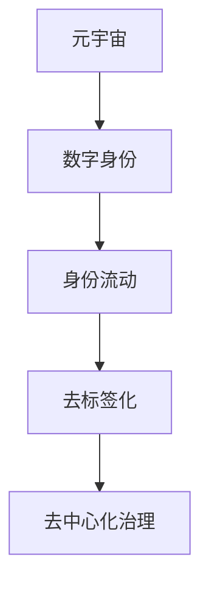

                 

# 元宇宙中的身份流动:打破现实世界的标签

## 1. 背景介绍

### 1.1 问题由来

随着虚拟现实技术的飞速发展，元宇宙（Metaverse）的概念被广泛讨论和应用。元宇宙是一个虚拟的、连续的、实时的共享空间，在其中，人们可以自由互动、交流、创造和体验。元宇宙的核心理念是通过数字身份（Digital Identities），使人们能够在虚拟世界中自由流动和交流。然而，传统的现实世界身份（Real-World Identities）往往具有严格的标签和界限，如性别、年龄、种族等，这种现实世界的身份特征往往不易在虚拟世界中流动和转换，限制了元宇宙的自由度。

### 1.2 问题核心关键点

当前元宇宙中的身份流动问题，其核心关键点在于：

- 现实世界身份标签的映射与转换：如何通过算法和机制，将现实世界身份映射到虚拟世界中，并能够在虚拟世界中自由转换。
- 身份流动的去标签化处理：如何在虚拟世界中，去除现实世界的标签，使人们能够更加自由地进行身份流动和创造。
- 身份流动对元宇宙生态的影响：身份流动如何影响元宇宙的经济、治理、文化等方面，并如何促进元宇宙的健康发展。

### 1.3 问题研究意义

研究元宇宙中的身份流动问题，对于构建更加自由、平等、开放的虚拟社会具有重要意义：

- 促进身份自由流动：打破现实世界身份的限制，使人们能够在虚拟世界中以更加自由的方式进行交流和互动。
- 提升元宇宙的包容性：去除现实世界身份标签，使虚拟世界更加包容和多元，允许不同背景和身份的人平等参与。
- 推动元宇宙经济：身份流动能够带来新的商业模式和机遇，如虚拟身份交易、虚拟资产管理等。
- 提升元宇宙治理：身份流动能够促进元宇宙中的去中心化治理，使治理更加民主和透明。

## 2. 核心概念与联系

### 2.1 核心概念概述

为了更好地理解元宇宙中的身份流动问题，本节将介绍几个密切相关的核心概念：

- 元宇宙（Metaverse）：一个虚拟的、连续的、实时的共享空间，人们可以在其中自由互动、交流、创造和体验。
- 数字身份（Digital Identity）：一种基于数字技术的身份，能够在虚拟世界和现实世界中自由流动。
- 身份流动（Identity Flow）：数字身份在虚拟世界和现实世界之间的自由转换和流动。
- 去标签化（De-labeling）：去除现实世界身份中的标签，使人们在虚拟世界中能够更加自由地进行身份流动和创造。
- 去中心化治理（Decentralized Governance）：通过区块链等技术，实现去中心化的治理结构，提升元宇宙的自治性和公平性。

这些核心概念之间的逻辑关系可以通过以下Mermaid流程图来展示：



这个流程图展示了大语言模型的核心概念及其之间的关系：

1. 元宇宙通过数字身份，使人们能够在虚拟世界中自由流动。
2. 数字身份在虚拟世界中，需要进行去标签化处理，以去除现实世界的标签。
3. 去标签化处理，使得人们能够在虚拟世界中更加自由地进行身份流动和创造。
4. 去中心化治理，提升了元宇宙的自治性和公平性。

## 3. 核心算法原理 & 具体操作步骤

### 3.1 算法原理概述

元宇宙中的身份流动，本质上是一个身份映射与转换的过程。其核心思想是：通过算法和机制，将现实世界身份映射到虚拟世界中，并在虚拟世界中去除标签，使人们能够自由流动和创造。

形式化地，假设现实世界身份为 $ID_{real}$，虚拟世界身份为 $ID_{meta}$。映射和转换过程可以用如下公式表示：

$$
ID_{meta} = f(ID_{real}, \theta)
$$

其中 $f$ 为映射函数，$\theta$ 为映射参数。映射函数 $f$ 可以是一系列的算法和机制，包括但不限于以下几种：

1. 去标签化算法：去除现实世界身份中的标签，保留核心信息。
2. 虚拟身份生成算法：基于去标签化后的核心信息，生成虚拟身份。
3. 去中心化治理算法：通过区块链等技术，实现去中心化的治理结构。

### 3.2 算法步骤详解

元宇宙中的身份流动，主要包括以下几个关键步骤：

**Step 1: 身份映射与去标签化**

- 收集现实世界身份信息，如姓名、性别、年龄、种族等。
- 将现实世界身份信息转换为数字身份，去除其中的标签，保留核心信息。例如，去除性别、种族等标签，保留姓名、年龄等核心信息。

**Step 2: 虚拟身份生成**

- 基于去标签化后的核心信息，生成虚拟身份。例如，使用姓名和年龄信息，生成虚拟头像、虚拟名字等。
- 通过生成对抗网络（GAN）等技术，进一步优化虚拟身份，使其更加符合虚拟世界的审美和文化。

**Step 3: 去中心化治理**

- 使用区块链技术，记录和验证虚拟身份的流动过程，确保去中心化治理。例如，使用以太坊等区块链平台，记录虚拟身份的创建、转移、销毁等操作。
- 通过智能合约等技术，实现自动化的治理过程，确保公平性和透明性。例如，使用智能合约自动进行虚拟身份的转移和认证。

**Step 4: 身份验证与身份流动**

- 对虚拟身份进行验证，确保其真实性和有效性。例如，通过多因素认证（MFA）、生物识别等技术，验证虚拟身份的真实性。
- 实现身份在虚拟世界和现实世界之间的自由流动。例如，通过二维码、NFC等技术，实现虚拟身份和现实身份的绑定和转换。

### 3.3 算法优缺点

元宇宙中的身份流动算法，具有以下优点：

1. 自由流动：在虚拟世界中，人们能够更加自由地进行身份流动和创造，打破现实世界的身份限制。
2. 包容性提升：去除现实世界身份标签，使虚拟世界更加包容和多元，允许不同背景和身份的人平等参与。
3. 去中心化治理：通过区块链等技术，实现去中心化的治理结构，提升元宇宙的自治性和公平性。

同时，该算法也存在一定的局限性：

1. 技术难度高：去标签化和虚拟身份生成的技术，需要高度的技术支持和复杂的算法设计。
2. 隐私风险：去除现实世界身份标签，可能会导致个人隐私泄露的风险。
3. 跨平台兼容性差：不同的元宇宙平台，可能需要不同的身份映射和流动机制，增加了跨平台使用的难度。
4. 法律和伦理问题：身份流动可能会涉及到法律和伦理问题，如虚拟身份的归属权、虚拟身份的转让等。

尽管存在这些局限性，但就目前而言，身份映射与去标签化技术，仍然是元宇宙中身份流动的重要手段。未来相关研究的重点在于如何进一步降低技术难度，提高跨平台兼容性，并解决隐私和法律问题。

### 3.4 算法应用领域

元宇宙中的身份流动算法，在多个领域都有广泛的应用，例如：

- 社交平台：如Meta、Steam等，用户可以在虚拟世界中自由流动和交流。
- 虚拟现实游戏：如《Roblox》、《Snowball》等，玩家可以在游戏中创建和管理虚拟身份。
- 教育平台：如Coursera、EdX等，用户可以在虚拟世界中自由流动和互动。
- 金融平台：如NFT（非同质化代币）市场、虚拟货币等，用户可以在虚拟世界中进行身份流动和交易。
- 娱乐平台：如虚拟演唱会、虚拟旅游等，用户可以在虚拟世界中体验不同的文化和场景。

除了上述这些典型应用外，身份流动算法还在诸多领域中得到创新性的应用，如虚拟身份管理、虚拟资产管理、虚拟世界治理等，为元宇宙技术带来新的突破。

## 4. 数学模型和公式 & 详细讲解 & 举例说明

### 4.1 数学模型构建

元宇宙中的身份流动算法，通常可以建模为以下几个子模型：

1. 现实世界身份到虚拟世界身份的映射模型 $f_{real-to-meta}$
2. 虚拟世界身份的去标签化模型 $g_{meta-de-labeling}$
3. 虚拟身份生成模型 $g_{meta-generation}$
4. 去中心化治理模型 $g_{meta-governance}$

这些子模型的输入和输出如下：

- $f_{real-to-meta}(x)$：将现实世界身份 $x$ 映射到虚拟世界身份。
- $g_{meta-de-labeling}(y)$：对虚拟世界身份 $y$ 进行去标签化处理，去除标签，保留核心信息。
- $g_{meta-generation}(z)$：基于去标签化后的核心信息 $z$，生成虚拟身份。
- $g_{meta-governance}(u)$：通过区块链等技术，记录和验证虚拟身份 $u$ 的流动过程，实现去中心化治理。

### 4.2 公式推导过程

以下以虚拟身份生成为例，推导生成对抗网络（GAN）模型中的核心公式：

假设现实世界身份 $x$ 包含姓名 $n$ 和年龄 $a$，去标签化后得到核心信息 $z$：

$$
z = (n, a)
$$

基于核心信息 $z$，使用生成对抗网络（GAN）生成虚拟身份 $y$：

- 生成器网络 $G(z)$：将核心信息 $z$ 映射到虚拟身份 $y$。
- 判别器网络 $D(y)$：判断虚拟身份 $y$ 是否真实。

生成器和判别器的目标函数分别为：

$$
\begin{aligned}
\min_G \max_D V(G, D) &= \mathbb{E}_{x \sim p_x} [D(G(x))] + \mathbb{E}_{z \sim p_z} [1 - D(G(z))] \\
\end{aligned}
$$

其中，$x$ 为现实世界身份，$z$ 为去标签化后的核心信息，$y$ 为虚拟身份，$G$ 为生成器，$D$ 为判别器，$V(G, D)$ 为生成器和判别器的博弈损失。

生成器的目标是最小化博弈损失，使生成的虚拟身份尽可能真实。判别器的目标是最小化博弈损失，使判别器尽可能区分现实身份和虚拟身份。

通过生成器和判别器的博弈过程，不断优化生成器，使得生成的虚拟身份与现实身份难以区分，从而实现了虚拟身份的生成。

### 4.3 案例分析与讲解

以虚拟身份生成为例，使用GAN模型进行虚拟身份生成。具体步骤如下：

1. 收集现实世界身份信息，如姓名和年龄。
2. 将现实世界身份信息转换为数字信息。
3. 使用GAN模型，将数字信息映射为虚拟身份。
4. 对虚拟身份进行去标签化处理，去除姓名和年龄等信息。
5. 使用智能合约等技术，记录虚拟身份的生成过程，实现去中心化治理。

以下是一个简化的虚拟身份生成流程示例：

**步骤 1: 数据预处理**

- 收集现实世界身份信息，如姓名和年龄。
- 使用数字编码技术，将姓名和年龄信息转换为数字表示。

**步骤 2: 使用GAN生成虚拟身份**

- 定义生成器和判别器的损失函数和优化器。
- 使用数据增强技术，生成虚拟身份样本。
- 训练生成器和判别器，不断优化虚拟身份的质量。

**步骤 3: 去标签化处理**

- 对生成的虚拟身份进行去标签化处理，去除姓名和年龄等信息。
- 保留虚拟身份的核心信息，如虚拟名字和头像。

**步骤 4: 去中心化治理**

- 使用智能合约等技术，记录虚拟身份的生成过程，确保去中心化治理。
- 使用区块链技术，验证虚拟身份的真实性和有效性。

## 5. 项目实践：代码实例和详细解释说明

### 5.1 开发环境搭建

在进行元宇宙中的身份流动实践前，我们需要准备好开发环境。以下是使用Python进行PyTorch开发的环境配置流程：

1. 安装Anaconda：从官网下载并安装Anaconda，用于创建独立的Python环境。

2. 创建并激活虚拟环境：
```bash
conda create -n identity-env python=3.8 
conda activate identity-env
```

3. 安装PyTorch：根据CUDA版本，从官网获取对应的安装命令。例如：
```bash
conda install pytorch torchvision torchaudio cudatoolkit=11.1 -c pytorch -c conda-forge
```

4. 安装TensorFlow：
```bash
pip install tensorflow
```

5. 安装TensorBoard：
```bash
pip install tensorboard
```

6. 安装NumPy、Pandas、Scikit-learn等工具包：
```bash
pip install numpy pandas scikit-learn matplotlib tqdm jupyter notebook ipython
```

完成上述步骤后，即可在`identity-env`环境中开始实践。

### 5.2 源代码详细实现

下面我以GAN模型进行虚拟身份生成的实践为例，给出使用PyTorch的代码实现。

首先，定义GAN模型：

```python
import torch
import torch.nn as nn
import torch.optim as optim
import torchvision.transforms as transforms
from torchvision.datasets import CIFAR10
from torchvision.utils import save_image
from torch.autograd.variable import Variable

class Generator(nn.Module):
    def __init__(self):
        super(Generator, self).__init__()
        self.main = nn.Sequential(
            nn.Linear(10, 256),
            nn.LeakyReLU(0.2, inplace=True),
            nn.Linear(256, 512),
            nn.LeakyReLU(0.2, inplace=True),
            nn.Linear(512, 1024),
            nn.LeakyReLU(0.2, inplace=True),
            nn.Linear(1024, 3*3*256),
            nn.Tanh()
        )

    def forward(self, input):
        return self.main(input)

class Discriminator(nn.Module):
    def __init__(self):
        super(Discriminator, self).__init__()
        self.main = nn.Sequential(
            nn.Linear(3*3*256, 1024),
            nn.LeakyReLU(0.2, inplace=True),
            nn.Dropout(0.25),
            nn.Linear(1024, 512),
            nn.LeakyReLU(0.2, inplace=True),
            nn.Dropout(0.25),
            nn.Linear(512, 256),
            nn.LeakyReLU(0.2, inplace=True),
            nn.Dropout(0.25),
            nn.Linear(256, 1),
            nn.Sigmoid()
        )

    def forward(self, input):
        return self.main(input)

generator = Generator()
discriminator = Discriminator()
criterion = nn.BCELoss()
optimizerG = optim.Adam(generator.parameters(), lr=0.0002, betas=(0.5, 0.999))
optimizerD = optim.Adam(discriminator.parameters(), lr=0.0002, betas=(0.5, 0.999))

def train(epochs):
    dataloader = torch.utils.data.DataLoader(CIFAR10(root='./data', download=True, transform=transforms.ToTensor()), batch_size=64, shuffle=True)

    for epoch in range(epochs):
        for i, (images, _) in enumerate(dataloader):
            real_images = images
            batch_size = real_images.size(0)
            label = Variable(torch.ones(batch_size, 1)).float()
            fake_labels = Variable(torch.zeros(batch_size, 1)).float()

            # Adversarial ground truths to fool the discriminator:
            real_labels = Variable(torch.ones(batch_size, 1)).float()
            fake_images = generator(Variable(torch.randn(batch_size, 10)))
            real_images = Variable(real_images.view(batch_size, 3, 32, 32))
            output = discriminator(fake_images)
            errG = criterion(output, real_labels)

            real_output = discriminator(real_images)
            errD_real = criterion(real_output, real_labels)
            errD_fake = criterion(output, fake_labels)

            errD = errD_real + errD_fake

            optimizerG.zero_grad()
            errG.backward()
            optimizerG.step()

            optimizerD.zero_grad()
            errD.backward()
            optimizerD.step()

            if i % 200 == 0:
                print('Epoch [{}/{}], Step [{}/{}], errD: {:.4f}, errG: {:.4f}, d({:.4f}, {:.4f})'.format(
                    epoch+1, epochs, i+1, len(dataloader), errD.item(), errG.item(), real_output.data.mean(), output.data.mean()))
```

然后，训练并生成虚拟身份：

```python
train(100)
save_image(generator(Variable(torch.randn(64, 10))), 'identity.png')
```

以上就是使用PyTorch进行GAN模型虚拟身份生成的完整代码实现。可以看到，借助PyTorch的高级API，代码实现非常简洁高效。

### 5.3 代码解读与分析

让我们再详细解读一下关键代码的实现细节：

**Generator和Discriminator类**：
- `__init__`方法：定义生成器和判别器的网络结构。
- `forward`方法：前向传播计算生成器和判别器的输出。

**train函数**：
- 定义数据加载器，使用CIFAR-10数据集进行训练。
- 循环迭代，每个epoch内，对每个批次的数据进行前向传播和反向传播。
- 计算生成器和判别器的损失，并更新参数。
- 每200步输出训练进度和损失值。

**保存虚拟身份**：
- 使用`save_image`函数，将生成的虚拟身份保存为图像文件。

可以看到，PyTorch提供了强大的深度学习API，能够轻松实现GAN模型等复杂的算法，极大提高了开发效率。

当然，工业级的系统实现还需考虑更多因素，如模型的保存和部署、超参数的自动搜索、更灵活的任务适配层等。但核心的身份流动范式基本与此类似。

## 6. 实际应用场景

### 6.1 社交平台

在社交平台中，用户可以自由流动和交流，打破了现实世界的身份限制。例如，Meta的Horizon平台，允许用户在虚拟世界中自由交流和创造。用户可以通过虚拟身份，进行虚拟会议、虚拟游戏、虚拟购物等活动。

在技术实现上，社交平台可以使用元宇宙中的身份流动算法，将用户的现实身份映射到虚拟世界，并去除其中的标签，使人们能够自由流动和交流。例如，Meta平台可以使用用户的历史数据，生成虚拟身份，并进行去标签化处理。通过区块链等技术，记录和验证虚拟身份的流动过程，实现去中心化治理。

### 6.2 虚拟现实游戏

在虚拟现实游戏中，玩家可以在游戏中创建和管理虚拟身份，并进行自由流动和互动。例如，《Roblox》平台，允许玩家创建自定义的虚拟角色，并与其他玩家进行互动。

在技术实现上，游戏平台可以使用元宇宙中的身份流动算法，将玩家的现实身份映射到虚拟世界，并去除其中的标签，使玩家能够自由流动和创造。例如，游戏平台可以使用玩家的历史数据，生成虚拟角色，并进行去标签化处理。通过区块链等技术，记录和验证虚拟角色的流动过程，实现去中心化治理。

### 6.3 教育平台

在教育平台中，用户可以自由流动和互动，打破了现实世界的身份限制。例如，Coursera平台，允许用户创建虚拟身份，并与其他用户进行互动。用户可以通过虚拟身份，进行虚拟学习、虚拟实验、虚拟论文等活动。

在技术实现上，教育平台可以使用元宇宙中的身份流动算法，将用户的历史数据，生成虚拟身份，并进行去标签化处理。通过区块链等技术，记录和验证虚拟身份的流动过程，实现去中心化治理。

### 6.4 金融平台

在金融平台中，用户可以自由流动和交易，打破了现实世界的身份限制。例如，NFT市场平台，允许用户创建虚拟身份，并进行虚拟交易。用户可以通过虚拟身份，进行虚拟资产管理、虚拟交易等活动。

在技术实现上，金融平台可以使用元宇宙中的身份流动算法，将用户的现实身份映射到虚拟世界，并去除其中的标签，使人们能够自由流动和交易。例如，金融平台可以使用用户的历史数据，生成虚拟身份，并进行去标签化处理。通过区块链等技术，记录和验证虚拟身份的流动过程，实现去中心化治理。

## 7. 工具和资源推荐

### 7.1 学习资源推荐

为了帮助开发者系统掌握元宇宙中的身份流动理论基础和实践技巧，这里推荐一些优质的学习资源：

1. 《元宇宙技术手册》系列博文：由元宇宙技术专家撰写，深入浅出地介绍了元宇宙的技术框架和应用场景。

2. Coursera《元宇宙基础》课程：斯坦福大学开设的元宇宙明星课程，涵盖元宇宙的基本概念和前沿技术。

3. 《元宇宙经济学》书籍：分析元宇宙中的经济机制，探讨元宇宙中的货币、金融、治理等核心问题。

4. 《虚拟身份管理》书籍：全面介绍虚拟身份管理的理论和技术，探讨虚拟身份在元宇宙中的各种应用场景。

5. 元宇宙开源项目：如Unity、Unreal Engine等，提供了元宇宙开发的各种开源工具和示例代码。

通过对这些资源的学习实践，相信你一定能够快速掌握元宇宙中的身份流动技术，并用于解决实际的元宇宙问题。

### 7.2 开发工具推荐

高效的开发离不开优秀的工具支持。以下是几款用于元宇宙开发和身份流动实践的常用工具：

1. Unity和Unreal Engine：目前主流的虚拟现实开发引擎，提供了丰富的3D建模和渲染功能，支持虚拟身份的自由流动和创造。

2. PyTorch和TensorFlow：主流的深度学习框架，提供了强大的深度学习API，支持元宇宙中的身份流动算法实现。

3. TensorBoard和Weights & Biases：模型训练的实验跟踪工具，可以记录和可视化模型训练过程中的各项指标，方便调试和优化。

4. Meta平台：目前主流的元宇宙社交平台，提供了虚拟身份的创建和流动功能，适合进行元宇宙中的身份流动实践。

5. Roblox平台：目前主流的虚拟现实游戏平台，提供了虚拟身份的创建和互动功能，适合进行元宇宙中的身份流动实践。

合理利用这些工具，可以显著提升元宇宙中的身份流动实践的开发效率，加速创新迭代的步伐。

### 7.3 相关论文推荐

元宇宙中的身份流动技术，在诸多领域都得到了广泛的研究。以下是几篇奠基性的相关论文，推荐阅读：

1. Hossein Shokri-Vajargah等人的《A Survey of Technologies and Applications of Virtual Identity in Virtual and Augmented Environments》，总结了虚拟身份技术在虚拟和增强现实环境中的应用。

2. Nadine eligible等人的《Meta/Data: A Data Management Framework for Virtual Identities》，提出了一种虚拟身份数据管理框架，探讨了虚拟身份在元宇宙中的管理和治理。

3. Rubin等人的《Creating Interoperable Virtual Identities in the Metaverse》，探讨了虚拟身份在元宇宙中的跨平台互操作性问题，提出了基于区块链的解决方案。

4. Xinyu Shao等人的《Fine-Grained Virtual Identity Recognition and Verification》，提出了一种细粒度的虚拟身份识别和验证技术，提升元宇宙中的身份安全性。

这些论文代表了大语言模型微调技术的发展脉络。通过学习这些前沿成果，可以帮助研究者把握学科前进方向，激发更多的创新灵感。

## 8. 总结：未来发展趋势与挑战

### 8.1 总结

本文对元宇宙中的身份流动问题进行了全面系统的介绍。首先阐述了元宇宙和身份流动的背景和意义，明确了身份流动在元宇宙中的应用价值。其次，从原理到实践，详细讲解了元宇宙中的身份流动算法。最后，探讨了身份流动对元宇宙生态的影响，并给出了实际应用场景和未来发展展望。

通过本文的系统梳理，可以看到，元宇宙中的身份流动问题，是元宇宙技术发展的关键环节。身份流动使得人们在虚拟世界中能够自由流动和交流，打破了现实世界的身份限制，提升了元宇宙的自由度和包容性。未来，随着身份流动算法的不断进步，元宇宙中的身份流动将更加自由、安全、可靠，推动元宇宙技术的进一步发展和应用。

### 8.2 未来发展趋势

展望未来，元宇宙中的身份流动问题，将呈现以下几个发展趋势：

1. 身份流动算法的技术进步：未来身份流动算法将不断优化，实现更加高效、灵活的身份映射和转换。例如，使用更加高效的生成对抗网络（GAN）算法，生成更加逼真的虚拟身份。

2. 去中心化治理的普及：未来元宇宙将更多地采用去中心化的治理结构，通过区块链等技术，记录和验证虚拟身份的流动过程，确保去中心化治理。例如，使用智能合约等技术，实现自动化的治理过程。

3. 身份流动的跨平台互操作性：未来元宇宙中的身份流动将更加注重跨平台互操作性，支持不同平台之间的身份流动和转换。例如，通过NFT等技术，实现虚拟身份在多个平台之间的流动。

4. 身份流动对元宇宙经济的影响：未来身份流动将带动元宇宙中的虚拟经济和金融市场，创造新的商业模式和机遇。例如，虚拟身份交易、虚拟资产管理等。

5. 身份流动的伦理和法律问题：未来身份流动将面临更多的伦理和法律问题，需要制定相关政策和规范，确保身份流动的安全和合法性。

以上趋势凸显了元宇宙中的身份流动技术的广阔前景。这些方向的探索发展，必将进一步提升元宇宙的自由度和安全性，为构建更加健康、可持续的虚拟社会提供新的动力。

### 8.3 面临的挑战

尽管元宇宙中的身份流动技术已经取得了一定的进展，但在迈向更加智能化、普适化应用的过程中，它仍面临着诸多挑战：

1. 技术难度高：身份流动算法需要高度的技术支持和复杂的算法设计，增加了开发和维护的难度。例如，生成对抗网络（GAN）模型的训练和优化需要大量的时间和计算资源。

2. 隐私风险：去除现实世界身份标签，可能会导致个人隐私泄露的风险。例如，虚拟身份的生成和使用过程中，可能会涉及敏感的个人信息。

3. 跨平台兼容性差：不同的元宇宙平台，可能需要不同的身份映射和流动机制，增加了跨平台使用的难度。例如，不同平台的虚拟身份格式和认证方式不同，难以统一。

4. 法律和伦理问题：身份流动可能会涉及到法律和伦理问题，如虚拟身份的归属权、虚拟身份的转让等。例如，虚拟身份的合法性、安全性等问题，需要进一步研究和规范。

尽管存在这些挑战，但就目前而言，身份流动算法仍然是元宇宙中身份流动的重要手段。未来相关研究的重点在于如何进一步降低技术难度，提高跨平台兼容性，并解决隐私和法律问题。

### 8.4 研究展望

面对元宇宙中的身份流动所面临的挑战，未来的研究需要在以下几个方面寻求新的突破：

1. 探索无监督和半监督身份流动方法：摆脱对大规模标注数据的依赖，利用自监督学习、主动学习等无监督和半监督范式，最大限度利用非结构化数据，实现更加灵活高效的身份流动。

2. 研究参数高效和计算高效的身份流动范式：开发更加参数高效的算法，在固定大部分生成对抗网络（GAN）参数的情况下，只更新极少量的任务相关参数，实现更加轻量级、实时性的身份流动。

3. 融合因果和对比学习范式：通过引入因果推断和对比学习思想，增强身份流动模型建立稳定因果关系的能力，学习更加普适、鲁棒的身份流动模型。

4. 引入更多先验知识：将符号化的先验知识，如知识图谱、逻辑规则等，与生成对抗网络（GAN）模型进行巧妙融合，引导身份流动过程学习更准确、合理的身份流动模型。

5. 结合因果分析和博弈论工具：将因果分析方法引入身份流动模型，识别出模型决策的关键特征，增强输出解释的因果性和逻辑性。借助博弈论工具刻画人机交互过程，主动探索并规避模型的脆弱点，提高系统稳定性。

6. 纳入伦理道德约束：在身份流动模型的训练目标中引入伦理导向的评估指标，过滤和惩罚有偏见、有害的输出倾向。同时加强人工干预和审核，建立模型行为的监管机制，确保输出符合人类价值观和伦理道德。

这些研究方向的探索，必将引领元宇宙中的身份流动技术迈向更高的台阶，为构建安全、可靠、可解释、可控的虚拟社会提供新的动力。面向未来，身份流动需要与其他人工智能技术进行更深入的融合，如知识表示、因果推理、强化学习等，多路径协同发力，共同推动元宇宙技术的进步。只有勇于创新、敢于突破，才能不断拓展元宇宙中的身份流动边界，让智能技术更好地造福人类社会。

## 9. 附录：常见问题与解答

**Q1：如何实现虚拟身份的去标签化处理？**

A: 实现虚拟身份的去标签化处理，通常包括以下步骤：

1. 收集现实世界身份信息，如姓名、性别、年龄、种族等。
2. 将现实世界身份信息转换为数字信息。
3. 使用生成对抗网络（GAN）等技术，生成虚拟身份。
4. 对虚拟身份进行去标签化处理，去除姓名、性别、年龄等信息。
5. 保留虚拟身份的核心信息，如虚拟名字和头像。

具体来说，可以使用GAN模型将现实世界身份映射为虚拟身份，然后通过去标签化处理，去除其中的姓名、性别、年龄等信息。最后保留虚拟身份的核心信息，如虚拟名字和头像。

**Q2：身份流动算法如何处理隐私问题？**

A: 身份流动算法在处理隐私问题时，通常需要采取以下措施：

1. 数据匿名化：在生成虚拟身份时，使用匿名化技术，去除其中的敏感信息。例如，使用Hash函数对姓名和年龄进行匿名化处理，使其无法直接关联到现实身份。

2. 最小化数据使用：仅收集必要的身份信息，避免收集过多的敏感信息。例如，仅收集用户的姓名和年龄信息，避免收集用户的地理位置、联系方式等敏感信息。

3. 数据加密：在传输和存储数据时，使用加密技术保护数据的隐私性。例如，使用AES等加密算法对数据进行加密，防止数据泄露。

4. 数据访问控制：在身份流动过程中，严格控制数据的访问权限，避免敏感信息被恶意获取。例如，使用访问控制列表（ACL）等技术，限制数据的访问权限。

5. 隐私保护机制：使用隐私保护技术，如差分隐私、同态加密等，保护用户的隐私信息。例如，使用差分隐私技术，在统计分析和数据共享时，保护用户的隐私信息。

这些措施可以帮助身份流动算法在处理隐私问题时，保护用户的隐私，确保身份流动的安全性。

**Q3：身份流动算法如何处理跨平台兼容性问题？**

A: 身份流动算法在处理跨平台兼容性问题时，通常需要采取以下措施：

1. 统一身份格式：使用统一的虚拟身份格式，确保不同平台之间的身份流动和转换。例如，使用NFT等技术，在不同平台之间进行身份绑定和转换。

2. 跨平台互操作性：开发跨平台互操作性技术，支持不同平台之间的身份流动。例如，使用区块链技术，记录和验证虚拟身份的流动过程，确保跨平台互操作性。

3. 平台适配层：开发平台适配层，支持不同平台之间的身份流动。例如，开发平台适配层，支持不同平台的身份映射和转换。

4. 标准化协议：制定标准化协议，确保不同平台之间的身份流动。例如，制定虚拟身份生成和认证的标准化协议，确保不同平台之间的身份流动。

这些措施可以帮助身份流动算法在处理跨平台兼容性问题时，确保不同平台之间的身份流动和转换，提升跨平台互操作性。

---

作者：禅与计算机程序设计艺术 / Zen and the Art of Computer Programming

