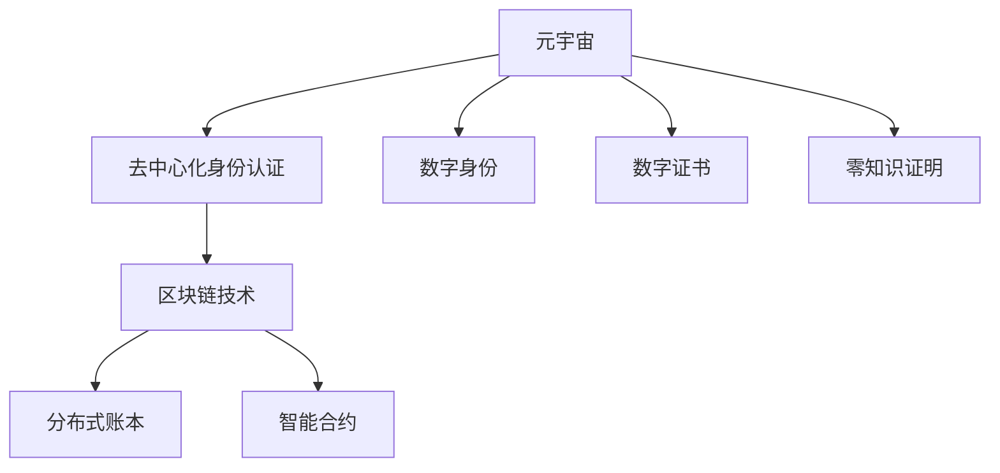

                 

# 元宇宙中的身份认证:去中心化信任体系

## 1. 背景介绍

随着数字技术的飞速发展，元宇宙这一虚拟空间的概念逐渐成为新的技术热点。元宇宙不仅是一个虚拟的世界，也是一个基于区块链技术、去中心化架构的数字身份生态系统。在这个虚拟空间中，人们通过数字身份进行交流、交易、创造和体验，构建了一个与现实世界并行的数字经济体。然而，与现实世界一样，元宇宙也需要一个安全、可靠的身份认证体系来保障用户的数字权益和行为可追溯性。

## 2. 核心概念与联系

### 2.1 核心概念概述

要构建元宇宙中的身份认证体系，首先需要理解以下核心概念：

- **元宇宙**: 一个基于虚拟现实(VR)、增强现实(AR)、区块链和数字资产的数字世界，用户在其中通过数字身份进行互动和体验。
- **去中心化身份认证**: 指利用区块链技术，去除中心化机构对身份认证的掌控，用户自行管理和控制自己的身份信息，确保身份的真实性和不可篡改性。
- **数字身份**: 用户在数字世界中的标识，包括姓名、年龄、地址、社交网络等信息，可用于身份认证、访问控制和行为记录。
- **数字证书**: 由可信机构颁发的证明用户身份的电子文件，常用于去中心化身份认证系统中。
- **零知识证明**: 一种密码学技术，允许用户在不泄露自身信息的前提下，向第三方证明自己知道某个秘密信息，用于隐私保护和安全性增强。

这些概念之间存在紧密的联系，通过区块链技术支撑的去中心化身份认证体系，能够提供更为安全、便捷、可信赖的数字身份管理方式，满足元宇宙中复杂的身份认证需求。

### 2.2 核心概念原理和架构的 Mermaid 流程图



这个流程图展示了元宇宙中身份认证的关键组件及其联系：

1. **元宇宙**与**去中心化身份认证**之间通过区块链技术进行连接。
2. **数字身份**和**数字证书**是身份认证的核心元素。
3. **零知识证明**用于增强身份认证的安全性和隐私保护。
4. **区块链技术**包括分布式账本和智能合约，是身份认证的底层技术支撑。

## 3. 核心算法原理 & 具体操作步骤

### 3.1 算法原理概述

去中心化身份认证系统的核心算法原理主要包括密码学技术、区块链技术和智能合约。以下详细介绍这些关键技术。

#### 3.1.1 密码学技术

密码学技术包括加密、解密、数字签名、零知识证明等，用于保障数据传输和身份认证的安全性。其中，数字签名和零知识证明是元宇宙身份认证中的重要工具：

- **数字签名**：用户通过私钥对数据进行签名，公钥验证签名，确保数据来源和完整性。
- **零知识证明**：用户在不泄露自身私钥的情况下，向第三方证明自己知道某个秘密信息，用于隐私保护和安全性增强。

#### 3.1.2 区块链技术

区块链技术提供了一个不可篡改、分布式、去中心化的账本，用于记录和管理数字身份。区块链上的智能合约可以自动执行身份认证过程，无需第三方干预。

#### 3.1.3 智能合约

智能合约是一种自执行、自审核的合约，基于区块链技术，能够在满足特定条件时自动执行。在去中心化身份认证中，智能合约可以处理身份认证请求、颁发和验证数字证书、管理权限等。

### 3.2 算法步骤详解

基于密码学、区块链和智能合约的身份认证算法步骤如下：

1. **数字身份创建**：用户通过身份管理系统创建自己的数字身份，生成一对公私钥。
2. **数字证书申请**：用户向身份管理系统申请数字证书，包含身份信息、公钥、签名等。
3. **证书颁发**：身份管理系统对申请进行审核，通过后颁发数字证书，并将其写入区块链。
4. **证书验证**：用户或其他系统通过公钥验证数字证书，确保身份信息真实有效。
5. **零知识证明**：用户提供零知识证明，证明自己知道私钥，以增强身份认证的安全性。
6. **身份认证**：智能合约根据数字证书和零知识证明验证用户身份，决定是否授权访问。

### 3.3 算法优缺点

#### 3.3.1 优点

1. **安全性高**：基于区块链和智能合约的去中心化身份认证，避免了中心化系统的单点故障和安全漏洞。
2. **透明度高**：所有身份认证过程公开透明，可追溯，增加了系统的可信度。
3. **用户控制权**：用户对自己身份和证书有完全控制权，数据自主性更强。
4. **扩展性强**：区块链和智能合约技术可支持大规模分布式系统的身份认证需求。

#### 3.3.2 缺点

1. **技术门槛高**：需要掌握密码学、区块链、智能合约等多项技术，技术复杂度较高。
2. **性能瓶颈**：区块链网络处理能力有限，可能影响身份认证的实时性和吞吐量。
3. **隐私问题**：尽管零知识证明提高了安全性，但用户仍然需要提供身份信息，存在隐私泄露风险。
4. **法律和伦理问题**：数字身份的归属和数据隐私权等法律问题尚不明确，存在争议。

### 3.4 算法应用领域

基于去中心化信任体系的身份认证技术，可以应用于多种场景，例如：

- **数字身份管理**：用户管理自己的数字身份，包括创建、修改、删除、查询等操作。
- **访问控制**：系统根据数字证书和零知识证明，决定用户对资源的访问权限。
- **隐私保护**：通过零知识证明，用户在不泄露真实身份信息的前提下，验证自身身份。
- **跨平台身份认证**：用户在不同平台间迁移身份信息，保证身份认证的一致性和连续性。
- **去中心化交易**：在区块链上进行去中心化身份认证，确保交易双方的真实性。

## 4. 数学模型和公式 & 详细讲解

### 4.1 数学模型构建

在去中心化身份认证系统中，数学模型通常包含以下元素：

- **公钥** $pk$ 和 **私钥** $sk$ 构成一对非对称加密密钥。
- **数字签名** $Sig$ 由私钥 $sk$ 和消息 $M$ 生成。
- **证书** $Cert$ 包含公钥 $pk$、签名 $Sig$、身份信息等。
- **零知识证明** $Proof$ 用于证明用户知道私钥 $sk$。

### 4.2 公式推导过程

以下公式展示了数字签名和零知识证明的基本推导过程：

**数字签名公式**：

$$
Sig(M) = \text{hash}(M) \cdot sk
$$

其中，$\text{hash}$ 为哈希函数，$M$ 为待签名的消息。

**零知识证明公式**：

假设 $Q$ 为质数，用户 $A$ 希望证明自己知道私钥 $sk$，可通过以下方式：

1. $A$ 选择随机数 $r$，计算 $R = g^r \mod Q$。
2. $A$ 计算 $S = sk \cdot H(M) + r$，其中 $H$ 为哈希函数。
3. $A$ 提供 $(R, S)$ 作为证明。

**验证过程**：

1. $B$ 接收 $(R, S)$，计算 $R' = g^S \mod Q$ 和 $S' = H(M) \cdot sk$。
2. 若 $R = R'$，则 $A$ 通过验证，证明了知道 $sk$。

### 4.3 案例分析与讲解

以用户在元宇宙中购买虚拟物品为例，分析身份认证的流程：

1. **身份创建**：用户通过身份管理系统创建数字身份，生成公私钥对。
2. **数字证书申请**：用户申请数字证书，提交身份信息、公钥和签名。
3. **证书颁发**：身份管理系统审核通过后，颁发数字证书，并记录到区块链。
4. **购买验证**：用户使用数字证书和零知识证明，向商家验证身份。
5. **权限控制**：商家通过智能合约验证用户身份和证书，决定是否授权交易。
6. **交易完成**：若验证通过，智能合约执行交易，更新用户的虚拟资产和商家的库存。

## 5. 项目实践：代码实例和详细解释说明

### 5.1 开发环境搭建

为便于项目开发，建议使用Linux操作系统，并安装以下工具和库：

- **Python**：作为编程语言，支持去中心化身份认证系统的开发。
- **Flask**：用于搭建后端API接口。
- **Web3.py**：与以太坊交互的Python库，支持智能合约开发。
- **WebAssembly**：用于部署在元宇宙平台上的智能合约。
- **OpenSSL**：提供密码学功能，用于数字签名和证书管理。

### 5.2 源代码详细实现

以下是Python代码示例，展示如何实现去中心化身份认证系统的核心功能：

```python
from flask import Flask, request
from web3 import Web3
import hashlib
import ecdsa

app = Flask(__name__)

# 初始化Web3，连接以太坊节点
w3 = Web3('http://localhost:8545')
# 设置私钥
sk = '0xdeadbeef'
# 公钥
pk = ecdsa.SigningKey.from_string(sk, curve='secp256k1').get_verifying_key().to_string()

@app.route('/sign', methods=['POST'])
def sign():
    # 接收消息
    message = request.form.get('message')
    # 生成签名
    signature = ecdsa.Signature(sk.sign_data(message.encode('utf-8'), curve='secp256k1'))
    return {
        'public_key': pk,
        'signature': signature.to_string(),
    }

@app.route('/signature_verification', methods=['POST'])
def verify_signature():
    # 接收签名和公钥
    signature_data = request.form.get('signature')
    public_key_data = request.form.get('public_key')
    # 验证签名
    if verify_signature(signature_data, public_key_data, message):
        return 'Signature is valid'
    else:
        return 'Signature is invalid'

def verify_signature(signature_data, public_key_data, message):
    pk = ecdsa.PublicKey.from_string(public_key_data, curve='secp256k1')
    sig = ecdsa.Signature.from_string(signature_data, curve='secp256k1')
    return sig.verify(message.encode('utf-8'), pk)

if __name__ == '__main__':
    app.run(debug=True)
```

### 5.3 代码解读与分析

以上代码实现了两个API接口：

- `/sign`：接收消息，使用私钥生成数字签名，并返回公钥和签名。
- `/signature_verification`：接收签名和公钥，验证签名是否有效，并返回验证结果。

在代码中，我们使用Python的`ecdsa`库实现了ECDSA加密算法，通过私钥生成签名，并使用公钥验证签名。这符合元宇宙中数字签名的基本流程。

### 5.4 运行结果展示

运行以上代码，启动Flask服务，可以通过浏览器访问API接口进行数字签名的生成和验证。

```bash
$ python app.py
* Running on http://127.0.0.1:5000/ (Press CTRL+C to quit)
```

访问以下URL进行签名和验证操作：

- 签名生成：`http://127.0.0.1:5000/sign?message=Hello%20world%21`
- 签名验证：`http://127.0.0.1:5000/signature_verification?signature=0x...&public_key=0x...`

通过浏览器访问这些URL，可以验证数字签名的生成和验证过程是否正确。

## 6. 实际应用场景

### 6.1 元宇宙数字身份平台

在元宇宙数字身份平台中，去中心化身份认证系统可以确保用户身份的真实性和不可篡改性。用户通过数字身份进行登录、创建和管理虚拟资产，进行跨平台、跨应用的身份认证，保证数据安全和隐私保护。

### 6.2 数字资产交易平台

在数字资产交易平台上，去中心化身份认证系统用于验证用户身份和数字证书，确保交易双方的真实性和合法性，防止欺诈和滥用。

### 6.3 虚拟社交平台

在虚拟社交平台中，去中心化身份认证系统用于管理用户身份和权限，防止恶意行为和虚假账号，保障社交互动的安全性和信任度。

### 6.4 未来应用展望

随着元宇宙的发展，去中心化身份认证技术将面临更多挑战和需求，未来展望如下：

1. **跨链互操作**：不同区块链之间的身份认证和数据互认，实现元宇宙的互联互通。
2. **分布式共识**：通过分布式共识机制，提高去中心化身份认证的公平性和安全性。
3. **隐私保护**：增强零知识证明的性能和安全性，提供更高的隐私保护能力。
4. **去中心化治理**：构建去中心化身份认证的治理模型，增强系统治理和维护的自治性。
5. **身份联邦**：构建身份联邦机制，实现不同平台间身份信息的互认和共享。

## 7. 工具和资源推荐

### 7.1 学习资源推荐

- **《区块链技术基础》**：学习区块链技术的基础知识和应用场景，理解去中心化身份认证的基本原理。
- **《密码学基础》**：掌握密码学技术，包括对称加密、非对称加密、哈希函数等，是去中心化身份认证的基础。
- **《智能合约开发实战》**：学习智能合约开发技术和以太坊平台，掌握在元宇宙中实现去中心化身份认证的工具和方法。

### 7.2 开发工具推荐

- **GitHub**：版本控制平台，方便协作和代码共享。
- **Jupyter Notebook**：交互式编程环境，适合数学模型和代码实现的详细讲解。
- **OpenSSL**：提供密码学功能，支持数字签名和证书管理。

### 7.3 相关论文推荐

- **《去中心化身份认证：一种基于区块链的解决方案》**：研究区块链技术在身份认证中的应用，提供解决方案和实际案例。
- **《零知识证明：一种密码学技术》**：介绍零知识证明的基本原理和应用，增强数字身份认证的安全性。
- **《智能合约：一种自执行合约》**：深入探讨智能合约的基本原理和应用场景，理解去中心化身份认证的技术基础。

## 8. 总结：未来发展趋势与挑战

### 8.1 研究成果总结

本文系统地介绍了元宇宙中的去中心化身份认证技术，主要内容包括：

- 核心概念和联系：元宇宙、去中心化身份认证、数字身份、数字证书、零知识证明等。
- 算法原理：密码学技术、区块链技术、智能合约。
- 具体操作步骤：数字身份创建、数字证书申请、证书颁发、证书验证、零知识证明、身份认证。
- 案例分析：元宇宙数字身份平台、数字资产交易平台、虚拟社交平台。

### 8.2 未来发展趋势

未来去中心化身份认证技术的发展趋势包括：

1. **跨链互操作**：不同区块链之间的身份认证和数据互认，实现元宇宙的互联互通。
2. **分布式共识**：通过分布式共识机制，提高去中心化身份认证的公平性和安全性。
3. **隐私保护**：增强零知识证明的性能和安全性，提供更高的隐私保护能力。
4. **去中心化治理**：构建去中心化身份认证的治理模型，增强系统治理和维护的自治性。
5. **身份联邦**：构建身份联邦机制，实现不同平台间身份信息的互认和共享。

### 8.3 面临的挑战

去中心化身份认证技术面临的挑战包括：

1. **技术复杂度**：涉及密码学、区块链、智能合约等多项技术，需要较高的技术门槛。
2. **性能瓶颈**：区块链网络处理能力有限，可能影响身份认证的实时性和吞吐量。
3. **隐私问题**：零知识证明增强了安全性，但用户仍需提供身份信息，存在隐私泄露风险。
4. **法律和伦理问题**：数字身份的归属和数据隐私权等法律问题尚不明确，存在争议。

### 8.4 研究展望

未来的研究应关注以下几点：

1. **跨链互操作**：开发跨链身份认证技术，实现不同区块链之间的身份互认和数据共享。
2. **分布式共识**：研究分布式共识机制，增强去中心化身份认证的公平性和安全性。
3. **隐私保护**：优化零知识证明算法，提高隐私保护能力和效率。
4. **去中心化治理**：设计去中心化身份认证的治理模型，增强系统自治性和可维护性。
5. **身份联邦**：构建身份联邦机制，实现不同平台间身份信息的互认和共享。

## 9. 附录：常见问题与解答

**Q1: 去中心化身份认证系统是否安全？**

A: 去中心化身份认证系统通过区块链和智能合约技术实现，相对于传统的中心化系统，具有更高的安全性和透明性。但仍然存在一些潜在的安全威胁，如51%攻击、共识漏洞等，需要持续研究和改进。

**Q2: 去中心化身份认证系统如何处理隐私问题？**

A: 去中心化身份认证系统通过零知识证明技术，能够在不泄露身份信息的情况下，验证用户身份。但隐私保护仍然是系统设计的重要考虑因素，需要在数据存储和使用上采取严格的安全措施。

**Q3: 去中心化身份认证系统是否适合大规模部署？**

A: 去中心化身份认证系统相对于传统的中心化系统，具有更高的可扩展性和容错性，适合大规模部署。但需要考虑区块链网络的性能瓶颈和扩展性，持续优化系统架构。

**Q4: 去中心化身份认证系统如何应对法律和伦理问题？**

A: 去中心化身份认证系统需要在设计时充分考虑法律和伦理问题，确保系统符合各地区法律法规和行业规范。建立有效的监管机制和用户隐私保护机制，确保系统使用的合法性和公正性。

---

作者：禅与计算机程序设计艺术 / Zen and the Art of Computer Programming

