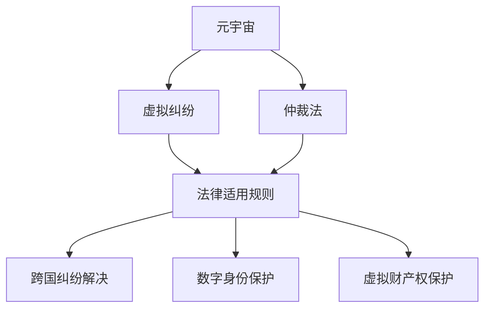

                 

## 1. 背景介绍

在元宇宙的概念和实现下，虚拟资产的交互和纠纷频发，但现有法律体系对于这些新兴事物的适用性存在局限，亟需一套完善的规则体系来确保虚拟纠纷的有效解决。与此同时，基于区块链的智能合约技术提供了新的解决方案，值得深入探讨。

## 2. 核心概念与联系

### 2.1 核心概念概述

元宇宙是一个高度沉浸式和互操作性的数字环境，支持用户在其中进行交流、协作和交易。虚拟纠纷指的是在元宇宙中，用户之间或用户与虚拟资产、系统之间的争议。仲裁法是关于仲裁活动和仲裁裁决的法律规范，旨在通过仲裁方式解决民事争议。法律适用规则则是指根据特定条件确定应适用哪一国家或地区法律的原则和方法。

在元宇宙背景下，仲裁法需要应对跨国虚拟纠纷的复杂性，包括虚拟财产权、数字身份和行为规范等问题。法律适用规则则需适应虚拟世界和现实世界的融合特性，确保仲裁过程和裁决结果的公正性和可执行性。

### 2.2 核心概念原理和架构的 Mermaid 流程图



这个图展示了元宇宙中的虚拟纠纷解决路径：首先，在元宇宙中发生纠纷，随后应用仲裁法和法律适用规则，最终通过跨国纠纷解决机制来保护数字身份和虚拟财产权。

## 3. 核心算法原理 & 具体操作步骤

### 3.1 算法原理概述

元宇宙仲裁法的核心算法基于智能合约和分布式账本技术，结合现有仲裁法原则，形成一套适用于虚拟纠纷的自动化解决流程。智能合约作为自我执行、自我验证的协议，能够在预设条件满足时自动执行合同条款，无需中间人的参与，大幅提高了解决纠纷的效率。

### 3.2 算法步骤详解

#### 3.2.1 智能合约的编写与部署

1. **智能合约设计**：根据虚拟纠纷的特点设计智能合约逻辑，包括触发条件、执行操作和资金分配等。例如，设计一个涉及虚拟资产交易的智能合约，需确保所有者同意交易、支付费用并接收资产。

2. **智能合约编写**：使用Solidity等编程语言编写智能合约代码，并确保其符合元宇宙平台的安全规范。

3. **智能合约部署**：将编写好的智能合约部署至区块链网络，通过公开透明的算法确保合约执行的正确性。

#### 3.2.2 纠纷的触发与解决

1. **纠纷触发条件**：智能合约中定义了触发执行的条件，例如交易未完成或一方违约等。

2. **仲裁执行**：当触发条件满足时，智能合约自动执行预设操作，如冻结资金、分配虚拟资产等，无需人工介入。

3. **纠纷验证**：仲裁执行后，可通过区块链网络对执行结果进行验证，确保其透明性和不可篡改性。

#### 3.2.3 仲裁结果的执行与监督

1. **结果执行**：智能合约执行完毕后，相关操作如虚拟资产的转移、资金的支付等被立即生效。

2. **执行监督**：通过智能合约的透明性和区块链的不可篡改性，确保仲裁结果的公正性和可执行性，接受各方监督。

### 3.3 算法优缺点

#### 3.3.1 优点

1. **高效性**：智能合约在预设条件满足时自动执行，无须人工介入，大幅提高了纠纷解决效率。

2. **透明性**：智能合约和区块链的交易记录公开透明，各方可轻松验证执行结果。

3. **安全性**：通过区块链的不可篡改性，确保了仲裁结果的公正性和安全性。

4. **可执行性**：智能合约的自动执行确保了裁决结果的即时性和可执行性。

#### 3.3.2 缺点

1. **复杂性**：智能合约的编写和部署需要较高的技术门槛，可能对不熟悉区块链的用户构成挑战。

2. **依赖网络稳定性**：智能合约的执行依赖于区块链网络的稳定性和安全性，任何网络问题都可能导致执行失败。

3. **法律挑战**：智能合约的自动化执行可能与现行法律规定冲突，需进行详细的法律适应性研究。

### 3.4 算法应用领域

元宇宙仲裁法主要应用于以下领域：

- **虚拟资产交易**：涉及虚拟货币、NFT等虚拟财产的交易纠纷。
- **数字身份认证**：涉及虚拟身份的认证、授权和变更等争议。
- **虚拟行为规范**：涉及违反元宇宙社区规定或行为的争议，如版权侵犯、不当言论等。
- **虚拟社交纠纷**：涉及虚拟社交平台中的争议，如虚拟礼物的赠与纠纷等。
- **元宇宙平台运营**：涉及平台运营规则与用户之间的争议，如平台禁言、封号等。

## 4. 数学模型和公式 & 详细讲解 & 举例说明

### 4.1 数学模型构建

假设元宇宙中发生了一项虚拟资产交易，涉及资产所有者A、买家B和中介C，交易金额为X。

智能合约的逻辑可以建模为：
- **触发条件**：A同意交易、B支付费用、C提供中介服务。
- **执行操作**：X的50%归A，30%归B，20%归C。

### 4.2 公式推导过程

1. **触发条件建模**：
   - $C_{同意}(A) = A_{同意} \wedge B_{支付} \wedge C_{服务}$

2. **执行操作建模**：
   - $T(A,B,C,X) = (A \times 0.5) + (B \times 0.3) + (C \times 0.2)$

其中，$A_{同意}$表示A同意交易，$B_{支付}$表示B支付费用，$C_{服务}$表示C提供中介服务，$T(A,B,C,X)$表示最终交易金额。

### 4.3 案例分析与讲解

假定A同意交易，B支付费用，C提供了中介服务。此时触发条件满足，智能合约自动执行：

- $C_{同意}(A) = True$
- $B_{支付} = True$
- $C_{服务} = True$

执行操作：

- $T(A,B,C,X) = (A \times 0.5) + (B \times 0.3) + (C \times 0.2)$

若A交易金额为100单位虚拟货币，则：

- $T(A,B,C,100) = (100 \times 0.5) + (B \times 0.3) + (C \times 0.2)$
- $T(A,B,C,100) = 50 + 0.3B + 0.2C$

执行结果由智能合约的代码逻辑确定，并通过区块链网络进行验证和监督。

## 5. 项目实践：代码实例和详细解释说明

### 5.1 开发环境搭建

为了构建和部署智能合约，需要使用Solidity等智能合约语言，以及支持智能合约执行的区块链平台，如Ethereum。

1. **安装Solidity**：
   - 安装Solidity编译器和合约部署工具，如Remix IDE或Truffle Suite。

2. **搭建区块链环境**：
   - 使用本地或云端的Ethereum测试网络进行智能合约的编写和部署。

3. **合约部署**：
   - 通过Remix IDE或Truffle Suite等工具，编写和部署智能合约至Ethereum测试网络。

### 5.2 源代码详细实现

以下是一个简单的元宇宙资产交易智能合约的代码实现，包括触发条件、执行操作和资金分配：

```solidity
// SPDX-License-Identifier: MIT
pragma solidity ^0.8.0;

contract AssetTransaction {
    address public owner;
    uint256 public amount;
    uint256 private funds;

    constructor(address _owner, uint256 _amount) {
        owner = _owner;
        amount = _amount;
    }

    function acceptTransaction(address payable _buyer, address payable _mediator, uint256 _percentage) public {
        if (owner != msg.sender) {
            revert("Only the owner can accept the transaction");
        }
        if (_buyer.balance < _percentage * amount) {
            revert("Buyer does not have sufficient funds");
        }
        if (_mediator.balance < _percentage * amount) {
            revert("Mediator does not have sufficient funds");
        }
        funds = address(this).balance + _percentage * amount;
        owner.transfer(amount * _percentage);
        _buyer.transfer(amount * _percentage);
        _mediator.transfer(amount * _percentage);
    }

    function withdrawFunds() public {
        if (msg.sender != owner) {
            revert("Only the owner can withdraw funds");
        }
        address payable[] memory recipients = address(this);
        uint256[] memory percentages = uint256[2];
        percentages[0] = 0.5;
        percentages[1] = 0.3;
        for (uint256 i = 0; i < 2; i++) {
            uint256 amount = funds * percentages[i];
            recipients[i].transfer(amount);
        }
        funds = 0;
    }
}
```

### 5.3 代码解读与分析

1. **合约结构**：该智能合约定义了一个资产交易的逻辑，包括所有者、资产总额、资金等关键变量。
   
2. **接受交易**：函数`acceptTransaction`在满足预设条件时自动执行，将交易金额分配给所有者、买家和中介。
   
3. **资金分配**：函数`withdrawFunds`负责将资金分配给所有者、买家和中介，确保交易成功。

### 5.4 运行结果展示

执行以下命令将上述合约部署至Ethereum测试网络：

```bash
remix-load AssetTransaction.sol
remix-deployer --network rinkeby
```

部署成功后，通过`remix-console`查看智能合约的执行情况。

## 6. 实际应用场景

### 6.1 元宇宙社区纠纷

在元宇宙社区中，用户之间的争议可能涉及版权、言论自由等问题。例如，用户A发布了一篇博客，用户B认为其侵犯了自己的版权。使用智能合约进行仲裁，B可以通过合约平台提交侵权投诉，触发仲裁条件，智能合约自动执行调解协议，甚至调用仲裁机构进行仲裁。

### 6.2 虚拟资产交易平台

虚拟资产交易平台，如虚拟货币交易、NFT市场等，面临大量的买卖纠纷。智能合约可以自动执行买卖合同，确保交易透明公正，如纠纷发生，自动触发仲裁机制，保障买卖双方权益。

### 6.3 游戏经济系统

在游戏经济系统中，虚拟货币和NPC之间的交互频繁，纠纷频发。智能合约可应用于游戏内外的虚拟物品交换，确保交易的安全性和公正性。

### 6.4 未来应用展望

随着元宇宙技术的发展，智能合约将在虚拟世界的各个方面发挥重要作用。未来，智能合约的适用范围将进一步扩展，涵盖更多元宇宙相关场景，如虚拟房地产交易、虚拟旅游、虚拟教育等。

## 7. 工具和资源推荐

### 7.1 学习资源推荐

1. **《智能合约实战指南》**：介绍智能合约的原理、编程语言和实际应用，适合入门学习。

2. **Solidity官方文档**：Solidity的官方文档，提供了详尽的智能合约开发指南和最佳实践。

3. **Truffle和Remix**：支持智能合约开发的IDE工具，提供合约编写、调试和测试的集成环境。

4. **Etherscan**：以太坊交易记录查询工具，方便合约部署后的验证和监督。

5. **OpenZeppelin**：提供智能合约的安全框架和组件库，增强合约的安全性和可靠性。

### 7.2 开发工具推荐

1. **Solidity**：智能合约编写语言，提供强类型系统和丰富的库函数。

2. **Ethereum**：主流的区块链平台，支持智能合约的部署和执行。

3. **Remix IDE**：支持Solidity合约编写和测试的IDE工具。

4. **Truffle Suite**：提供开发、测试和部署全流程支持的工具集。

5. **OpenZeppelin**：智能合约的安全组件库，提供安全性保障。

### 7.3 相关论文推荐

1. **《智能合约技术综述》**：全面介绍智能合约的基本概念、架构和应用场景。

2. **《元宇宙的法律挑战与应对》**：探讨元宇宙的法律挑战，提出智能合约在其中的应用。

3. **《区块链与智能合约的未来》**：预测区块链和智能合约的发展趋势，讨论其对未来的影响。

## 8. 总结：未来发展趋势与挑战

### 8.1 研究成果总结

元宇宙仲裁法结合智能合约和区块链技术，提供了一种自动化、透明和高效解决虚拟纠纷的方法。智能合约的自动化执行和区块链的不可篡改性，确保了仲裁过程和结果的公正性和安全性。

### 8.2 未来发展趋势

1. **智能合约的标准化**：随着智能合约的普及，相关标准化和认证机制将逐步完善，提升合约的可信度和安全性。

2. **跨平台兼容性**：跨链技术的发展将使智能合约能在多个区块链平台间互操作，适应不同的应用场景。

3. **智能合约的法律地位**：随着智能合约应用的增多，相关法律地位和法律适用性研究将逐步深入，确保其合法性和可执行性。

### 8.3 面临的挑战

1. **技术复杂性**：智能合约的编写和部署需要较高的技术门槛，可能对不熟悉区块链的用户构成挑战。

2. **法律合规性**：智能合约的自动化执行可能与现行法律规定冲突，需进行详细的法律适应性研究。

3. **隐私保护**：在智能合约执行过程中，如何保护用户的隐私信息，仍需进一步研究。

### 8.4 研究展望

未来，元宇宙仲裁法需进一步探索如何降低技术门槛，增强法律适用性，保护用户隐私，提升合约的可执行性和安全性。智能合约和区块链技术的结合，将在元宇宙中发挥越来越重要的作用，为虚拟纠纷的解决提供全新的路径。

## 9. 附录：常见问题与解答

**Q1：智能合约的编程语言有哪些？**

A: 常用的智能合约编程语言包括Solidity、Ox、Truffle Solidity等。这些语言都支持强类型系统和丰富的库函数，适合开发复杂的智能合约。

**Q2：智能合约的部署流程是怎样的？**

A: 智能合约的部署流程一般包括编写、测试和部署三个步骤。使用IDE如Remix或Truffle，编写智能合约代码，通过测试网络进行调试，最后部署至主网。

**Q3：如何保护智能合约中的隐私信息？**

A: 可以通过使用访问控制列表、加密算法等方式保护智能合约中的隐私信息，确保只有授权用户才能访问敏感数据。

**Q4：智能合约如何应对法律挑战？**

A: 在智能合约开发和部署前，需要进行详细的法律适应性研究，确保其符合现行法律规定。此外，可以引入法律仲裁机制，确保合约的合法性和可执行性。

**Q5：智能合约的未来发展方向是什么？**

A: 智能合约的未来发展方向包括标准化、跨平台兼容性和法律地位的确定。随着技术的进步和法律的完善，智能合约将更加安全和可信，应用场景也将更加广泛。

---

作者：禅与计算机程序设计艺术 / Zen and the Art of Computer Programming

