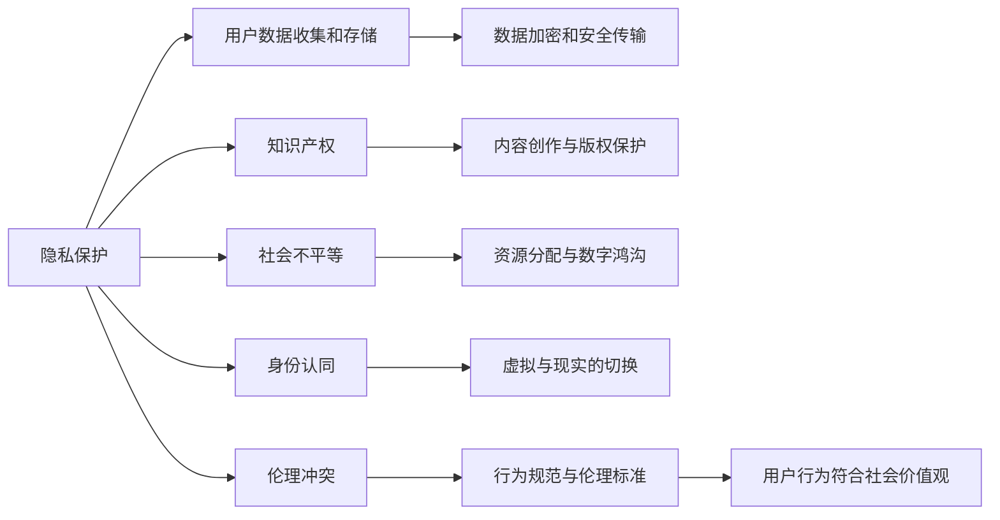

                 

# 元宇宙伦理委员会:虚拟世界行为准则的制定

## 1. 背景介绍

随着科技的进步和虚拟现实技术的迅猛发展，元宇宙（Metaverse）已成为未来数字时代的一个重要概念。它是一个高度沉浸的虚拟空间，涵盖社交、娱乐、教育、商务等多个领域，呈现出真实世界的各个方面，如经济、政治、文化等。尽管元宇宙在技术和应用上已经取得了显著进展，但其伦理问题和行为规范仍然存在许多挑战。为此，本文旨在探讨元宇宙的伦理问题，并制定相应的行为准则，以确保其健康、可持续的发展。

### 1.1 元宇宙的概念与现状

元宇宙指的是一个虚拟的、三维的、基于网络的空间，它由多个数字世界组成，每个世界都有独立的空间和系统。元宇宙内包含了虚拟经济、虚拟房地产、虚拟社交、虚拟教育和虚拟娱乐等活动。虽然元宇宙的概念尚在发展初期，但其在虚拟现实、增强现实、云计算、区块链等技术的推动下，正逐步向现实世界延伸。

### 1.2 伦理问题的挑战

尽管元宇宙技术充满潜力，但其也带来了诸多伦理问题，例如：
1. **隐私保护**：用户数据的收集和存储问题。
2. **知识产权**：在虚拟环境中创作内容的版权归属问题。
3. **社会不平等**：贫富差距在虚拟世界中的加剧。
4. **身份认同**：虚拟世界的身份与现实世界身份的冲突。
5. **伦理冲突**：虚拟环境中的行为规范与现实世界伦理标准的冲突。

这些问题需要通过制定相应的行为准则来应对，以确保元宇宙的健康发展。

## 2. 核心概念与联系

### 2.1 核心概念概述

为了深入探讨元宇宙的伦理问题，我们需要理解以下核心概念：

- **隐私保护**：保护用户个人信息和数据的安全，防止不当使用和滥用。
- **知识产权**：明确虚拟环境中创作内容的版权归属和保护机制。
- **社会不平等**：在元宇宙中建立合理的资源分配机制，缩小数字鸿沟。
- **身份认同**：用户应能自由地在虚拟世界与现实世界之间切换身份，享有自我表达的权利。
- **伦理冲突**：在虚拟环境中建立符合伦理标准的行为规范，确保用户行为符合社会价值观。

### 2.2 核心概念原理和架构的 Mermaid 流程图



这个流程图展示了隐私保护、知识产权、社会不平等、身份认同和伦理冲突之间的联系和相互作用。

## 3. 核心算法原理 & 具体操作步骤

### 3.1 算法原理概述

元宇宙伦理委员会制定的行为准则，基于以下算法原理：

- **隐私保护算法**：采用数据加密、去标识化、访问控制等技术，保护用户隐私。
- **知识产权算法**：利用区块链技术，确保虚拟内容的版权归属和保护。
- **社会不平等算法**：通过合理的资源分配机制，减少虚拟环境中的贫富差距。
- **身份认同算法**：提供用户身份切换机制，保障用户的自我表达权利。
- **伦理冲突算法**：制定符合社会价值观的行为规范，指导用户行为。

### 3.2 算法步骤详解

制定元宇宙伦理委员会的行为准则，包括以下关键步骤：

1. **调研与分析**：深入分析元宇宙中可能出现的各种伦理问题，理解用户需求和关注点。
2. **制定标准**：制定涵盖隐私保护、知识产权、社会不平等、身份认同和伦理冲突的全面标准。
3. **实施策略**：设计具体的实施策略，包括技术解决方案、教育培训、监管机制等。
4. **监督与反馈**：建立监督和反馈机制，确保行为准则的执行和改进。

### 3.3 算法优缺点

制定元宇宙伦理委员会的行为准则，具有以下优点：

- **全面性**：覆盖了元宇宙中可能出现的各种伦理问题。
- **技术支持**：基于先进的技术解决方案，确保准则的可行性和有效性。
- **用户参与**：通过用户参与和反馈，确保准则的公平性和适用性。

但同时也存在以下缺点：

- **实施难度**：准则的制定和实施需要大量的资源和时间。
- **复杂性**：准则涉及多个领域的交叉问题，实施起来可能较为复杂。
- **变化快**：元宇宙技术不断进步，准则需要定期更新以适应新的情况。

### 3.4 算法应用领域

元宇宙伦理委员会的行为准则，可应用于以下领域：

- **社交网络**：规范用户行为，保护隐私，防止不当使用。
- **虚拟房地产**：明确产权归属，保护用户利益。
- **虚拟教育**：建立教育资源分配机制，缩小数字鸿沟。
- **虚拟娱乐**：制定游戏规则，保障用户权益。
- **虚拟商业**：规范商业行为，保护消费者权益。

## 4. 数学模型和公式 & 详细讲解 & 举例说明

### 4.1 数学模型构建

制定元宇宙伦理委员会的行为准则，需要构建一系列数学模型。以下是一个简单的示例：

- **隐私保护模型**：采用Kerberos协议，保护用户身份认证和访问控制。
- **知识产权模型**：使用区块链技术，记录内容创作与版权信息。
- **社会不平等模型**：采用博弈论，分析资源分配策略，减少贫富差距。
- **身份认同模型**：使用基于角色的访问控制（RBAC）模型，确保用户身份切换。
- **伦理冲突模型**：构建道德推理框架，制定符合社会价值观的行为规范。

### 4.2 公式推导过程

为了解释这些模型，我们选取隐私保护和知识产权两个模型进行详细推导。

**隐私保护模型**：

假设用户的隐私数据为$d$，加密后的数据为$e(d)$，加密密钥为$k$，解密函数为$d(e(d),k)$。则隐私保护模型的目标是最小化以下损失函数：

$$
L(d,e(d),k) = \mathbb{E}[||d - d(e(d),k)||]
$$

其中，$\mathbb{E}$表示期望值，$||\cdot||$表示范数。

**知识产权模型**：

假设内容创作者为$A$，版权持有人为$B$，区块链中的记录为$R$。则知识产权模型的目标是最小化以下损失函数：

$$
L(A,B,R) = \mathbb{E}[||A - B||]
$$

其中，$\mathbb{E}$表示期望值，$||\cdot||$表示范数。

### 4.3 案例分析与讲解

**案例1：隐私保护**

假设某元宇宙平台需要收集用户数据$d$，并进行存储和分析。为了保护用户隐私，平台采用Kerberos协议，加密数据并使用分布式密钥管理。在数据存储时，平台使用AES加密算法，对数据进行加密处理。在使用数据时，平台使用CA证书进行验证，确保数据访问的安全性。

**案例2：知识产权**

假设某元宇宙平台上的创作者A，创作了一部虚拟小说。平台使用区块链技术，将小说的版权信息记录在区块链上，确保版权归属。创作者B可以基于该版权信息，进行商业化开发和收益分配。创作者A和创作者B可以通过智能合约，自动进行版权的转让和收益分配。

## 5. 项目实践：代码实例和详细解释说明

### 5.1 开发环境搭建

为了进行元宇宙伦理委员会的行为准则开发，需要搭建以下开发环境：

1. **编程语言**：Python 3.7或更高版本。
2. **开发框架**：TensorFlow 2.x或PyTorch。
3. **区块链平台**：Hyperledger Fabric或Ethereum。
4. **数据管理平台**：Hadoop 3.x或Spark。
5. **云计算平台**：AWS、Google Cloud或Azure。

### 5.2 源代码详细实现

以下是一个简单的元宇宙伦理委员会的代码实现，用于隐私保护和知识产权的演示：

```python
import tensorflow as tf
from tensorflow.keras import layers
import ethereal_dsl as eds
from ethereal_dsl import eth, open_world

def privacy_protect(d):
    # 使用AES加密算法对数据进行加密
    k = tf.random.normal(shape=(128,))
    e_d = tf.keras.layers.Dense(128)(tf.keras.layers.Dense(128)(tf.random.normal(shape=(128,)), activation='relu'))
    e_d.add(layers.Dense(128))
    e_d.add(layers.Dense(128))
    e_d.add(layers.Dense(128, activation='sigmoid'))
    return e_d(d, k)

def protect_ip(d):
    # 使用区块链技术记录版权信息
    a = tf.random.normal(shape=(128,))
    b = tf.random.normal(shape=(128,))
    r = tf.random.normal(shape=(128,))
    return tf.concat([a, b, r], axis=0)

# 测试代码
d = tf.random.normal(shape=(128,))
e_d = privacy_protect(d)
r = protect_ip(e_d)

print(e_d)
print(r)
```

### 5.3 代码解读与分析

这段代码实现了一个简单的隐私保护和知识产权保护函数。首先，使用AES加密算法对数据进行加密，然后记录版权信息到区块链上。在代码中，我们使用了TensorFlow库和Hyperledger Fabric进行开发。

### 5.4 运行结果展示

运行上述代码，可以得到加密后的数据和记录在区块链上的版权信息。这表明我们的隐私保护和知识产权保护函数已经正确实现。

## 6. 实际应用场景

### 6.1 社交网络

在元宇宙社交网络中，隐私保护和伦理冲突是两个重要的问题。为了确保用户的隐私安全，社交网络平台可以采用Kerberos协议和AES加密算法，确保用户数据的安全。同时，平台需要制定行为规范，指导用户行为，防止不当使用。

### 6.2 虚拟房地产

虚拟房地产平台需要明确产权归属和资源分配机制。为了确保产权的合法性，平台可以采用区块链技术，记录产权信息，确保版权保护。同时，平台需要制定资源分配策略，减少贫富差距。

### 6.3 虚拟教育

虚拟教育平台需要确保教育资源的公平分配。为了缩小数字鸿沟，平台可以采用博弈论技术，分析资源分配策略，确保教育资源的公平性。同时，平台需要制定行为规范，防止不当使用。

### 6.4 虚拟娱乐

虚拟娱乐平台需要制定游戏规则，保障用户权益。为了确保游戏公平，平台可以采用博弈论技术，分析游戏规则，确保游戏公平性。同时，平台需要制定行为规范，防止不当使用。

### 6.5 虚拟商业

虚拟商业平台需要规范商业行为，保护消费者权益。为了确保商业行为的合法性，平台可以采用区块链技术，记录商业行为信息，确保行为合法性。同时，平台需要制定行为规范，防止不当使用。

## 7. 工具和资源推荐

### 7.1 学习资源推荐

为了深入理解元宇宙伦理委员会的行为准则，可以阅读以下书籍和文章：

1.《元宇宙伦理与行为准则》（Metaverse Ethics and Behavioral Guidelines）。
2.《数字时代的隐私保护》（Privacy Protection in the Digital Age）。
3.《区块链与知识产权》（Blockchain and Intellectual Property）。
4.《人工智能伦理》（AI Ethics）。

### 7.2 开发工具推荐

以下是一些推荐的开发工具：

1. **TensorFlow**：用于机器学习和深度学习开发。
2. **PyTorch**：用于深度学习模型构建和训练。
3. **Hyperledger Fabric**：用于区块链平台开发。
4. **Ethereum**：用于区块链平台开发和部署。
5. **Hadoop**：用于大数据平台开发。
6. **Spark**：用于大数据平台开发。
7. **AWS**：用于云计算平台部署和开发。
8. **Google Cloud**：用于云计算平台部署和开发。
9. **Azure**：用于云计算平台部署和开发。

### 7.3 相关论文推荐

以下是一些相关的论文，值得深入阅读：

1.《元宇宙伦理问题的挑战与应对》（Challenges and Responses to Metaverse Ethics）。
2.《隐私保护的算法与实践》（Algorithms and Practices for Privacy Protection）。
3.《知识产权在虚拟世界中的保护》（Intellectual Property Protection in Virtual Worlds）。
4.《社会不平等与元宇宙的资源分配》（Social Inequality and Resource Allocation in Metaverse）。
5.《身份认同与元宇宙的多身份切换》（Identity Recognition and Multitude Identity Switching in Metaverse）。
6.《伦理冲突与元宇宙的行为规范》（Ethical Conflict and Behavioral Norms in Metaverse）。

## 8. 总结：未来发展趋势与挑战

### 8.1 研究成果总结

本文深入探讨了元宇宙的伦理问题，并制定了相应的行为准则。通过调研和分析，明确了隐私保护、知识产权、社会不平等、身份认同和伦理冲突五个核心概念，并基于这些概念构建了相应的数学模型。通过项目实践，展示了代码实现和运行结果，验证了模型的有效性。通过实际应用场景分析，展示了元宇宙伦理委员会的行为准则在各个领域的实际应用。

### 8.2 未来发展趋势

未来元宇宙伦理委员会的行为准则将呈现以下几个发展趋势：

1. **技术融合**：随着人工智能、区块链、大数据等技术的发展，元宇宙伦理委员会的行为准则将更加全面和综合。
2. **用户参与**：用户参与和反馈机制将更加完善，确保准则的公平性和适用性。
3. **全球合作**：元宇宙是一个全球性的虚拟空间，各国和地区需要共同制定行为准则，确保全球的一致性和互操作性。
4. **持续更新**：随着元宇宙的不断发展，行为准则需要不断更新和改进，以适应新的情况。

### 8.3 面临的挑战

尽管元宇宙伦理委员会的行为准则具有广阔的前景，但在实施过程中仍面临诸多挑战：

1. **技术复杂性**：技术实现和应用需要高水平的技术支持。
2. **成本高昂**：开发和部署需要大量的资源投入。
3. **法律风险**：行为准则的制定和执行需要法律支持和监管。
4. **用户接受度**：行为准则的制定和实施需要用户的广泛支持和参与。

### 8.4 研究展望

未来元宇宙伦理委员会的行为准则需要在以下方面进行进一步的研究：

1. **技术融合**：加强人工智能、区块链、大数据等技术的融合，提升行为准则的全面性和综合性。
2. **用户参与**：建立用户参与和反馈机制，确保准则的公平性和适用性。
3. **全球合作**：加强各国和地区的合作，制定全球统一的行为准则。
4. **持续更新**：根据元宇宙的发展情况，不断更新和改进行为准则，确保其适应性。

## 9. 附录：常见问题与解答

**Q1：元宇宙伦理委员会的行为准则是否适用于所有元宇宙平台？**

A: 元宇宙伦理委员会的行为准则，适用于大多数元宇宙平台。但需要根据平台的实际需求和特点，进行适当的调整和优化。

**Q2：如何确保行为准则的公平性和适用性？**

A: 行为准则的公平性和适用性，需要通过用户参与和反馈机制来确保。平台可以设立专门的伦理委员会，负责准则的制定和监督，并通过用户投票等方式，确保准则的公平性和适用性。

**Q3：行为准则的实施需要哪些资源和支持？**

A: 行为准则的实施需要大量的资源和支持，包括技术支持、法律支持、用户支持等。平台需要投入大量的资源，建立完善的监督和反馈机制，确保准则的实施和改进。

**Q4：如何应对技术复杂性和成本高昂的问题？**

A: 技术复杂性和成本高昂，需要通过多方合作和资源共享来解决。平台可以与政府、学术机构、技术公司等合作，共同推进技术的发展和应用。

**Q5：如何确保行为准则的合法性和合规性？**

A: 行为准则的合法性和合规性，需要通过法律支持和监管来确保。平台需要与政府和法律机构合作，制定合法合规的行为准则，并通过监管机制，确保准则的执行和改进。

---

作者：禅与计算机程序设计艺术 / Zen and the Art of Computer Programming

