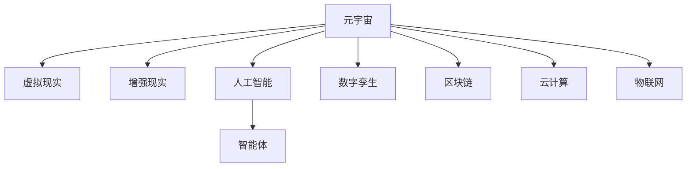

                 

# 元宇宙体育:虚实结合的竞技新形式

> 关键词：元宇宙,体育,虚实结合,竞技,新技术,未来体育,数字孪生

## 1. 背景介绍

### 1.1 问题由来
随着技术的进步和产业的迭代，我们正在经历从现实世界向虚拟世界的深刻变革。在体育竞技领域，虚拟现实(VR)、增强现实(AR)、人工智能(AI)等新技术正在改变传统体育的固有模式，开启虚实结合的竞技新纪元。而元宇宙（Metaverse）的概念和技术的兴起，则为体育竞技提供了全新的平台和场景，带来了无限的可能。

### 1.2 问题核心关键点
元宇宙体育的核心在于通过虚拟和现实技术的结合，创造一个更加沉浸、互动、智能的竞技环境，提供前所未有的参与感和体验感。这个概念涵盖三个核心要素：

1. **虚拟竞技场景**：构建高拟真度的虚拟比赛环境，通过3D建模、物理引擎等技术，尽可能地还原真实竞技场景。
2. **互动竞技体验**：利用AI驱动的智能体（agent），为参与者提供实时反馈、智能对手、数据支持等丰富互动体验。
3. **跨界竞技平台**：打破传统体育地理限制，构建开放、自由、连续的竞技空间，让全球范围内的体育爱好者都能够参与其中。

### 1.3 问题研究意义
元宇宙体育的发展不仅能够极大地推动体育竞技的智能化和数字化进程，还能促进新兴产业的成长，推动相关技术的创新和应用。具体而言，它具有以下几方面的研究意义：

1. **提升竞技体验**：通过虚拟现实和增强现实技术，提供沉浸式的竞技体验，使观众和运动员都能在虚拟世界中尽情享受竞技的乐趣。
2. **扩大受众范围**：打破地理限制，让全球的体育爱好者都能够方便地参与和观赏，促进体育文化的全球传播。
3. **促进技术进步**：推动虚拟现实、增强现实、人工智能等新技术的发展，为这些领域的跨界融合提供范例。
4. **拓展应用场景**：为体育、游戏、教育等多个领域提供新的应用场景，激发更多的创新和应用可能性。

## 2. 核心概念与联系

### 2.1 核心概念概述

为更好地理解元宇宙体育的构建，本节将介绍几个密切相关的核心概念：

- **元宇宙 (Metaverse)**：一个跨越物理和数字世界的虚拟空间，其中用户可以通过虚拟现实和增强现实技术，获得沉浸式体验。
- **虚拟现实 (Virtual Reality, VR)**：一种通过计算机生成模拟环境，让用户获得沉浸式体验的技术。
- **增强现实 (Augmented Reality, AR)**：一种将虚拟信息叠加到现实世界中的技术，增强用户对现实环境的感知。
- **人工智能 (Artificial Intelligence, AI)**：一种使计算机具备类似于人类智能的技术，包括机器学习、深度学习、自然语言处理等。
- **智能体 (Agent)**：在元宇宙体育中，智能体指由AI驱动的虚拟角色或实体，能够自主决策、实时反馈，为参与者提供竞技体验。
- **数字孪生 (Digital Twin)**：一种将物理世界的对象和系统数字化，并在数字空间中创建其虚拟镜像的技术。
- **区块链 (Blockchain)**：一种去中心化、不可篡改的分布式账本技术，为元宇宙提供安全、透明的治理基础。
- **云计算 (Cloud Computing)**：一种通过网络提供计算资源和服务的模式，支持元宇宙体育的大规模数据处理和计算需求。
- **物联网 (Internet of Things, IoT)**：一种将各种物理设备连接到互联网，实现设备间通信和数据共享的技术，为元宇宙体育的智能设备和环境感知提供支持。

这些核心概念之间的逻辑关系可以通过以下Mermaid流程图来展示：



这个流程图展示了几项关键技术在元宇宙体育中的作用：

1. 元宇宙作为总体平台，连接虚拟和现实世界。
2. VR、AR提供沉浸式和增强现实的体验。
3. AI和智能体实现智能竞技环境。
4. 数字孪生和区块链确保数据安全和透明治理。
5. 云计算和物联网支持大规模数据处理和设备互联。

## 3. 核心算法原理 & 具体操作步骤
### 3.1 算法原理概述

元宇宙体育的构建涉及到虚拟现实、增强现实、人工智能、数字孪生等多个领域的先进技术。核心算法原理包括但不限于以下几个方面：

1. **虚拟环境构建**：利用3D建模、物理引擎等技术，构建逼真的虚拟竞技场景。
2. **智能体行为控制**：通过强化学习、模仿学习等算法，使智能体能够自主学习和决策，提供实时反馈和智能对手。
3. **数据驱动竞技体验**：利用大数据分析、机器学习等技术，提供个性化的竞技体验和数据分析支持。
4. **跨界平台互联**：利用区块链和云计算等技术，实现不同平台之间的数据互通和协同操作。

### 3.2 算法步骤详解

以下是元宇宙体育构建的详细步骤：

**Step 1: 设计虚拟竞技环境**
- 使用3D建模软件和物理引擎，设计虚拟竞技场景。
- 引入真实世界的数据和资源，如地形、天气、观众、灯光等，增加真实感。
- 确定游戏规则和竞技方式，确保场景的公平性和可玩性。

**Step 2: 实现智能体控制**
- 使用强化学习算法，如Q-learning、Deep Q-Network等，训练智能体的行为策略。
- 使用模仿学习算法，如行为克隆、Transformer-based imitation learning等，训练智能体模仿人类运动员的行为。
- 为智能体提供实时反馈和奖励机制，增强其决策能力和学习效率。

**Step 3: 数据驱动竞技体验**
- 收集和分析竞技数据，如运动员动作、环境数据、观众反馈等。
- 利用机器学习算法，如决策树、随机森林、神经网络等，提供个性化竞技建议和数据分析。
- 结合用户反馈和数据分析，优化竞技场景和智能体的行为策略。

**Step 4: 跨界平台互联**
- 利用区块链技术，建立竞技平台的数据治理体系，确保数据的透明和可追溯性。
- 使用云计算技术，提供竞技平台的大规模数据处理和计算支持。
- 通过物联网技术，实现虚拟竞技环境中的设备和传感器互联，增强环境的感知和交互能力。

**Step 5: 用户接入和互动**
- 开发虚拟现实设备和增强现实设备，供用户接入虚拟竞技环境。
- 实现用户与智能体之间的实时互动，如语音交互、动作捕捉等。
- 提供用户反馈和建议的机制，不断优化竞技体验。

### 3.3 算法优缺点

元宇宙体育的构建方法具有以下优点：

1. **沉浸式体验**：通过虚拟现实和增强现实技术，提供高拟真度的竞技体验，增强用户的沉浸感和参与感。
2. **智能化决策**：利用AI驱动的智能体，提供实时反馈和智能对手，增强竞技的挑战性和趣味性。
3. **个性化定制**：通过大数据分析和机器学习算法，提供个性化的竞技体验和数据分析支持，满足不同用户的需求。
4. **跨界协同**：利用区块链和云计算技术，实现不同平台之间的数据互通和协同操作，扩大竞技场景的覆盖范围。

同时，该方法也存在一些局限性：

1. **技术成本高**：构建高拟真度的虚拟竞技场景和智能体控制需要较高的技术成本，包括硬件设备和软件开发。
2. **数据隐私风险**：在跨界平台互联过程中，用户的竞技数据和个人隐私可能面临泄露的风险。
3. **用户体验不稳定**：虚拟现实和增强现实技术仍处于发展阶段，设备性能和用户体验可能存在不稳定性。
4. **技术壁垒高**：涉及多个领域的先进技术，对技术团队的要求较高，跨领域技术融合难度大。

尽管存在这些局限性，但就目前而言，元宇宙体育的构建方法在提升竞技体验、扩大受众范围、促进技术创新等方面具有显著优势。未来相关研究的重点在于如何进一步降低技术成本，提高用户体验，确保数据隐私安全，同时兼顾跨界协同和智能化决策。

### 3.4 算法应用领域

元宇宙体育的应用场景广泛，涵盖了传统体育竞技的多个领域，具体包括：

- **虚拟体育赛事**：如虚拟奥运会、虚拟世界杯等，提供高拟真度的竞技体验。
- **在线竞技平台**：如虚拟篮球场、虚拟足球场等，用户可以实时参与竞技，体验互动。
- **教育培训平台**：如虚拟体育课、虚拟教练等，提供个性化的学习和训练支持。
- **健康运动平台**：如虚拟健身、虚拟康复等，为用户提供沉浸式的运动体验。
- **娱乐体验平台**：如虚拟演唱会、虚拟游乐园等，提供新型的娱乐体验。

除了这些传统应用场景，元宇宙体育还在不断拓展新的应用领域，如虚拟场景下的体育竞赛、跨界融合的体育文化活动等，为体育竞技带来新的生命力和活力。

## 4. 数学模型和公式 & 详细讲解 & 举例说明

### 4.1 数学模型构建

在元宇宙体育的构建过程中，涉及到多个数学模型和算法。以下将重点介绍几个关键模型的构建。

**虚拟环境构建模型**
假设竞技场景由多个对象组成，每个对象 $i$ 的位置和速度由向量 $\mathbf{p}_i$ 和 $\mathbf{v}_i$ 表示，受力 $f_i$ 影响。则对象的物理方程为：

$$
\mathbf{p}_{i+1} = \mathbf{p}_i + \mathbf{v}_i \Delta t + \mathbf{f}_i \Delta t^2
$$
$$
\mathbf{v}_{i+1} = \mathbf{v}_i + \frac{\mathbf{f}_i}{m_i} \Delta t
$$

其中 $\Delta t$ 为时间步长，$m_i$ 为对象的质量。

**智能体行为控制模型**
假设智能体在竞技环境中的决策由神经网络 $N$ 控制，输入为当前状态 $s_t$，输出为动作 $a_t$。则智能体的控制方程为：

$$
a_t = N(s_t; \theta)
$$

其中 $\theta$ 为神经网络的参数。

**数据驱动竞技体验模型**
假设竞技数据由用户 $i$ 的行为 $x_i$ 和环境数据 $e_i$ 构成，竞技体验由个性化推荐模型 $R$ 驱动。则竞技体验的推荐方程为：

$$
y_i = R(x_i, e_i; \phi)
$$

其中 $\phi$ 为推荐模型的参数。

### 4.2 公式推导过程

以下我们以虚拟环境构建模型为例，推导物理方程的求解过程。

假设竞技场景中有两个对象 $A$ 和 $B$，其位置和速度分别为 $\mathbf{p}_A$、$\mathbf{v}_A$ 和 $\mathbf{p}_B$、$\mathbf{v}_B$，受力分别为 $f_A$ 和 $f_B$。则两对象间的物理方程为：

$$
\mathbf{p}_{A+1} = \mathbf{p}_A + \mathbf{v}_A \Delta t + \mathbf{f}_A \Delta t^2
$$
$$
\mathbf{p}_{B+1} = \mathbf{p}_B + \mathbf{v}_B \Delta t + \mathbf{f}_B \Delta t^2
$$
$$
\mathbf{v}_{A+1} = \mathbf{v}_A + \frac{\mathbf{f}_A}{m_A} \Delta t
$$
$$
\mathbf{v}_{B+1} = \mathbf{v}_B + \frac{\mathbf{f}_B}{m_B} \Delta t
$$

求解上述方程组，即可得到对象在下一个时间步的位置和速度。

### 4.3 案例分析与讲解

假设我们正在构建一个虚拟篮球比赛场景，其中有两个球员 $A$ 和 $B$，他们的位置和速度由以下方程控制：

$$
\mathbf{p}_{A+1} = \mathbf{p}_A + \mathbf{v}_A \Delta t + \mathbf{f}_A \Delta t^2
$$
$$
\mathbf{p}_{B+1} = \mathbf{p}_B + \mathbf{v}_B \Delta t + \mathbf{f}_B \Delta t^2
$$
$$
\mathbf{v}_{A+1} = \mathbf{v}_A + \frac{\mathbf{f}_A}{m_A} \Delta t
$$
$$
\mathbf{v}_{B+1} = \mathbf{v}_B + \frac{\mathbf{f}_B}{m_B} \Delta t
$$

其中 $\mathbf{p}_A$、$\mathbf{p}_B$、$\mathbf{v}_A$、$\mathbf{v}_B$ 分别为球员 $A$ 和 $B$ 的位置和速度向量，$\mathbf{f}_A$ 和 $\mathbf{f}_B$ 分别为球员所受的力，$m_A$ 和 $m_B$ 分别为球员的质量，$\Delta t$ 为时间步长。

在模拟过程中，我们还需要考虑球员之间的碰撞和摩擦，这些因素可以通过更复杂的物理方程进行建模。

## 5. 项目实践：代码实例和详细解释说明
### 5.1 开发环境搭建

在进行元宇宙体育开发前，我们需要准备好开发环境。以下是使用Python进行PyTorch开发的环境配置流程：

1. 安装Anaconda：从官网下载并安装Anaconda，用于创建独立的Python环境。

2. 创建并激活虚拟环境：
```bash
conda create -n pytorch-env python=3.8 
conda activate pytorch-env
```

3. 安装PyTorch：根据CUDA版本，从官网获取对应的安装命令。例如：
```bash
conda install pytorch torchvision torchaudio cudatoolkit=11.1 -c pytorch -c conda-forge
```

4. 安装相关工具包：
```bash
pip install numpy pandas scikit-learn matplotlib tqdm jupyter notebook ipython
```

完成上述步骤后，即可在`pytorch-env`环境中开始元宇宙体育的开发。

### 5.2 源代码详细实现

下面我们以虚拟篮球比赛场景为例，给出使用PyTorch进行虚拟环境构建的PyTorch代码实现。

首先，定义虚拟篮球比赛的场景类：

```python
import torch
import torch.nn as nn
import torch.optim as optim
from torch.distributions import MultivariateNormal, Normal

class BasketballScene:
    def __init__(self, n_objects=2):
        self.n_objects = n_objects
        self.objects = self.create_objects()
    
    def create_objects(self):
        objects = []
        for i in range(self.n_objects):
            obj = {}
            obj['position'] = torch.tensor([0, 0, 0])
            obj['speed'] = torch.tensor([1, 0, 0])
            obj['mass'] = 1.0
            objects.append(obj)
        return objects
    
    def update_position(self, dt):
        for obj in self.objects:
            force = torch.tensor([0, 0, 0])
            obj['position'] += obj['speed'] * dt + force * dt**2
            obj['speed'] += force / obj['mass'] * dt
```

然后，定义智能体控制模型：

```python
class BasketballAgent(nn.Module):
    def __init__(self):
        super(BasketballAgent, self).__init__()
        self.fc1 = nn.Linear(3, 64)
        self.fc2 = nn.Linear(64, 2)
    
    def forward(self, x):
        x = torch.relu(self.fc1(x))
        x = self.fc2(x)
        return x
```

接着，定义数据驱动竞技体验模型：

```python
class BasketballRecommendation:
    def __init__(self):
        self.model = nn.Linear(3, 1)
    
    def forward(self, x):
        return self.model(x)
```

最后，启动训练流程并在虚拟比赛场景中应用：

```python
from torch.utils.data import DataLoader
from tqdm import tqdm

n_epochs = 1000
dt = 0.01
device = torch.device('cuda') if torch.cuda.is_available() else torch.device('cpu')
objects = BasketballScene(n_objects=2).objects
agent = BasketballAgent().to(device)
recommendation = BasketballRecommendation().to(device)

optimizer = optim.Adam([{'params': agent.parameters()}, {'params': recommendation.parameters()}], lr=0.01)

for epoch in range(n_epochs):
    with torch.no_grad():
        for obj in objects:
            force = torch.tensor([0, 0, 0])
            obj['position'] += obj['speed'] * dt + force * dt**2
            obj['speed'] += force / obj['mass'] * dt
    
    optimizer.zero_grad()
    agent_output = agent(torch.tensor([obj['position'], obj['speed']]))
    recommendation_output = recommendation(torch.tensor([obj['position'], obj['speed']]))
    loss = torch.mean(torch.abs(agent_output - recommendation_output))
    loss.backward()
    optimizer.step()

    print(f'Epoch {epoch+1}, loss: {loss.item()}')
```

以上就是使用PyTorch构建虚拟篮球比赛场景的完整代码实现。可以看到，利用PyTorch，我们可以高效地实现虚拟环境中的物理模拟和智能体控制，为元宇宙体育的构建提供强大的技术支持。

### 5.3 代码解读与分析

让我们再详细解读一下关键代码的实现细节：

**BasketballScene类**：
- `__init__`方法：初始化虚拟篮球比赛场景中的对象。
- `create_objects`方法：创建并返回虚拟对象，包括位置、速度、质量等属性。
- `update_position`方法：根据物理方程更新对象的位置和速度。

**BasketballAgent类**：
- `__init__`方法：定义神经网络结构，包括全连接层。
- `forward`方法：定义神经网络的计算过程。

**BasketballRecommendation类**：
- `__init__`方法：定义数据驱动竞技体验的模型，包括线性层。
- `forward`方法：定义模型的计算过程。

**训练流程**：
- 在每个epoch中，根据物理方程更新对象位置和速度。
- 计算智能体输出和推荐模型输出，计算损失。
- 使用优化器更新模型参数。
- 输出当前损失，以便观察训练效果。

可以看到，PyTorch使得元宇宙体育的构建过程变得简洁高效，开发者可以将更多精力放在场景设计、模型训练等高层逻辑上，而不必过多关注底层的实现细节。

当然，工业级的系统实现还需考虑更多因素，如模型的保存和部署、超参数的自动搜索、更灵活的智能体行为策略等。但核心的技术原理基本与此类似。

## 6. 实际应用场景
### 6.1 智能运动训练

在智能运动训练领域，元宇宙体育提供了全新的训练方式。通过虚拟现实和增强现实技术，用户可以在虚拟环境中进行高仿真的运动训练，实时获取反馈和建议，快速提升运动技能。

具体而言，智能运动训练系统可以包括以下几个模块：

- **虚拟教练**：利用智能体技术，提供实时反馈和动作指导，帮助用户纠正动作错误，提高训练效果。
- **个性化训练计划**：结合用户数据和竞技体验模型，提供个性化的训练方案和进度跟踪。
- **虚拟比赛模拟**：模拟真实比赛场景，提供竞技体验和心理压力测试，帮助用户提升比赛表现。
- **数据驱动分析**：利用大数据分析技术，提供运动表现和健康指标的统计分析，辅助训练调整和健康管理。

### 6.2 体育赛事直播

在体育赛事直播领域，元宇宙体育提供了全新的观看体验。观众可以在虚拟环境中参与直播，实时与体育明星互动，享受沉浸式的观赛体验。

具体而言，体育赛事直播系统可以包括以下几个模块：

- **虚拟观众**：利用智能体技术，提供虚拟观众的互动体验，如与明星交流、参与互动问答等。
- **虚拟广告**：在虚拟场景中插入虚拟广告，提供品牌推广和产品展示的机会。
- **虚拟解说**：利用AI驱动的虚拟解说员，提供实时解说和数据分析，增强观赛体验。
- **数据驱动分析**：利用大数据分析技术，提供赛事数据和观众反馈的统计分析，优化直播内容。

### 6.3 体育营销活动

在体育营销活动领域，元宇宙体育提供了全新的营销方式。通过虚拟现实和增强现实技术，体育品牌可以在虚拟环境中开展互动活动，吸引用户的注意和参与。

具体而言，体育营销活动系统可以包括以下几个模块：

- **虚拟体验活动**：利用虚拟现实技术，提供沉浸式的体育体验活动，如虚拟足球赛、虚拟篮球赛等。
- **虚拟产品展示**：在虚拟场景中展示体育产品，提供产品试用和体验的机会。
- **虚拟互动游戏**：利用增强现实技术，提供与体育明星互动的游戏，增强用户参与感。
- **数据驱动分析**：利用大数据分析技术，提供用户行为和反馈的统计分析，优化营销策略。

### 6.4 未来应用展望

随着元宇宙体育的发展，其在实际应用中的潜力将被进一步挖掘，未来的应用场景将更加广泛。

1. **虚拟职业运动员**：利用智能体技术，训练虚拟职业运动员，进行高仿真的比赛和训练，为现实运动员提供数据支持和技能训练。
2. **虚拟体育学院**：利用元宇宙体育平台，提供虚拟体育学院课程，为全球体育爱好者提供学习和训练的机会。
3. **虚拟体育俱乐部**：利用元宇宙体育平台，构建虚拟体育俱乐部，提供竞技比赛、运动训练、社交活动等综合服务。
4. **虚拟体育赛事**：利用元宇宙体育平台，举办虚拟体育赛事，吸引全球体育爱好者的参与，推动体育文化的全球传播。
5. **虚拟体育广告**：利用元宇宙体育平台，提供虚拟广告位，进行品牌推广和产品展示，拓展体育营销的新途径。

此外，元宇宙体育还在不断拓展新的应用领域，如虚拟体育旅游、虚拟体育社交、虚拟体育教育等，为体育竞技带来新的生命力和活力。相信随着技术的不断进步，元宇宙体育将为体育竞技带来更多的创新和可能，为人类社会的健康、娱乐和教育带来新的价值。

## 7. 工具和资源推荐
### 7.1 学习资源推荐

为了帮助开发者系统掌握元宇宙体育的理论基础和实践技巧，这里推荐一些优质的学习资源：

1. 《元宇宙：概念、技术与应用》系列博文：由元宇宙领域专家撰写，深入浅出地介绍了元宇宙的基本概念、关键技术及其在体育中的应用。

2. 《虚拟现实与增强现实技术》课程：斯坦福大学开设的VR/AR明星课程，涵盖基础概念、核心技术和经典案例，适合入门学习。

3. 《人工智能与体育》书籍：全面介绍了人工智能在体育中的应用，包括智能体控制、数据驱动竞技体验等技术。

4. NVIDIA官方文档：NVIDIA的VR/AR开发指南，提供详细的硬件、软件和开发工具支持，是实践元宇宙体育的必备资料。

5. Unity游戏引擎：提供强大的3D建模和游戏引擎支持，广泛应用于虚拟场景构建和互动体验开发。

通过对这些资源的学习实践，相信你一定能够快速掌握元宇宙体育的技术精髓，并用于解决实际的体育问题。
### 7.2 开发工具推荐

高效的开发离不开优秀的工具支持。以下是几款用于元宇宙体育开发的常用工具：

1. Unity游戏引擎：提供强大的3D建模和游戏引擎支持，广泛应用于虚拟场景构建和互动体验开发。

2. Unreal Engine：另一款顶级游戏引擎，提供高仿真的物理引擎和可视化工具，支持VR/AR的开发和部署。

3. TensorFlow和PyTorch：提供强大的深度学习框架支持，用于智能体行为控制和数据驱动竞技体验的开发。

4. VRTK：一个专为VR开发的Unity插件，提供丰富的VR开发工具和组件，支持VR/AR的应用开发。

5. ARKit和ARCore：苹果和谷歌提供的增强现实开发工具，支持iOS和Android平台的AR应用开发。

合理利用这些工具，可以显著提升元宇宙体育的开发效率，加快创新迭代的步伐。

### 7.3 相关论文推荐

元宇宙体育的发展源于学界的持续研究。以下是几篇奠基性的相关论文，推荐阅读：

1. The Reality of Virtual Reality：一篇关于VR技术的综述性论文，介绍了VR技术的发展历程和应用前景。

2. Virtual Reality and Social Interaction：研究虚拟现实技术在社交互动中的应用，探讨了其对人际交往的影响。

3. Augmented Reality in Education：探讨AR技术在教育中的应用，提供了AR教育系统的设计和实现案例。

4. Multiagent Systems in Sports：介绍智能体技术在体育竞技中的应用，分析了智能体在运动训练和比赛中的应用前景。

5. Virtual Reality Sports Analytics：研究虚拟现实技术在体育赛事直播中的应用，提供了虚拟体育赛事的实现方法和效果评估。

这些论文代表了大元宇宙体育领域的研究进展。通过学习这些前沿成果，可以帮助研究者把握学科前进方向，激发更多的创新灵感。

## 8. 总结：未来发展趋势与挑战
### 8.1 总结

本文对元宇宙体育的构建方法进行了全面系统的介绍。首先阐述了元宇宙体育的背景和研究意义，明确了虚拟现实、增强现实、人工智能等技术在体育竞技中的应用价值。其次，从原理到实践，详细讲解了虚拟环境构建、智能体行为控制、数据驱动竞技体验等关键技术的核心算法原理和操作步骤。同时，本文还探讨了元宇宙体育在智能运动训练、体育赛事直播、体育营销活动等多个领域的应用前景，展示了元宇宙体育的巨大潜力。此外，本文精选了元宇宙体育的学习资源、开发工具和相关论文，力求为读者提供全方位的技术指引。

通过本文的系统梳理，可以看到，元宇宙体育的构建方法正在成为体育竞技领域的重要范式，极大地提升了竞技体验和互动性，推动了体育文化的全球传播。得益于虚拟现实、增强现实、人工智能等技术的不断进步，元宇宙体育必将在未来的体育竞技中发挥越来越重要的作用，为人类社会的健康、娱乐和教育带来新的价值。

### 8.2 未来发展趋势

展望未来，元宇宙体育的发展将呈现以下几个趋势：

1. **技术融合加速**：随着VR、AR、AI等技术的不断进步，元宇宙体育将实现更加无缝的虚实结合，提供更加沉浸和互动的体验。
2. **多模态融合**：结合视觉、听觉、触觉等多模态信息，提供更丰富的竞技体验，增强用户的参与感和沉浸感。
3. **智能决策提升**：利用更先进的智能体技术，提升竞技决策的智能性和准确性，优化竞技体验和比赛结果。
4. **跨界应用拓展**：元宇宙体育将在更多领域得到应用，如医疗、教育、娱乐等，拓展其应用范围和影响力。
5. **个性化定制增强**：利用大数据和AI技术，提供更个性化的竞技体验和训练方案，满足不同用户的需求。
6. **数据驱动分析深入**：结合竞技体验和数据驱动分析，提供更深入的竞技表现和健康指标分析，优化训练和比赛策略。

以上趋势凸显了元宇宙体育在提升竞技体验、扩大受众范围、促进技术创新等方面的巨大潜力。这些方向的探索发展，必将进一步推动体育竞技的智能化和数字化进程，为体育文化的全球传播提供新的平台和场景。

### 8.3 面临的挑战

尽管元宇宙体育的发展前景广阔，但在迈向更加智能化、普适化应用的过程中，仍面临诸多挑战：

1. **技术成本高昂**：构建高拟真度的虚拟竞技场景和智能体控制需要较高的技术成本，包括硬件设备和软件开发。
2. **数据隐私风险**：在跨界平台互联过程中，用户的竞技数据和个人隐私可能面临泄露的风险。
3. **用户体验不稳定**：虚拟现实和增强现实技术仍处于发展阶段，设备性能和用户体验可能存在不稳定性。
4. **技术壁垒高**：涉及多个领域的先进技术，对技术团队的要求较高，跨领域技术融合难度大。
5. **内容创作难度大**：高质量、高仿真度的竞技内容创作需要大量人力和时间投入，且版权保护困难。
6. **市场接受度低**：用户对虚拟竞技的接受度较低，仍需市场教育和时间积累。

尽管存在这些挑战，但就目前而言，元宇宙体育在提升竞技体验、扩大受众范围、促进技术创新等方面具有显著优势。未来相关研究的重点在于如何进一步降低技术成本，提高用户体验，确保数据隐私安全，同时兼顾跨界协同和智能化决策。

### 8.4 研究展望

面对元宇宙体育所面临的种种挑战，未来的研究需要在以下几个方面寻求新的突破：

1. **低成本构建方案**：探索更加低成本的虚拟竞技场景和智能体控制方法，降低硬件成本和开发难度。
2. **数据隐私保护**：研究数据隐私保护技术，确保用户竞技数据和个人隐私的安全性。
3. **稳定用户体验**：优化虚拟现实和增强现实技术，提升设备性能和用户体验。
4. **跨领域融合**：促进不同领域的深度融合，实现跨平台、跨设备的无缝互联。
5. **内容创作工具化**：开发高质量竞技内容创作工具，降低内容创作难度，提高创作效率。
6. **用户接受度提升**：开展市场教育和用户培训，提升用户对虚拟竞技的接受度和参与度。

这些研究方向的探索，必将引领元宇宙体育技术迈向更高的台阶，为体育竞技带来新的生命力和活力。面向未来，元宇宙体育将为体育竞技提供全新的平台和场景，推动体育文化的全球传播，为人类社会的健康、娱乐和教育带来新的价值。

## 9. 附录：常见问题与解答

**Q1：元宇宙体育与传统体育竞技有何区别？**

A: 元宇宙体育与传统体育竞技的区别主要体现在以下几个方面：

1. **虚拟与现实的结合**：元宇宙体育通过虚拟现实和增强现实技术，提供沉浸式的竞技体验，增强用户的参与感和互动性。
2. **智能决策的支持**：利用智能体和机器学习技术，提供实时反馈和智能对手，提升竞技决策的智能性和准确性。
3. **跨界平台互联**：利用区块链和云计算技术，实现不同平台之间的数据互通和协同操作，扩大竞技场景的覆盖范围。
4. **个性化定制**：利用大数据和AI技术，提供个性化的竞技体验和训练方案，满足不同用户的需求。

**Q2：元宇宙体育的主要技术难点是什么？**

A: 元宇宙体育的主要技术难点包括：

1. **高拟真度的虚拟环境构建**：需要高精度3D建模和物理引擎支持，技术复杂度高。
2. **智能体行为控制的稳定性**：需要高效的强化学习和模仿学习算法，保证智能体的行为稳定性和决策准确性。
3. **跨界平台的数据安全和隐私保护**：需要构建可靠的数据治理体系，确保用户数据的透明和可追溯性。
4. **用户体验的提升**：需要优化虚拟现实和增强现实技术，提升设备性能和用户体验。
5. **高质量竞技内容的创作**：需要开发高质量竞技内容创作工具，降低内容创作难度，提高创作效率。

**Q3：元宇宙体育的未来发展方向是什么？**

A: 元宇宙体育的未来发展方向主要包括以下几个方面：

1. **技术融合加速**：结合VR、AR、AI等技术，提供更加无缝的虚实结合体验。
2. **多模态融合**：结合视觉、听觉、触觉等多模态信息，提供更丰富的竞技体验。
3. **智能决策提升**：利用更先进的智能体技术，提升竞技决策的智能性和准确性。
4. **跨界应用拓展**：在医疗、教育、娱乐等多个领域应用，拓展其应用范围和影响力。
5. **个性化定制增强**：利用大数据和AI技术，提供更个性化的竞技体验和训练方案。
6. **数据驱动分析深入**：结合竞技体验和数据驱动分析，提供更深入的竞技表现和健康指标分析。

**Q4：如何构建高质量的元宇宙体育平台？**

A: 构建高质量的元宇宙体育平台需要考虑以下几个关键因素：

1. **技术选型和集成**：选择合适的虚拟现实、增强现实、人工智能等技术，并进行深度集成和优化。
2. **平台架构设计**：设计高效、可扩展的平台架构，支持高并发和大规模数据处理。
3. **用户体验优化**：优化用户体验，提供流畅、稳定的竞技体验和互动体验。
4. **内容创作支持**：提供高质量竞技内容创作工具，降低内容创作难度，提高创作效率。
5. **数据治理和安全**：构建可靠的数据治理体系，确保用户数据的透明和可追溯性，保护用户隐私。
6. **市场教育和推广**：开展市场教育和用户培训，提升用户对虚拟竞技的接受度和参与度。

**Q5：元宇宙体育在实际应用中需要注意哪些问题？**

A: 元宇宙体育在实际应用中需要注意以下几个问题：

1. **设备兼容性和用户体验**：确保不同设备之间的兼容性，提供流畅、稳定的竞技体验。
2. **内容创作和版权保护**：高质量、高仿真度的竞技内容创作需要大量人力和时间投入，且版权保护困难。
3. **数据安全和隐私保护**：在跨界平台互联过程中，用户的竞技数据和个人隐私可能面临泄露的风险。
4. **市场接受度和用户教育**：用户对虚拟竞技的接受度较低，仍需市场教育和时间积累。
5. **技术成本和商业化**：构建高拟真度的虚拟竞技场景和智能体控制需要较高的技术成本，需要寻找商业化路径。

总之，元宇宙体育技术的发展将为体育竞技带来更多的创新和可能，为人类社会的健康、娱乐和教育带来新的价值。通过不断的技术进步和应用探索，相信元宇宙体育必将在未来的体育竞技中发挥越来越重要的作用，推动体育文化的全球传播。

