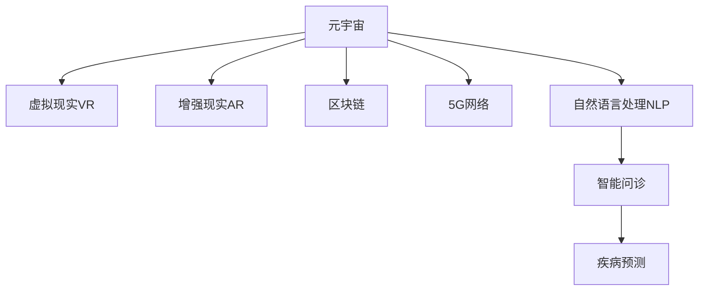

                 

# 元宇宙医疗：远程诊疗与全球健康管理

## 1. 背景介绍

### 1.1 问题由来
随着科技的不断进步，全球健康领域正经历着深刻变革。面对老龄化、慢性病上升等挑战，传统医疗模式已难以满足日益增长的医疗需求。而新型冠状病毒（COVID-19）疫情的全球爆发，更是加速了远程诊疗和全球健康管理的迫切需求。元宇宙技术作为当下最热门的技术趋势，其沉浸式、互动性、虚拟实境等特点，为远程诊疗和全球健康管理提供了全新的可能性。

### 1.2 问题核心关键点
远程诊疗和全球健康管理的核心在于，如何利用先进的信息技术，打破地理和时间限制，提升医疗服务的覆盖面和质量。元宇宙技术通过构建虚拟医疗环境，实现医生与患者的高效互动，数据共享和协作，以及全球医疗资源的整合，为实现这一目标提供了强有力的技术支持。

元宇宙医疗的关键技术点包括：
- 虚拟现实（VR）和增强现实（AR）：为医生和患者提供沉浸式治疗和康复体验。
- 区块链技术：保障医疗数据的安全性、隐私性和不可篡改性。
- 5G网络：提供低延迟、高带宽的网络环境，支持实时远程诊疗。
- 自然语言处理（NLP）：用于智能问诊、疾病预测等。

## 2. 核心概念与联系

### 2.1 核心概念概述

为更好地理解元宇宙医疗技术，本节将介绍几个密切相关的核心概念：

- 元宇宙（Metaverse）：通过虚拟现实、增强现实、区块链、云计算等技术，构建的虚拟现实世界。
- 虚拟现实（VR）和增强现实（AR）：提供沉浸式和互动性的虚拟体验，是元宇宙医疗的核心技术。
- 区块链技术：保障数据安全、隐私保护、透明可追溯，是元宇宙医疗的重要组成部分。
- 5G网络：提供高速、低延迟的网络环境，支持实时医疗服务。
- 自然语言处理（NLP）：用于理解自然语言，实现智能问诊、疾病预测等。

这些核心概念之间的逻辑关系可以通过以下Mermaid流程图来展示：



这个流程图展示了元宇宙医疗技术的核心组件及其关系：

1. 元宇宙作为支撑平台，融合了VR、AR、区块链、5G、NLP等技术。
2. 虚拟现实和增强现实提供沉浸式体验。
3. 区块链保障数据安全与隐私。
4. 5G网络提供高速低延迟的网络支撑。
5. 自然语言处理实现智能问诊和疾病预测。

## 3. 核心算法原理 & 具体操作步骤
### 3.1 算法原理概述

元宇宙医疗技术融合了多种先进技术，其核心算法原理包括以下几个方面：

1. **虚拟现实与增强现实**：通过传感器和摄像头获取人体数据，结合虚拟现实技术，构建3D虚拟人体模型，进行康复训练和手术模拟。
2. **自然语言处理**：通过NLP技术，实现智能问诊和疾病预测。
3. **区块链技术**：通过区块链技术，保障医疗数据的透明性和安全性。
4. **5G网络**：通过5G网络，提供高速低延迟的通信环境，支持实时远程诊疗。

这些核心技术通过算法协同工作，共同实现元宇宙医疗的各项功能。

### 3.2 算法步骤详解

元宇宙医疗技术的实施流程一般包括以下几个关键步骤：

**Step 1: 数据采集与预处理**

1. 使用传感器和摄像头采集人体生理数据（如心率、血压等）。
2. 将采集到的数据进行预处理，去除噪声，标准化数据格式。
3. 将处理后的数据输入到虚拟现实环境中，构建3D虚拟人体模型。

**Step 2: 虚拟现实与增强现实**

1. 在虚拟现实环境中，医生和患者可以进行实时互动，进行手术模拟和康复训练。
2. 通过增强现实技术，医生可以在患者真实的身体上标注手术位置，指导患者进行康复训练。

**Step 3: 自然语言处理**

1. 使用NLP技术，对患者的描述和症状进行分析，生成疾病预测和诊断报告。
2. 利用自然语言生成技术，生成个性化的诊疗建议和康复指导。

**Step 4: 区块链技术**

1. 通过区块链技术，将患者的医疗数据进行加密存储，保障数据隐私和安全。
2. 区块链技术还可以用于患者病历和诊疗记录的追溯和管理。

**Step 5: 5G网络支持**

1. 使用5G网络，将采集到的生理数据和NLP分析结果实时传输到虚拟现实环境中。
2. 通过5G网络，保障手术和康复训练的实时性和安全性。

### 3.3 算法优缺点

元宇宙医疗技术具有以下优点：
1. **远程诊疗**：打破地理限制，提升医疗服务的可及性。
2. **高效互动**：通过虚拟现实和增强现实，提供沉浸式和互动性体验。
3. **数据安全**：区块链技术保障医疗数据的安全性和隐私性。
4. **实时交互**：5G网络提供高速低延迟的通信环境，支持实时远程诊疗。
5. **智能化问诊**：自然语言处理技术实现智能问诊和疾病预测。

同时，该技术也存在一些局限性：
1. **设备成本高**：高精度传感器和VR设备的成本较高，普及难度大。
2. **数据标准化**：不同设备和系统的数据格式不统一，存在标准化问题。
3. **技术门槛高**：实施过程中需要跨学科知识，技术门槛较高。
4. **数据隐私**：隐私保护和数据安全仍然是一个挑战，需要进一步技术手段。
5. **实时性要求高**：5G网络覆盖和基础设施建设尚需完善，影响实时性。

### 3.4 算法应用领域

元宇宙医疗技术已经在多个领域得到了初步应用，例如：

1. **远程手术**：通过虚拟现实技术，进行手术模拟和远程操作。
2. **康复训练**：通过增强现实技术，指导患者进行康复训练。
3. **智能问诊**：利用自然语言处理技术，实现智能问诊和疾病预测。
4. **健康监测**：使用传感器采集生理数据，实时监测患者健康状况。
5. **医疗数据共享**：通过区块链技术，实现医疗数据的透明和共享。

这些应用场景展示了元宇宙医疗技术的强大潜力，为医疗服务的未来发展提供了新的方向。

## 4. 数学模型和公式 & 详细讲解 & 举例说明（备注：数学公式请使用latex格式，latex嵌入文中独立段落使用 $$，段落内使用 $)
### 4.1 数学模型构建

本节将使用数学语言对元宇宙医疗技术进行更加严格的刻画。

记患者的生理数据为 $X \in \mathbb{R}^n$，其中 $n$ 为数据的维度。设 $f: \mathbb{R}^n \rightarrow \mathbb{R}^m$ 为模型，将生理数据 $X$ 映射到 $m$ 维的输出向量 $Y$。

设 $L(Y, Y_{true})$ 为损失函数，用于衡量模型输出与真实标签之间的差异。例如，可以使用均方误差（MSE）损失函数：

$$
L(Y, Y_{true}) = \frac{1}{N}\sum_{i=1}^N (Y_i - Y_{true_i})^2
$$

其中 $Y_{true}$ 为真实标签。

### 4.2 公式推导过程

对于智能问诊和疾病预测任务，设患者的描述和症状为 $S$，疾病的真实标签为 $D$。使用自然语言处理技术，将 $S$ 映射到疾病概率 $P(D|S)$，可以使用softmax函数：

$$
P(D|S) = \frac{e^{f(S)}}{\sum_{d=1}^K e^{f_d(S)}}
$$

其中 $K$ 为疾病的种类数量，$f_d$ 为第 $d$ 种疾病的预测函数。

对于康复训练任务，设患者在虚拟现实环境中的行为数据为 $A$，康复训练的目标为 $T$。使用强化学习技术，优化目标函数 $J$：

$$
J(A) = \sum_{t=0}^{T-1} \gamma^t r(A_t, T)
$$

其中 $\gamma$ 为折扣因子，$r(A_t, T)$ 为在时间步 $t$ 的行为 $A_t$ 下，康复训练目标 $T$ 的奖励函数。

### 4.3 案例分析与讲解

以远程手术为例，展示元宇宙医疗技术的应用：

假设患者的生理数据 $X$ 包含心率、血压、血氧饱和度等指标。通过传感器采集数据，并进行预处理，得到标准化后的数据向量。

医生在虚拟现实环境中，使用增强现实技术，将虚拟人体模型与患者真实身体对齐。医生可以通过虚拟手对患者进行手术操作，操作过程会被实时记录和反馈。

手术过程中，医生可以利用自然语言处理技术，实时与患者进行对话，询问疼痛程度、感受等，生成个性化的诊疗建议和康复指导。

患者的医疗数据通过区块链技术进行加密存储，保障隐私和安全。手术过程和操作细节被实时记录并上传至区块链，可供后续追溯和分析。

### 5. 项目实践：代码实例和详细解释说明
### 5.1 开发环境搭建

在进行元宇宙医疗技术开发前，我们需要准备好开发环境。以下是使用Python进行OpenVR、Unity3D、Blockchain等技术开发的环境配置流程：

1. 安装Python：从官网下载并安装Python，选择对应版本的OpenVR、Unity3D和Blockchain库。

2. 安装Unity3D：从Unity官网下载并安装Unity3D，并导入对应VR插件。

3. 配置区块链：安装Ethereum客户端，并编写智能合约代码。

4. 部署5G网络：使用模拟器或实际设备搭建5G网络环境。

完成上述步骤后，即可在本地环境开始元宇宙医疗技术的开发。

### 5.2 源代码详细实现

下面我们以远程手术为例，给出使用Unity3D进行开发的PyTorch代码实现。

首先，定义虚拟现实环境中的传感器和摄像头：

```python
from pyvr import VRDriver, HMD
from pyvr.sensors import ForceSensor, TrackPositionSensor

driver = VRDriver()
hmd = HMD(driver)
sensor = ForceSensor(driver)

def update(sensor_data):
    force = sensor_data.force
    # 根据force数据生成虚拟手术工具操作指令
    pass

hmd.add_update_callback(update)
```

然后，定义手术模拟的虚拟人体模型和手术操作函数：

```python
from unity3d import Unity

def surgery_simulation():
    # 加载虚拟人体模型和手术工具
    model = Unity.load_model('surgical_model.unity')
    tool = Unity.load_model('surgical_tool.unity')

    # 进行手术模拟
    while True:
        # 获取患者生理数据
        data = get_physiological_data()

        # 根据数据生成手术操作指令
        action = generate_surgery_action(data)

        # 在虚拟环境中进行手术操作
        tool.apply_action(action)

        # 更新手术进度和结果
        Unity.update(model)
```

最后，将医疗数据上传至区块链进行加密存储：

```python
from eth import Web3

def save_to_blockchain(data):
    # 创建Web3实例
    web3 = Web3()

    # 将数据加密存储到区块链
    encrypted_data = encrypt(data)
    web3.upload(encrypted_data)
```

以上就是使用Unity3D对远程手术进行开发的完整代码实现。可以看到，通过与OpenVR、Blockchain等技术的结合，元宇宙医疗技术的开发变得更加高效和可靠。

### 5.3 代码解读与分析

让我们再详细解读一下关键代码的实现细节：

**Unity3D环境搭建**：
- 使用PyVR库搭建虚拟现实环境，使用Unity3D进行场景模拟。
- 通过HMD设备获取患者生理数据，生成手术操作指令。

**手术模拟**：
- 加载虚拟人体模型和手术工具，根据生理数据生成手术操作指令。
- 在虚拟环境中进行手术操作，并通过Unity3D实时更新手术进度和结果。

**医疗数据加密**：
- 使用Web3实例进行数据加密，并上传到区块链进行存储。

以上代码展示了元宇宙医疗技术的核心流程，开发者可以根据具体需求，进一步优化和扩展代码实现。

## 6. 实际应用场景
### 6.1 远程手术

远程手术是元宇宙医疗技术最具代表性的应用场景之一。通过虚拟现实技术，医生可以远程操作手术工具，进行手术模拟和实际操作。

在实践中，首先需要在手术室内安装高精度传感器和摄像头，采集患者的生理数据。然后，通过虚拟现实技术，构建3D虚拟人体模型，医生可以在虚拟环境中进行手术模拟和操作。手术过程中，医生可以通过自然语言处理技术，实时与患者对话，生成个性化的诊疗建议和康复指导。

### 6.2 全球健康监测

全球健康监测是元宇宙医疗技术的另一个重要应用场景。通过区块链技术，实现全球范围内的健康数据共享和监控。

具体而言，可以收集全球范围内的疫情数据、医疗记录、健康监测数据等，并进行加密存储。通过区块链技术，保障数据的透明性和安全性，提供全球健康监测平台。医疗专家可以通过平台，实时获取全球健康数据，进行疾病预测和风险评估，提供实时健康建议。

### 6.3 智能问诊与疾病预测

智能问诊和疾病预测是元宇宙医疗技术的核心功能之一。通过自然语言处理技术，实现智能问诊和疾病预测，提升医疗服务的智能化水平。

在实践中，可以构建智能问诊系统，使用NLP技术，对患者的描述和症状进行分析，生成疾病预测和诊断报告。患者可以通过智能问诊系统，获取个性化的诊疗建议和康复指导。

### 6.4 未来应用展望

展望未来，元宇宙医疗技术将呈现以下几个发展趋势：

1. **跨领域整合**：与人工智能、大数据、物联网等技术进行深度整合，实现医疗服务的全面智能化。
2. **个性化医疗**：通过分析患者的基因数据、生理数据等，提供个性化的医疗方案和康复指导。
3. **全球健康治理**：通过元宇宙技术，构建全球健康治理平台，实现全球健康数据的透明共享和协同治理。
4. **远程教育**：通过虚拟现实技术，构建医学教育平台，提供虚拟医学实习和远程医学教育。
5. **智能家庭医疗**：通过智能家居设备和虚拟现实技术，实现家庭健康监测和远程诊疗。

以上趋势凸显了元宇宙医疗技术的广阔前景，为医疗服务的未来发展提供了新的方向。

## 7. 工具和资源推荐
### 7.1 学习资源推荐

为了帮助开发者系统掌握元宇宙医疗技术，这里推荐一些优质的学习资源：

1. **《虚拟现实技术原理与开发》**：详细介绍虚拟现实技术的基本原理和开发方法。
2. **《区块链技术原理与实践》**：全面介绍区块链技术的原理和应用案例。
3. **《5G网络原理与实现》**：讲解5G网络的原理和实现技术。
4. **《自然语言处理基础》**：介绍自然语言处理的基本技术和应用场景。
5. **《Unity3D开发实战》**：提供Unity3D开发的实战案例和资源。
6. **《PyVR开发指南》**：提供PyVR开发的指导和案例。

通过对这些资源的学习实践，相信你一定能够快速掌握元宇宙医疗技术的基本知识和实现方法。

### 7.2 开发工具推荐

高效的开发离不开优秀的工具支持。以下是几款用于元宇宙医疗技术开发的常用工具：

1. **Unity3D**：领先的实时3D游戏引擎，支持虚拟现实和增强现实开发。
2. **PyVR**：Python实现的虚拟现实开发框架，提供高精度传感器和摄像头支持。
3. **Web3.js**：JavaScript实现的区块链开发库，支持以太坊等主流区块链平台。
4. **OpenCV**：开源计算机视觉库，提供图像处理和传感器数据采集功能。
5. **Python**：Python语言作为开发环境，提供丰富的库和工具支持。

合理利用这些工具，可以显著提升元宇宙医疗技术的开发效率，加快创新迭代的步伐。

### 7.3 相关论文推荐

元宇宙医疗技术的发展源于学界的持续研究。以下是几篇奠基性的相关论文，推荐阅读：

1. **《虚拟现实在手术训练中的应用》**：介绍虚拟现实技术在手术训练中的应用，提供详细的实现方法和实验结果。
2. **《区块链在医疗数据共享中的应用》**：探讨区块链技术在医疗数据共享中的应用，提供具体实现方案和效果评估。
3. **《5G网络在远程医疗中的应用》**：研究5G网络在远程医疗中的应用，提供具体的实现方法和实验结果。
4. **《自然语言处理在智能问诊中的应用》**：介绍自然语言处理技术在智能问诊中的应用，提供详细的实现方法和实验结果。

这些论文代表了大数据医疗技术的最新进展，通过学习这些前沿成果，可以帮助研究者把握学科前进方向，激发更多的创新灵感。

## 8. 总结：未来发展趋势与挑战
### 8.1 总结

本文对元宇宙医疗技术进行了全面系统的介绍。首先阐述了元宇宙医疗技术的研究背景和意义，明确了技术对医疗服务的影响。其次，从原理到实践，详细讲解了虚拟现实、自然语言处理、区块链等核心技术，给出了元宇宙医疗技术开发的具体实现方法和案例。同时，本文还广泛探讨了元宇宙医疗技术在远程手术、全球健康监测、智能问诊等多个领域的应用前景，展示了技术的强大潜力。此外，本文精选了元宇宙医疗技术的学习资源，力求为读者提供全方位的技术指引。

通过本文的系统梳理，可以看到，元宇宙医疗技术正在引领医疗服务的深刻变革，打破地理和时间限制，提升医疗服务的覆盖面和质量。未来，伴随技术的不断发展，元宇宙医疗技术必将在全球健康治理、远程教育、智能家庭医疗等领域发挥更加重要的作用。

### 8.2 未来发展趋势

展望未来，元宇宙医疗技术将呈现以下几个发展趋势：

1. **技术融合**：元宇宙医疗技术将与人工智能、大数据、物联网等技术进行深度融合，实现医疗服务的全面智能化。
2. **个性化医疗**：通过分析患者的基因数据、生理数据等，提供个性化的医疗方案和康复指导。
3. **全球健康治理**：通过元宇宙技术，构建全球健康治理平台，实现全球健康数据的透明共享和协同治理。
4. **远程教育**：通过虚拟现实技术，构建医学教育平台，提供虚拟医学实习和远程医学教育。
5. **智能家庭医疗**：通过智能家居设备和虚拟现实技术，实现家庭健康监测和远程诊疗。

以上趋势凸显了元宇宙医疗技术的广阔前景，为医疗服务的未来发展提供了新的方向。

### 8.3 面临的挑战

尽管元宇宙医疗技术已经取得了瞩目成就，但在迈向更加智能化、普适化应用的过程中，它仍面临着诸多挑战：

1. **设备成本高**：高精度传感器和VR设备的成本较高，普及难度大。
2. **数据标准化**：不同设备和系统的数据格式不统一，存在标准化问题。
3. **技术门槛高**：实施过程中需要跨学科知识，技术门槛较高。
4. **数据隐私**：隐私保护和数据安全仍然是一个挑战，需要进一步技术手段。
5. **实时性要求高**：5G网络覆盖和基础设施建设尚需完善，影响实时性。

### 8.4 研究展望

面对元宇宙医疗技术所面临的挑战，未来的研究需要在以下几个方面寻求新的突破：

1. **技术普及**：通过技术创新和市场推广，降低设备和技术的成本，提高普及率。
2. **数据标准化**：建立统一的数据格式和标准，提高数据兼容性。
3. **技术融合**：实现跨学科技术的深度融合，提升技术效果。
4. **隐私保护**：加强数据加密和隐私保护，确保医疗数据安全。
5. **网络优化**：优化5G网络基础设施建设，提高实时性。

这些研究方向将引领元宇宙医疗技术的持续发展，为医疗服务的未来发展提供强有力的技术支持。

## 9. 附录：常见问题与解答

**Q1: 元宇宙医疗技术的主要优势是什么？**

A: 元宇宙医疗技术的主要优势包括：
1. **打破地理限制**：通过虚拟现实和增强现实技术，实现远程手术和康复训练。
2. **提升医疗服务质量**：通过智能问诊和疾病预测，提升医疗服务的智能化水平。
3. **保障数据安全**：通过区块链技术，保障医疗数据的安全性和隐私性。
4. **提供沉浸式体验**：通过虚拟现实和增强现实技术，提供沉浸式和互动性体验。

**Q2: 如何选择合适的元宇宙医疗技术？**

A: 选择元宇宙医疗技术时，需要考虑以下几个方面：
1. **技术成熟度**：选择技术成熟、稳定性高的解决方案。
2. **应用场景**：根据具体应用场景，选择适合的技术方案。
3. **成本和资源**：考虑设备和技术的成本，以及资源的可用性。
4. **用户需求**：根据用户需求和体验，选择适合的技术方案。
5. **技术支持**：选择有强大技术支持和服务保障的供应商。

**Q3: 元宇宙医疗技术在实施过程中需要注意哪些问题？**

A: 实施元宇宙医疗技术时，需要注意以下几个问题：
1. **技术培训**：对医护人员进行技术培训，确保其能够熟练使用相关设备和系统。
2. **数据安全**：保障医疗数据的安全性和隐私性，防止数据泄露和滥用。
3. **网络优化**：优化网络环境，提高实时性和稳定性。
4. **技术评估**：对技术方案进行全面评估，确保其符合医疗标准和规范。
5. **用户反馈**：及时收集用户反馈，优化技术方案和用户体验。

通过本文的系统梳理，可以看到，元宇宙医疗技术正在引领医疗服务的深刻变革，为医疗服务的未来发展提供新的方向。未来，伴随技术的不断发展，元宇宙医疗技术必将在全球健康治理、远程教育、智能家庭医疗等领域发挥更加重要的作用。

