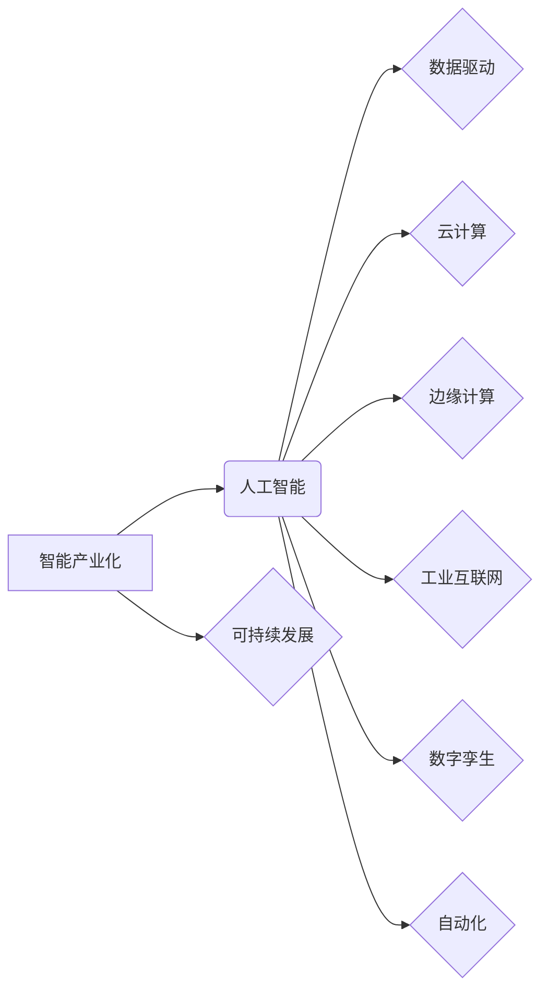

> 智能产业化、人工智能、机器学习、深度学习、数据驱动、云计算、边缘计算、工业互联网、数字孪生、自动化、可持续发展

## 1. 背景介绍

智能产业化正处于蓬勃发展的阶段，人工智能（AI）技术作为其核心驱动力，正在深刻地改变着各行各业的生产方式和商业模式。从制造业的智能化转型到金融行业的精准服务，从医疗保健的智能诊断到交通运输的智能化管理，AI技术的应用场景日益广泛，其带来的经济效益和社会效益也越来越显著。

然而，智能产业化的发展也面临着诸多挑战。例如，数据孤岛、算法可解释性、人才短缺、伦理道德等问题都需要得到有效解决。只有克服这些挑战，才能真正实现智能产业化的可持续发展。

## 2. 核心概念与联系

**2.1 智能产业化**

智能产业化是指将人工智能技术应用于产业生产和经营管理的全过程，以实现生产效率提升、成本降低、产品质量提升、服务体验优化等目标。

**2.2 人工智能（AI）**

人工智能是指模拟人类智能行为的计算机系统。其核心技术包括机器学习、深度学习、自然语言处理、计算机视觉等。

**2.3 数据驱动**

数据驱动是指以数据为基础，通过数据分析和挖掘，为决策提供依据。在智能产业化中，数据是人工智能算法训练和运行的基础，也是实现智能化转型的关键要素。

**2.4 云计算和边缘计算**

云计算提供强大的计算资源和存储能力，支持大规模数据处理和人工智能模型训练。边缘计算则将计算能力部署到靠近数据源的边缘节点，降低数据传输延迟，提高实时性。

**2.5 工业互联网**

工业互联网是指将互联网技术与工业生产相结合，实现设备互联、数据共享、智能协同的工业生产模式。

**2.6 数字孪生**

数字孪生是指基于物理实体构建的虚拟模型，能够实时反映物理实体的状态和运行情况。

**2.7 自动化**

自动化是指利用技术手段代替人工完成重复性、高风险或效率低下的工作。

**2.8 可持续发展**

可持续发展是指在满足当前需求的同时，不损害后代满足其自身需求的能力。

**2.9 核心概念关系图**



## 3. 核心算法原理 & 具体操作步骤

**3.1 算法原理概述**

机器学习算法是智能产业化中不可或缺的核心技术之一。其核心思想是通过学习数据中的模式和规律，自动构建模型，并根据模型预测或分类新的数据。常见的机器学习算法包括监督学习、无监督学习和强化学习。

**3.2 算法步骤详解**

1. **数据收集和预处理:** 收集相关数据，并进行清洗、转换、特征工程等预处理操作，以确保数据质量和算法训练效果。
2. **模型选择:** 根据具体任务需求选择合适的机器学习算法模型。
3. **模型训练:** 使用训练数据训练模型，调整模型参数，使其能够准确地预测或分类数据。
4. **模型评估:** 使用测试数据评估模型的性能，并根据评估结果进行模型调优。
5. **模型部署:** 将训练好的模型部署到实际应用场景中，用于预测或分类新的数据。

**3.3 算法优缺点**

**优点:**

* 自动学习能力强，能够从海量数据中发现隐藏的模式和规律。
* 适应性强，能够处理复杂、非线性问题。
* 可持续改进，随着数据量的增加，模型性能会不断提升。

**缺点:**

* 数据依赖性强，模型性能受数据质量和数量影响较大。
* 可解释性差，难以理解模型的决策过程。
* 训练成本高，需要大量的计算资源和时间。

**3.4 算法应用领域**

机器学习算法广泛应用于各个领域，例如：

* **图像识别:** 人脸识别、物体检测、图像分类等。
* **自然语言处理:** 文本分类、情感分析、机器翻译等。
* **预测分析:** 销售预测、风险评估、故障预测等。
* **推荐系统:** 商品推荐、内容推荐、用户匹配等。

## 4. 数学模型和公式 & 详细讲解 & 举例说明

**4.1 数学模型构建**

机器学习算法通常基于数学模型进行构建。例如，线性回归模型可以表示为：

$$y = w_0 + w_1x_1 + w_2x_2 + ... + w_nx_n + \epsilon$$

其中：

* $y$ 是预测值
* $w_0, w_1, w_2, ..., w_n$ 是模型参数
* $x_1, x_2, ..., x_n$ 是输入特征
* $\epsilon$ 是误差项

**4.2 公式推导过程**

机器学习算法的模型参数通常通过优化算法进行求解。例如，梯度下降算法通过迭代更新模型参数，使得模型预测值与真实值之间的误差最小化。

**4.3 案例分析与讲解**

假设我们想要构建一个预测房价的机器学习模型。我们可以使用线性回归模型，并将房屋面积、房间数量、地理位置等特征作为输入，预测房价。通过训练模型，我们可以得到模型参数，并使用这些参数预测新房子的价格。

## 5. 项目实践：代码实例和详细解释说明

**5.1 开发环境搭建**

* Python 3.x
* TensorFlow 或 PyTorch 等深度学习框架
* Jupyter Notebook 或 VS Code 等开发工具

**5.2 源代码详细实现**

```python
import tensorflow as tf

# 定义模型结构
model = tf.keras.models.Sequential([
    tf.keras.layers.Dense(64, activation='relu', input_shape=(4,)),
    tf.keras.layers.Dense(32, activation='relu'),
    tf.keras.layers.Dense(1)
])

# 编译模型
model.compile(optimizer='adam', loss='mse')

# 训练模型
model.fit(X_train, y_train, epochs=10)

# 评估模型
loss = model.evaluate(X_test, y_test)

# 预测新数据
predictions = model.predict(new_data)
```

**5.3 代码解读与分析**

* 代码首先定义了一个简单的深度学习模型，包含三个全连接层。
* 然后，模型被编译，指定了优化器、损失函数等参数。
* 接着，模型使用训练数据进行训练，训练过程会迭代更新模型参数，使得模型预测值与真实值之间的误差最小化。
* 最后，模型的性能被评估，并使用训练好的模型预测新数据。

**5.4 运行结果展示**

运行结果展示了模型的训练过程、评估结果以及预测结果。

## 6. 实际应用场景

**6.1 制造业**

* **智能制造:** 利用机器学习算法实现设备预测维护、生产过程优化、质量控制等。
* **柔性制造:** 通过人工智能技术实现生产线灵活配置、快速响应市场需求。

**6.2 金融业**

* **风险管理:** 利用机器学习算法识别欺诈行为、评估信用风险、预测市场波动。
* **个性化服务:** 通过人工智能技术提供个性化的金融产品和服务。

**6.3 医疗保健**

* **智能诊断:** 利用机器学习算法辅助医生进行疾病诊断，提高诊断准确率。
* **精准治疗:** 通过人工智能技术个性化制定治疗方案，提高治疗效果。

**6.4 交通运输**

* **智能驾驶:** 利用机器学习算法实现自动驾驶功能，提高交通安全和效率。
* **交通管理:** 通过人工智能技术优化交通流量，缓解交通拥堵。

**6.5 未来应用展望**

随着人工智能技术的不断发展，其应用场景将更加广泛，例如：

* **教育:** 个性化学习、智能辅导
* **零售:** 智能推荐、个性化营销
* **农业:** 智能种植、精准施肥
* **能源:** 智能能源管理、可再生能源预测

## 7. 工具和资源推荐

**7.1 学习资源推荐**

* **在线课程:** Coursera、edX、Udacity 等平台提供丰富的机器学习和人工智能课程。
* **书籍:** 《深度学习》、《机器学习实战》等书籍是学习人工智能的经典教材。
* **开源项目:** TensorFlow、PyTorch 等开源深度学习框架提供了丰富的学习资源和实践案例。

**7.2 开发工具推荐**

* **Jupyter Notebook:** 用于编写和执行Python代码，并可视化数据和模型结果。
* **VS Code:** 功能强大的代码编辑器，支持多种编程语言和深度学习框架。
* **Google Colab:** 基于云计算的 Jupyter Notebook 环境，提供免费的 GPU 资源。

**7.3 相关论文推荐**

* **《ImageNet Classification with Deep Convolutional Neural Networks》**
* **《Attention Is All You Need》**
* **《BERT: Pre-training of Deep Bidirectional Transformers for Language Understanding》**

## 8. 总结：未来发展趋势与挑战

**8.1 研究成果总结**

近年来，人工智能技术取得了长足的进步，在各个领域都取得了显著的应用成果。例如，图像识别、自然语言处理、语音识别等领域都取得了突破性的进展。

**8.2 未来发展趋势**

* **模型规模和能力的提升:** 未来人工智能模型将更加强大，能够处理更加复杂的任务。
* **算法的泛化能力增强:** 未来人工智能算法将更加通用，能够应用于更多不同的领域。
* **边缘计算和联邦学习的兴起:** 未来人工智能将更加注重数据隐私和安全，边缘计算和联邦学习将成为重要的发展趋势。
* **人工智能与其他技术的融合:** 未来人工智能将与其他技术，例如物联网、区块链等融合，形成更加强大的协同效应。

**8.3 面临的挑战**

* **数据安全和隐私保护:** 人工智能算法依赖于大量数据，如何保障数据安全和隐私保护是一个重要的挑战。
* **算法可解释性和信任问题:** 许多人工智能算法是黑箱模型，难以理解其决策过程，这导致了算法的可解释性和信任问题。
* **人才短缺:** 人工智能领域人才需求量大，但人才供给不足，人才短缺是一个制约人工智能发展的重要因素。
* **伦理道德问题:** 人工智能技术的应用可能会带来一些伦理道德问题，例如算法偏见、工作岗位替代等，需要得到有效解决。

**8.4 研究展望**

未来，人工智能研究将继续朝着更加安全、可靠、可解释的方向发展。同时，人工智能技术也将与其他技术融合，为人类社会带来更加美好的未来。

## 9. 附录：常见问题与解答

**9.1 如何选择合适的机器学习算法？**

选择合适的机器学习算法需要根据具体任务需求和数据特点进行选择。例如，对于分类任务，可以考虑使用逻辑回归、支持向量机、决策树等算法；对于回归任务，可以考虑使用线性回归、支持向量回归、神经网络等算法。

**9.2 如何评估机器学习模型的性能？**

机器学习模型的性能可以通过多种指标进行评估，例如准确率、召回率、F1-score、AUC等。

**9.3 如何解决机器学习模型的过拟合问题？**

过拟合是指机器学习模型在训练数据上表现良好，但在测试数据上表现较差。解决过拟合问题的方法包括：

* 减少模型复杂度
* 增加训练数据量
* 使用正则化技术
* 使用交叉验证技术

**9.4 如何部署机器学习模型？**

机器学习模型的部署方式多种多样，例如：

* 将模型部署到云服务器上
* 将模型部署到边缘设备上
* 将模型集成到应用程序中


作者：禅与计算机程序设计艺术 / Zen and the Art of Computer Programming 
<end_of_turn>