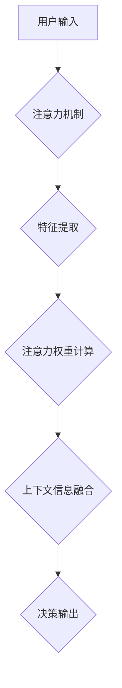

> 智能家电, 注意力机制, 用户体验, 人机交互, 算法设计, 数据分析, 个性化定制

## 1. 背景介绍

智能家电的普及正在深刻地改变着人们的生活方式。从冰箱到洗衣机，从空调到扫地机器人，越来越多的家电设备都具备了联网、感知、学习和决策的能力。然而，随着智能家电功能的不断增强，用户面临着新的挑战：如何有效地与众多智能设备进行交互，并获得最佳的用户体验？

注意力机制在人工智能领域取得了显著的进展，它能够帮助模型聚焦于输入数据中最重要的部分，从而提高效率和准确性。将注意力机制应用于智能家电，可以帮助设备更好地理解用户的需求，并提供更个性化、更便捷的服务。

## 2. 核心概念与联系

### 2.1 智能家电与注意力机制

智能家电通常通过传感器收集环境信息，并利用算法进行数据分析和决策。注意力机制可以帮助智能家电在处理大量数据时，聚焦于与用户需求最相关的部分，从而提高决策效率和准确性。

### 2.2 用户体验与注意力机制

用户体验是指用户使用产品或服务时所感受到的整体感受。注意力机制可以帮助智能家电提供更个性化、更便捷的用户体验，例如：

* **主动预判用户需求:** 通过分析用户的行为模式和环境信息，智能家电可以主动预判用户的需求，并提前提供相应的服务。
* **个性化内容推荐:** 智能家电可以根据用户的喜好和使用习惯，推荐个性化的内容和服务。
* **简化交互流程:** 通过注意力机制，智能家电可以识别用户的意图，并提供更简洁、更直观的交互方式。

### 2.3 注意力机制架构



## 3. 核心算法原理 & 具体操作步骤

### 3.1 算法原理概述

注意力机制的核心思想是学习一个权重向量，用于对输入数据进行加权求和。权重向量反映了模型对不同输入元素的关注程度。通过学习注意力权重，模型可以聚焦于与任务相关的关键信息，从而提高性能。

### 3.2 算法步骤详解

1. **输入数据处理:** 将输入数据转换为模型可处理的格式。
2. **特征提取:** 使用神经网络或其他方法提取输入数据的特征。
3. **注意力权重计算:** 计算每个输入元素的注意力权重。常用的注意力机制包括自注意力机制、异注意力机制等。
4. **上下文信息融合:** 将注意力权重与特征向量相乘，得到加权后的特征向量，即上下文信息。
5. **决策输出:** 使用上下文信息进行决策或预测。

### 3.3 算法优缺点

**优点:**

* 可以有效地聚焦于输入数据中最重要的部分，提高模型的效率和准确性。
* 可以学习到用户需求和偏好的表示，提供更个性化的服务。

**缺点:**

* 计算复杂度较高，训练时间较长。
* 需要大量的训练数据才能达到最佳效果。

### 3.4 算法应用领域

注意力机制在人工智能领域广泛应用，例如：

* **自然语言处理:** 机器翻译、文本摘要、问答系统等。
* **计算机视觉:** 图像识别、目标检测、图像 Captioning 等。
* **语音识别:** 语音转文本、语音合成等。

## 4. 数学模型和公式 & 详细讲解 & 举例说明

### 4.1 数学模型构建

注意力机制的数学模型可以表示为：

$$
\text{Attention}(Q, K, V) = \text{softmax}\left(\frac{Q K^T}{\sqrt{d_k}}\right) V
$$

其中：

* $Q$：查询矩阵
* $K$：键矩阵
* $V$：值矩阵
* $d_k$：键向量的维度
* $\text{softmax}$：softmax 函数

### 4.2 公式推导过程

注意力机制的核心是计算查询向量 $Q$ 与键向量 $K$ 之间的相似度，并将其作为注意力权重。

* **相似度计算:** 使用点积或其他相似度度量方法计算 $Q$ 和 $K$ 之间的相似度。
* **归一化:** 使用 softmax 函数对相似度进行归一化，得到注意力权重。
* **加权求和:** 将注意力权重与值向量 $V$ 相乘，得到加权后的特征向量。

### 4.3 案例分析与讲解

假设我们有一个句子 "我爱吃苹果"，想要计算每个单词的注意力权重。

* $Q$：查询向量
* $K$：键向量，每个单词的词嵌入向量
* $V$：值向量，每个单词的词嵌入向量

通过计算 $Q$ 和 $K$ 之间的相似度，我们可以得到每个单词的注意力权重。例如，如果 "苹果" 的注意力权重最高，则表示模型对 "苹果" 的关注程度最高。

## 5. 项目实践：代码实例和详细解释说明

### 5.1 开发环境搭建

* Python 3.x
* TensorFlow 或 PyTorch
* 其他必要的库，例如 NumPy、pandas 等

### 5.2 源代码详细实现

```python
import tensorflow as tf

# 定义注意力机制层
class AttentionLayer(tf.keras.layers.Layer):
    def __init__(self, units):
        super(AttentionLayer, self).__init__()
        self.Wq = tf.keras.layers.Dense(units)
        self.Wk = tf.keras.layers.Dense(units)
        self.Wv = tf.keras.layers.Dense(units)
        self.fc = tf.keras.layers.Dense(units)

    def call(self, inputs):
        Q = self.Wq(inputs)
        K = self.Wk(inputs)
        V = self.Wv(inputs)
        attention_scores = tf.matmul(Q, K, transpose_b=True) / tf.math.sqrt(tf.cast(tf.shape(Q)[-1], tf.float32))
        attention_weights = tf.nn.softmax(attention_scores, axis=-1)
        context_vector = tf.matmul(attention_weights, V)
        output = self.fc(context_vector)
        return output

# 示例用法
inputs = tf.random.normal(shape=(1, 10, 512))
attention_layer = AttentionLayer(units=128)
output = attention_layer(inputs)
print(output.shape)
```

### 5.3 代码解读与分析

* `AttentionLayer` 类定义了一个注意力机制层。
* `__init__` 方法初始化权重矩阵。
* `call` 方法实现注意力机制的计算过程。
* `tf.matmul` 函数计算矩阵乘积。
* `tf.math.sqrt` 函数计算平方根。
* `tf.nn.softmax` 函数计算 softmax 函数。
* `tf.cast` 函数将数据类型转换为 float32。

### 5.4 运行结果展示

运行代码后，输出的 `output` 形状为 `(1, 10, 128)`，表示注意力机制层将输入数据压缩到 128 维。

## 6. 实际应用场景

### 6.1 智能家居场景

* **个性化场景控制:** 智能家电可以根据用户的习惯和偏好，自动调节温度、灯光、音乐等环境参数。
* **主动服务提醒:** 智能家电可以根据用户的日程安排和生活习惯，主动提醒用户进行相关操作，例如提醒用户出门前关闭电器。
* **语音交互优化:** 智能家电可以利用注意力机制，识别用户的语音指令，并提供更准确、更便捷的响应。

### 6.2 智能医疗场景

* **病症诊断辅助:** 智能医疗设备可以利用注意力机制，分析患者的症状和病史，辅助医生进行诊断。
* **个性化治疗方案:** 智能医疗设备可以根据患者的体质和病情，制定个性化的治疗方案。
* **远程医疗服务:** 智能医疗设备可以利用注意力机制，识别患者的生理信号，并提供远程医疗服务。

### 6.3 其他应用场景

* **智能教育:** 个性化学习推荐、智能答疑系统等。
* **智能交通:** 智能驾驶辅助、交通流量预测等。
* **智能金融:** 风险评估、欺诈检测等。

### 6.4 未来应用展望

随着人工智能技术的不断发展，注意力机制将在更多领域得到应用，例如：

* **更精准的个性化服务:** 智能家电可以更加精准地理解用户的需求，并提供更个性化的服务。
* **更自然的交互方式:** 智能家电可以与用户进行更自然的交互，例如通过眼神交流、肢体语言等。
* **更智能的决策能力:** 智能家电可以拥有更智能的决策能力，能够自主学习和适应用户的需求。

## 7. 工具和资源推荐

### 7.1 学习资源推荐

* **书籍:**
    * "Attention Is All You Need"
    * "Deep Learning"
* **在线课程:**
    * Coursera: "Deep Learning Specialization"
    * Udacity: "Deep Learning Nanodegree"

### 7.2 开发工具推荐

* **TensorFlow:** 开源深度学习框架
* **PyTorch:** 开源深度学习框架
* **Keras:** 高级深度学习API

### 7.3 相关论文推荐

* "Attention Is All You Need"
* "BERT: Pre-training of Deep Bidirectional Transformers for Language Understanding"
* "Transformer-XL: Attentive Language Models Beyond a Fixed-Length Context"

## 8. 总结：未来发展趋势与挑战

### 8.1 研究成果总结

注意力机制在人工智能领域取得了显著的进展，为智能家电的开发提供了新的思路和方法。通过将注意力机制应用于智能家电，可以提高用户体验、增强智能化程度、拓展应用场景。

### 8.2 未来发展趋势

* **更强大的注意力机制:** 研究更强大的注意力机制，例如跨模态注意力机制、动态注意力机制等。
* **更个性化的服务:** 利用注意力机制，提供更个性化的智能家电服务，例如根据用户的行为模式和喜好，自动调节家电参数。
* **更自然的交互方式:** 研究更自然的智能家电交互方式，例如通过眼神交流、肢体语言等。

### 8.3 面临的挑战

* **计算复杂度:** 某些注意力机制的计算复杂度较高，需要更高效的算法和硬件支持。
* **数据需求:** 训练强大的注意力机制模型需要大量的训练数据。
* **伦理问题:** 智能家电的注意力机制可能会收集用户的隐私信息，需要考虑伦理问题和数据安全问题。

### 8.4 研究展望

未来，注意力机制将在智能家电领域得到更广泛的应用，并推动智能家电的智能化程度不断提升。


## 9. 附录：常见问题与解答

### 9.1 什么是注意力机制？

注意力机制是一种模仿人类注意力机制的算法，它能够帮助模型聚焦于输入数据中最重要的部分，从而提高效率和准确性。

### 9.2 注意力机制有哪些类型？

常见的注意力机制类型包括自注意力机制、异注意力机制、软注意力机制、硬注意力机制等。

### 9.3 注意力机制的应用场景有哪些？

注意力机制在人工智能领域广泛应用，例如：自然语言处理、计算机视觉、语音识别等。

### 9.4 如何选择合适的注意力机制？

选择合适的注意力机制需要根据具体任务和数据特点进行选择。

### 9.5 注意力机制的未来发展趋势是什么？

未来，注意力机制将更加强大、更加个性化、更加自然。


作者：禅与计算机程序设计艺术 / Zen and the Art of Computer Programming 
<end_of_turn>