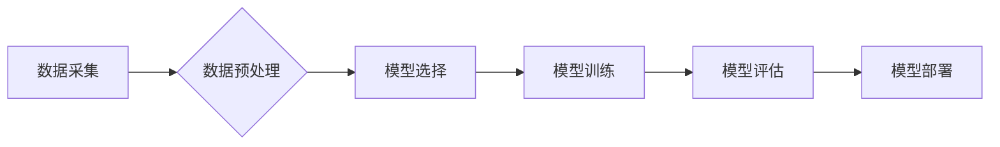

> 机器学习、算法原理、代码实现、深度学习、数据分析、Python、TensorFlow

## 1. 背景介绍

机器学习作为人工智能领域的核心技术之一，近年来发展迅速，并在各个领域取得了令人瞩目的成就。从语音识别、图像识别到自然语言处理，机器学习算法正在改变着我们的生活方式。

随着数据量的爆炸式增长，机器学习的应用场景也越来越广泛。然而，对于许多人来说，机器学习仍然是一个比较抽象的概念，难以理解其原理和应用。

本文旨在通过对机器学习核心算法原理的讲解，以及代码实例的演示，帮助读者深入理解机器学习的本质，并掌握其应用技能。

## 2. 核心概念与联系

机器学习的核心思想是通过算法学习数据中的模式，从而能够对新的数据进行预测或分类。

**机器学习流程:**



**核心概念:**

* **数据:** 机器学习算法的燃料，需要大量的数据来训练和评估模型。
* **特征:** 数据中的可供算法学习的属性或变量。
* **模型:**  用于学习数据模式的数学模型，例如线性回归、决策树、支持向量机等。
* **训练:** 使用训练数据来调整模型参数，使其能够更好地预测或分类数据。
* **评估:** 使用测试数据来评估模型的性能，例如准确率、召回率、F1-score等。
* **部署:** 将训练好的模型应用于实际场景，例如预测客户行为、识别图像内容等。

## 3. 核心算法原理 & 具体操作步骤

### 3.1  算法原理概述

**线性回归**是一种监督学习算法，用于预测连续值。其核心思想是找到一条直线或超平面，能够最佳地拟合训练数据。

### 3.2  算法步骤详解

1. **数据预处理:** 将数据清洗、标准化，例如处理缺失值、归一化特征值等。
2. **特征选择:** 选择与目标变量相关的特征，减少模型复杂度。
3. **模型训练:** 使用训练数据，通过最小化损失函数，调整模型参数，找到最佳的直线或超平面。
4. **模型评估:** 使用测试数据，评估模型的预测精度。
5. **模型部署:** 将训练好的模型应用于实际场景，例如预测房价、股票价格等。

### 3.3  算法优缺点

**优点:**

* 算法简单易懂，易于实现。
* 计算效率高，适合处理大规模数据。

**缺点:**

* 只能预测连续值，无法处理分类问题。
* 对非线性关系的拟合能力较差。

### 3.4  算法应用领域

* 房价预测
* 股票价格预测
* 销售额预测
* 医疗诊断

## 4. 数学模型和公式 & 详细讲解 & 举例说明

### 4.1  数学模型构建

线性回归模型的数学表达式为：

$$y = w_0 + w_1x_1 + w_2x_2 + ... + w_nx_n + \epsilon$$

其中：

* $y$ 是目标变量
* $x_1, x_2, ..., x_n$ 是特征变量
* $w_0, w_1, w_2, ..., w_n$ 是模型参数
* $\epsilon$ 是误差项

### 4.2  公式推导过程

模型参数的求解可以通过最小化损失函数来实现。常用的损失函数是均方误差（MSE）：

$$MSE = \frac{1}{n}\sum_{i=1}^{n}(y_i - \hat{y}_i)^2$$

其中：

* $n$ 是样本数量
* $y_i$ 是第 $i$ 个样本的目标变量
* $\hat{y}_i$ 是模型预测的第 $i$ 个样本的目标变量

通过求解MSE的最小值，可以得到最佳的模型参数。

### 4.3  案例分析与讲解

假设我们想要预测房屋价格，特征变量包括房屋面积、房间数量、地理位置等。我们可以使用线性回归模型来建立房屋价格预测模型。

通过训练模型，我们可以得到最佳的模型参数，例如：

* $w_0 = 100000$
* $w_1 = 500$
* $w_2 = 10000$

这意味着，房屋面积每增加1平方米，价格会增加500元；房间数量每增加1个，价格会增加10000元。

## 5. 项目实践：代码实例和详细解释说明

### 5.1  开发环境搭建

* Python 3.x
* NumPy
* Pandas
* Scikit-learn

### 5.2  源代码详细实现

```python
import numpy as np
from sklearn.linear_model import LinearRegression
from sklearn.model_selection import train_test_split

# 加载数据
data = np.loadtxt('housing_data.csv', delimiter=',')

# 分割数据
X = data[:, :-1]  # 特征变量
y = data[:, -1]  # 目标变量

X_train, X_test, y_train, y_test = train_test_split(X, y, test_size=0.2, random_state=42)

# 创建线性回归模型
model = LinearRegression()

# 训练模型
model.fit(X_train, y_train)

# 预测测试数据
y_pred = model.predict(X_test)

# 评估模型性能
from sklearn.metrics import mean_squared_error
mse = mean_squared_error(y_test, y_pred)
print(f'Mean Squared Error: {mse}')
```

### 5.3  代码解读与分析

* 首先，我们加载数据并将其分割为训练集和测试集。
* 然后，我们创建线性回归模型并使用训练集进行训练。
* 训练完成后，我们可以使用测试集来评估模型的性能。
* 在代码中，我们使用均方误差（MSE）来评估模型的性能。

### 5.4  运行结果展示

运行代码后，会输出模型的均方误差值。

## 6. 实际应用场景

* **房价预测:** 根据房屋面积、房间数量、地理位置等特征，预测房屋价格。
* **股票价格预测:** 根据股票历史数据、市场趋势等特征，预测股票价格。
* **客户行为预测:** 根据客户购买历史、浏览记录等特征，预测客户的购买行为。
* **医疗诊断:** 根据患者症状、检查结果等特征，辅助医生进行诊断。

### 6.4  未来应用展望

随着机器学习技术的不断发展，其应用场景将更加广泛，例如：

* **个性化推荐:** 根据用户的兴趣爱好、购买历史等特征，推荐个性化的商品或服务。
* **自动驾驶:** 利用机器学习算法，实现自动驾驶汽车的感知、决策和控制。
* **智能客服:** 利用机器学习算法，构建智能客服系统，自动回答用户问题。

## 7. 工具和资源推荐

### 7.1  学习资源推荐

* **书籍:**
    * 《机器学习》 - 周志华
    * 《深入理解机器学习》 -  李航
* **在线课程:**
    * Coursera: Machine Learning by Andrew Ng
    * edX: Artificial Intelligence by Columbia University

### 7.2  开发工具推荐

* **Python:** 
    * Scikit-learn: 机器学习库
    * TensorFlow: 深度学习库
    * PyTorch: 深度学习库

### 7.3  相关论文推荐

* **《机器学习》** - 周志华
* **《深入理解机器学习》** - 李航

## 8. 总结：未来发展趋势与挑战

### 8.1  研究成果总结

机器学习在过去几十年取得了显著的进展，在各个领域都取得了令人瞩目的成就。

### 8.2  未来发展趋势

* **深度学习:** 深度学习算法在图像识别、自然语言处理等领域取得了突破性进展，未来将继续发展和完善。
* **迁移学习:** 迁移学习可以利用已训练好的模型，在新的任务上进行快速训练，将提高机器学习的效率和泛化能力。
* **联邦学习:** 联邦学习可以训练模型而无需共享原始数据，保护用户隐私，未来将应用于医疗、金融等敏感领域。

### 8.3  面临的挑战

* **数据质量:** 机器学习算法对数据质量要求很高，数据不完整、不准确、不平衡等问题会影响模型性能。
* **模型解释性:** 许多机器学习模型是黑盒模型，难以解释其决策过程，这限制了其在一些领域应用的推广。
* **伦理问题:** 机器学习算法可能存在偏见和歧视，需要关注其伦理问题，确保其公平公正地应用。

### 8.4  研究展望

未来，机器学习研究将继续朝着更智能、更安全、更可解释的方向发展，为人类社会带来更多福祉。

## 9. 附录：常见问题与解答

* **什么是机器学习？**

机器学习是一种人工智能技术，通过算法学习数据中的模式，从而能够对新的数据进行预测或分类。

* **机器学习有哪些类型？**

常见的机器学习类型包括监督学习、无监督学习和强化学习。

* **如何选择合适的机器学习算法？**

选择合适的机器学习算法需要根据具体任务和数据特点进行选择。

* **如何评估机器学习模型的性能？**

常用的评估指标包括准确率、召回率、F1-score等。

* **机器学习有哪些应用场景？**

机器学习应用场景非常广泛，例如图像识别、自然语言处理、推荐系统、医疗诊断等。


作者：禅与计算机程序设计艺术 / Zen and the Art of Computer Programming 
<end_of_turn>