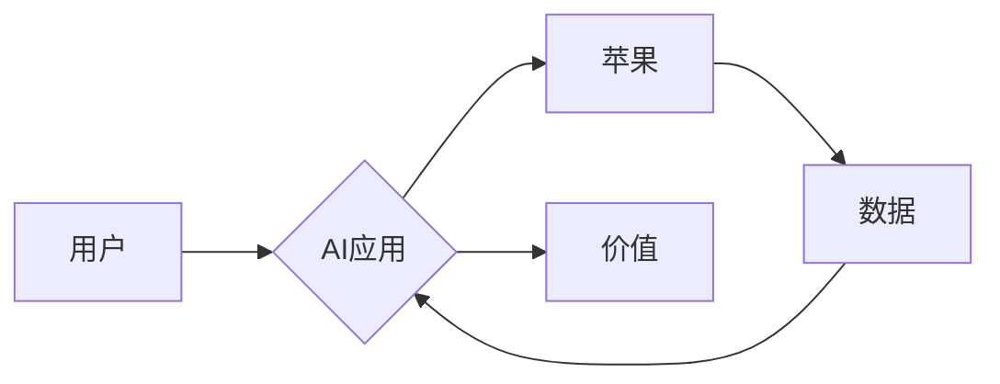

> 苹果, AI应用, 价值, 创新, 市场, 技术, 发展趋势

## 1. 背景介绍

近年来，人工智能（AI）技术飞速发展，已渗透到生活的方方面面。从智能手机的语音助手到自动驾驶汽车，AI正在改变着我们的生活方式。作为科技巨头，苹果也积极布局AI领域，并于近期发布了一系列AI应用。这些应用不仅展现了苹果在AI技术上的实力，也引发了人们对苹果发布AI应用价值的广泛讨论。

## 2. 核心概念与联系

### 2.1 AI应用的价值

AI应用的价值体现在以下几个方面：

* **提升用户体验:** AI可以帮助用户更便捷、更智能地完成任务，例如语音识别、图像识别、个性化推荐等。
* **创造新的商业模式:** AI可以帮助企业开发新的产品和服务，例如智能客服、精准营销、个性化定制等。
* **推动社会进步:** AI可以帮助解决社会问题，例如医疗诊断、环境监测、交通管理等。

### 2.2 苹果的AI战略

苹果一直以来都注重用户体验和产品创新。在AI领域，苹果也秉持着同样的理念，致力于将AI技术融入到其产品和服务中，提升用户体验，创造新的价值。

苹果的AI战略主要体现在以下几个方面：

* **打造强大的AI平台:** 苹果拥有强大的硬件和软件生态系统，为AI应用提供了坚实的基础。
* **积累海量数据:** 苹果拥有庞大的用户群体，可以收集海量用户数据，为AI模型训练提供数据支持。
* **开发核心AI技术:** 苹果在语音识别、图像识别、自然语言处理等核心AI技术领域进行深入研究和开发。
* **与合作伙伴合作:** 苹果积极与合作伙伴合作，共同开发和推广AI应用。

### 2.3  AI应用的价值链



## 3. 核心算法原理 & 具体操作步骤

### 3.1  算法原理概述

苹果在AI应用中广泛使用深度学习算法，例如卷积神经网络（CNN）、循环神经网络（RNN）等。这些算法能够从海量数据中学习特征，并进行预测、分类、识别等任务。

### 3.2  算法步骤详解

1. **数据预处理:** 将原始数据进行清洗、转换、格式化等操作，使其适合深度学习算法的训练。
2. **模型构建:** 根据具体的应用场景，选择合适的深度学习模型架构，并设置模型参数。
3. **模型训练:** 使用训练数据训练深度学习模型，调整模型参数，使其能够准确地完成目标任务。
4. **模型评估:** 使用测试数据评估模型的性能，例如准确率、召回率、F1-score等。
5. **模型部署:** 将训练好的模型部署到实际应用场景中，例如手机应用程序、服务器端等。

### 3.3  算法优缺点

**优点:**

* **高精度:** 深度学习算法能够学习到数据中的复杂特征，从而实现高精度的预测、分类、识别等任务。
* **自动化学习:** 深度学习算法能够自动学习数据特征，无需人工特征工程。
* **可扩展性强:** 深度学习算法可以处理海量数据，并可以并行训练，提高训练效率。

**缺点:**

* **数据依赖:** 深度学习算法需要大量的训练数据，否则模型性能会下降。
* **计算资源消耗大:** 深度学习模型训练需要大量的计算资源，例如GPU等。
* **可解释性差:** 深度学习模型的决策过程比较复杂，难以解释模型的决策结果。

### 3.4  算法应用领域

深度学习算法在各个领域都有广泛的应用，例如：

* **计算机视觉:** 图像识别、物体检测、图像分割等。
* **自然语言处理:** 语音识别、机器翻译、文本摘要等。
* **推荐系统:** 商品推荐、内容推荐等。
* **医疗诊断:** 疾病诊断、影像分析等。

## 4. 数学模型和公式 & 详细讲解 & 举例说明

### 4.1  数学模型构建

深度学习模型通常由多个神经网络层组成，每一层都包含多个神经元。每个神经元接收来自上一层的输入信号，并通过激活函数进行处理，输出到下一层。

### 4.2  公式推导过程

深度学习模型的训练过程是通过优化模型参数来最小化损失函数的过程。损失函数衡量模型预测结果与真实结果之间的差异。常用的损失函数包括均方误差（MSE）、交叉熵损失等。

**均方误差（MSE）:**

$$MSE = \frac{1}{n} \sum_{i=1}^{n} (y_i - \hat{y}_i)^2$$

其中：

* $y_i$ 是真实值
* $\hat{y}_i$ 是模型预测值
* $n$ 是样本数量

**交叉熵损失:**

$$CrossEntropy = -\frac{1}{n} \sum_{i=1}^{n} y_i \log(\hat{y}_i) + (1-y_i) \log(1-\hat{y}_i)$$

其中：

* $y_i$ 是真实值（0或1）
* $\hat{y}_i$ 是模型预测值（0到1之间的概率）

### 4.3  案例分析与讲解

例如，在图像分类任务中，可以使用卷积神经网络（CNN）模型进行训练。CNN模型可以学习图像中的特征，并将其分类到不同的类别。

## 5. 项目实践：代码实例和详细解释说明

### 5.1  开发环境搭建

* Python 3.x
* TensorFlow 或 PyTorch 等深度学习框架
* GPU 

### 5.2  源代码详细实现

```python
# 使用 TensorFlow 框架实现一个简单的图像分类模型

import tensorflow as tf

# 定义模型结构
model = tf.keras.models.Sequential([
    tf.keras.layers.Conv2D(32, (3, 3), activation='relu', input_shape=(28, 28, 1)),
    tf.keras.layers.MaxPooling2D((2, 2)),
    tf.keras.layers.Conv2D(64, (3, 3), activation='relu'),
    tf.keras.layers.MaxPooling2D((2, 2)),
    tf.keras.layers.Flatten(),
    tf.keras.layers.Dense(10, activation='softmax')
])

# 编译模型
model.compile(optimizer='adam',
              loss='sparse_categorical_crossentropy',
              metrics=['accuracy'])

# 训练模型
model.fit(x_train, y_train, epochs=10)

# 评估模型
loss, accuracy = model.evaluate(x_test, y_test)
print('Test loss:', loss)
print('Test accuracy:', accuracy)
```

### 5.3  代码解读与分析

* **模型结构:** 该代码定义了一个简单的卷积神经网络模型，包含两个卷积层、两个池化层、一个全连接层和一个输出层。
* **模型编译:** 使用Adam优化器、交叉熵损失函数和准确率作为评估指标编译模型。
* **模型训练:** 使用训练数据训练模型，训练10个 epochs。
* **模型评估:** 使用测试数据评估模型的性能，输出测试损失和准确率。

### 5.4  运行结果展示

运行代码后，会输出测试损失和准确率。

## 6. 实际应用场景

### 6.1  智能语音助手

苹果的Siri语音助手就是AI应用的一个典型例子。Siri可以理解用户的语音指令，并执行相应的操作，例如设置闹钟、发送短信、播放音乐等。

### 6.2  图像识别

苹果的iPhone手机内置了强大的图像识别功能，可以识别物体、场景、人脸等。用户可以通过拍照或扫描二维码来识别信息。

### 6.3  个性化推荐

苹果的App Store和iTunes Store会根据用户的历史浏览记录和购买记录，推荐相关的应用程序和音乐。

### 6.4  未来应用展望

随着AI技术的不断发展，苹果将继续在更多领域应用AI技术，例如：

* **自动驾驶:** 苹果正在开发自动驾驶汽车技术，AI将扮演重要角色。
* **医疗保健:** AI可以帮助医生诊断疾病、分析医学影像等。
* **教育:** AI可以个性化学习体验，帮助学生提高学习效率。

## 7. 工具和资源推荐

### 7.1  学习资源推荐

* **在线课程:** Coursera、edX、Udacity等平台提供丰富的AI课程。
* **书籍:** 《深度学习》、《机器学习实战》等书籍是学习AI的基础教材。
* **博客和论坛:** 关注AI领域的博客和论坛，可以了解最新的研究成果和技术趋势。

### 7.2  开发工具推荐

* **TensorFlow:** Google开发的开源深度学习框架。
* **PyTorch:** Facebook开发的开源深度学习框架。
* **Keras:** TensorFlow的深度学习API，易于使用。

### 7.3  相关论文推荐

* **《ImageNet Classification with Deep Convolutional Neural Networks》**
* **《Attention Is All You Need》**
* **《BERT: Pre-training of Deep Bidirectional Transformers for Language Understanding》**

## 8. 总结：未来发展趋势与挑战

### 8.1  研究成果总结

近年来，AI技术取得了长足的进步，在各个领域都有广泛的应用。深度学习算法成为AI领域的主流技术，并取得了令人瞩目的成果。

### 8.2  未来发展趋势

* **模型规模和复杂度提升:** 未来AI模型将更加庞大、复杂，能够处理更复杂的任务。
* **跨模态学习:** AI模型将能够处理多种模态数据，例如文本、图像、音频等。
* **边缘计算:** AI模型将部署到边缘设备，实现更快速的响应和更低的延迟。
* **可解释性增强:** 研究人员将致力于提高AI模型的可解释性，使其决策过程更加透明。

### 8.3  面临的挑战

* **数据安全和隐私:** AI模型训练需要大量数据，如何保证数据安全和隐私是一个重要的挑战。
* **算法偏见:** AI模型可能存在算法偏见，导致不公平的结果。
* **伦理问题:** AI技术的应用引发了伦理问题，例如人工智能的责任和义务。

### 8.4  研究展望

未来，AI技术将继续发展，并对我们的生活产生更深远的影响。研究人员将继续探索新的AI算法和应用场景，并致力于解决AI技术带来的挑战。

## 9. 附录：常见问题与解答

### 9.1  什么是深度学习？

深度学习是一种机器学习的子领域，它使用多层神经网络来学习数据特征。

### 9.2  深度学习有哪些应用？

深度学习在各个领域都有广泛的应用，例如图像识别、自然语言处理、推荐系统等。

### 9.3  如何学习深度学习？

可以通过在线课程、书籍、博客和论坛等方式学习深度学习。

### 9.4  深度学习有哪些主流框架？

TensorFlow、PyTorch、Keras等都是主流的深度学习框架。

### 9.5  深度学习有哪些挑战？

数据安全、算法偏见、伦理问题等都是深度学习面临的挑战。


作者：禅与计算机程序设计艺术 / Zen and the Art of Computer Programming 
<end_of_turn>