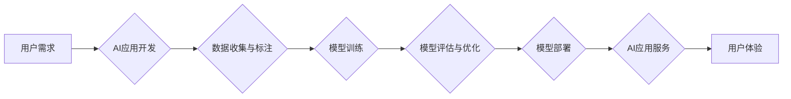

> 苹果, AI应用, 市场, 趋势, 挑战,  李开复,  人工智能,  机器学习

## 1. 背景介绍

近年来，人工智能（AI）技术飞速发展，已渗透到生活的方方面面。从智能手机的语音助手到自动驾驶汽车，AI正在改变着我们的生活方式。作为科技巨头，苹果也积极布局AI领域，并不断推出搭载AI技术的应用和服务。

李开复，一位享誉全球的人工智能专家，曾于2023年发表了一篇关于苹果发布AI应用市场的文章，引发了业界广泛关注。他认为，苹果拥有强大的硬件、软件和生态系统，具备成为AI应用市场领导者的潜力。

## 2. 核心概念与联系

### 2.1 AI应用的本质

AI应用的核心是利用机器学习算法，从海量数据中学习，并根据学习到的知识完成特定任务。例如，语音识别应用利用机器学习算法识别用户的语音指令，而图像识别应用则利用机器学习算法识别图像中的物体。

### 2.2 苹果的AI生态系统

苹果拥有强大的AI生态系统，包括：

* **硬件平台:** 苹果的芯片（如A系列芯片）拥有强大的计算能力，能够支持复杂的AI算法运行。
* **软件平台:** 苹果的iOS和macOS操作系统提供了一系列AI开发工具和框架，方便开发者开发AI应用。
* **应用商店:** 苹果的App Store是全球最大的移动应用商店，为用户提供了丰富的AI应用选择。

### 2.3  AI应用市场

AI应用市场正处于快速发展阶段，市场规模不断扩大。根据市场调研机构预测，到2025年，全球AI应用市场规模将达到数万亿美元。

**Mermaid 流程图**



## 3. 核心算法原理 & 具体操作步骤

### 3.1  算法原理概述

李开复的文章重点介绍了苹果在AI应用开发中使用的核心算法原理，主要包括：

* **深度学习:** 深度学习是一种机器学习算法，利用多层神经网络模拟人类大脑的学习过程。
* **强化学习:** 强化学习是一种机器学习算法，通过奖励和惩罚机制训练模型，使其在特定环境中做出最优决策。
* **自然语言处理:** 自然语言处理是指让计算机理解和处理人类语言的技术。

### 3.2  算法步骤详解

以深度学习为例，其算法步骤可以概括为以下几个阶段：

1. **数据收集与预处理:** 收集大量相关数据，并进行清洗、格式化等预处理工作。
2. **模型构建:** 根据任务需求选择合适的深度学习模型架构，并设置模型参数。
3. **模型训练:** 利用训练数据训练模型，调整模型参数，使其能够准确地完成任务。
4. **模型评估:** 使用测试数据评估模型的性能，并根据评估结果进行模型优化。
5. **模型部署:** 将训练好的模型部署到实际应用场景中，提供AI服务。

### 3.3  算法优缺点

深度学习算法具有以下优点：

* **高准确率:** 深度学习算法能够学习到复杂的特征，从而实现高准确率的预测和识别。
* **自动化学习:** 深度学习算法能够自动学习数据中的规律，无需人工特征工程。
* **泛化能力强:** 深度学习算法能够将学习到的知识应用到新的数据中，具有较强的泛化能力。

但也存在一些缺点：

* **数据依赖:** 深度学习算法需要大量数据进行训练，否则性能会下降。
* **计算资源消耗大:** 深度学习算法训练过程需要消耗大量的计算资源。
* **可解释性差:** 深度学习模型的内部机制复杂，难以解释其决策过程。

### 3.4  算法应用领域

深度学习算法已广泛应用于各个领域，例如：

* **图像识别:** 人脸识别、物体检测、图像分类等。
* **语音识别:** 语音转文本、语音助手等。
* **自然语言处理:** 机器翻译、文本摘要、情感分析等。
* **推荐系统:** 商品推荐、内容推荐等。

## 4. 数学模型和公式 & 详细讲解 & 举例说明

### 4.1  数学模型构建

深度学习模型的核心是神经网络，其结构由多个层组成，每一层包含多个神经元。每个神经元接收来自上一层的输入信号，并通过激活函数进行处理，输出到下一层。

**激活函数:** 激活函数的作用是将神经元的输入信号转换为输出信号，并引入非线性因素，使神经网络能够学习到复杂的特征。常见的激活函数包括 sigmoid 函数、ReLU 函数等。

### 4.2  公式推导过程

深度学习模型的训练过程是通过优化模型参数来最小化损失函数的过程。损失函数衡量模型预测结果与真实结果之间的差异。常用的损失函数包括均方误差（MSE）、交叉熵损失等。

**均方误差 (MSE):**

$$MSE = \frac{1}{n} \sum_{i=1}^{n} (y_i - \hat{y}_i)^2$$

其中：

* $y_i$ 是真实值
* $\hat{y}_i$ 是模型预测值
* $n$ 是样本数量

**交叉熵损失:**

$$CrossEntropy = -\frac{1}{n} \sum_{i=1}^{n} y_i \log(\hat{y}_i) + (1-y_i) \log(1-\hat{y}_i)$$

其中：

* $y_i$ 是真实标签（0或1）
* $\hat{y}_i$ 是模型预测概率

### 4.3  案例分析与讲解

以图像分类为例，假设我们训练一个深度学习模型，用于识别猫和狗的图片。

1. **数据收集与预处理:** 收集大量猫和狗的图片，并进行裁剪、缩放等预处理工作。
2. **模型构建:** 选择合适的深度学习模型架构，例如卷积神经网络（CNN）。
3. **模型训练:** 利用训练数据训练模型，并使用交叉熵损失函数进行优化。
4. **模型评估:** 使用测试数据评估模型的准确率，并根据评估结果进行模型优化。
5. **模型部署:** 将训练好的模型部署到实际应用场景中，例如手机应用或网站。

## 5. 项目实践：代码实例和详细解释说明

### 5.1  开发环境搭建

* **操作系统:** macOS, Windows, Linux
* **编程语言:** Python
* **深度学习框架:** TensorFlow, PyTorch
* **其他工具:** Jupyter Notebook, Git

### 5.2  源代码详细实现

```python
# 使用 TensorFlow 构建一个简单的图像分类模型

import tensorflow as tf

# 定义模型架构
model = tf.keras.models.Sequential([
    tf.keras.layers.Conv2D(32, (3, 3), activation='relu', input_shape=(28, 28, 1)),
    tf.keras.layers.MaxPooling2D((2, 2)),
    tf.keras.layers.Conv2D(64, (3, 3), activation='relu'),
    tf.keras.layers.MaxPooling2D((2, 2)),
    tf.keras.layers.Flatten(),
    tf.keras.layers.Dense(10, activation='softmax')
])

# 编译模型
model.compile(optimizer='adam',
              loss='sparse_categorical_crossentropy',
              metrics=['accuracy'])

# 训练模型
model.fit(x_train, y_train, epochs=5)

# 评估模型
loss, accuracy = model.evaluate(x_test, y_test)
print('Test loss:', loss)
print('Test accuracy:', accuracy)
```

### 5.3  代码解读与分析

* **模型架构:** 代码中定义了一个简单的卷积神经网络（CNN）模型，用于图像分类。
* **层类型:** 模型包含卷积层、池化层、全连接层等不同类型的层。
* **激活函数:** 使用ReLU函数作为激活函数，引入非线性因素。
* **损失函数:** 使用交叉熵损失函数，用于衡量模型预测结果与真实结果之间的差异。
* **优化器:** 使用Adam优化器，用于更新模型参数。

### 5.4  运行结果展示

训练完成后，模型可以用于预测新的图像类别。

## 6. 实际应用场景

### 6.1  智能助手

苹果的Siri智能助手利用自然语言处理技术，能够理解用户的语音指令，并执行相应的操作。

### 6.2  图像识别

苹果的iPhone手机内置了图像识别功能，能够识别物体、场景和文字。

### 6.3  推荐系统

苹果的App Store和音乐应用利用推荐系统，根据用户的喜好推荐相关的应用和音乐。

### 6.4  未来应用展望

随着AI技术的不断发展，苹果将在更多领域应用AI技术，例如：

* **自动驾驶:** 苹果正在开发自动驾驶汽车技术，利用AI算法实现车辆的感知、决策和控制。
* **医疗保健:** 苹果将利用AI技术辅助医生诊断疾病、预测患者风险和个性化治疗方案。
* **教育:** 苹果将利用AI技术提供个性化的学习体验，帮助学生更好地掌握知识。

## 7. 工具和资源推荐

### 7.1  学习资源推荐

* **在线课程:** Coursera, edX, Udacity
* **书籍:** 深度学习，机器学习
* **博客:** 机器之心，AI科技评论

### 7.2  开发工具推荐

* **深度学习框架:** TensorFlow, PyTorch
* **编程语言:** Python
* **数据处理工具:** Pandas, NumPy

### 7.3  相关论文推荐

* **深度学习论文:** ImageNet Classification with Deep Convolutional Neural Networks
* **强化学习论文:** Deep Reinforcement Learning with Double Q-learning

## 8. 总结：未来发展趋势与挑战

### 8.1  研究成果总结

李开复的文章总结了苹果在AI应用开发方面的研究成果，并指出苹果拥有强大的硬件、软件和生态系统，具备成为AI应用市场领导者的潜力。

### 8.2  未来发展趋势

未来，AI技术将继续发展，并应用到更多领域。苹果将继续加大对AI技术的投入，并将其应用到更多产品和服务中。

### 8.3  面临的挑战

苹果在AI应用开发中也面临一些挑战，例如：

* **数据隐私:** AI算法需要大量数据进行训练，如何保护用户数据隐私是一个重要问题。
* **算法偏见:** AI算法可能存在偏见，导致不公平的结果。
* **伦理问题:** AI技术的应用可能引发一些伦理问题，例如自动驾驶汽车的责任归属。

### 8.4  研究展望

苹果需要继续加强对AI技术的研发，并积极应对AI技术带来的挑战，才能在AI应用市场中保持领先地位。

## 9. 附录：常见问题与解答

* **Q1: 苹果的AI应用有哪些？**

* **A1:** 苹果的AI应用包括Siri智能助手、图像识别、推荐系统等。

* **Q2: 苹果如何保障用户数据隐私？**

* **A2:** 苹果承诺保护用户数据隐私，并采取多种措施来保障数据安全。

* **Q3: 苹果的AI技术与其他公司的AI技术相比如何？**

* **A3:** 苹果的AI技术在某些领域处于领先地位，例如语音识别和图像识别。


作者：禅与计算机程序设计艺术 / Zen and the Art of Computer Programming 


<end_of_turn>