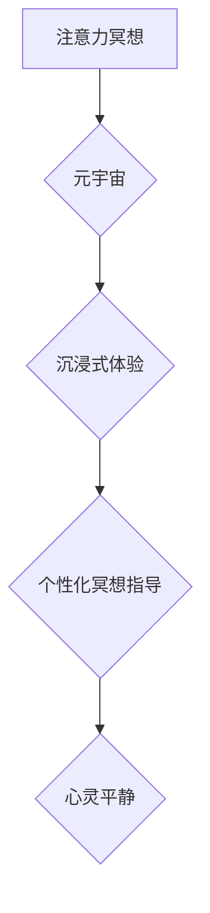

>  注意力冥想、元宇宙、人工智能、深度学习、神经网络、心流状态、用户体验、可穿戴设备

## 1. 背景介绍

在当今科技飞速发展的时代，人类面临着前所未有的信息爆炸和生活节奏加快。人们日益感受到压力、焦虑和精神疲惫，寻求心灵平静和内在平衡的需求日益强烈。元宇宙作为下一代互联网，将带来更加沉浸式、交互式和虚拟化的体验，但也可能加剧信息过载和虚拟现实带来的心理压力。在这种背景下，注意力冥想App应运而生，它利用人工智能技术和深度学习算法，为用户提供个性化、智能化的冥想指导，帮助他们在元宇宙时代保持心灵平静和专注力。

## 2. 核心概念与联系

注意力冥想是一种通过专注于当下，观察呼吸和身体感受，训练专注力和意识觉察的冥想方法。元宇宙则是一个由虚拟现实、增强现实和互联网技术融合而成的虚拟世界，用户可以在其中进行社交、娱乐、工作等活动。注意力冥想App将注意力冥想的核心概念与元宇宙的沉浸式体验相结合，为用户提供更加身临其境的冥想体验。

**核心概念与联系流程图:**



## 3. 核心算法原理 & 具体操作步骤

### 3.1  算法原理概述

注意力冥想App的核心算法原理基于深度学习和自然语言处理技术。

* **深度学习:** 用于训练模型识别用户的情绪状态、注意力水平和冥想效果。
* **自然语言处理:** 用于理解用户的冥想需求和反馈，提供个性化的冥想指导。

### 3.2  算法步骤详解

1. **数据采集:** 通过可穿戴设备或手机传感器采集用户的生理数据，如心率、呼吸频率、脑电波等，以及用户的语音和文本反馈。
2. **数据预处理:** 对采集到的数据进行清洗、转换和特征提取，以便于模型训练。
3. **模型训练:** 使用深度学习算法训练模型，识别用户的生理和心理状态，并预测用户的冥想效果。
4. **个性化指导:** 根据用户的冥想需求和反馈，模型提供个性化的冥想指导，包括冥想音乐、引导语、呼吸练习等。
5. **效果评估:** 持续监测用户的冥想效果，并根据反馈进行模型调整和优化。

### 3.3  算法优缺点

**优点:**

* **个性化:** 根据用户的需求和反馈提供个性化的冥想指导。
* **智能化:** 利用人工智能技术自动识别用户的状态和需求，提供更精准的指导。
* **沉浸式体验:** 与元宇宙结合，提供更加身临其境的冥想体验。

**缺点:**

* **数据隐私:** 需要收集用户的生理和心理数据，需要确保数据安全和隐私保护。
* **模型准确性:** 深度学习模型的准确性依赖于训练数据，需要不断收集和优化数据。
* **技术复杂性:** 开发注意力冥想App需要具备深度学习、自然语言处理和元宇宙技术等方面的专业知识。

### 3.4  算法应用领域

注意力冥想App的算法可以应用于以下领域:

* **医疗保健:** 帮助患者缓解压力、焦虑和抑郁症状。
* **教育:** 提高学生的注意力和学习效率。
* **企业:** 帮助员工减轻工作压力，提高工作效率和创造力。
* **个人成长:** 帮助个人提升自我意识、专注力和情绪管理能力。

## 4. 数学模型和公式 & 详细讲解 & 举例说明

### 4.1  数学模型构建

注意力冥想App的算法模型可以构建为一个多层神经网络，其中每一层都包含多个神经元。每个神经元接收来自上一层的输入信号，并通过激活函数进行处理，输出到下一层。

**模型结构:**

* **输入层:** 接收用户的生理数据和文本反馈。
* **隐藏层:** 对数据进行特征提取和表示学习。
* **输出层:** 输出用户的冥想状态、注意力水平和冥想效果。

### 4.2  公式推导过程

神经网络的训练过程基于反向传播算法，其核心公式为：

$$
\Delta w = \eta \frac{\partial E}{\partial w}
$$

其中：

* $\Delta w$ 是权重的更新量。
* $\eta$ 是学习率。
* $E$ 是损失函数，用于衡量模型预测结果与真实值的差异。
* $\frac{\partial E}{\partial w}$ 是损失函数对权重的梯度。

### 4.3  案例分析与讲解

假设用户在冥想过程中，心率下降了10%，呼吸频率降低了5%，并反馈“感觉很放松”。模型可以根据这些数据，更新权重，提高预测用户冥想效果的准确性。

## 5. 项目实践：代码实例和详细解释说明

### 5.1  开发环境搭建

注意力冥想App的开发环境可以搭建在以下平台：

* **Python:** 使用TensorFlow或PyTorch深度学习框架。
* **Android/iOS:** 使用Java或Swift开发移动应用程序。
* **云平台:** 使用AWS、Azure或GCP等云平台提供计算资源和存储服务。

### 5.2  源代码详细实现

以下是一个使用TensorFlow框架训练注意力冥想模型的代码示例：

```python
import tensorflow as tf

# 定义模型结构
model = tf.keras.models.Sequential([
    tf.keras.layers.Dense(64, activation='relu', input_shape=(10,)),
    tf.keras.layers.Dense(32, activation='relu'),
    tf.keras.layers.Dense(1, activation='sigmoid')
])

# 编译模型
model.compile(optimizer='adam', loss='binary_crossentropy', metrics=['accuracy'])

# 训练模型
model.fit(x_train, y_train, epochs=10)

# 评估模型
loss, accuracy = model.evaluate(x_test, y_test)
print('Loss:', loss)
print('Accuracy:', accuracy)
```

### 5.3  代码解读与分析

这段代码定义了一个简单的多层神经网络模型，用于预测用户的冥想效果。模型的输入层接收10个特征，例如心率、呼吸频率等。隐藏层使用ReLU激活函数，输出层使用sigmoid激活函数，输出0或1，表示用户是否处于冥想状态。

### 5.4  运行结果展示

训练完成后，模型可以用于预测用户的冥想效果。例如，当用户的心率和呼吸频率下降时，模型可以预测用户处于冥想状态。

## 6. 实际应用场景

### 6.1  元宇宙冥想体验

注意力冥想App可以与元宇宙平台集成，为用户提供更加沉浸式的冥想体验。用户可以身临其境地进入虚拟冥想空间，感受自然环境、聆听舒缓的音乐，并获得个性化的冥想指导。

### 6.2  远程协作冥想

注意力冥想App可以支持远程协作冥想，让用户即使身处不同地点，也能共同进行冥想练习。

### 6.3  个性化冥想方案

注意力冥想App可以根据用户的冥想需求和反馈，提供个性化的冥想方案，例如针对压力、焦虑、睡眠等问题提供不同的冥想练习。

### 6.4  未来应用展望

注意力冥想App在元宇宙时代将拥有广阔的应用前景，可以应用于教育、医疗、企业培训、个人成长等领域，帮助人们在虚拟世界中保持心灵平静和专注力。

## 7. 工具和资源推荐

### 7.1  学习资源推荐

* **深度学习书籍:** 《深度学习》、《动手学深度学习》
* **在线课程:** Coursera、edX、Udacity等平台提供深度学习课程。
* **开源项目:** TensorFlow、PyTorch等深度学习框架的官方文档和示例代码。

### 7.2  开发工具推荐

* **Python:** 深度学习开发的常用语言。
* **TensorFlow/PyTorch:** 深度学习框架。
* **Android Studio/Xcode:** 移动应用程序开发工具。
* **AWS/Azure/GCP:** 云平台提供计算资源和存储服务。

### 7.3  相关论文推荐

* **Attention Is All You Need:** https://arxiv.org/abs/1706.03762
* **Deep Learning for Natural Language Processing:** https://arxiv.org/abs/1803.01982

## 8. 总结：未来发展趋势与挑战

### 8.1  研究成果总结

注意力冥想App将人工智能技术与冥想实践相结合，为用户提供个性化、智能化的冥想体验。该技术在元宇宙时代具有广阔的应用前景，可以帮助人们在虚拟世界中保持心灵平静和专注力。

### 8.2  未来发展趋势

* **更精准的个性化指导:** 利用更先进的深度学习算法和自然语言处理技术，提供更精准的个性化冥想指导。
* **更沉浸式的体验:** 与元宇宙平台深度融合，提供更沉浸式的冥想体验。
* **更广泛的应用场景:** 将注意力冥想App应用于更多领域，例如教育、医疗、企业培训等。

### 8.3  面临的挑战

* **数据隐私保护:** 需要确保用户数据的安全和隐私。
* **模型准确性:** 深度学习模型的准确性依赖于训练数据，需要不断收集和优化数据。
* **技术复杂性:** 开发注意力冥想App需要具备深度学习、自然语言处理和元宇宙技术等方面的专业知识。

### 8.4  研究展望

未来，我们将继续研究注意力冥想App的算法模型、用户体验设计和应用场景，努力将注意力冥想技术应用于更多领域，帮助人们在元宇宙时代保持心灵平静和专注力。

## 9. 附录：常见问题与解答

**Q1: 注意力冥想App是否适合所有人？**

A1: 注意力冥想App可以帮助大多数人缓解压力、焦虑和抑郁症状，提高专注力和情绪管理能力。但对于一些特定人群，例如患有精神疾病的人，建议在专业医生的指导下使用。

**Q2: 使用注意力冥想App需要花费多少时间？**

A2: 每天只需花费10-20分钟即可获得显著的冥想效果。

**Q3: 注意力冥想App是否需要购买？**

A3: 一些注意力冥想App是免费的，而另一些则需要付费订阅。

**Q4: 注意力冥想App的数据是否安全？**

A4:  reputable注意力冥想App会采取严格的安全措施来保护用户的隐私数据。


作者：禅与计算机程序设计艺术 / Zen and the Art of Computer Programming 
<end_of_turn>