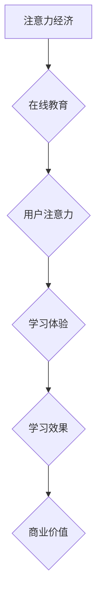

> 在线教育, 注意力经济, 人工智能, 学习个性化, 知识图谱, 互动体验, 虚拟现实

## 1. 背景介绍

在当今信息爆炸的时代，人们面临着前所未有的信息过载。注意力，作为人类认知的核心资源，变得越来越稀缺。这使得在线教育行业面临着前所未有的挑战：如何在竞争激烈的市场中吸引和留住学生的注意力，并提供高质量的学习体验？

在线教育行业近年来发展迅速，但同时也面临着诸多问题：

* **用户注意力分散:** 学生容易受到各种干扰，难以集中注意力学习。
* **学习体验单调:** 传统在线课程模式缺乏互动性，难以激发学生的学习兴趣。
* **个性化学习不足:** 现有的在线课程大多采用“一刀切”的教学模式，难以满足不同学生个性化的学习需求。

## 2. 核心概念与联系

**2.1 注意力经济**

注意力经济是指在信息时代，注意力成为一种稀缺资源，并被商业化和交易的经济模式。

**2.2 在线教育与注意力经济**

在线教育作为一种信息密集型服务，与注意力经济有着密切的联系。在线教育平台需要通过吸引和留住学生的注意力，才能实现商业目标。

**2.3 核心概念架构**



## 3. 核心算法原理 & 具体操作步骤

**3.1 算法原理概述**

为了解决在线教育中的注意力问题，我们可以利用人工智能技术，例如深度学习和自然语言处理，开发个性化学习推荐算法。这些算法可以根据学生的学习行为、兴趣偏好和知识水平，推荐最适合他们的学习内容。

**3.2 算法步骤详解**

1. **数据收集:** 收集学生的学习行为数据，例如学习时长、点击率、完成率等，以及学生的兴趣偏好和知识水平数据。
2. **数据预处理:** 对收集到的数据进行清洗、转换和特征提取。
3. **模型训练:** 利用深度学习算法，例如循环神经网络（RNN）或Transformer，训练个性化学习推荐模型。
4. **模型预测:** 将新用户的学习行为数据输入到训练好的模型中，预测用户的学习兴趣和需求。
5. **推荐内容:** 根据模型预测结果，推荐最适合用户的学习内容。

**3.3 算法优缺点**

* **优点:**
    * 可以根据学生的个性化需求提供定制化的学习内容。
    * 可以提高学生的学习兴趣和效率。
    * 可以帮助在线教育平台更好地了解学生的学习行为，从而改进教学内容和服务。
* **缺点:**
    * 需要大量的学习行为数据进行模型训练。
    * 模型训练需要较高的计算资源和技术水平。
    * 模型的预测结果可能存在一定的误差。

**3.4 算法应用领域**

* 在线教育平台的个性化学习推荐
* 在线课程内容的自动生成
* 学习资源的智能匹配
* 学生学习行为的分析和评估

## 4. 数学模型和公式 & 详细讲解 & 举例说明

**4.1 数学模型构建**

我们可以使用协同过滤算法来构建个性化学习推荐模型。协同过滤算法基于用户的历史行为数据，预测用户对未接触过的物品的兴趣。

**4.2 公式推导过程**

协同过滤算法的核心思想是：如果用户A和用户B对某些物品的评价相似，那么用户A可能也喜欢用户B喜欢的物品。

假设我们有一个用户-物品评分矩阵，其中每个元素表示用户对物品的评分。我们可以使用以下公式计算用户A对物品B的评分预测值：

$$
\hat{r}_{A,B} = \bar{r}_A + \frac{\sum_{i \in N(A) \cap N(B)} (r_{A,i} - \bar{r}_A)(r_{B,i} - \bar{r}_B)}{\sum_{i \in N(A) \cap N(B)} (r_{A,i} - \bar{r}_A)^2}
$$

其中：

* $\hat{r}_{A,B}$ 是用户A对物品B的评分预测值。
* $\bar{r}_A$ 是用户A的平均评分。
* $\bar{r}_B$ 是用户B的平均评分。
* $r_{A,i}$ 是用户A对物品i的评分。
* $r_{B,i}$ 是用户B对物品i的评分。
* $N(A)$ 是用户A评分过的物品集合。
* $N(B)$ 是用户B评分过的物品集合。

**4.3 案例分析与讲解**

假设我们有一个用户-物品评分矩阵，其中用户A和用户B都对电影A和电影B评分过。我们可以使用上述公式计算用户A对电影C的评分预测值，如果用户B对电影C的评分较高。

## 5. 项目实践：代码实例和详细解释说明

**5.1 开发环境搭建**

* Python 3.x
* TensorFlow 或 PyTorch
* Jupyter Notebook

**5.2 源代码详细实现**

```python
import tensorflow as tf

# 定义模型结构
model = tf.keras.Sequential([
    tf.keras.layers.Embedding(input_dim=vocab_size, output_dim=embedding_dim),
    tf.keras.layers.LSTM(units=128),
    tf.keras.layers.Dense(units=1, activation='sigmoid')
])

# 编译模型
model.compile(optimizer='adam', loss='binary_crossentropy', metrics=['accuracy'])

# 训练模型
model.fit(x_train, y_train, epochs=10, batch_size=32)

# 预测
predictions = model.predict(x_test)
```

**5.3 代码解读与分析**

* 首先，我们定义了一个基于LSTM神经网络的模型。
* 然后，我们使用Adam优化器和二分类交叉熵损失函数对模型进行训练。
* 最后，我们使用训练好的模型对测试数据进行预测。

**5.4 运行结果展示**

* 训练完成后，我们可以查看模型的训练和验证准确率。
* 我们可以使用测试数据评估模型的性能。

## 6. 实际应用场景

**6.1 个性化学习推荐**

在线教育平台可以利用个性化学习推荐算法，根据学生的学习行为和兴趣偏好，推荐最适合他们的学习内容。

**6.2 智能辅导系统**

智能辅导系统可以利用自然语言处理技术，理解学生的学习问题，并提供个性化的辅导建议。

**6.3 虚拟现实学习体验**

虚拟现实技术可以为学生提供沉浸式的学习体验，提高学生的学习兴趣和效率。

**6.4 未来应用展望**

* 人工智能技术将进一步提升在线教育的个性化、智能化和互动性。
* 虚拟现实和增强现实技术将为学生提供更加沉浸式的学习体验。
* 在线教育将更加注重学生的实践能力和创新能力培养。

## 7. 工具和资源推荐

**7.1 学习资源推荐**

* 深度学习课程：Coursera, Udacity, edX
* 自然语言处理课程：Stanford NLP, NLTK Book
* 在线教育平台：Coursera, edX, Udemy

**7.2 开发工具推荐**

* Python: TensorFlow, PyTorch
* Jupyter Notebook
* Git

**7.3 相关论文推荐**

* Attention Is All You Need
* BERT: Pre-training of Deep Bidirectional Transformers for Language Understanding
* A Survey of Personalized Learning Systems

## 8. 总结：未来发展趋势与挑战

**8.1 研究成果总结**

近年来，人工智能技术在在线教育领域的应用取得了显著进展，例如个性化学习推荐、智能辅导系统和虚拟现实学习体验等。

**8.2 未来发展趋势**

* 人工智能技术将更加深入地融入在线教育，提供更加个性化、智能化和互动化的学习体验。
* 虚拟现实和增强现实技术将为学生提供更加沉浸式的学习体验。
* 在线教育将更加注重学生的实践能力和创新能力培养。

**8.3 面临的挑战**

* 数据隐私和安全问题
* 模型解释性和可信度问题
* 教育公平性和可访问性问题

**8.4 研究展望**

未来，我们需要继续探索人工智能技术在在线教育领域的应用，并解决相关挑战，以实现在线教育的公平、高效和可持续发展。

## 9. 附录：常见问题与解答

**9.1 如何提高模型的准确率？**

* 增加训练数据量
* 使用更复杂的模型架构
* 优化模型的超参数

**9.2 如何解决数据隐私和安全问题？**

* 使用匿名化技术处理用户数据
* 加强数据加密和安全防护措施

**9.3 如何评估模型的性能？**

* 使用准确率、召回率、F1-score等指标评估模型的分类性能
* 使用RMSE、MAE等指标评估模型的回归性能

作者：禅与计算机程序设计艺术 / Zen and the Art of Computer Programming


<end_of_turn>