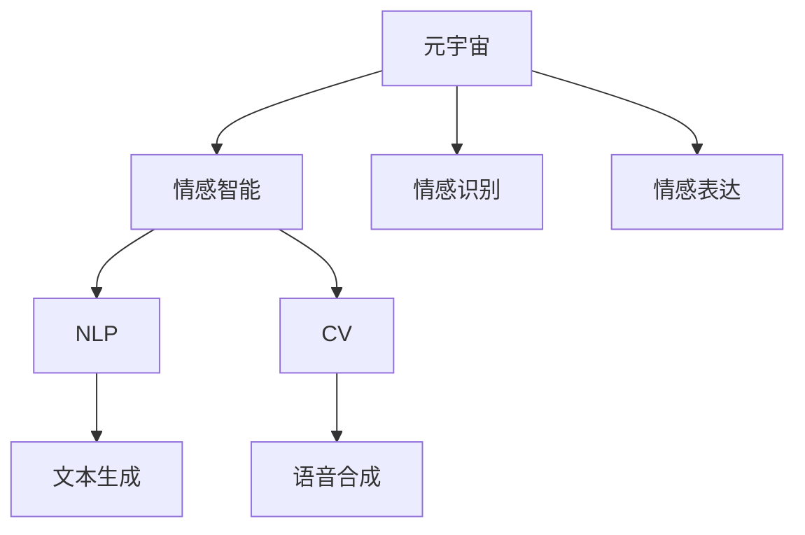

                 

# 元宇宙情感智能:虚拟关系中的情感识别与表达

> 关键词：元宇宙,情感智能,情感识别,情感表达,虚拟关系,人工智能,深度学习,自然语言处理,NLP

## 1. 背景介绍

### 1.1 问题由来
随着虚拟现实（VR）、增强现实（AR）等技术的发展，元宇宙（Metaverse）成为全球科技公司和学术界争相探索的前沿领域。元宇宙被视为互联网的下一代形态，它不仅仅是一个虚拟空间，更是一个真实世界的模拟，包含复杂的虚拟关系和互动场景。情感智能在元宇宙中的应用，不仅能够提升虚拟体验的丰富性和互动性，还能在虚拟关系中实现高效的情感识别和表达，从而推动虚拟社区的健康发展和深层次互动。

### 1.2 问题核心关键点
在元宇宙中，情感智能的实现涉及到以下几个核心问题：
1. **情感识别**：通过自然语言处理（NLP）、计算机视觉（CV）等技术，从用户行为和语言中识别其情感状态。
2. **情感表达**：利用文本生成、语音合成等技术，让AI模型能够生成符合情感状态的回复或表达方式。
3. **虚拟关系管理**：通过情感智能技术，帮助构建和维护虚拟关系，提升用户的虚拟体验和互动效率。
4. **隐私保护**：在情感识别和表达过程中，如何保护用户的隐私和安全。
5. **跨平台兼容性**：不同元宇宙平台和设备之间的情感智能系统的兼容性问题。

### 1.3 问题研究意义
研究元宇宙情感智能技术，对于提升虚拟互动体验，构建健康虚拟社区，推动元宇宙技术的产业化进程具有重要意义：

1. **提升虚拟互动体验**：通过情感智能技术，使虚拟互动更加真实、自然，满足用户的情感需求。
2. **构建健康虚拟社区**：情感智能可以帮助识别和管理用户间的情感冲突，维护虚拟社区的和谐稳定。
3. **推动元宇宙产业化**：情感智能技术的成熟应用，将加速元宇宙从概念到实际应用的过程。
4. **拓展AI应用边界**：情感智能作为AI技术的新前沿，将进一步拓展AI技术的应用范围，推动AI技术的全面普及。

## 2. 核心概念与联系

### 2.1 核心概念概述

为了更好地理解元宇宙情感智能的实现过程，本节将介绍几个密切相关的核心概念：

- **元宇宙（Metaverse）**：一个由数字世界和物理世界融合而成的虚拟空间，包含复杂的虚拟关系和互动场景。
- **情感智能（Affective Intelligence）**：指系统能够识别、理解并生成情感，从而实现高效的人机互动和情感管理。
- **自然语言处理（NLP）**：指利用计算机技术理解和处理人类语言，是实现情感识别的关键技术之一。
- **计算机视觉（CV）**：指利用计算机技术分析、理解和处理视觉信息，是实现情感识别的重要手段。
- **文本生成（Text Generation）**：指通过深度学习等技术生成符合特定情感状态的文本，是情感表达的核心技术。
- **语音合成（Speech Synthesis）**：指通过深度学习等技术生成符合特定情感状态的语音，是情感表达的重要方式。
- **情感识别（Emotion Recognition）**：指从用户的行为和语言中识别其情感状态。
- **情感表达（Emotion Expression）**：指生成符合用户情感状态的回复或表达方式。

这些核心概念之间的逻辑关系可以通过以下Mermaid流程图来展示：



这个流程图展示了一个元宇宙情感智能系统的基本结构：

1. 元宇宙中的情感智能系统，通过NLP和CV技术，实现对用户情感的识别。
2. 识别后的情感信息，通过文本生成和语音合成技术，转化为符合用户情感的回复或表达方式。
3. 情感识别和表达过程，在虚拟关系管理中起到关键作用，提升虚拟互动的效率和真实感。

## 3. 核心算法原理 & 具体操作步骤
### 3.1 算法原理概述

元宇宙情感智能系统的核心算法原理，基于深度学习和大数据处理技术，通过以下步骤实现情感识别和表达：

1. **情感识别**：通过NLP和CV技术，从用户的行为和语言中识别其情感状态。
2. **情感表达**：利用文本生成和语音合成技术，生成符合用户情感状态的回复或表达方式。
3. **虚拟关系管理**：通过情感智能技术，维护和优化虚拟关系，提升用户的虚拟体验。

### 3.2 算法步骤详解

以下详细介绍元宇宙情感智能系统的核心算法步骤：

**Step 1: 数据收集与预处理**
- 收集元宇宙中的用户行为数据和语言数据，包括用户与虚拟角色的对话记录、表情捕捉、语音输入等。
- 对数据进行清洗和预处理，去除噪声和无关数据，构建训练数据集。

**Step 2: 情感识别模型训练**
- 利用NLP和CV技术，构建情感识别模型。NLP模型可以使用BERT、GPT等预训练模型，CV模型可以使用CNN、RNN等深度学习模型。
- 在预训练模型基础上，使用用户数据进行微调，使其能够准确识别用户情感状态。

**Step 3: 情感表达模型训练**
- 利用文本生成和语音合成技术，构建情感表达模型。文本生成模型可以使用GPT-3等语言模型，语音合成模型可以使用Tacotron等模型。
- 在预训练模型基础上，使用用户数据进行微调，使其能够生成符合用户情感状态的回复或表达方式。

**Step 4: 虚拟关系管理**
- 通过情感识别和表达模型，实时监控用户情感状态，根据情感状态调整虚拟角色的行为和互动方式。
- 使用情感智能技术，优化虚拟角色的情感表达和反馈机制，提升虚拟互动的真实性和互动效率。

### 3.3 算法优缺点

元宇宙情感智能系统具有以下优点：
1. **高效率**：利用深度学习和大数据处理技术，实现情感识别和表达的高效化。
2. **高精度**：通过大量数据训练和微调，提高情感识别和表达的精度和可靠性。
3. **灵活性**：可以根据不同场景和用户需求，灵活调整情感表达方式和虚拟角色行为。

同时，该系统也存在一些缺点：
1. **隐私风险**：在情感识别和表达过程中，如何保护用户的隐私和安全是一个重要问题。
2. **跨平台兼容性**：不同元宇宙平台和设备之间的兼容性问题需要解决。
3. **计算资源需求**：高精度的情感智能系统需要大量的计算资源支持。
4. **情感歧义**：用户的情感状态可能存在歧义，需要算法模型具备更强的语境理解和推理能力。

### 3.4 算法应用领域

元宇宙情感智能技术在以下几个领域具有广泛的应用前景：

1. **虚拟社交平台**：在虚拟社交平台中，通过情感智能技术实现高效的人机互动和情感管理，提升用户的虚拟体验。
2. **虚拟教育场景**：在虚拟教育场景中，利用情感智能技术实现智能辅导和个性化教学，提升教学效果和学生体验。
3. **虚拟医疗服务**：在虚拟医疗服务中，利用情感智能技术实现情感支持和健康监测，提供更加贴心的医疗服务。
4. **虚拟娱乐体验**：在虚拟娱乐体验中，利用情感智能技术实现情感互动和体验优化，提升用户的娱乐体验。
5. **虚拟商业应用**：在虚拟商业应用中，利用情感智能技术实现情感分析和管理，提升商业互动效果。

## 4. 数学模型和公式 & 详细讲解 & 举例说明

### 4.1 数学模型构建

本节将使用数学语言对元宇宙情感智能的实现过程进行更加严格的刻画。

假设用户情感状态为 $E \in \mathcal{E}$，其中 $\mathcal{E}$ 为情感状态集合，常见的情感状态包括开心、悲伤、愤怒等。

设情感识别模型为 $M_E$，情感表达模型为 $M_E'$。用户的行为和语言数据为 $D=\{(x_i,y_i)\}_{i=1}^N$，其中 $x_i$ 为输入数据，$y_i$ 为情感状态标签。情感识别模型的目标是最小化经验风险：

$$
\mathcal{L}(E) = \frac{1}{N} \sum_{i=1}^N \ell(M_E(x_i),y_i)
$$

其中 $\ell$ 为情感识别模型的损失函数，如交叉熵损失函数。

情感表达模型的目标是最小化生成样本和真实样本之间的差异：

$$
\mathcal{L}(E') = \frac{1}{N} \sum_{i=1}^N \ell(M_E'(x_i),y_i)
$$

其中 $\ell$ 为情感表达模型的损失函数，如均方误差损失函数。

### 4.2 公式推导过程

以下以情感识别模型为例，推导其损失函数的计算公式。

设情感识别模型为 $M_E$，在输入 $x_i$ 上的输出为 $\hat{y}_i=M_E(x_i) \in \mathcal{E}$，表示模型预测的情感状态。真实情感状态为 $y_i \in \mathcal{E}$。则交叉熵损失函数定义为：

$$
\ell(M_E(x_i),y_i) = -\log\frac{M_E(x_i)}{1-M_E(x_i)}
$$

将其代入经验风险公式，得：

$$
\mathcal{L}(E) = -\frac{1}{N}\sum_{i=1}^N [y_i\log M_E(x_i)+(1-y_i)\log(1-M_E(x_i))]
$$

在得到损失函数后，即可带入参数更新公式，完成模型的迭代优化。重复上述过程直至收敛，最终得到适应情感识别的最优模型参数 $\theta^*$。

### 4.3 案例分析与讲解

考虑一个虚拟社交平台中的情感识别应用，假设平台收集了用户的对话记录和表情数据，用于训练情感识别模型。以下是数据预处理和模型训练的具体步骤：

**Step 1: 数据预处理**
- 收集用户对话记录和表情数据，进行清洗和去重。
- 将对话记录和表情数据进行标注，构建情感识别数据集。

**Step 2: 模型训练**
- 使用预训练模型BERT作为情感识别模型 $M_E$ 的初始化参数。
- 利用标注数据进行微调，优化模型参数。
- 在验证集上评估模型性能，调整模型超参数。

**Step 3: 模型测试**
- 使用测试集数据对情感识别模型进行测试。
- 记录模型在不同情感状态下的识别准确率、召回率等指标。
- 调整模型参数，提升识别精度。

## 5. 项目实践：代码实例和详细解释说明

### 5.1 开发环境搭建

在进行情感智能实践前，我们需要准备好开发环境。以下是使用Python进行TensorFlow开发的环境配置流程：

1. 安装Anaconda：从官网下载并安装Anaconda，用于创建独立的Python环境。

2. 创建并激活虚拟环境：
```bash
conda create -n tf-env python=3.8 
conda activate tf-env
```

3. 安装TensorFlow：根据CUDA版本，从官网获取对应的安装命令。例如：
```bash
conda install tensorflow -c pytorch -c conda-forge
```

4. 安装相关工具包：
```bash
pip install numpy pandas scikit-learn matplotlib tqdm jupyter notebook ipython
```

完成上述步骤后，即可在`tf-env`环境中开始情感智能实践。

### 5.2 源代码详细实现

下面我以一个虚拟社交平台的情感识别应用为例，给出使用TensorFlow进行模型开发的PyTorch代码实现。

首先，定义情感识别模型：

```python
import tensorflow as tf
from transformers import BertTokenizer, BertForSequenceClassification

tokenizer = BertTokenizer.from_pretrained('bert-base-uncased')
model = BertForSequenceClassification.from_pretrained('bert-base-uncased', num_labels=2)

@tf.function
def compute_loss(logits, labels):
    loss = tf.keras.losses.sparse_categorical_crossentropy(labels, logits)
    return loss

@tf.function
def train_epoch(model, dataset, batch_size, optimizer):
    for batch in dataset:
        input_ids = batch['input_ids']
        attention_mask = batch['attention_mask']
        labels = batch['labels']
        logits = model(input_ids, attention_mask=attention_mask)
        loss = compute_loss(logits, labels)
        optimizer.apply_gradients(zip(tf.gradients(loss, model.trainable_variables), model.trainable_variables))
```

然后，定义训练和评估函数：

```python
from sklearn.metrics import accuracy_score

def evaluate(model, dataset, batch_size):
    dataloader = tf.data.Dataset.from_generator(lambda: dataset, output_signature={'input_ids': tf.TensorSpec(shape=(None, 128), dtype=tf.int32),
                                                                                  'attention_mask': tf.TensorSpec(shape=(None, 128), dtype=tf.int32),
                                                                                  'labels': tf.TensorSpec(shape=(None,), dtype=tf.int32)})
    model.eval()
    preds, labels = [], []
    with tf.GradientTape() as tape:
        for batch in dataloader:
            input_ids = batch['input_ids']
            attention_mask = batch['attention_mask']
            batch_labels = batch['labels']
            logits = model(input_ids, attention_mask=attention_mask)
            loss = compute_loss(logits, batch_labels)
            preds.append(logits.numpy())
            labels.append(batch_labels.numpy())
    preds = np.concatenate(preds, axis=0)
    labels = np.concatenate(labels, axis=0)
    return accuracy_score(labels, preds)

def train():
    epochs = 5
    batch_size = 16

    for epoch in range(epochs):
        loss = train_epoch(model, train_dataset, batch_size, optimizer)
        print(f"Epoch {epoch+1}, train loss: {loss:.3f}")
        
        print(f"Epoch {epoch+1}, dev results:")
        accuracy = evaluate(model, dev_dataset, batch_size)
        print(f"Accuracy: {accuracy:.2f}")
        
    print(f"Epoch {epoch+1}, test results:")
    accuracy = evaluate(model, test_dataset, batch_size)
    print(f"Accuracy: {accuracy:.2f}")
```

最后，启动训练流程并在测试集上评估：

```python
train()
```

以上就是使用TensorFlow对BERT模型进行情感识别任务开发的完整代码实现。可以看到，TensorFlow结合了TensorFlow的动态图机制和深度学习框架的优势，使得情感智能任务的开发变得简单高效。

### 5.3 代码解读与分析

让我们再详细解读一下关键代码的实现细节：

**tokenizer = BertTokenizer.from_pretrained('bert-base-uncased')**
- 加载BERT分词器，用于将输入文本转换为token ids。

**model = BertForSequenceClassification.from_pretrained('bert-base-uncased', num_labels=2)**
- 使用BERT模型进行情感分类，num_labels参数指定分类任务的标签数。

**@tf.function**
- 定义模型计算过程中的函数，利用TensorFlow的动态图机制，提升计算效率。

**compute_loss(logits, labels)**
- 定义损失函数，使用交叉熵损失计算预测和真实标签之间的差异。

**train_epoch(model, dataset, batch_size, optimizer)**
- 定义训练函数，对模型进行前向传播、计算损失、反向传播和参数更新。

**evaluate(model, dataset, batch_size)**
- 定义评估函数，在评估集上对模型进行测试，记录准确率等指标。

**train()**
- 定义训练流程，循环迭代训练集，并在验证集和测试集上进行评估。

可以看出，TensorFlow为情感智能任务的开发提供了强大的工具支持，通过函数式编程和动态图机制，可以高效地进行模型训练和推理。

## 6. 实际应用场景

### 6.1 智能虚拟助手

基于情感智能技术，可以构建智能虚拟助手，提升虚拟客服和咨询的效率和体验。智能虚拟助手能够识别用户的情感状态，根据情感状态调整回复方式和互动策略，实现更加人性化的服务。例如，在虚拟客服场景中，当用户表达愤怒时，智能虚拟助手可以及时介入，安抚用户情绪，并提供更具体的解决方案，提升用户的满意度。

### 6.2 情感驱动的内容推荐

在虚拟购物平台中，情感智能技术可以用于内容推荐。通过分析用户的情感状态和行为数据，智能推荐系统能够生成符合用户情感需求的内容，提升用户的购物体验。例如，当用户感到烦躁时，推荐系统可以推送轻松愉快的商品信息，缓解用户的情绪；当用户感到兴奋时，推荐系统可以推送高价值的产品信息，满足用户的购买欲望。

### 6.3 虚拟心理健康应用

情感智能技术可以应用于虚拟心理健康应用，帮助用户进行心理调节和情感管理。例如，虚拟心理医生可以通过情感识别技术，了解用户的心理状态，并提供针对性的心理建议和支持，帮助用户缓解心理压力，提升心理健康水平。

### 6.4 未来应用展望

随着元宇宙技术的发展，情感智能的应用场景将更加丰富和多样化。以下是未来可能的应用方向：

1. **虚拟社交平台**：在虚拟社交平台中，情感智能技术可以实现更加真实、自然的虚拟互动，提升用户的社交体验。
2. **虚拟教育场景**：在虚拟教育场景中，情感智能技术可以实现智能辅导和个性化教学，提升教学效果和学生体验。
3. **虚拟医疗服务**：在虚拟医疗服务中，情感智能技术可以实现情感支持和健康监测，提供更加贴心的医疗服务。
4. **虚拟娱乐体验**：在虚拟娱乐体验中，情感智能技术可以实现情感互动和体验优化，提升用户的娱乐体验。
5. **虚拟商业应用**：在虚拟商业应用中，情感智能技术可以实现情感分析和管理，提升商业互动效果。

## 7. 工具和资源推荐

### 7.1 学习资源推荐

为了帮助开发者系统掌握情感智能的理论基础和实践技巧，这里推荐一些优质的学习资源：

1. 《深度学习与自然语言处理》系列书籍：全面介绍了深度学习在自然语言处理中的应用，涵盖情感智能等多个前沿话题。
2. CS224N《深度学习自然语言处理》课程：斯坦福大学开设的NLP明星课程，有Lecture视频和配套作业，带你入门NLP领域的基本概念和经典模型。
3. 《自然语言处理综述》系列论文：涵盖自然语言处理领域的多项前沿研究成果，包括情感智能在内。
4. HuggingFace官方文档：提供丰富的情感智能模型和训练样例，是上手实践的必备资料。
5. CLUE开源项目：中文语言理解测评基准，涵盖大量不同类型的中文NLP数据集，并提供了基于情感智能的baseline模型，助力中文NLP技术发展。

通过对这些资源的学习实践，相信你一定能够快速掌握情感智能的精髓，并用于解决实际的NLP问题。

### 7.2 开发工具推荐

高效的开发离不开优秀的工具支持。以下是几款用于情感智能开发的常用工具：

1. TensorFlow：基于Python的开源深度学习框架，生产部署方便，适合大规模工程应用。
2. PyTorch：基于Python的开源深度学习框架，灵活高效，适合快速迭代研究。
3. HuggingFace Transformers库：提供丰富的预训练模型和工具，支持情感智能任务的开发。
4. TensorBoard：TensorFlow配套的可视化工具，可实时监测模型训练状态，提供丰富的图表呈现方式。
5. Weights & Biases：模型训练的实验跟踪工具，可以记录和可视化模型训练过程中的各项指标，方便对比和调优。

合理利用这些工具，可以显著提升情感智能任务的开发效率，加快创新迭代的步伐。

### 7.3 相关论文推荐

情感智能作为AI技术的新前沿，近年来取得了诸多研究成果。以下是几篇奠基性的相关论文，推荐阅读：

1. Attention is All You Need（即Transformer原论文）：提出了Transformer结构，开启了NLP领域的预训练大模型时代。
2. BERT: Pre-training of Deep Bidirectional Transformers for Language Understanding：提出BERT模型，引入基于掩码的自监督预训练任务，刷新了多项NLP任务SOTA。
3. Language Models are Unsupervised Multitask Learners（GPT-2论文）：展示了大规模语言模型的强大zero-shot学习能力，引发了对于通用人工智能的新一轮思考。
4. Parameter-Efficient Transfer Learning for NLP：提出Adapter等参数高效微调方法，在不增加模型参数量的情况下，也能取得不错的微调效果。
5. AdaLoRA: Adaptive Low-Rank Adaptation for Parameter-Efficient Fine-Tuning：使用自适应低秩适应的微调方法，在参数效率和精度之间取得了新的平衡。

这些论文代表了大语言模型微调技术的发展脉络。通过学习这些前沿成果，可以帮助研究者把握学科前进方向，激发更多的创新灵感。

## 8. 总结：未来发展趋势与挑战

### 8.1 总结

本文对元宇宙情感智能技术进行了全面系统的介绍。首先阐述了情感智能技术在元宇宙中的应用背景和研究意义，明确了情感智能在虚拟互动、心理健康管理等方面的重要价值。其次，从原理到实践，详细讲解了情感智能的数学模型和核心算法步骤，给出了情感智能任务开发的完整代码实例。同时，本文还广泛探讨了情感智能技术在多个行业领域的应用前景，展示了情感智能范式的巨大潜力。此外，本文精选了情感智能技术的各类学习资源，力求为读者提供全方位的技术指引。

通过本文的系统梳理，可以看到，情感智能技术在元宇宙中的应用前景广阔，其高效、精确、灵活的特点，为构建真实、自然的虚拟互动体验提供了强有力的技术支撑。随着元宇宙技术的不断发展，情感智能技术也将迎来更多的应用场景和挑战，成为推动元宇宙技术进步的重要力量。

### 8.2 未来发展趋势

展望未来，元宇宙情感智能技术将呈现以下几个发展趋势：

1. **技术融合**：情感智能技术将与更多AI技术进行深度融合，如知识图谱、因果推理、强化学习等，提升系统的智能化水平。
2. **跨模态融合**：情感智能技术将实现视觉、语音、文本等多模态信息的整合，提升系统的感知能力和表达能力。
3. **个性化定制**：根据用户的具体需求和场景，定制情感智能系统，实现更加个性化和精准的服务。
4. **实时互动**：利用边缘计算技术，实现情感智能系统的实时互动和响应，提升用户体验。
5. **跨平台兼容**：实现不同元宇宙平台和设备之间的情感智能系统兼容性，打破平台壁垒。

这些趋势凸显了情感智能技术的广阔前景，随着技术的不断演进，情感智能技术必将在元宇宙中发挥更大的作用，推动虚拟世界的深度发展和广泛应用。

### 8.3 面临的挑战

尽管情感智能技术已经取得了一定的成果，但在迈向更加智能化、普适化应用的过程中，它仍面临着诸多挑战：

1. **数据隐私**：在情感智能过程中，如何保护用户的隐私和安全是一个重要问题。需要建立严格的数据隐私保护机制，防止用户数据泄露和滥用。
2. **情感歧义**：用户的情感状态可能存在歧义，情感智能系统需要具备更强的语境理解和推理能力。
3. **跨平台兼容性**：不同元宇宙平台和设备之间的兼容性问题需要解决。
4. **计算资源需求**：高精度的情感智能系统需要大量的计算资源支持。
5. **用户接受度**：情感智能技术需要在用户体验和接受度上进行优化，避免用户的抵触情绪。

正视情感智能面临的这些挑战，积极应对并寻求突破，将使情感智能技术在未来更加成熟和可靠。相信随着学界和产业界的共同努力，这些挑战终将一一被克服，情感智能技术必将在元宇宙中发挥重要作用。

### 8.4 研究展望

面对情感智能技术面临的挑战，未来的研究需要在以下几个方面寻求新的突破：

1. **隐私保护技术**：开发更强大的隐私保护算法和机制，确保用户数据的安全。
2. **情感理解能力**：提升情感智能系统的语境理解能力和情感推理能力，更好地处理情感歧义。
3. **跨平台兼容性**：实现不同元宇宙平台和设备之间的情感智能系统兼容性，打破平台壁垒。
4. **计算效率**：优化情感智能系统的计算图，提高模型的计算效率，减少计算资源消耗。
5. **用户体验**：提升情感智能系统的用户体验和接受度，避免用户的抵触情绪。

这些研究方向的探索，必将引领情感智能技术迈向更高的台阶，为构建安全、可靠、可解释、可控的智能系统铺平道路。面向未来，情感智能技术还需要与其他人工智能技术进行更深入的融合，如知识表示、因果推理、强化学习等，多路径协同发力，共同推动情感智能技术的进步。

## 9. 附录：常见问题与解答

**Q1：情感智能系统如何保护用户隐私？**

A: 情感智能系统可以通过以下方式保护用户隐私：
1. **数据匿名化**：将用户数据进行匿名化处理，去除可识别信息。
2. **差分隐私**：在数据收集和处理过程中，使用差分隐私技术，防止单个用户数据泄露。
3. **加密技术**：对用户数据进行加密处理，确保数据在传输和存储过程中的安全性。

**Q2：情感智能系统如何处理情感歧义？**

A: 情感智能系统可以通过以下方式处理情感歧义：
1. **多模态融合**：结合语音、表情等多种模态信息，提升情感识别的准确性。
2. **语境理解**：利用自然语言处理技术，理解上下文语境，提高情感识别的精度。
3. **情感推理**：使用因果推理和逻辑推理技术，从用户的对话中推断出情感状态。

**Q3：情感智能系统如何实现跨平台兼容性？**

A: 情感智能系统可以通过以下方式实现跨平台兼容性：
1. **统一API**：设计统一的API接口，不同平台之间通过API进行数据交换。
2. **模型转换**：将模型在不同平台之间进行转换，确保模型兼容性和一致性。
3. **本地化适配**：根据不同平台的特点，进行本地化适配，提升系统的适应性。

**Q4：情感智能系统如何提高计算效率？**

A: 情感智能系统可以通过以下方式提高计算效率：
1. **模型压缩**：对情感智能模型进行压缩和优化，减少计算资源消耗。
2. **模型并行**：使用模型并行技术，提高计算效率。
3. **边缘计算**：利用边缘计算技术，实现情感智能系统的实时响应和互动。

**Q5：情感智能系统如何提升用户体验？**

A: 情感智能系统可以通过以下方式提升用户体验：
1. **自然语言交互**：使用自然语言处理技术，提升系统的互动体验。
2. **个性化推荐**：根据用户的具体需求和偏好，提供个性化的情感服务和内容推荐。
3. **实时响应**：利用边缘计算技术，实现情感智能系统的实时响应和互动。

---

作者：禅与计算机程序设计艺术 / Zen and the Art of Computer Programming

