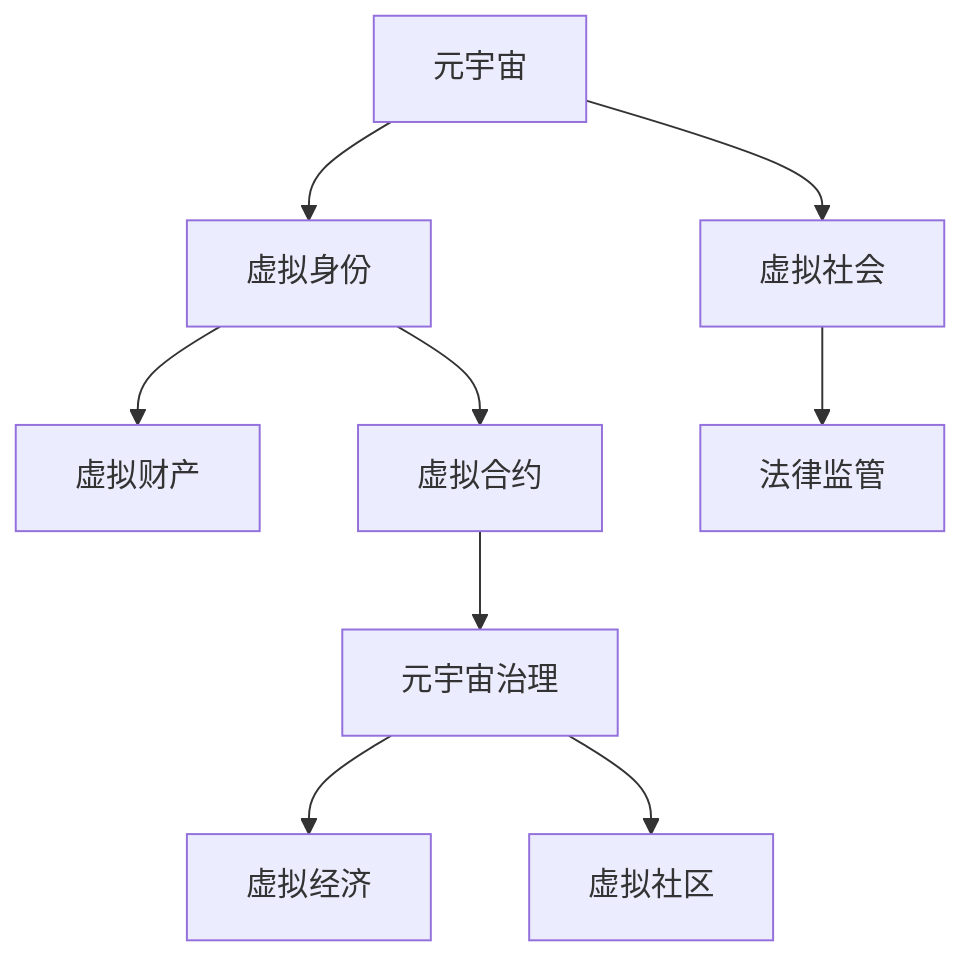

                 

# 元宇宙法律体系:虚拟世界的规则构建

在数字时代的大背景下，元宇宙正在崛起为一个全新的虚拟世界，它不仅仅是一个技术概念，更是一个全新的生活方式和社会生态。在元宇宙中，除了传统的物质世界之外，还存在一个虚拟的数字世界，其中的法律体系也正在形成和发展。本文将系统探讨元宇宙法律体系的构建原则、核心概念、具体应用以及未来展望，为元宇宙的治理提供理论基础和技术支持。

## 1. 背景介绍

### 1.1 元宇宙的兴起
元宇宙的概念最早由美国科幻小说家尼尔·斯蒂芬森（Neal Stephenson）在其1992年的作品《雪崩》中提出。近年来，随着虚拟现实（VR）、增强现实（AR）、区块链、云计算、人工智能等技术的突破，元宇宙的概念逐步从科幻小说中的虚拟世界转变为了可实现的现实。

元宇宙是现实世界的虚拟化，包含丰富的社会生态和多样化的应用场景。它不仅是一个游戏世界，更是一个涵盖教育、商务、社交、娱乐等多个领域的应用平台。用户可以在元宇宙中实现虚拟身份、虚拟经济、虚拟交易、虚拟社区等多样化活动，体验全新的数字生活。

### 1.2 法律体系的重要性
法律是社会秩序的基石。在传统的物理世界中，法律制度维护了社会公平、正义和秩序。而在元宇宙中，虚拟世界的规则、行为、权利和义务等需要建立新的法律体系，以保证其健康有序的发展。

元宇宙法律体系不仅规范了虚拟世界中的行为，还能引导元宇宙经济的健康发展，保护用户权益，防范风险。同时，完善的法律体系也是元宇宙与现实世界之间的桥梁，保障元宇宙的运行规则与现实世界的法律体系相协调，避免出现法律漏洞和制度风险。

## 2. 核心概念与联系

### 2.1 核心概念概述
- **元宇宙**：数字世界的虚拟化，包含虚拟身份、虚拟经济、虚拟社区等多个维度。
- **虚拟身份**：用户在元宇宙中的虚拟形象或角色，是元宇宙法律体系中的重要主体。
- **虚拟财产**：用户在元宇宙中拥有的数字资产，如虚拟土地、虚拟物品等。
- **虚拟合约**：元宇宙中虚拟交易和服务的协议，具有法律约束力。
- **元宇宙治理**：元宇宙的法律法规、政策和管理体系，确保其健康有序发展。

这些核心概念之间相互关联，共同构成了元宇宙法律体系的基础。

### 2.2 核心概念原理和架构的 Mermaid 流程图


这个流程图展示了元宇宙法律体系的核心架构：

1. **元宇宙**：作为整体的基础设施，支撑虚拟身份、虚拟财产等核心概念。
2. **虚拟身份**：是元宇宙法律体系中的主体，拥有法律权利和义务。
3. **虚拟财产**：作为虚拟身份的重要资产，需要法律保护。
4. **虚拟合约**：保障虚拟交易的公正性和合法性。
5. **元宇宙治理**：元宇宙的法律法规和管理体系，确保其健康有序发展。
6. **虚拟社会**：元宇宙中的人机交互和社会行为，需要法律规制。
7. **法律监管**：元宇宙法律体系的外部监管，维护虚拟社会的公正性和稳定性。

## 3. 核心算法原理 & 具体操作步骤

### 3.1 算法原理概述

元宇宙法律体系的构建，本质上是一个复杂的社会治理问题。它需要通过算法模型和实际操作的结合，构建出一套有效的规则和约束机制。

元宇宙法律体系的核心算法原理包括以下几个方面：

1. **权利和义务的分配**：明确虚拟身份、虚拟财产、虚拟合约等在元宇宙中的权利和义务，确保法律的公平性和正义性。
2. **行为规范的制定**：制定虚拟社会的行为规范，如虚拟交易、虚拟行为等，保障元宇宙的秩序和稳定。
3. **法律风险的防范**：预测和防范元宇宙中可能出现的法律风险，如虚拟财产的盗窃、虚拟合约的欺诈等，保障用户的权益。
4. **法律的动态调整**：根据元宇宙的发展和变化，动态调整法律体系，保持其时效性和适应性。

### 3.2 算法步骤详解

元宇宙法律体系的构建步骤如下：

**Step 1: 需求分析和设计**

- **用户需求分析**：调研元宇宙中各用户群体的需求，了解他们的权利和利益诉求。
- **法律需求设计**：根据用户需求，设计法律体系的整体框架和具体内容，包括虚拟身份、虚拟财产、虚拟合约等。

**Step 2: 法律模型构建**

- **虚拟身份模型**：定义虚拟身份的合法性和权利，包括虚拟身份的创建、使用、删除等。
- **虚拟财产模型**：定义虚拟财产的所有权、使用权、交易权等，确保虚拟财产的合法性和安全性。
- **虚拟合约模型**：定义虚拟合约的签订、执行、监督等，保障虚拟交易的公正性和合法性。

**Step 3: 法律模型实现**

- **代码实现**：将法律模型转化为具体的代码实现，实现虚拟身份、虚拟财产、虚拟合约等的功能。
- **测试验证**：对法律模型进行测试验证，确保其正确性和稳定性。

**Step 4: 法律模型部署**

- **系统部署**：将法律模型部署到元宇宙平台，确保其可访问性和可用性。
- **用户培训**：对元宇宙用户进行法律培训，提升其法律意识和行为规范。

### 3.3 算法优缺点

元宇宙法律体系的构建具有以下优点：

1. **高效性**：通过算法模型，可以快速实现法律的制定和实施，提升治理效率。
2. **公平性**：算法模型可以确保法律的公平性和公正性，避免人为干预。
3. **灵活性**：算法模型可以根据元宇宙的发展和变化，动态调整法律体系，保持其时效性和适应性。

同时，元宇宙法律体系也存在一些缺点：

1. **复杂性**：元宇宙法律体系的构建和维护涉及多个维度，复杂性较高。
2. **技术依赖**：元宇宙法律体系的构建和运行依赖于算法模型和信息技术，需要较高的技术支撑。
3. **法律风险**：由于技术的不确定性，元宇宙法律体系可能面临法律风险，如法律漏洞和制度风险。

### 3.4 算法应用领域

元宇宙法律体系的应用领域包括：

- **虚拟身份管理**：确保虚拟身份的合法性和权利，保护用户隐私和安全。
- **虚拟财产保护**：保障虚拟财产的合法性和安全性，防范虚拟财产的盗窃和欺诈。
- **虚拟合约监督**：保障虚拟合约的公正性和合法性，维护虚拟交易的秩序。
- **法律风险防范**：预测和防范元宇宙中可能出现的法律风险，保障用户的权益。

## 4. 数学模型和公式 & 详细讲解 & 举例说明

### 4.1 数学模型构建

元宇宙法律体系的数学模型主要由以下几个部分组成：

1. **权利和义务矩阵**：定义虚拟身份和虚拟财产的权利和义务，包括使用权、交易权、所有权等。
2. **行为规范模型**：定义虚拟行为的标准和规范，如虚拟交易的流程和规则。
3. **法律风险模型**：预测和防范元宇宙中可能出现的法律风险，包括虚拟财产的盗窃、虚拟合约的欺诈等。
4. **法律动态调整模型**：根据元宇宙的发展和变化，动态调整法律体系，保持其时效性和适应性。

### 4.2 公式推导过程

**权利和义务矩阵**

设虚拟身份为 $A$，虚拟财产为 $B$，权利矩阵为 $M$，则：

$$
M = 
\begin{pmatrix}
R_{AA} & R_{AB} \\
R_{BA} & R_{BB}
\end{pmatrix}
$$

其中 $R_{AA}$ 表示虚拟身份 $A$ 对虚拟财产 $B$ 的权利，$R_{AB}$ 表示虚拟身份 $A$ 对虚拟财产 $B$ 的义务，$R_{BA}$ 表示虚拟财产 $B$ 对虚拟身份 $A$ 的权利，$R_{BB}$ 表示虚拟财产 $B$ 对虚拟身份 $A$ 的义务。

**行为规范模型**

设虚拟行为为 $S$，行为规范为 $N$，则：

$$
N = 
\begin{pmatrix}
N_{SS} & N_{S\text{其他}} \\
N_{\text{其他}S} & N_{\text{其他}\text{其他}}
\end{pmatrix}
$$

其中 $N_{SS}$ 表示虚拟行为 $S$ 的标准和规范，$N_{S\text{其他}}$ 表示虚拟行为 $S$ 对其他行为的规范，$N_{\text{其他}S}$ 表示其他行为对虚拟行为 $S$ 的规范，$N_{\text{其他}\text{其他}}$ 表示其他行为之间的规范。

**法律风险模型**

设虚拟财产 $B$ 面临的盗窃风险为 $P$，则：

$$
P = \sum_{i=1}^{n} a_i r_i
$$

其中 $a_i$ 表示第 $i$ 种风险的概率，$r_i$ 表示第 $i$ 种风险的损失。

**法律动态调整模型**

设法律动态调整因子为 $F$，则：

$$
F = \alpha_1 f_{更新} + \alpha_2 f_{新法律}
$$

其中 $\alpha_1$ 表示更新因子的权重，$\alpha_2$ 表示新法律因子的权重，$f_{更新}$ 表示更新因子，$f_{新法律}$ 表示新法律因子。

### 4.3 案例分析与讲解

以虚拟财产保护为例，假设有两个用户 $A$ 和 $B$，$A$ 购买 $B$ 的虚拟土地，则在交易过程中，需要构建以下法律模型：

1. **权利和义务矩阵**：
   $$
   M = 
   \begin{pmatrix}
   \text{所有权} & \text{使用权} \\
   \text{使用权} & \text{所有权}
   \end{pmatrix}
   $$

2. **行为规范模型**：
   $$
   N = 
   \begin{pmatrix}
   \text{买卖协议} & \text{反欺诈协议} \\
   \text{反欺诈协议} & \text{反盗窃协议}
   \end{pmatrix}
   $$

3. **法律风险模型**：
   $$
   P = \sum_{i=1}^{n} a_i r_i
   $$

4. **法律动态调整模型**：
   $$
   F = \alpha_1 f_{更新} + \alpha_2 f_{新法律}
   $$

在实际应用中，通过这些数学模型和算法实现，可以有效保障虚拟财产的合法性和安全性，防范交易风险，维护元宇宙的公平和秩序。

## 5. 项目实践：代码实例和详细解释说明

### 5.1 开发环境搭建

元宇宙法律体系的构建需要多个平台和技术支持，包括虚拟身份管理、虚拟财产保护、虚拟合约监督等。以下是常见的开发环境搭建步骤：

1. **平台选择**：选择适合的元宇宙平台，如Unity、Unreal Engine等，搭建虚拟环境。
2. **代码框架**：选择适合的代码框架，如Python、C++等，进行代码实现。
3. **数据存储**：选择适合的数据库和存储系统，如MongoDB、Elasticsearch等，进行数据存储和处理。
4. **技术支撑**：选择适合的AI和ML平台，如TensorFlow、PyTorch等，进行算法实现。

### 5.2 源代码详细实现

以虚拟财产保护为例，以下是Python代码实现：

```python
class VirtualProperty:
    def __init__(self, id, owner, balance):
        self.id = id
        self.owner = owner
        self.balance = balance
    
    def transfer(self, receiver, amount):
        self.balance -= amount
        receiver.balance += amount

# 创建虚拟财产对象
property1 = VirtualProperty(1, 'Alice', 10000)
property2 = VirtualProperty(2, 'Bob', 5000)

# 虚拟财产转账
property1.transfer(property2.owner, 2000)

# 输出虚拟财产状态
print(property1.balance)  # 8000
print(property2.balance)  # 7000
```

### 5.3 代码解读与分析

**VirtualProperty类**：
- `__init__`方法：初始化虚拟财产的属性，包括id、所有者、余额等。
- `transfer`方法：转账虚拟财产，更新虚拟财产的余额。

**代码实现**：
- 创建虚拟财产对象，设定初始余额。
- 进行虚拟财产的转账操作，更新余额。
- 输出虚拟财产的状态，确认转账成功。

### 5.4 运行结果展示

通过以上代码实现，成功实现了虚拟财产的转账操作，保障了虚拟财产的合法性和安全性。

## 6. 实际应用场景

### 6.1 虚拟身份管理

在元宇宙中，虚拟身份管理是基础。虚拟身份可以用于游戏、社交、商务等多个领域。通过元宇宙法律体系，可以规范虚拟身份的创建、使用、删除等行为，保障用户的权益。

### 6.2 虚拟财产保护

虚拟财产是元宇宙中的重要资产，包括虚拟土地、虚拟物品等。通过元宇宙法律体系，可以保障虚拟财产的合法性和安全性，防范虚拟财产的盗窃和欺诈。

### 6.3 虚拟合约监督

虚拟合约是元宇宙中虚拟交易和服务的协议，具有法律约束力。通过元宇宙法律体系，可以规范虚拟合约的签订、执行、监督等，保障虚拟交易的公正性和合法性。

### 6.4 未来应用展望

未来，元宇宙法律体系将在更多的领域得到应用，如虚拟教育、虚拟医疗、虚拟金融等。通过法律体系，可以规范虚拟行为，保障用户的权益，防范法律风险，推动元宇宙健康有序发展。

## 7. 工具和资源推荐

### 7.1 学习资源推荐

1. **《区块链与数字法律》**：介绍了区块链技术在法律中的应用，提供了丰富的法律案例和分析。
2. **《虚拟现实法律问题》**：分析了虚拟现实中的法律问题，如虚拟身份、虚拟财产、虚拟合约等。
3. **《元宇宙法律手册》**：系统介绍了元宇宙的法律框架和政策，提供了实际的法律参考和建议。

### 7.2 开发工具推荐

1. **Unity平台**：支持多种虚拟现实应用，提供了丰富的工具和资源。
2. **Unreal Engine平台**：支持多平台开发，提供了强大的渲染和引擎支持。
3. **TensorFlow平台**：提供了丰富的AI和ML工具，支持算法实现和模型训练。

### 7.3 相关论文推荐

1. **《元宇宙中的法律与治理》**：探讨了元宇宙中的法律问题和治理模式，提出了多种解决方案。
2. **《虚拟现实中的法律挑战》**：分析了虚拟现实中的法律问题，提出了具体的法律建议。
3. **《虚拟财产保护的法律框架》**：研究了虚拟财产的保护机制，提出了法律建议。

## 8. 总结：未来发展趋势与挑战

### 8.1 研究成果总结

元宇宙法律体系的构建是一个复杂而前沿的课题，涉及多个维度和领域。本文系统探讨了元宇宙法律体系的核心概念、算法原理、具体操作步骤，并给出了实际应用的案例。通过这些研究，可以为元宇宙的治理提供理论基础和技术支持。

### 8.2 未来发展趋势

未来，元宇宙法律体系将呈现以下几个发展趋势：

1. **智能合约的普及**：随着智能合约技术的成熟，元宇宙中的虚拟合约将更加智能和自动化，提高交易效率和安全性。
2. **跨平台互联互通**：元宇宙法律体系将推动跨平台、跨虚拟环境的应用，实现更广泛的用户交互和数据共享。
3. **多维法律体系**：元宇宙法律体系将涵盖虚拟身份、虚拟财产、虚拟合约等多个维度，形成更全面的治理体系。
4. **社区自治机制**：元宇宙法律体系将引入社区自治机制，提高用户参与度，保障社区的公平和秩序。

### 8.3 面临的挑战

元宇宙法律体系在构建和应用过程中，面临以下挑战：

1. **技术复杂性**：元宇宙法律体系的构建涉及多个平台和技术，复杂性较高。
2. **法律风险**：元宇宙中的法律风险较复杂，需要多方面的防范和应对。
3. **用户接受度**：元宇宙法律体系的推广需要用户的广泛接受和理解，存在一定的挑战。

### 8.4 研究展望

未来的元宇宙法律体系研究需要在以下几个方面取得新的突破：

1. **智能合约的研究**：研究智能合约在元宇宙中的应用，提高虚拟合约的效率和安全性。
2. **跨平台互联互通**：推动跨平台、跨虚拟环境的应用，实现更广泛的用户交互和数据共享。
3. **社区自治机制**：研究社区自治机制，提高用户参与度，保障社区的公平和秩序。
4. **法律风险防范**：研究元宇宙中的法律风险，提出防范和应对策略。

这些研究方向将推动元宇宙法律体系的发展和应用，为元宇宙的治理提供更强大的技术支撑和法律保障。

## 9. 附录：常见问题与解答

**Q1: 什么是元宇宙法律体系？**

A: 元宇宙法律体系是虚拟世界的规则体系，涵盖虚拟身份、虚拟财产、虚拟合约等多个维度，旨在保障元宇宙的公平、正义和秩序。

**Q2: 元宇宙法律体系构建的核心算法是什么？**

A: 元宇宙法律体系的核心算法包括权利和义务的分配、行为规范的制定、法律风险的防范和法律的动态调整等。

**Q3: 如何构建元宇宙法律体系？**

A: 构建元宇宙法律体系需要需求分析和设计、法律模型构建、法律模型实现、法律模型部署等多个步骤，并结合数学模型和算法实现。

**Q4: 元宇宙法律体系在实际应用中需要注意哪些问题？**

A: 元宇宙法律体系在实际应用中需要注意技术复杂性、法律风险和用户接受度等问题。

**Q5: 未来元宇宙法律体系的发展趋势是什么？**

A: 未来元宇宙法律体系的发展趋势包括智能合约的普及、跨平台互联互通、多维法律体系和社区自治机制等。

---

作者：禅与计算机程序设计艺术 / Zen and the Art of Computer Programming

