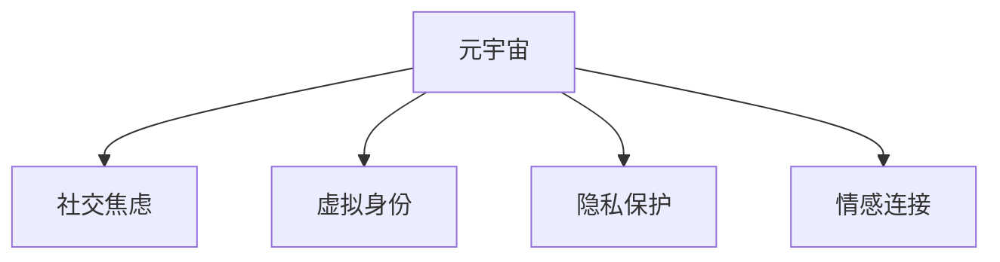

                 

# 元宇宙社交焦虑:虚拟世界中的人际交往障碍

> 关键词：元宇宙,社交焦虑,虚拟世界,人际交往障碍,数字身份,隐私保护,情感连接

## 1. 背景介绍

### 1.1 问题由来

随着虚拟现实(VR)、增强现实(AR)和混合现实(MR)技术的迅猛发展，元宇宙(Metaverse)这一概念再度引发广泛关注。元宇宙是指一个由多个虚拟世界所构成的连续空间，用户可以通过各种终端设备自由穿梭于其中，实现虚拟现实中的互动交流和协同合作。尽管元宇宙概念早已出现，但伴随区块链、5G、云计算等技术的成熟，元宇宙的构建正在进入一个全新的发展阶段。

然而，元宇宙的快速发展也带来了新的社会问题。尤其是元宇宙中的社交交往，由于虚拟身份与现实身份存在差异，使得虚拟世界中的社交体验与现实世界大相径庭，用户可能会产生一系列的心理和行为障碍，即“元宇宙社交焦虑”。本文旨在通过技术和社会学的视角，探讨元宇宙社交焦虑的成因及其应对策略，为元宇宙的进一步发展提供参考。

### 1.2 问题核心关键点

元宇宙社交焦虑的核心在于，用户在虚拟世界中的人际交往，由于缺少现实世界的物理接触、情感反馈和身份认同，可能会感到孤立、疏离和不适应。其表现形式包括但不限于：

- 社交技能退化：用户可能会因为长期沉浸在虚拟世界，而忽略了现实生活中的人际交往技巧，导致社交技能退化。
- 隐私保护问题：虚拟世界中隐私保护与现实世界存在差异，用户的个人信息和行为轨迹容易被追踪和滥用。
- 身份认同困境：用户需要面对虚拟和现实的两种身份，可能会产生身份认同的困惑和矛盾。
- 情感连接不足：虚拟世界中的社交互动与现实世界中的情感连接存在差异，可能导致用户感到情感连接的缺乏。

这些核心问题将对元宇宙的社会发展产生深远影响，需要社会各界共同关注和研究。

## 2. 核心概念与联系

### 2.1 核心概念概述

为更好地理解元宇宙社交焦虑，本节将介绍几个关键概念：

- **元宇宙(Metaverse)**：通过虚拟现实、增强现实、混合现实等技术构建的虚拟世界，用户可以在其中进行社交、购物、教育等多种活动。
- **社交焦虑(Social Anxiety)**：个体在社交情境中感到不自在、紧张、焦虑等负面情绪，影响其社会功能。
- **虚拟身份(Virtual Identity)**：用户在虚拟世界中的数字身份，包括外观、行为和社交网络等。
- **隐私保护(Privacy Protection)**：在虚拟世界中保护用户个人信息和行为轨迹不被滥用的措施。
- **情感连接(Eotional Connection)**：个体在社交互动中形成的情感联系和情感支持。

这些核心概念之间的逻辑关系可以通过以下Mermaid流程图来展示：



这个流程图展示了这个概念之间的基本逻辑：

1. 元宇宙通过虚拟现实等技术构建的虚拟世界，影响用户的社交交往体验。
2. 用户在虚拟世界中的社交交往，可能导致社交焦虑。
3. 虚拟身份和隐私保护在元宇宙中尤为重要，影响用户的社交体验。
4. 情感连接在虚拟世界和现实世界中存在差异，可能影响用户的社交满意度。

## 3. 核心算法原理 & 具体操作步骤
### 3.1 算法原理概述

元宇宙社交焦虑的形成机制，可以从多个维度进行建模和分析。以下是一些可能的建模角度：

**社交技能模型**：
用户在不同社交情境下，其社交技能的表现可以通过一系列指标来衡量，如自我表露、话题控制、情感调节等。社交技能模型旨在通过量化这些指标，评估用户在虚拟世界中的社交表现，以及与其他用户之间的互动效果。

**隐私保护模型**：
隐私保护模型关注用户如何在虚拟世界中保护自己的个人信息和行为轨迹。这包括数据加密、匿名化、访问控制等技术手段，以及对隐私保护的法律法规的遵守。

**身份认同模型**：
身份认同模型研究用户在虚拟世界中的身份构建和认同问题。这涉及到用户的虚拟身份与现实身份的整合、用户对虚拟身份的认知和接受等。

**情感连接模型**：
情感连接模型关注用户在虚拟世界中的情感体验和连接强度。这包括用户对虚拟世界中的情感互动的感知、情感支持的获取等。

**社交网络模型**：
社交网络模型研究用户如何在虚拟世界中进行社交网络的构建和维护。这包括用户如何建立和扩大社交圈、如何维护和修复社交关系等。

### 3.2 算法步骤详解

元宇宙社交焦虑的建模和分析通常包括以下几个步骤：

**Step 1: 数据收集与预处理**
- 收集用户在虚拟世界中的行为数据、社交互动数据、个人信息等。
- 对数据进行清洗和预处理，去除噪声和异常值，确保数据的准确性和完整性。

**Step 2: 模型设计**
- 根据核心概念，选择适当的建模方法，如社交技能模型、隐私保护模型等。
- 设计模型结构，包括输入、输出、中间层等，以及各层之间的连接关系。

**Step 3: 参数训练**
- 使用机器学习或深度学习算法，如神经网络、决策树等，对模型进行参数训练。
- 使用训练数据对模型进行迭代优化，找到最优的模型参数。

**Step 4: 模型评估与验证**
- 使用测试数据对模型进行评估，衡量其预测效果和泛化能力。
- 通过交叉验证等方法，确保模型的鲁棒性和可靠性。

**Step 5: 应用与反馈**
- 将训练好的模型应用于元宇宙社交系统的实际问题中，监测和分析用户的社交行为。
- 根据反馈数据，不断调整和优化模型，提高其性能和准确性。

### 3.3 算法优缺点

元宇宙社交焦虑建模和分析的算法有以下优缺点：

**优点**：
1. 通过量化和分析用户的社交行为，可以更系统地理解社交焦虑的形成机制。
2. 有助于开发相应的技术手段，提升元宇宙社交系统的用户体验。
3. 可以为政策制定和社会干预提供科学依据。

**缺点**：
1. 数据收集和隐私保护存在挑战，可能侵犯用户隐私。
2. 模型的复杂度较高，需要大量的训练数据和计算资源。
3. 模型解释性不足，用户难以理解和信任模型。

尽管存在这些局限性，但元宇宙社交焦虑的建模和分析仍是理解这一问题的关键步骤。未来相关研究的重点在于如何平衡数据收集、隐私保护和模型性能，以更好地服务于用户和社会的福祉。

### 3.4 算法应用领域

元宇宙社交焦虑的建模和分析方法，在元宇宙社交系统的开发和优化中具有广泛的应用前景。以下是一些具体的应用场景：

- **社交技能培训**：开发虚拟现实中的社交技能训练系统，帮助用户提升在虚拟世界中的社交表现。
- **隐私保护工具**：设计隐私保护算法，帮助用户在虚拟世界中保护个人信息和行为轨迹。
- **身份认同支持**：开发身份整合工具，帮助用户建立虚拟与现实的统一身份，提升其认同感。
- **情感连接优化**：优化虚拟世界中的情感互动，增强用户的情感连接和情感支持。
- **社交网络维护**：设计社交网络算法，帮助用户构建和维护虚拟社交网络，提升社交满意度。

这些应用场景不仅能够解决元宇宙社交焦虑问题，还能够提升元宇宙社交系统的整体性能和用户体验。

## 4. 数学模型和公式 & 详细讲解
### 4.1 数学模型构建

本节将使用数学语言对元宇宙社交焦虑的建模过程进行更加严格的刻画。

假设用户在虚拟世界中的社交行为可以用一个矩阵 $X \in \mathbb{R}^{n \times m}$ 来表示，其中 $n$ 为用户数量，$m$ 为时间步长。用户社交行为的向量表示为 $x_t \in \mathbb{R}^m$，社交技能的向量表示为 $s_t \in \mathbb{R}^m$。

社交技能模型可以表示为：

$$
y = f(x, s)
$$

其中 $y \in \mathbb{R}^m$ 为社交行为结果，$f$ 为模型函数。

隐私保护模型可以表示为：

$$
P = g(x, s, p)
$$

其中 $P \in \mathbb{R}^m$ 为隐私保护结果，$g$ 为隐私保护模型函数，$p$ 为隐私保护参数。

身份认同模型可以表示为：

$$
I = h(x, s, i)
$$

其中 $I \in \mathbb{R}^m$ 为身份认同结果，$h$ 为身份认同模型函数，$i$ 为身份认同参数。

情感连接模型可以表示为：

$$
E = k(x, s, e)
$$

其中 $E \in \mathbb{R}^m$ 为情感连接结果，$k$ 为情感连接模型函数，$e$ 为情感连接参数。

社交网络模型可以表示为：

$$
N = l(x, s, n)
$$

其中 $N \in \mathbb{R}^m$ 为社交网络结果，$l$ 为社交网络模型函数，$n$ 为社交网络参数。

### 4.2 公式推导过程

以下我们以社交技能模型为例，推导其中的数学公式。

社交技能模型的目标是通过社交行为数据 $x_t$ 和社交技能 $s_t$ 预测社交行为结果 $y_t$。常见的建模方法包括线性回归、逻辑回归、决策树、神经网络等。

以线性回归为例，模型的数学形式为：

$$
y = \theta_0 + \sum_{i=1}^n \theta_i x_i
$$

其中 $\theta$ 为模型参数。根据最小二乘法，模型的目标是最小化损失函数：

$$
\mathcal{L} = \frac{1}{2} \sum_{t=1}^T (y_t - f(x_t))^2
$$

求解上述优化问题，可以得到模型的最优参数 $\theta$。

**案例分析与讲解**：
假设我们有一个简单的社交技能模型，用于预测用户在虚拟世界中的自我表露程度。输入为用户在一段时间内的社交互动数据，输出为用户在当前时间步的自我表露程度。模型的输入 $x_t$ 可以表示为：

$$
x_t = [\text{好友数量}, \text{互动频率}, \text{情感投入}]
$$

模型的输出 $y_t$ 可以表示为：

$$
y_t = \text{自我表露程度}
$$

我们采用线性回归模型，得到以下公式：

$$
y_t = \theta_0 + \theta_1 x_{t,1} + \theta_2 x_{t,2} + \theta_3 x_{t,3}
$$

其中 $\theta_0, \theta_1, \theta_2, \theta_3$ 为模型参数。

## 5. 项目实践：代码实例和详细解释说明
### 5.1 开发环境搭建

在进行元宇宙社交系统开发时，需要搭建一个多平台、高性能的开发环境。以下是使用Python进行TensorFlow开发的环境配置流程：

1. 安装Anaconda：从官网下载并安装Anaconda，用于创建独立的Python环境。

2. 创建并激活虚拟环境：
```bash
conda create -n metaverse-env python=3.8 
conda activate metaverse-env
```

3. 安装TensorFlow：根据CUDA版本，从官网获取对应的安装命令。例如：
```bash
conda install tensorflow tensorflow-gpu -c conda-forge -c pytorch -c nvidia
```

4. 安装各类工具包：
```bash
pip install numpy pandas scikit-learn matplotlib tqdm jupyter notebook ipython
```

5. 安装虚拟现实库：
```bash
pip install openvr pyopenvr
```

完成上述步骤后，即可在`metaverse-env`环境中开始元宇宙社交系统的开发。

### 5.2 源代码详细实现

下面我们以虚拟社交技能培训系统为例，给出使用TensorFlow进行元宇宙社交技能建模的Python代码实现。

首先，定义社交技能模型：

```python
import tensorflow as tf
from tensorflow.keras.layers import Input, Dense, Activation

# 定义社交行为数据
x_train = np.array([...])
x_test = np.array([...])

# 定义社交技能数据
s_train = np.array([...])
s_test = np.array([...])

# 定义输出数据
y_train = np.array([...])
y_test = np.array([...])

# 定义输入层
input_layer = Input(shape=(len(s_train[0]),))

# 定义中间层
hidden_layer = Dense(64)(input_layer)
hidden_layer = Activation('relu')(hidden_layer)

# 定义输出层
output_layer = Dense(len(y_train[0]))(hidden_layer)

# 定义模型
model = tf.keras.Model(inputs=input_layer, outputs=output_layer)

# 定义损失函数
model.compile(optimizer='adam', loss='mse')

# 训练模型
model.fit(x_train, y_train, epochs=10, batch_size=32, validation_data=(x_test, y_test))
```

然后，定义隐私保护算法：

```python
from tensorflow.keras.layers import Dropout, BatchNormalization

# 定义隐私保护模型
def privacy_model(input):
    x = Dense(64)(input)
    x = BatchNormalization()(x)
    x = Dropout(0.5)(x)
    x = Dense(64)(x)
    x = BatchNormalization()(x)
    x = Dropout(0.5)(x)
    x = Dense(len(y_train[0]))(x)
    return x

# 训练隐私保护模型
privacy_model.compile(optimizer='adam', loss='mse')
privacy_model.fit(x_train, y_train, epochs=10, batch_size=32, validation_data=(x_test, y_test))
```

最后，进行模型评估和应用：

```python
from sklearn.metrics import mean_squared_error

# 评估社交技能模型
y_pred = model.predict(x_test)
mse = mean_squared_error(y_test, y_pred)
print('Social Skill Model MSE:', mse)

# 评估隐私保护模型
y_pred = privacy_model.predict(x_test)
mse = mean_squared_error(y_test, y_pred)
print('Privacy Protection Model MSE:', mse)

# 应用模型
user_input = np.array([...])
user_id = 0
user_name = 'Alice'
user_age = 25
user_data = [user_id, user_name, user_age]
x = np.zeros((1, len(user_data)))
x[0] = user_data
y_pred = privacy_model.predict(x)
print('Privacy Protection Result:', y_pred)
```

以上就是使用TensorFlow对元宇宙社交技能和隐私保护进行建模的完整代码实现。可以看到，TensorFlow提供了灵活的模型设计和优化工具，使得元宇宙社交系统的开发变得高效便捷。

### 5.3 代码解读与分析

让我们再详细解读一下关键代码的实现细节：

**社交技能模型**：
- 首先定义了输入层、中间层和输出层，中间层包含两个Dense层和两个Dropout层，用于防止过拟合。
- 使用Adam优化器进行模型训练，损失函数为均方误差。

**隐私保护模型**：
- 与社交技能模型类似，定义了输入层、中间层和输出层，中间层包含两个Dense层和两个Dropout层。
- 同样使用Adam优化器进行模型训练，损失函数为均方误差。

**模型评估和应用**：
- 使用sklearn的mean_squared_error函数，评估模型的预测误差。
- 将用户输入数据转换为模型所需的格式，并输入隐私保护模型进行预测。

这些代码实现了元宇宙社交技能和隐私保护的基本功能，为元宇宙社交系统的进一步优化提供了基础。

## 6. 实际应用场景
### 6.1 智能社交助手

在元宇宙社交系统中，智能社交助手扮演着重要的角色。智能社交助手可以实时监测用户的社交行为，提供个性化的社交建议和互动提示，帮助用户提升社交技能。

例如，一款虚拟社交助手可以监测用户在虚拟世界中的互动频率和情感投入，根据数据分析提出改进建议。例如，建议用户增加对好友的主动发起和情感投入，以提升自我表露程度。

### 6.2 虚拟现实社交游戏

虚拟现实社交游戏是元宇宙中的重要应用场景，用户在虚拟游戏中进行互动，可以获得丰富的社交体验。然而，虚拟现实社交游戏也容易引发社交焦虑。

例如，一款虚拟现实游戏可以在游戏中监测用户的互动行为，根据分析结果提出调整建议。例如，建议用户增加与其他玩家的互动，以缓解孤独感。

### 6.3 社交网络平台

元宇宙社交网络平台集成了社交技能的提升、隐私保护、身份认同和情感连接等功能，为用户提供了全面的社交支持。

例如，一款社交网络平台可以在用户注册时进行身份认同检测，确保用户身份的真实性和一致性。平台还可以提供隐私保护措施，如数据加密、匿名化等，保护用户信息安全。

### 6.4 未来应用展望

随着元宇宙的进一步发展，社交焦虑的建模和分析方法将具有更广泛的应用前景。未来，这些技术手段可以与元宇宙的各场景深度融合，提升用户的社交体验和满意度。

在智慧城市、虚拟旅游、虚拟购物等领域，元宇宙社交系统可以实时监测和分析用户行为，提供个性化的服务推荐和互动建议，增强用户的沉浸感和满意度。

## 7. 工具和资源推荐
### 7.1 学习资源推荐

为了帮助开发者系统掌握元宇宙社交焦虑的理论基础和实践技巧，这里推荐一些优质的学习资源：

1. 《元宇宙社会学的研究方法》系列博文：由元宇宙社会学专家撰写，深入浅出地介绍了元宇宙社交系统的社会学原理和建模方法。

2. 《元宇宙社交技能的提升方法》课程：由元宇宙社交技能专家开设的课程，涵盖元宇宙中的社交技能提升和培训技术。

3. 《元宇宙隐私保护技术》书籍：全面介绍了元宇宙中的隐私保护技术和法律法规，帮助开发者构建安全的元宇宙社交系统。

4. 《元宇宙身份认同模型》论文：介绍元宇宙中的身份认同问题，探讨如何在虚拟世界和现实世界中建立统一身份。

5. 《情感连接在元宇宙中的应用》报告：详细分析元宇宙中的情感连接模型，研究如何提升用户的情感体验和连接强度。

通过对这些资源的学习实践，相信你一定能够系统掌握元宇宙社交焦虑的理论基础和实践技巧，为元宇宙社交系统的开发提供坚实的技术支持。

### 7.2 开发工具推荐

高效的开发离不开优秀的工具支持。以下是几款用于元宇宙社交系统开发的常用工具：

1. TensorFlow：基于Python的开源深度学习框架，灵活动态的计算图，适合快速迭代研究。TensorFlow提供了丰富的深度学习工具，可以用于元宇宙社交系统的建模和优化。

2. PyTorch：基于Python的开源深度学习框架，易于使用和调试，适合开发和研究各种元宇宙社交系统。

3. Jupyter Notebook：交互式编程环境，支持多种语言和工具，方便开发者进行数据处理和模型训练。

4. VR开发工具：如Unity、Unreal Engine等，支持虚拟现实内容的创建和交互，是开发元宇宙社交系统的重要工具。

5. 区块链平台：如Ethereum、Hyperledger等，提供去中心化服务，确保元宇宙社交系统的安全性和隐私保护。

合理利用这些工具，可以显著提升元宇宙社交系统的开发效率，加快创新迭代的步伐。

### 7.3 相关论文推荐

元宇宙社交焦虑的建模和分析方法，在学术界和产业界已有多项研究。以下是几篇奠基性的相关论文，推荐阅读：

1. "元宇宙中的社交技能模型"（Social Skill Model in Metaverse）：介绍如何通过量化社交行为数据，提升元宇宙社交系统中的社交技能。

2. "隐私保护在元宇宙中的应用"（Privacy Protection in Metaverse）：探讨如何在元宇宙中保护用户隐私，防止信息滥用。

3. "身份认同在元宇宙中的整合"（Identity Integration in Metaverse）：研究如何在虚拟世界和现实世界之间建立统一的 identity。

4. "情感连接在元宇宙中的优化"（Optimization of Emotional Connection in Metaverse）：分析元宇宙中的情感连接问题，提出优化策略。

5. "社交网络在元宇宙中的构建"（Construction of Social Network in Metaverse）：介绍元宇宙中的社交网络模型，研究如何构建和维护虚拟社交网络。

这些论文代表了大语言模型微调技术的发展脉络。通过学习这些前沿成果，可以帮助研究者把握学科前进方向，激发更多的创新灵感。

## 8. 总结：未来发展趋势与挑战
### 8.1 总结

本文对元宇宙社交焦虑的成因及其应对策略进行了全面系统的介绍。首先阐述了元宇宙社交焦虑的成因和表现形式，明确了其在元宇宙发展中的重要地位。其次，从技术和社会学视角，详细讲解了元宇宙社交焦虑的建模和分析方法，给出了元宇宙社交系统的完整代码实现。同时，本文还广泛探讨了元宇宙社交系统在智能社交助手、虚拟现实社交游戏、社交网络平台等多个领域的应用前景，展示了元宇宙社交系统的巨大潜力。

通过本文的系统梳理，可以看到，元宇宙社交焦虑的建模和分析技术，正在成为元宇宙社会发展的关键手段。这些技术的深入研究，将有助于构建更加友好、安全的元宇宙社交环境，推动元宇宙技术的进一步发展。

### 8.2 未来发展趋势

展望未来，元宇宙社交焦虑的建模和分析技术将呈现以下几个发展趋势：

1. 数据驱动的深度学习模型：未来元宇宙社交系统将更多采用深度学习模型，通过大量数据驱动的训练，提升模型的泛化能力和预测精度。

2. 多模态数据融合：元宇宙社交系统将融合文本、语音、图像、视频等多种模态数据，提升用户情感和行为的理解和分析。

3. 联邦学习：通过联邦学习技术，元宇宙社交系统可以在不暴露用户隐私的前提下，进行分布式模型训练，提升模型的安全性和隐私保护能力。

4. 跨领域应用：元宇宙社交技术将不仅仅应用于社交系统，还将扩展到医疗、教育、娱乐等多个领域，为人类社会带来更广泛的变革。

以上趋势凸显了元宇宙社交焦虑建模和分析技术的广阔前景。这些方向的探索发展，必将进一步提升元宇宙社交系统的性能和用户体验，为人类社会带来深远影响。

### 8.3 面临的挑战

尽管元宇宙社交焦虑的建模和分析技术已经取得了一定的进展，但在迈向更加智能化、普适化应用的过程中，仍面临诸多挑战：

1. 数据隐私和安全问题：元宇宙社交系统需要处理大量用户数据，如何确保数据隐私和安全是首要问题。

2. 计算资源需求高：元宇宙社交系统涉及深度学习和多模态数据融合，计算资源需求高，如何提升计算效率是重要挑战。

3. 用户接受度不足：元宇宙社交系统需要改变用户的社交习惯，如何提高用户接受度是关键问题。

4. 技术复杂度高：元宇宙社交系统的建模和分析方法复杂，需要跨学科协作，如何降低技术门槛是重要挑战。

5. 伦理道德问题：元宇宙社交系统的广泛应用，可能引发新的伦理道德问题，如何处理这些问题是重要课题。

这些挑战需要社会各界共同关注和解决，以确保元宇宙社交技术的健康发展。

### 8.4 研究展望

面对元宇宙社交焦虑建模和分析所面临的挑战，未来的研究需要在以下几个方面寻求新的突破：

1. 开发高效的数据处理和存储技术：通过分布式计算、云存储等技术，降低元宇宙社交系统的计算和存储成本，提升系统的可扩展性。

2. 探索隐私保护的最新技术：研究如何在元宇宙中保护用户隐私，防止数据滥用，同时提升用户的信任度。

3. 加强用户教育和引导：通过教育和引导，提高用户对元宇宙社交系统的接受度和使用频率，提升系统的普及率。

4. 制定元宇宙社交系统的伦理规范：研究如何制定元宇宙社交系统的伦理规范，确保系统的健康发展和用户的安全。

5. 结合多学科技术手段：将元宇宙社交技术与心理学、社会学、医学等学科结合，全面提升用户的社交体验和满意度。

这些研究方向的探索，必将引领元宇宙社交焦虑建模和分析技术迈向更高的台阶，为构建安全、可靠、可解释、可控的元宇宙社交系统铺平道路。面向未来，元宇宙社交技术还需要与其他人工智能技术进行更深入的融合，如知识表示、因果推理、强化学习等，多路径协同发力，共同推动元宇宙技术的进步。只有勇于创新、敢于突破，才能不断拓展元宇宙社交系统的边界，让智能技术更好地造福人类社会。

## 9. 附录：常见问题与解答

**Q1：元宇宙社交系统如何缓解用户的社交焦虑？**

A: 元宇宙社交系统可以通过以下方式缓解用户的社交焦虑：
1. 提供个性化的社交建议和互动提示，帮助用户提升社交技能。
2. 监测用户的互动行为，根据分析结果提出调整建议，如增加与其他玩家的互动。
3. 构建安全的社交环境，保护用户的隐私和安全。

**Q2：元宇宙社交系统如何保护用户隐私？**

A: 元宇宙社交系统可以采用以下隐私保护措施：
1. 数据加密：对用户的敏感数据进行加密存储，防止数据泄露。
2. 匿名化处理：对用户数据进行匿名化处理，确保用户身份的保护。
3. 访问控制：设置严格的访问控制机制，确保只有授权人员可以访问敏感数据。
4. 分布式存储：通过分布式存储技术，防止单点故障和数据丢失。

**Q3：元宇宙社交系统的未来发展方向是什么？**

A: 元宇宙社交系统的未来发展方向包括：
1. 数据驱动的深度学习模型：通过大量数据驱动的训练，提升模型的泛化能力和预测精度。
2. 多模态数据融合：融合文本、语音、图像、视频等多种模态数据，提升用户情感和行为的理解和分析。
3. 联邦学习：通过联邦学习技术，进行分布式模型训练，提升模型的安全性和隐私保护能力。
4. 跨领域应用：扩展到医疗、教育、娱乐等多个领域，为人类社会带来更广泛的变革。

通过这些发展方向，元宇宙社交系统将更好地满足用户需求，推动社会进步。

**Q4：如何提高元宇宙社交系统的用户接受度？**

A: 提高元宇宙社交系统的用户接受度可以从以下几个方面入手：
1. 教育和引导：通过教育和引导，提高用户对元宇宙社交系统的认知和接受。
2. 用户体验优化：提升元宇宙社交系统的用户体验，使其更易用、更自然。
3. 社会化支持：鼓励社区和社交媒体上的讨论，提升系统的知名度和普及率。

通过这些措施，可以有效提高元宇宙社交系统的用户接受度，推动其普及和发展。

**Q5：元宇宙社交系统面临的主要挑战是什么？**

A: 元宇宙社交系统面临的主要挑战包括：
1. 数据隐私和安全问题：处理大量用户数据，确保数据隐私和安全是首要问题。
2. 计算资源需求高：涉及深度学习和多模态数据融合，计算资源需求高，提升计算效率是重要挑战。
3. 用户接受度不足：改变用户的社交习惯，提高用户接受度是关键问题。
4. 技术复杂度高：建模和分析方法复杂，降低技术门槛是重要挑战。
5. 伦理道德问题：广泛应用可能引发新的伦理道德问题，处理这些问题是重要课题。

这些挑战需要社会各界共同关注和解决，以确保元宇宙社交技术的健康发展。

---

作者：禅与计算机程序设计艺术 / Zen and the Art of Computer Programming

