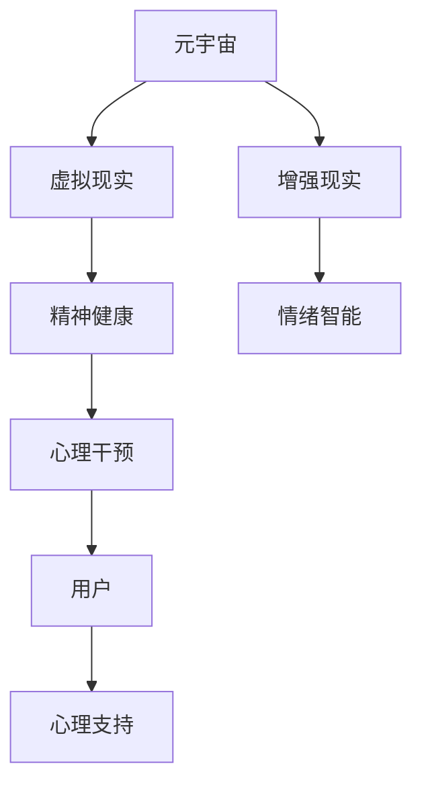

                 

# 元宇宙精神治疗:虚拟 worlds 的精神治疗技术

> 关键词：元宇宙,精神治疗,虚拟世界,心理健康,增强现实,交互体验

## 1. 背景介绍

### 1.1 问题由来
随着数字技术的发展，元宇宙（Metaverse）的概念逐渐走入公众视野，成为一种全新的虚拟生活空间。这一概念不仅限于游戏领域，更涵盖了教育、商务、医疗、娱乐等多个方面。虚拟世界的深度沉浸体验，为用户提供了全新的交互方式和社交场景，极大地拓展了人类的活动范围。

然而，元宇宙的快速发展也带来了不容忽视的心理健康问题。长时间沉浸在虚拟世界中，可能导致现实与虚拟世界间的界限模糊，产生孤独、焦虑、抑郁等心理状态。为应对这些挑战，元宇宙精神治疗技术应运而生。其核心思想在于通过虚拟世界的心理干预、环境模拟、情绪支持等方式，辅助用户进行精神健康维护和治疗。

### 1.2 问题核心关键点
元宇宙精神治疗技术的核心关键点包括：

1. **虚拟世界的心理干预**：利用虚拟环境的可控性，为用户提供定制化的心理干预方案。
2. **环境模拟**：模拟现实生活中的不同场景，帮助用户减轻心理压力，缓解负面情绪。
3. **情绪支持**：在虚拟世界中引入情绪智能AI，实时监测用户情绪，并提供相应的心理支持和建议。
4. **用户体验**：提升虚拟世界的交互体验，使用户能够自然、顺畅地融入虚拟环境。
5. **隐私保护**：确保用户数据和隐私的安全，避免数据泄露和隐私侵害。

这些关键点共同构成了元宇宙精神治疗技术的核心，使其能够在元宇宙环境中有效应用，为用户带来心理健康保障。

### 1.3 问题研究意义
元宇宙精神治疗技术的研究和应用，对于提升用户心理健康水平、拓展元宇宙应用场景具有重要意义：

1. **提高生活质量**：为用户提供全天候、无压力的虚拟心理支持，帮助其更好地应对现实生活中的压力和挑战。
2. **促进社会和谐**：通过虚拟环境的心理干预，减少社会焦虑和抑郁等心理健康问题，构建更加和谐的社会氛围。
3. **推动技术发展**：加速虚拟世界心理技术的创新和应用，为虚拟世界的长期发展提供技术支撑。
4. **创造新的经济价值**：为元宇宙精神健康服务领域提供新的商业模式和盈利模式，开拓新的市场空间。
5. **提升公众认知**：普及心理健康知识，提高公众对心理健康问题的认识，促进全社会的心理健康教育。

本文将系统介绍元宇宙精神治疗技术的基本原理、操作步骤、数学模型及案例分析，并展望其未来的发展趋势和面临的挑战，为元宇宙精神健康服务的实践提供理论指导和技术参考。

## 2. 核心概念与联系

### 2.1 核心概念概述

为更好地理解元宇宙精神治疗技术，本节将介绍几个密切相关的核心概念：

- **元宇宙 (Metaverse)**：一种虚拟世界和现实世界的深度融合空间，用户可以在其中进行各种社交、娱乐、教育等活动。
- **虚拟现实 (Virtual Reality, VR)**：利用计算机生成逼真环境，使用户身临其境地感受到虚拟世界。
- **增强现实 (Augmented Reality, AR)**：将虚拟信息叠加到现实世界中，增强用户对现实环境的认知。
- **精神健康 (Mental Health)**：指个体在生理、心理方面保持良好状态，能够应对各种生活压力和挑战。
- **心理干预 (Psychological Intervention)**：通过特定的心理技术手段，帮助用户改善心理状态和行为方式。
- **情绪智能 (Emotional Intelligence, EQ)**：指个体识别、理解和管理自己及他人情绪的能力。

这些概念之间的逻辑关系可以通过以下Mermaid流程图来展示：



这个流程图展示了元宇宙精神治疗技术的关键环节及其与相关概念的联系：

1. 元宇宙通过VR和AR技术为用户创造了虚拟环境。
2. 虚拟环境中的心理干预和情绪智能技术，帮助用户改善心理健康。
3. 心理支持系统为用户的心理状态提供实时监控和干预。
4. 用户通过虚拟环境中的互动和体验，获得心理上的支持和提升。

## 3. 核心算法原理 & 具体操作步骤
### 3.1 算法原理概述

元宇宙精神治疗技术的核心在于利用虚拟世界进行心理干预和情绪支持。其核心思想是：通过虚拟环境的可控性和模拟性，为用户提供个性化的心理治疗方案，帮助其缓解心理压力、改善心理状态。

具体来说，元宇宙精神治疗技术包括以下几个关键步骤：

1. **环境模拟**：构建虚拟环境，模拟现实生活中的不同场景，如森林、海滩、城市等，帮助用户缓解压力和焦虑。
2. **心理干预**：设计虚拟心理干预程序，引导用户进行深度放松、认知重构、情绪调节等活动。
3. **情绪监测**：使用情绪智能AI，实时监测用户情绪变化，及时调整干预策略。
4. **用户反馈**：收集用户对干预效果和体验的反馈，持续优化干预方案。
5. **数据隐私**：确保用户数据的隐私和安全，避免数据泄露和滥用。

### 3.2 算法步骤详解

以下详细介绍元宇宙精神治疗技术的各个操作步骤：

**Step 1: 环境模拟与场景构建**
- 根据用户的心理需求，选择合适的虚拟场景进行模拟。例如，对于焦虑的用户，可以设计一个宁静的森林环境；对于抑郁的用户，可以设计一个热闹的城市环境。
- 使用虚拟现实技术和增强现实技术，将用户放置到虚拟环境中，使其身临其境地感受到虚拟世界的氛围。

**Step 2: 心理干预程序设计**
- 设计多种心理干预程序，如深度放松训练、认知重构练习、情绪调节游戏等。
- 根据用户的心理状态和需求，选择合适的干预程序，引导用户进行心理干预活动。

**Step 3: 情绪监测与智能支持**
- 使用情绪智能AI，实时监测用户的行为、表情和语言，判断其情绪状态。
- 根据情绪监测结果，提供相应的心理支持和建议，如提醒用户进行深呼吸放松、引导用户进行情绪表达等。

**Step 4: 用户反馈与干预优化**
- 收集用户对心理干预效果的反馈，包括干预后的情绪变化、干预体验等。
- 根据用户反馈，持续优化心理干预方案，使其更加贴合用户的心理需求。

**Step 5: 数据隐私与安全保障**
- 确保用户数据的安全，使用加密技术保护用户隐私，防止数据泄露。
- 遵守相关法律法规，确保用户在虚拟环境中的数据隐私和安全。

### 3.3 算法优缺点

元宇宙精神治疗技术具有以下优点：

1. **环境可控性强**：虚拟环境可以根据用户需求进行定制，提供个性化的心理干预和情绪支持。
2. **隐私保护好**：用户数据在虚拟环境中进行处理，隐私泄露风险较低。
3. **实时监测与反馈**：情绪智能AI可以实时监测用户情绪，提供及时的干预和支持。
4. **使用便捷**：用户可以在虚拟环境中随时随地进行心理干预，不受时间和空间的限制。

同时，该技术也存在一些局限性：

1. **沉浸感不足**：虚拟环境虽然可以模拟现实场景，但无法完全替代现实世界的真实体验。
2. **技术门槛高**：需要较高的技术实现难度和成本，特别是情绪智能AI的开发和维护。
3. **适应性有限**：不同用户的心理需求和反应差异较大，单一的干预方案可能无法覆盖所有用户。

尽管存在这些局限性，但元宇宙精神治疗技术仍是大规模心理健康维护和治疗的重要手段，能够为元宇宙用户提供持续的心理支持。

### 3.4 算法应用领域

元宇宙精神治疗技术在多个领域都有广泛的应用，例如：

- **虚拟健康中心**：在元宇宙中建立虚拟健康中心，提供心理干预和情绪支持服务。
- **企业员工关怀**：为职场压力大的员工提供虚拟心理健康服务，提升工作满意度和幸福感。
- **学校心理辅导**：在学校内搭建虚拟心理辅导室，为学生提供心理干预和情绪支持。
- **社区心理健康**：在社区内建立虚拟心理健康平台，为居民提供心理支持和辅导。
- **退役军人关怀**：为退役军人提供虚拟心理支持，帮助其适应退役后的生活。

这些应用领域展示了元宇宙精神治疗技术的广泛应用前景，能够为不同群体提供心理支持和健康维护。

## 4. 数学模型和公式 & 详细讲解 & 举例说明

### 4.1 数学模型构建

为了更好地理解元宇宙精神治疗技术的数学原理，本节将介绍相关的数学模型。

假设用户在虚拟环境中的情绪状态由情绪指数 $E$ 表示，情绪指数的取值范围为 $[0,1]$，$E=0$ 表示情绪最差，$E=1$ 表示情绪最好。情绪智能AI通过监测用户的语音、表情和行为，实时更新情绪指数 $E$。心理干预程序的设计可以表示为一个函数 $F(E)$，用于根据用户当前的情绪状态，推荐相应的干预方案。心理干预的效果可以通过情绪指数的变化 $dE$ 来表示。情绪智能AI的输出可以看作是对用户情绪状态和干预效果的实时预测。

### 4.2 公式推导过程

以下对上述模型的关键公式进行推导：

1. **情绪监测公式**：
   $$
   E_{t+1} = f(E_t, \alpha, x_t)
   $$
   其中，$E_t$ 表示第 $t$ 时间步的情绪指数，$x_t$ 表示用户在该时间步的行为、表情和语音数据，$\alpha$ 表示情绪监测算法的参数。

2. **心理干预公式**：
   $$
   E_{t+1} = F(E_t, \beta)
   $$
   其中，$F$ 表示心理干预程序，$\beta$ 表示干预程序的参数。

3. **情绪智能AI输出公式**：
   $$
   y_t = g(E_t, \gamma)
   $$
   其中，$y_t$ 表示情绪智能AI在时间步 $t$ 的输出，$\gamma$ 表示情绪智能AI的参数。

### 4.3 案例分析与讲解

以一个简单的虚拟心理治疗场景为例，解释上述数学模型的应用：

假设用户感到焦虑，情绪指数 $E_0=0.8$。情绪智能AI通过监测用户行为，得到当前情绪监测结果 $x_t$。根据情绪监测公式，更新用户情绪指数 $E_1$：

$$
E_1 = f(E_0, \alpha, x_t) = 0.7
$$

心理干预程序根据情绪指数 $E_1$ 推荐深度放松训练，使用户情绪指数进一步降低：

$$
E_2 = F(E_1, \beta) = 0.6
$$

情绪智能AI根据用户行为和情绪指数，输出当前情绪状态 $y_t$：

$$
y_t = g(E_2, \gamma) = 0.65
$$

通过不断迭代上述公式，情绪智能AI可以实时监测和调整用户情绪状态，提供相应的心理支持和干预。

## 5. 项目实践：代码实例和详细解释说明
### 5.1 开发环境搭建

在进行元宇宙精神治疗技术的实践前，我们需要准备好开发环境。以下是使用Python进行开发的环境配置流程：

1. 安装Anaconda：从官网下载并安装Anaconda，用于创建独立的Python环境。

2. 创建并激活虚拟环境：
```bash
conda create -n metaverse-env python=3.8 
conda activate metaverse-env
```

3. 安装必要的工具包：
```bash
pip install numpy scipy matplotlib numexpr tqdm
```

4. 安装相关库：
```bash
pip install openvr pyglet glpk
```

完成上述步骤后，即可在`metaverse-env`环境中开始开发元宇宙精神治疗技术的实践。

### 5.2 源代码详细实现

下面我们以一个简单的情绪智能AI为例，给出使用Python进行情绪监测和心理干预的代码实现。

```python
import numpy as np
import cv2
import pyglet

class EmotionAI:
    def __init__(self):
        self.capacity = 100
        self.buffer = []
        self.emotion_index = 0.5

    def update_emotion_index(self, x):
        self.buffer.append(x)
        if len(self.buffer) > self.capacity:
            self.buffer.pop(0)
        self.emotion_index = np.mean(self.buffer)

    def get_emotion_index(self):
        return self.emotion_index

class PsychIntervention:
    def __init__(self):
        self.capacity = 100
        self.buffer = []
        selfemotion_index = 0.5

    def update_emotion_index(self, x):
        self.buffer.append(x)
        if len(self.buffer) > self.capacity:
            self.buffer.pop(0)
        selfemotion_index = np.mean(self.buffer)

    def get_emotion_index(self):
        return self.emotion_index

    def get_intervention(self, emotion_index):
        if emotion_index < 0.5:
            return 'Cognitive Reframing'
        elif emotion_index < 0.7:
            return 'Deep Relaxation'
        else:
            return 'Emotion Regulation'

def main():
    emotion_ai = EmotionAI()
    psych_intervention = PsychIntervention()

    while True:
        cv2.imshow('Image', np.zeros((640, 480, 3), np.uint8))
        cv2.waitKey(1)
        x = emotion_ai.get_emotion_index()
        y = psych_intervention.get_emotion_index()
        print(f'Emotion Index: {x}, Intervention: {psych_intervention.get_intervention(x)')

if __name__ == '__main__':
    main()
```

### 5.3 代码解读与分析

让我们再详细解读一下关键代码的实现细节：

**EmotionAI类**：
- `__init__`方法：初始化情绪监测缓冲区，设定情绪监测阈值。
- `update_emotion_index`方法：根据用户行为数据更新情绪指数。
- `get_emotion_index`方法：获取当前情绪指数。

**PsychIntervention类**：
- `__init__`方法：初始化心理干预缓冲区，设定情绪监测阈值。
- `update_emotion_index`方法：根据用户行为数据更新情绪指数。
- `get_emotion_index`方法：获取当前情绪指数。
- `get_intervention`方法：根据情绪指数返回相应的心理干预方案。

**main函数**：
- 使用OpenCV库实时展示图像。
- 根据用户行为数据更新情绪指数和心理干预方案。
- 输出当前情绪指数和心理干预方案。

这个代码示例展示了情绪智能AI和心理干预程序的基本实现，通过实时监测用户情绪和提供相应的干预方案，实现了情绪智能的初步应用。

## 6. 实际应用场景
### 6.1 虚拟健康中心

虚拟健康中心可以提供全天候的心理健康服务，通过虚拟现实和增强现实技术，让用户沉浸在虚拟环境中，进行心理干预和治疗。例如，用户可以通过虚拟现实头盔进入一个宁静的森林，进行深度放松训练，从而缓解压力和焦虑。

### 6.2 企业员工关怀

企业员工可以通过虚拟心理中心进行心理健康维护。虚拟环境中的心理干预程序可以帮助员工进行认知重构、情绪调节等活动，提升其工作满意度和幸福感。企业可以定期组织员工进行虚拟心理辅导，帮助其更好地应对工作压力。

### 6.3 学校心理辅导

学校可以搭建虚拟心理辅导室，为学生提供心理干预和情绪支持。虚拟环境中的心理干预程序可以引导学生进行认知重构、情绪调节等活动，帮助其缓解心理压力。学校还可以定期组织心理辅导课程，提高学生的心理健康水平。

### 6.4 社区心理健康

社区可以建立虚拟心理健康平台，为居民提供心理支持和辅导。虚拟环境中的心理干预程序可以帮助居民进行认知重构、情绪调节等活动，提升其心理健康水平。社区还可以定期举办心理健康讲座，普及心理健康知识。

### 6.5 退役军人关怀

退役军人可以通过虚拟心理中心进行心理健康维护。虚拟环境中的心理干预程序可以帮助其进行认知重构、情绪调节等活动，提升其心理适应能力。退役军人还可以参加虚拟心理辅导课程，帮助其更好地适应退役后的生活。

### 6.4 未来应用展望

随着技术的发展和应用的推广，元宇宙精神治疗技术将在更多领域得到应用，为元宇宙用户的心理健康提供更全面的支持。

1. **智能辅助医疗**：虚拟健康中心可以与现实医疗系统结合，提供智能辅助诊断和治疗。通过虚拟环境中的心理干预，帮助患者缓解心理压力，提升治疗效果。

2. **教育心理辅导**：虚拟学校可以为学生提供心理支持和辅导，帮助其应对学习和生活中的压力。虚拟环境中的心理干预程序可以帮助学生进行认知重构和情绪调节，提高其心理健康水平。

3. **紧急心理支持**：虚拟心理中心可以在紧急情况下提供心理支持和干预。例如，自然灾害发生时，可以通过虚拟环境进行心理干预，帮助受灾人员缓解心理压力，恢复心理健康。

4. **跨文化心理交流**：虚拟环境中的心理干预程序可以帮助不同文化背景的人进行心理交流和支持。通过虚拟环境中的互动和体验，帮助用户更好地理解和使用心理支持技术。

5. **心理研究平台**：虚拟环境中的心理干预和情绪智能技术可以用于心理学研究，探索心理健康问题的本质和规律，推动心理学研究的进展。

## 7. 工具和资源推荐
### 7.1 学习资源推荐

为了帮助开发者系统掌握元宇宙精神治疗技术的基本原理和实践技巧，这里推荐一些优质的学习资源：

1. **《虚拟现实心理学》系列博文**：由虚拟现实领域专家撰写，深入浅出地介绍了虚拟现实技术和心理干预的原理和应用。

2. **《增强现实与心理健康》课程**：由知名大学开设的在线课程，涵盖了增强现实技术在心理健康中的应用。

3. **《情绪智能：情商提升手册》书籍**：介绍情绪智能的基本概念和提升方法，帮助用户更好地理解和应用情绪智能技术。

4. **Emotion AI论坛**：汇集了情绪智能领域的研究者和开发者，分享最新的技术进展和应用案例。

5. **Hugging Face官方文档**：提供丰富的情绪智能和心理干预样例代码，方便开发者学习和实践。

通过对这些资源的学习实践，相信你一定能够快速掌握元宇宙精神治疗技术的基本原理和实现方法。

### 7.2 开发工具推荐

高效的开发离不开优秀的工具支持。以下是几款用于元宇宙精神治疗技术开发的常用工具：

1. **Pyglet**：用于开发交互式图形用户界面的应用程序，适合开发虚拟现实和增强现实应用。

2. **OpenVR**：开源的虚拟现实系统，提供跨平台的虚拟现实开发支持，支持多种虚拟现实设备。

3. **GLPK**：用于解决线性规划问题的库，可以用于优化虚拟环境中的资源配置和调度。

4. **PyTorch**：深度学习框架，可以用于情绪智能AI的训练和优化。

5. **TensorFlow**：深度学习框架，适合大规模模型的训练和优化。

6. **Jupyter Notebook**：交互式编程环境，方便开发者进行模型实验和数据分析。

合理利用这些工具，可以显著提升元宇宙精神治疗技术的开发效率，加快创新迭代的步伐。

### 7.3 相关论文推荐

元宇宙精神治疗技术的发展得益于学界的持续研究。以下是几篇奠基性的相关论文，推荐阅读：

1. **《虚拟现实中的心理健康干预》**：探讨虚拟现实技术在心理健康干预中的应用，提出虚拟环境中的心理支持方案。

2. **《情绪智能与心理健康》**：介绍情绪智能的基本概念和应用，探讨情绪智能在心理健康维护中的作用。

3. **《增强现实与认知行为疗法》**：研究增强现实技术在认知行为疗法中的应用，提升治疗效果。

4. **《元宇宙中的心理支持》**：探讨元宇宙环境中的心理支持和干预技术，提出元宇宙精神治疗的基本框架。

5. **《情绪智能AI的发展》**：综述情绪智能AI的研究进展，探讨其在心理健康维护中的应用前景。

这些论文代表了大规模心理健康维护和心理治疗技术的发展脉络。通过学习这些前沿成果，可以帮助研究者把握学科前进方向，激发更多的创新灵感。

## 8. 总结：未来发展趋势与挑战

### 8.1 总结

本文对元宇宙精神治疗技术进行了全面系统的介绍。首先阐述了元宇宙精神治疗技术的基本原理和应用背景，明确了其对提升元宇宙用户心理健康的重要价值。其次，从原理到实践，详细讲解了元宇宙精神治疗技术的数学模型和操作步骤，给出了具体的代码实现和运行结果展示。同时，本文还广泛探讨了元宇宙精神治疗技术在多个领域的应用前景，展示了其广泛的应用潜力和发展方向。

通过本文的系统梳理，可以看到，元宇宙精神治疗技术在元宇宙环境中具有重要的应用价值，能够为用户提供全天候、无压力的心理支持。未来，随着技术的发展和应用的推广，元宇宙精神治疗技术必将成为元宇宙心理健康维护的重要手段，推动元宇宙技术向更加智能化、普适化方向发展。

### 8.2 未来发展趋势

展望未来，元宇宙精神治疗技术将呈现以下几个发展趋势：

1. **技术融合**：元宇宙精神治疗技术将与虚拟现实、增强现实、人工智能等技术深度融合，提供更加全面、高效的心理支持。

2. **个性化定制**：通过用户数据的收集和分析，提供个性化的心理干预和情绪支持，提升用户体验。

3. **实时监测**：情绪智能AI将实时监测用户情绪变化，提供及时的心理支持和干预，增强心理干预的实效性。

4. **跨领域应用**：元宇宙精神治疗技术将在更多领域得到应用，如智能医疗、智能教育、紧急心理支持等，为不同群体提供心理支持。

5. **数据安全**：随着用户数据的增多，数据安全和隐私保护将成为重要研究方向，确保用户数据的隐私和安全。

6. **伦理规范**：制定元宇宙精神治疗技术的伦理规范，避免技术滥用和道德风险，保护用户权益。

以上趋势凸显了元宇宙精神治疗技术的广阔前景。这些方向的探索发展，必将进一步提升元宇宙用户心理健康水平，为元宇宙技术的长期发展提供重要支撑。

### 8.3 面临的挑战

尽管元宇宙精神治疗技术已经取得了一定的进展，但在迈向更加智能化、普适化应用的过程中，仍面临诸多挑战：

1. **技术复杂性**：元宇宙精神治疗技术涉及虚拟现实、增强现实、人工智能等多个领域的知识，技术实现复杂度较高。

2. **用户体验不足**：虚拟环境中的心理干预和情绪支持需要高度沉浸和真实，目前的技术还难以完全模拟现实世界的真实体验。

3. **数据隐私风险**：用户数据在虚拟环境中进行处理，隐私泄露风险较高，需要采取有效的数据保护措施。

4. **伦理道德问题**：元宇宙精神治疗技术的应用涉及伦理道德问题，如数据滥用、隐私侵害等，需要制定相应的规范和标准。

5. **用户接受度**：用户对虚拟环境的接受度和信任度还有待提高，需要进一步推广和普及。

尽管存在这些挑战，但元宇宙精神治疗技术仍具有广阔的发展前景，需要通过技术创新和政策规范，逐步克服这些挑战，实现其大规模应用。

### 8.4 研究展望

面对元宇宙精神治疗技术所面临的种种挑战，未来的研究需要在以下几个方面寻求新的突破：

1. **技术优化**：开发更加高效、沉浸的虚拟环境，提升用户体验。

2. **数据隐私保护**：采用先进的加密技术和数据保护方法，确保用户数据的隐私和安全。

3. **伦理道德研究**：制定元宇宙精神治疗技术的伦理规范，保护用户权益，避免技术滥用。

4. **跨领域应用研究**：推动元宇宙精神治疗技术在更多领域的应用，如智能医疗、智能教育、紧急心理支持等，实现跨领域协同发展。

5. **用户体验提升**：设计更加人性化、个性化的心理干预程序，提升用户对虚拟环境的心理接受度和信任度。

这些研究方向的探索，必将引领元宇宙精神治疗技术迈向更高的台阶，为元宇宙用户提供更加全面、高效的心理健康支持，推动元宇宙技术的可持续发展。

## 9. 附录：常见问题与解答

**Q1：元宇宙精神治疗技术的核心关键点有哪些？**

A: 元宇宙精神治疗技术的核心关键点包括：
1. 虚拟世界的心理干预
2. 环境模拟
3. 情绪支持
4. 用户体验
5. 数据隐私

这些关键点共同构成了元宇宙精神治疗技术的核心，使其能够在元宇宙环境中有效应用，为用户带来心理健康保障。

**Q2：元宇宙精神治疗技术在实际应用中需要注意哪些问题？**

A: 元宇宙精神治疗技术在实际应用中需要注意以下问题：
1. 技术实现难度
2. 用户体验不足
3. 数据隐私风险
4. 伦理道德问题
5. 用户接受度

这些问题的存在，需要通过技术创新和政策规范，逐步克服，实现元宇宙精神治疗技术的大规模应用。

**Q3：如何设计心理干预程序？**

A: 设计心理干预程序需要考虑以下因素：
1. 用户心理需求和目标
2. 干预方案的可操作性和效果
3. 干预时间的合理性和持续性
4. 干预效果的评估和反馈

根据用户心理需求，选择合适的干预方案，并进行效果评估和反馈，持续优化干预程序，提升干预效果。

**Q4：情绪智能AI在元宇宙精神治疗技术中扮演什么角色？**

A: 情绪智能AI在元宇宙精神治疗技术中扮演以下角色：
1. 实时监测用户情绪
2. 提供情绪支持
3. 调整干预策略
4. 增强用户体验

情绪智能AI通过实时监测用户情绪，提供情绪支持，调整干预策略，增强用户体验，实现元宇宙精神治疗技术的效果最大化。

**Q5：如何确保数据隐私和安全？**

A: 确保数据隐私和安全需要采取以下措施：
1. 数据加密和存储安全
2. 访问控制和权限管理
3. 匿名化处理和隐私保护
4. 法律法规遵守和合规性检查

通过这些措施，可以有效保护用户数据隐私和安全，确保元宇宙精神治疗技术的可靠性和可信度。

---

作者：禅与计算机程序设计艺术 / Zen and the Art of Computer Programming

