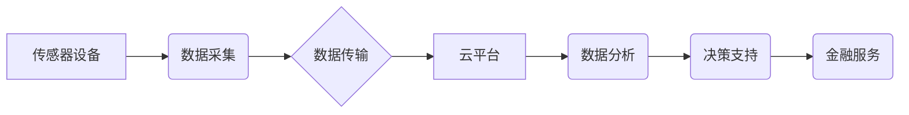

> 物联网(IoT)、传感器设备、金融服务、数据分析、风险管理、客户体验、安全保障、区块链

## 1. 背景介绍

物联网(IoT)技术正在迅速发展，并对各个行业产生深远影响。金融服务行业作为信息化程度高、数据密集型的行业，对物联网技术的应用潜力巨大。通过物联网技术和各种传感器设备的集成，金融服务机构可以收集海量数据，实现对客户行为、市场趋势和风险因素的更深入了解，从而提升服务效率、降低运营成本、增强风险管理能力和提升客户体验。

## 2. 核心概念与联系

**2.1 物联网(IoT)**

物联网是指通过传感器、网络和数据分析技术，将各种物理设备、物体和环境连接起来，形成一个互联互通的智能网络。物联网的核心要素包括：

* **传感器设备:** 用于收集物理环境和物体状态的数据，例如温度、湿度、位置、运动等。
* **网络连接:** 用于将传感器设备连接到互联网，实现数据传输和通信。
* **数据分析:** 用于处理和分析收集到的数据，提取有价值的信息，并用于决策和控制。

**2.2 金融服务**

金融服务是指为个人和企业提供资金、投资、保险、支付等服务的行业。金融服务行业面临着不断变化的市场环境、日益复杂的客户需求和严峻的监管压力。

**2.3 核心概念联系**

物联网技术为金融服务行业提供了新的机遇和挑战。通过物联网技术，金融服务机构可以收集客户行为、市场趋势和风险因素等海量数据，实现对金融服务的个性化、智能化和自动化。

**2.4  架构图**



## 3. 核心算法原理 & 具体操作步骤

**3.1 算法原理概述**

物联网在金融服务中的应用涉及多种算法，例如机器学习、深度学习、自然语言处理等。这些算法可以用于客户行为分析、风险评估、欺诈检测、个性化服务等方面。

**3.2 算法步骤详解**

以机器学习算法为例，其步骤如下：

1. **数据收集:** 收集相关数据，例如客户交易记录、账户信息、网络行为等。
2. **数据预处理:** 对数据进行清洗、转换、特征提取等操作，使其适合模型训练。
3. **模型选择:** 根据具体应用场景选择合适的机器学习算法，例如分类算法、回归算法、聚类算法等。
4. **模型训练:** 使用训练数据训练模型，调整模型参数，使其能够准确预测或分类目标变量。
5. **模型评估:** 使用测试数据评估模型性能，例如准确率、召回率、F1-score等。
6. **模型部署:** 将训练好的模型部署到生产环境中，用于实际应用。

**3.3 算法优缺点**

* **优点:** 能够自动学习数据模式，提高预测精度和自动化程度。
* **缺点:** 需要大量数据进行训练，对数据质量要求高，解释性较差。

**3.4 算法应用领域**

* **客户行为分析:** 预测客户的交易行为、投资偏好、潜在风险等。
* **风险评估:** 评估客户的信用风险、欺诈风险等。
* **欺诈检测:** 检测异常交易行为，防止欺诈活动。
* **个性化服务:** 提供个性化的金融产品和服务，提升客户体验。

## 4. 数学模型和公式 & 详细讲解 & 举例说明

**4.1 数学模型构建**

在物联网金融服务中，可以使用多种数学模型来描述和预测各种现象。例如，可以使用线性回归模型来预测客户的贷款需求，可以使用Logistic回归模型来预测客户的信用风险，可以使用时间序列模型来预测市场趋势。

**4.2 公式推导过程**

以线性回归模型为例，其目标是找到一条直线，使得这条直线与数据点之间的距离最小。

假设我们有n个数据点，每个数据点包含一个自变量x和一个因变量y。线性回归模型的公式如下：

$$y = \beta_0 + \beta_1x + \epsilon$$

其中：

* $y$ 是因变量
* $x$ 是自变量
* $\beta_0$ 是截距
* $\beta_1$ 是斜率
* $\epsilon$ 是误差项

线性回归模型的系数$\beta_0$和$\beta_1$可以通过最小二乘法来估计。最小二乘法的目标是找到一条直线，使得所有数据点到直线的距离的平方和最小。

**4.3 案例分析与讲解**

假设我们想预测客户的贷款需求，根据客户的收入和年龄，我们可以建立一个线性回归模型。

* 自变量：收入、年龄
* 因变量：贷款需求

我们可以收集一些客户的数据，并使用线性回归模型进行训练。训练完成后，我们可以使用模型来预测新的客户的贷款需求。

## 5. 项目实践：代码实例和详细解释说明

**5.1 开发环境搭建**

* 操作系统：Windows/Linux/macOS
* 编程语言：Python
* 开发工具：PyCharm/VS Code
* 库依赖：NumPy、Pandas、Scikit-learn

**5.2 源代码详细实现**

```python
import pandas as pd
from sklearn.linear_model import LinearRegression

# 加载数据
data = pd.read_csv('loan_data.csv')

# 划分训练集和测试集
X = data[['income', 'age']]
y = data['loan_demand']
from sklearn.model_selection import train_test_split
X_train, X_test, y_train, y_test = train_test_split(X, y, test_size=0.2, random_state=42)

# 创建线性回归模型
model = LinearRegression()

# 训练模型
model.fit(X_train, y_train)

# 预测测试集数据
y_pred = model.predict(X_test)

# 评估模型性能
from sklearn.metrics import mean_squared_error
mse = mean_squared_error(y_test, y_pred)
print(f'Mean Squared Error: {mse}')
```

**5.3 代码解读与分析**

* 首先，我们加载数据并划分训练集和测试集。
* 然后，我们创建线性回归模型并训练模型。
* 训练完成后，我们使用模型来预测测试集数据。
* 最后，我们评估模型性能，例如使用均方误差(MSE)来衡量模型的预测精度。

**5.4 运行结果展示**

运行代码后，会输出模型的均方误差值。

## 6. 实际应用场景

**6.1 客户行为分析**

金融机构可以使用物联网传感器收集客户的交易行为、账户信息、网络行为等数据，并使用机器学习算法进行分析，以预测客户的交易行为、投资偏好、潜在风险等。

**6.2 风险评估**

金融机构可以使用物联网传感器收集客户的信用信息、身份信息、行为信息等数据，并使用机器学习算法进行风险评估，以评估客户的信用风险、欺诈风险等。

**6.3 欺诈检测**

金融机构可以使用物联网传感器收集交易行为、账户信息、网络行为等数据，并使用机器学习算法进行欺诈检测，以识别异常交易行为，防止欺诈活动。

**6.4 个性化服务**

金融机构可以使用物联网传感器收集客户的消费习惯、生活方式、兴趣爱好等数据，并使用机器学习算法进行个性化服务，以提供个性化的金融产品和服务，提升客户体验。

**6.5 未来应用展望**

物联网技术在金融服务行业的应用前景广阔，未来将有更多创新应用场景出现，例如：

* **智能理财:** 基于物联网传感器收集的客户行为和市场数据，提供个性化的理财建议和投资方案。
* **数字身份验证:** 使用物联网传感器和生物识别技术，实现更安全、更便捷的数字身份验证。
* **供应链金融:** 使用物联网传感器跟踪货物运输信息，为供应链金融提供更精准的数据支持。

## 7. 工具和资源推荐

**7.1 学习资源推荐**

* **书籍:**
    * 《物联网技术》
    * 《机器学习实战》
    * 《深度学习》
* **在线课程:**
    * Coursera: 物联网课程
    * edX: 机器学习课程
    * Udacity: 深度学习课程

**7.2 开发工具推荐**

* **物联网平台:**
    * AWS IoT
    * Azure IoT
    * Google Cloud IoT
* **数据分析工具:**
    * Python (NumPy, Pandas, Scikit-learn)
    * R
    * Tableau

**7.3 相关论文推荐**

* 物联网技术在金融服务中的应用研究
* 基于物联网的金融风险管理
* 物联网与区块链在金融服务中的融合应用

## 8. 总结：未来发展趋势与挑战

**8.1 研究成果总结**

物联网技术与金融服务行业的结合，为金融服务带来了新的机遇和挑战。通过物联网技术，金融机构可以收集海量数据，实现对客户行为、市场趋势和风险因素的更深入了解，从而提升服务效率、降低运营成本、增强风险管理能力和提升客户体验。

**8.2 未来发展趋势**

* **数据安全和隐私保护:** 随着物联网技术的应用，金融机构需要更加重视数据安全和隐私保护，制定完善的政策和措施，保障客户数据安全。
* **人工智能技术的融合:** 人工智能技术将与物联网技术深度融合，为金融服务提供更智能化、更个性化的服务。
* **区块链技术的应用:** 区块链技术可以为物联网金融服务提供更安全、更透明的交易平台。

**8.3 面临的挑战**

* **技术标准的制定:** 物联网技术涉及多个领域，缺乏统一的技术标准，制约了物联网技术的应用推广。
* **数据质量和可信度:** 物联网传感器收集的数据质量和可信度需要得到保证，否则会影响金融服务的准确性和可靠性。
* **监管政策的完善:** 物联网技术的应用涉及多个法律法规，需要完善相关的监管政策，规范物联网金融服务的运营。

**8.4 研究展望**

未来，物联网技术在金融服务行业的应用将更加广泛和深入，需要进一步研究和探索物联网技术的应用场景、技术标准、数据安全和隐私保护等方面，推动物联网技术在金融服务领域的健康发展。

## 9. 附录：常见问题与解答

**9.1 如何保证物联网数据安全？**

* 使用加密技术保护数据传输和存储。
* 实施身份验证和授权机制，控制数据访问权限。
* 定期进行安全评估和漏洞扫描，及时修复安全漏洞。

**9.2 如何处理物联网数据中的隐私问题？**

* 明确收集和使用数据的目的，并获得客户的同意。
*  anonymize 数据，保护客户个人信息。
* 建立数据安全和隐私保护机制，确保数据安全和隐私。

**9.3 物联网技术在金融服务中的应用有哪些风险？**

* 数据泄露风险
* 系统故障风险
* 恶意攻击风险

**9.4 如何应对物联网技术在金融服务中的风险？**

* 建立完善的安全防护体系
* 提高员工安全意识
* 定期进行风险评估和应急演练


作者：禅与计算机程序设计艺术 / Zen and the Art of Computer Programming 
<end_of_turn>