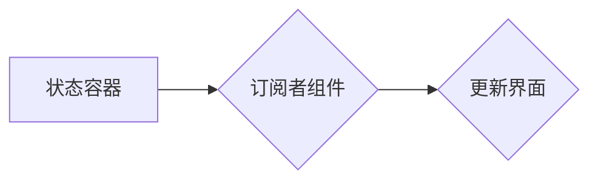

> 状态管理，单向数据流，状态容器，状态更新，订阅者模式，React，Vue，Angular

## 1. 背景介绍

在现代软件开发中，状态管理是应用程序的核心问题之一。随着应用程序的复杂性不断增加，如何有效地管理应用程序的状态变得越来越重要。状态管理是指在应用程序中跟踪和更新数据，并根据这些数据更新用户界面和应用程序的行为。

传统的应用程序开发模式通常使用全局变量来存储和共享数据，但这会导致代码难以维护、测试和扩展。随着应用程序规模的增长，全局变量会变得越来越难以管理，容易导致状态冲突和难以追踪问题。

为了解决这些问题，状态管理模式应运而生。状态管理模式提供了一种结构化和可控的方式来管理应用程序的状态，使其更加易于理解、维护和扩展。

## 2. 核心概念与联系

状态管理的核心概念包括：

* **状态容器:**  一个专门用于存储应用程序状态的单一实体。
* **单向数据流:**  数据在应用程序中流动的方式是单向的，即从状态容器到组件，而不是反过来。
* **订阅者模式:**  组件可以订阅状态容器中的特定状态变化，并在状态发生变化时自动更新。

状态管理模式通常采用订阅者模式来实现状态更新。当状态容器中的状态发生变化时，它会通知所有订阅该状态的组件，这些组件会根据状态变化更新自己的界面。

**状态管理模式架构图:**



## 3. 核心算法原理 & 具体操作步骤

### 3.1  算法原理概述

状态管理算法的核心原理是基于订阅者模式和单向数据流。

* **订阅者模式:** 组件可以订阅状态容器中的特定状态变化，并在状态发生变化时自动更新。
* **单向数据流:** 数据在应用程序中流动的方式是单向的，即从状态容器到组件，而不是反过来。

### 3.2  算法步骤详解

1. **创建状态容器:**  创建一个专门用于存储应用程序状态的单一实体。
2. **定义状态:**  定义应用程序中需要管理的状态变量和它们的初始值。
3. **订阅状态变化:**  组件可以订阅状态容器中的特定状态变化。
4. **更新状态:**  当应用程序需要更新状态时，可以通过状态容器的 API 方法来更新状态。
5. **通知订阅者:**  状态容器会通知所有订阅该状态的组件，这些组件会根据状态变化更新自己的界面。

### 3.3  算法优缺点

**优点:**

* **可维护性:**  状态管理模式使应用程序的状态更加结构化和可控，从而提高了代码的可维护性。
* **可测试性:**  状态管理模式使应用程序的状态更加易于测试，因为状态的变化可以被模拟和控制。
* **可扩展性:**  状态管理模式使应用程序更加易于扩展，因为新的状态变量和组件可以轻松地添加到应用程序中。

**缺点:**

* **学习曲线:**  学习状态管理模式需要一定的学习成本。
* **代码复杂度:**  状态管理模式可能会增加应用程序的代码复杂度。

### 3.4  算法应用领域

状态管理模式广泛应用于各种类型的应用程序，例如：

* **单页面应用程序 (SPA):**  SPA 通常需要管理大量的状态，状态管理模式可以帮助 SPA 更好地管理状态。
* **移动应用程序:**  移动应用程序也需要管理状态，状态管理模式可以帮助移动应用程序提高性能和稳定性。
* **桌面应用程序:**  桌面应用程序也可以使用状态管理模式来管理状态。

## 4. 数学模型和公式 & 详细讲解 & 举例说明

### 4.1  数学模型构建

状态管理模式可以抽象为一个状态机模型，其中状态机包含以下几个关键要素：

* **状态:**  应用程序当前的状态，可以由多个状态变量组成。
* **事件:**  应用程序中发生的事件，例如用户点击按钮、数据更新等。
* **状态转换函数:**  将事件映射到新的状态的函数。

### 4.2  公式推导过程

状态转换函数可以表示为以下公式：

```latex
S' = f(S, E)
```

其中：

* $S$ 表示应用程序当前的状态。
* $E$ 表示发生的事件。
* $S'$ 表示事件发生后应用程序的新状态。

### 4.3  案例分析与讲解

例如，一个简单的状态机可以用来管理一个开关的状态。

* **状态:**  开关可以处于开或关两种状态。
* **事件:**  点击开关按钮。
* **状态转换函数:**  如果开关处于开状态，点击按钮后状态变为关；如果开关处于关状态，点击按钮后状态变为开。

## 5. 项目实践：代码实例和详细解释说明

### 5.1  开发环境搭建

本示例使用 React 框架进行开发，需要安装 Node.js 和 npm。

### 5.2  源代码详细实现

```javascript
import React, { useState } from 'react';

function Counter() {
  const [count, setCount] = useState(0);

  const increment = () => {
    setCount(count + 1);
  };

  const decrement = () => {
    setCount(count - 1);
  };

  return (
    <div>
      <h1>{count}</h1>
      <button onClick={increment}>+</button>
      <button onClick={decrement}>-</button>
    </div>
  );
}

export default Counter;
```

### 5.3  代码解读与分析

* `useState` hook 用于管理组件的状态，`count` 变量存储计数器值，`setCount` 函数用于更新计数器值。
* `increment` 和 `decrement` 函数分别负责增加和减少计数器值。
* 组件的渲染部分显示计数器值和两个按钮，按钮的 `onClick` 事件分别调用 `increment` 和 `decrement` 函数。

### 5.4  运行结果展示

运行代码后，会显示一个计数器，初始值为 0。点击 "+" 按钮会增加计数器值，点击 "-" 按钮会减少计数器值。

## 6. 实际应用场景

状态管理模式在各种实际应用场景中发挥着重要作用，例如：

* **电商平台:**  管理商品信息、购物车状态、用户登录状态等。
* **社交媒体:**  管理用户资料、消息列表、动态流等。
* **游戏:**  管理游戏角色状态、游戏进度、游戏场景等。

### 6.4  未来应用展望

随着应用程序的复杂性不断增加，状态管理模式将变得越来越重要。未来，状态管理模式将会更加智能化、自动化，并与其他技术，例如人工智能和机器学习，深度融合。

## 7. 工具和资源推荐

### 7.1  学习资源推荐

* **书籍:**
    * 《Effective State Management with React》
    * 《Redux in Action》
* **在线课程:**
    * Udemy: React State Management with Redux
    * Coursera: Building Scalable React Applications with Redux

### 7.2  开发工具推荐

* **Redux:**  一个流行的 JavaScript 状态管理库。
* **MobX:**  一个基于观察者的状态管理库。
* **Vuex:**  Vue.js 的官方状态管理库。
* **NgRx:**  Angular 的状态管理库。

### 7.3  相关论文推荐

* **Redux: Predictable State Management for JavaScript Apps**
* **MobX: State Management Made Simple**

## 8. 总结：未来发展趋势与挑战

### 8.1  研究成果总结

状态管理模式已经成为现代应用程序开发中不可或缺的一部分。它提供了结构化和可控的方式来管理应用程序的状态，提高了代码的可维护性、可测试性和可扩展性。

### 8.2  未来发展趋势

* **更智能化的状态管理:**  未来，状态管理模式将会更加智能化，能够自动预测和处理状态变化。
* **更强大的状态管理工具:**  新的状态管理工具将会出现，提供更强大的功能和更易于使用的界面。
* **状态管理与其他技术的融合:**  状态管理模式将会与其他技术，例如人工智能和机器学习，深度融合，为应用程序带来更智能化的体验。

### 8.3  面临的挑战

* **状态管理模式的复杂性:**  学习和使用状态管理模式需要一定的学习成本，对于初学者来说可能比较复杂。
* **状态管理模式的性能问题:**  在某些情况下，状态管理模式可能会导致性能问题，需要进行优化。
* **状态管理模式的安全性问题:**  状态管理模式需要考虑安全性问题，防止数据泄露和攻击。

### 8.4  研究展望

未来，状态管理模式的研究方向将集中在以下几个方面：

* **开发更易于使用的状态管理工具。**
* **提高状态管理模式的性能和安全性。**
* **探索状态管理模式与其他技术的融合。**


## 9. 附录：常见问题与解答

**问题 1:**  为什么需要使用状态管理模式？

**答案:**  传统的应用程序开发模式使用全局变量来存储和共享数据，这会导致代码难以维护、测试和扩展。状态管理模式提供了一种结构化和可控的方式来管理应用程序的状态，使其更加易于理解、维护和扩展。

**问题 2:**  有哪些常见的状态管理库？

**答案:**  一些常见的状态管理库包括 Redux、MobX、Vuex 和 NgRx。

**问题 3:**  如何选择合适的状态管理库？

**答案:**  选择合适的状态管理库取决于应用程序的规模、复杂性和开发团队的经验。

**问题 4:**  状态管理模式的学习成本高吗？

**答案:**  学习状态管理模式需要一定的学习成本，但随着对状态管理模式的理解，学习成本会逐渐降低。

**问题 5:**  状态管理模式会影响应用程序的性能吗？

**答案:**  在某些情况下，状态管理模式可能会导致性能问题，需要进行优化。


作者：禅与计算机程序设计艺术 / Zen and the Art of Computer Programming 
<end_of_turn>