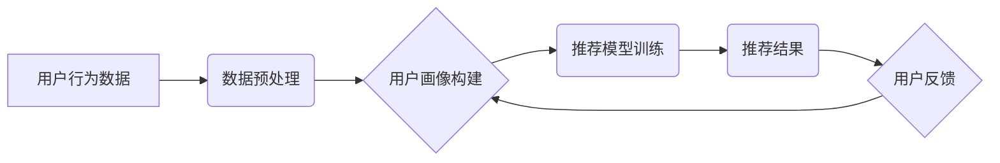

> 用户画像，推荐系统，协同优化，机器学习，深度学习，个性化推荐

## 1. 背景介绍

在当今数据爆炸的时代，信息过载已成为人们面临的普遍问题。如何精准地将用户所需的信息呈现在其面前，是各大互联网平台亟需解决的关键问题。推荐系统作为信息过滤和个性化服务的核心引擎，在电商、社交媒体、视频平台等领域发挥着越来越重要的作用。

传统的推荐系统主要依赖于基于内容的过滤或基于用户的协同过滤算法，但这些方法往往难以捕捉用户行为的复杂性和多变性。随着深度学习技术的兴起，基于深度学习的推荐系统逐渐成为研究热点，其能够更好地学习用户画像，挖掘用户兴趣偏好，并提供更精准、个性化的推荐结果。

然而，仅仅依靠深度学习模型训练用户画像并进行推荐，往往难以达到最佳效果。用户画像的构建和推荐系统的优化是相互关联的，两者之间存在着协同优化关系。

## 2. 核心概念与联系

**2.1 用户画像**

用户画像是指对用户进行深入分析和总结，构建出用户特征、行为模式、兴趣偏好等多维度的描述模型。用户画像的构建是推荐系统的基础，它为推荐算法提供用户特征信息，帮助算法更好地理解用户需求。

**2.2 推荐系统**

推荐系统是指利用数据挖掘、机器学习等技术，根据用户的历史行为、兴趣偏好等信息，预测用户可能感兴趣的内容或商品，并将其推荐给用户。

**2.3 协同优化**

协同优化是指用户画像和推荐系统之间相互促进、共同提升的效果。通过不断优化用户画像，可以为推荐系统提供更精准的用户特征信息，从而提高推荐系统的准确性和个性化程度。反之，通过不断优化推荐系统，可以收集更多用户行为数据，进而完善用户画像，形成良性循环。

**2.4 架构图**



## 3. 核心算法原理 & 具体操作步骤

### 3.1 算法原理概述

用户画像与推荐系统的协同优化通常采用以下几种核心算法：

* **深度学习模型:** 
    * **用户画像构建:** 使用深度神经网络，例如自编码器、多层感知机等，对用户行为数据进行特征提取和降维，构建多维的用户画像。
    * **推荐模型训练:** 使用深度神经网络，例如深度协同过滤、深度因子分解机等，对用户画像和物品特征进行融合，训练推荐模型。
* **强化学习:** 
    * **推荐策略优化:** 使用强化学习算法，例如Q学习、SARSA等，根据用户反馈信息，优化推荐策略，提高推荐效果。

### 3.2 算法步骤详解

**3.2.1 用户画像构建**

1. **数据收集:** 收集用户行为数据，例如浏览记录、购买记录、点赞记录、评论记录等。
2. **数据预处理:** 对数据进行清洗、转换、编码等预处理操作，例如去除噪声数据、处理缺失值、将类别特征转换为数值特征等。
3. **特征提取:** 使用深度学习模型，例如自编码器，对用户行为数据进行特征提取，提取用户兴趣、偏好、行为模式等特征。
4. **用户画像构建:** 将提取到的特征组合在一起，构建用户画像，例如用户兴趣标签、用户购买偏好、用户行为模式等。

**3.2.2 推荐模型训练**

1. **数据准备:** 将用户画像和物品特征数据进行整合，构建训练数据集。
2. **模型选择:** 选择合适的深度学习模型，例如深度协同过滤、深度因子分解机等，进行模型训练。
3. **模型训练:** 使用训练数据集，训练推荐模型，优化模型参数。
4. **模型评估:** 使用测试数据集，评估模型性能，例如准确率、召回率、覆盖率等。

**3.2.3 推荐策略优化**

1. **强化学习环境构建:** 将推荐系统构建成强化学习环境，用户点击行为作为奖励信号。
2. **强化学习算法训练:** 使用强化学习算法，例如Q学习、SARSA等，训练推荐策略，优化推荐结果。
3. **策略部署:** 将训练好的推荐策略部署到推荐系统中，进行实时推荐。

### 3.3 算法优缺点

**3.3.1 深度学习模型**

* **优点:** 能够学习用户行为数据的复杂特征，提高推荐效果。
* **缺点:** 需要大量的训练数据，训练时间较长，模型解释性较差。

**3.3.2 强化学习**

* **优点:** 可以根据用户反馈信息动态调整推荐策略，提高推荐效果。
* **缺点:** 需要设计合理的奖励函数，训练过程可能比较复杂。

### 3.4 算法应用领域

* **电商推荐:** 推荐商品、优惠券、促销活动等。
* **社交媒体推荐:** 推荐好友、群组、内容等。
* **视频平台推荐:** 推荐视频、节目、主播等。
* **音乐平台推荐:** 推荐歌曲、专辑、歌手等。

## 4. 数学模型和公式 & 详细讲解 & 举例说明

### 4.1 数学模型构建

用户画像构建可以使用矩阵分解模型，例如协同过滤模型，将用户和物品表示为低维向量，并通过矩阵分解的方式学习用户兴趣和物品特征。

**4.1.1 协同过滤模型**

假设用户集合为U，物品集合为I，用户-物品交互矩阵为R，其中R(u,i)表示用户u对物品i的评分或交互行为。协同过滤模型的目标是学习用户和物品的隐向量，使得预测的评分与实际评分尽可能接近。

**4.1.2 矩阵分解模型**

将用户-物品交互矩阵R分解为两个低维矩阵P和Q，其中P为用户特征矩阵，Q为物品特征矩阵。

$$R \approx P Q^T$$

其中，P(u,:)表示用户u的特征向量，Q(i,:)表示物品i的特征向量。

### 4.2 公式推导过程

协同过滤模型的目标函数通常是最小化预测评分与实际评分之间的均方误差。

$$L(P,Q) = \frac{1}{2} \sum_{u \in U, i \in I} (R(u,i) - P(u,:)Q(i,:))^2$$

使用梯度下降算法优化模型参数P和Q，使得目标函数L(P,Q)最小化。

### 4.3 案例分析与讲解

假设有一个用户-物品交互矩阵R，其中R(u,i)表示用户u对物品i的评分。可以使用协同过滤模型将用户和物品表示为低维向量，并通过矩阵分解的方式学习用户兴趣和物品特征。

例如，用户1对物品1评分为5，用户2对物品1评分为3，可以使用协同过滤模型学习到用户1对物品1的兴趣较高，用户2对物品1的兴趣较低。

## 5. 项目实践：代码实例和详细解释说明

### 5.1 开发环境搭建

* Python 3.x
* TensorFlow/PyTorch
* Jupyter Notebook

### 5.2 源代码详细实现

```python
import tensorflow as tf

# 定义用户-物品交互矩阵
R = tf.constant([[5, 3, 4],
                 [2, 5, 1],
                 [3, 2, 5]])

# 定义用户和物品的维度
latent_dim = 2

# 定义用户特征矩阵P和物品特征矩阵Q
P = tf.Variable(tf.random.normal([3, latent_dim]))
Q = tf.Variable(tf.random.normal([3, latent_dim]))

# 计算预测评分
predictions = tf.matmul(P, Q, transpose_b=True)

# 定义损失函数
loss = tf.reduce_mean(tf.square(R - predictions))

# 定义优化器
optimizer = tf.keras.optimizers.Adam()

# 训练模型
for epoch in range(100):
    with tf.GradientTape() as tape:
        loss_value = loss
    gradients = tape.gradient(loss_value, [P, Q])
    optimizer.apply_gradients(zip(gradients, [P, Q]))

    print(f"Epoch {epoch+1}, Loss: {loss_value.numpy()}")

# 打印训练后的用户特征矩阵P和物品特征矩阵Q
print("User Features (P):
", P.numpy())
print("Item Features (Q):
", Q.numpy())
```

### 5.3 代码解读与分析

* 代码首先定义了用户-物品交互矩阵R，以及用户和物品的维度latent_dim。
* 然后定义了用户特征矩阵P和物品特征矩阵Q，并使用矩阵乘法计算预测评分。
* 定义了损失函数，并使用Adam优化器训练模型。
* 训练完成后，打印训练后的用户特征矩阵P和物品特征矩阵Q。

### 5.4 运行结果展示

训练完成后，可以观察到用户特征矩阵P和物品特征矩阵Q已经学习到用户的兴趣和物品的特征。

## 6. 实际应用场景

### 6.1 电商推荐

* **商品推荐:** 根据用户的浏览历史、购买记录等信息，推荐用户可能感兴趣的商品。
* **个性化促销:** 根据用户的购买偏好，推荐个性化的促销活动和优惠券。

### 6.2 社交媒体推荐

* **好友推荐:** 根据用户的兴趣爱好和社交关系，推荐可能感兴趣的新朋友。
* **群组推荐:** 根据用户的兴趣爱好和社交关系，推荐用户可能感兴趣的群组。

### 6.3 视频平台推荐

* **视频推荐:** 根据用户的观看历史、点赞记录等信息，推荐用户可能感兴趣的视频。
* **节目推荐:** 根据用户的观看历史、点赞记录等信息，推荐用户可能感兴趣的节目。

### 6.4 未来应用展望

* **更精准的个性化推荐:** 利用更先进的深度学习算法和强化学习算法，实现更精准的个性化推荐。
* **跨平台推荐:** 将用户画像跨平台共享，实现更全面的用户画像构建和推荐服务。
* **多模态推荐:** 利用文本、图像、音频等多模态数据，构建更丰富的用户画像，实现更智能的推荐。

## 7. 工具和资源推荐

### 7.1 学习资源推荐

* **书籍:**
    * 《深度学习》
    * 《推荐系统实践》
* **在线课程:**
    * Coursera: 深度学习
    * Udacity: 机器学习工程师
* **博客:**
    * Towards Data Science
    * Machine Learning Mastery

### 7.2 开发工具推荐

* **Python:** 
    * TensorFlow
    * PyTorch
* **数据处理工具:**
    * Pandas
    * Scikit-learn
* **可视化工具:**
    * Matplotlib
    * Seaborn

### 7.3 相关论文推荐

* **协同过滤:**
    * "Collaborative Filtering for Implicit Feedback Datasets"
* **深度学习推荐:**
    * "Deep Learning for Recommender Systems"
* **强化学习推荐:**
    * "Context-Aware Recommendation via Reinforcement Learning"

## 8. 总结：未来发展趋势与挑战

### 8.1 研究成果总结

用户画像与推荐系统的协同优化取得了显著成果，深度学习和强化学习算法在推荐系统领域得到了广泛应用，推荐效果得到了显著提升。

### 8.2 未来发展趋势

* **更精准的个性化推荐:** 利用更先进的深度学习算法和强化学习算法，实现更精准的个性化推荐。
* **跨平台推荐:** 将用户画像跨平台共享，实现更全面的用户画像构建和推荐服务。
* **多模态推荐:** 利用文本、图像、音频等多模态数据，构建更丰富的用户画像，实现更智能的推荐。

### 8.3 面临的挑战

* **数据隐私保护:** 用户画像构建需要大量用户数据，如何保护用户隐私是一个重要的