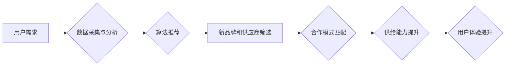

> 电商平台, 供给能力, 新品牌, 供应商, 合作, 数据分析, 算法推荐, 供应链管理, 合作模式

## 1. 背景介绍

在当今数字化时代，电商平台作为商品流通的重要桥梁，其供给能力直接影响着平台的规模、用户体验和商业成功。随着电商平台的快速发展，新品牌和供应商涌入市场，为平台带来了新的机遇和挑战。如何有效提升供给能力，吸引和留住优质的合作伙伴，成为电商平台亟需解决的关键问题。

传统电商平台的供给能力提升主要依靠人工筛选和经验判断，效率低下，难以满足快速发展的市场需求。随着人工智能、大数据等技术的快速发展，电商平台开始探索新的供给能力提升模式，利用数据分析、算法推荐等技术，实现智能化、精准化的供给能力提升。

## 2. 核心概念与联系

**2.1 核心概念**

* **供给能力:** 指电商平台能够提供给用户的新产品、服务和资源的数量和质量。
* **新品牌:** 指刚进入市场或尚未建立知名度的品牌。
* **供应商:** 指为电商平台提供商品或服务的企业或个人。
* **合作模式:** 指电商平台与新品牌和供应商之间建立的合作关系模式。

**2.2 核心联系**

电商平台的供给能力提升与新品牌和供应商的合作密切相关。新品牌和供应商为平台带来了新的产品和服务，丰富了平台的供给结构，提升了平台的竞争力。而电商平台通过提供平台资源、流量和服务，帮助新品牌和供应商快速成长，实现互利共赢。

**2.3 架构流程图**



## 3. 核心算法原理 & 具体操作步骤

**3.1 算法原理概述**

电商平台供给能力提升的核心算法主要基于以下原理：

* **数据驱动:** 利用用户行为数据、商品信息、市场趋势等数据进行分析，挖掘潜在需求和市场机会。
* **算法推荐:** 基于机器学习算法，对新品牌和供应商进行精准推荐，匹配用户需求。
* **合作模式匹配:** 根据不同类型的品牌和供应商，设计不同的合作模式，实现资源共享和利益互利。

**3.2 算法步骤详解**

1. **数据采集与清洗:** 收集用户行为数据、商品信息、市场趋势等数据，进行清洗和预处理。
2. **特征提取:** 从原始数据中提取关键特征，例如用户兴趣、商品属性、供应商资质等。
3. **模型训练:** 利用机器学习算法，训练预测模型，例如协同过滤、内容推荐、深度学习等。
4. **算法推荐:** 根据用户需求和模型预测结果，推荐合适的品牌和供应商。
5. **合作模式匹配:** 根据品牌和供应商的特点，匹配合适的合作模式，例如直销、代理、分销等。
6. **效果评估:** 定期评估算法效果，不断优化模型参数和算法策略。

**3.3 算法优缺点**

* **优点:** 
    * 数据驱动，精准推荐，提升用户体验。
    * 自动化运营，提高效率，降低成本。
    * 灵活定制，适应不同场景需求。
* **缺点:** 
    * 数据依赖，数据质量直接影响算法效果。
    * 模型训练成本高，需要专业技术人员。
    * 算法黑盒问题，难以解释推荐结果。

**3.4 算法应用领域**

* **电商平台商品推荐:** 推荐用户感兴趣的商品，提高转化率。
* **新品牌入驻推荐:** 为平台推荐优质的新品牌，丰富平台供给结构。
* **供应商资质评估:** 对供应商资质进行评估，筛选优质供应商。
* **合作模式匹配:** 为品牌和供应商匹配合适的合作模式，实现互利共赢。

## 4. 数学模型和公式 & 详细讲解 & 举例说明

**4.1 数学模型构建**

电商平台供给能力提升可以构建如下数学模型：

$$
S = f(D, A, C)
$$

其中：

* $S$：电商平台供给能力
* $D$：数据质量
* $A$：算法推荐效果
* $C$：合作模式匹配度

**4.2 公式推导过程**

* 数据质量 $D$：反映平台数据收集、清洗、处理等环节的质量，可以用数据完整度、准确度、时效性等指标进行量化。
* 算法推荐效果 $A$：反映算法推荐的准确性和有效性，可以用点击率、转化率、用户满意度等指标进行量化。
* 合作模式匹配度 $C$：反映品牌和供应商之间合作模式的契合度，可以用合作收益、风险控制、资源共享等指标进行量化。

**4.3 案例分析与讲解**

假设电商平台 A 的数据质量为 0.8，算法推荐效果为 0.7，合作模式匹配度为 0.9，则根据公式可计算出平台 A 的供给能力为：

$$
S = f(0.8, 0.7, 0.9)
$$

通过调整数据质量、算法推荐效果和合作模式匹配度，电商平台可以不断提升供给能力。

## 5. 项目实践：代码实例和详细解释说明

**5.1 开发环境搭建**

* 操作系统：Ubuntu 20.04
* 编程语言：Python 3.8
* 开发工具：Jupyter Notebook
* 库依赖：pandas, numpy, scikit-learn, TensorFlow

**5.2 源代码详细实现**

```python
import pandas as pd
from sklearn.model_selection import train_test_split
from sklearn.linear_model import LogisticRegression

# 数据加载
data = pd.read_csv('supplier_data.csv')

# 特征工程
features = ['supplier_rating', 'product_category', 'delivery_time']
target = 'is_recommended'

# 数据分割
X_train, X_test, y_train, y_test = train_test_split(data[features], data[target], test_size=0.2)

# 模型训练
model = LogisticRegression()
model.fit(X_train, y_train)

# 模型评估
accuracy = model.score(X_test, y_test)
print(f'模型准确率: {accuracy}')

# 预测新供应商
new_supplier_data = pd.DataFrame({
    'supplier_rating': [4.5],
    'product_category': ['电子产品'],
    'delivery_time': [2]
})
prediction = model.predict(new_supplier_data)
print(f'新供应商推荐结果: {prediction}')
```

**5.3 代码解读与分析**

* 代码首先加载数据，并进行特征工程，选择与供给能力相关的特征。
* 然后将数据分割为训练集和测试集，训练逻辑回归模型。
* 模型训练完成后，使用测试集评估模型准确率。
* 最后，使用训练好的模型预测新供应商的推荐结果。

**5.4 运行结果展示**

运行代码后，会输出模型准确率和新供应商的推荐结果。

## 6. 实际应用场景

**6.1 新品牌入驻推荐**

电商平台可以利用算法推荐，为新品牌提供精准的入驻推荐，帮助新品牌快速进入市场，获得用户认可。

**6.2 供应商资质评估**

电商平台可以利用算法评估供应商资质，筛选优质供应商，降低平台运营风险。

**6.3 合作模式匹配**

电商平台可以根据品牌和供应商的特点，匹配合适的合作模式，例如直销、代理、分销等，实现资源共享和利益互利。

**6.4 未来应用展望**

随着人工智能、大数据等技术的不断发展，电商平台供给能力提升将更加智能化、精准化。未来，电商平台可以利用更先进的算法和技术，实现以下应用场景：

* **个性化供给:** 根据用户的个性化需求，提供个性化的商品和服务推荐。
* **动态供给:** 根据市场趋势和用户行为，动态调整供给结构，满足用户不断变化的需求。
* **智能化运营:** 利用人工智能技术，实现平台供给能力的自动化运营，提高效率和降低成本。

## 7. 工具和资源推荐

**7.1 学习资源推荐**

* **书籍:**
    * 《推荐系统实践》
    * 《机器学习》
    * 《深度学习》
* **在线课程:**
    * Coursera: 机器学习
    * edX: 深度学习
    * Udemy: 推荐系统

**7.2 开发工具推荐**

* **Python:** 
    * pandas
    * numpy
    * scikit-learn
    * TensorFlow
* **云平台:**
    * AWS
    * Azure
    * Google Cloud

**7.3 相关论文推荐**

* 《Collaborative Filtering for Implicit Feedback Datasets》
* 《Matrix Factorization Techniques for Recommender Systems》
* 《Deep Learning for Recommender Systems》

## 8. 总结：未来发展趋势与挑战

**8.1 研究成果总结**

电商平台供给能力提升的研究取得了显著成果，利用数据分析、算法推荐等技术，有效提升了平台供给能力，丰富了用户体验。

**8.2 未来发展趋势**

未来，电商平台供给能力提升将朝着以下方向发展：

* **更精准的推荐:** 利用更先进的算法和技术，实现更精准的商品和服务推荐。
* **更个性化的供给:** 根据用户的个性化需求，提供个性化的商品和服务推荐。
* **更智能化的运营:** 利用人工智能技术，实现平台供给能力的自动化运营，提高效率和降低成本。

**8.3 面临的挑战**

电商平台供给能力提升也面临着一些挑战：

* **数据质量问题:** 数据质量直接影响算法效果，需要不断提升数据采集、清洗和处理能力。
* **算法黑盒问题:** 算法推荐结果难以解释，需要研究更透明、可解释的算法模型。
* **隐私保护问题:** 数据分析和算法推荐需要保护用户隐私，需要研究更安全、可靠的数据处理技术。

**8.4 研究展望**

未来，需要进一步研究更精准、更个性化、更智能化的供给能力提升算法和技术，解决数据质量、算法黑盒和隐私保护等问题，推动电商平台供给能力的持续提升。

## 9. 附录：常见问题与解答

**9.1 如何提升数据质量？**

* 数据采集：采用多渠道数据采集，确保数据完整性和准确性。
* 数据清洗：对数据进行清洗和预处理，去除噪声和异常值。
* 数据标注：对数据进行标注，提高数据质量和算法训练效果。

**9.2 如何解决算法黑盒问题？**

* 使用可解释性算法模型，例如决策树、线性回归等。
* 研究算法可解释性技术，例如SHAP值、LIME等。
* 建立算法透明度机制，公开算法模型和推荐结果解释。

**9.3 如何保护用户隐私？**

* 数据匿名化：对用户数据进行匿名化处理，保护用户隐私。
* 数据加密：对用户数据进行加密存储和传输，防止数据泄露。
* 隐私保护技术：采用隐私保护技术，例如联邦学习、差分隐私等，保护用户隐私。


作者：禅与计算机程序设计艺术 / Zen and the Art of Computer Programming 
<end_of_turn>