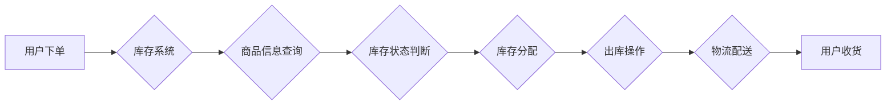

> 库存管理系统，电商平台，供给链优化，预测模型，算法优化，数据分析

## 1. 背景介绍

在当今以电子商务为核心的商业环境中，供给链的效率和稳定性至关重要。电商平台作为连接消费者和供应商的桥梁，其供给能力直接影响着用户体验和平台的商业成功。库存管理作为供给链的关键环节，其优化直接关系到平台的运营成本、销售额和客户满意度。

传统电商平台的库存管理模式往往依赖于经验和人工干预，存在着库存积压、缺货等问题，难以满足快速变化的市场需求和用户期望。随着大数据、人工智能等技术的快速发展，基于数据驱动的智能库存管理系统应运而生，为电商平台的供给能力提升提供了新的解决方案。

## 2. 核心概念与联系

**2.1 库存管理系统概述**

库存管理系统是指用于管理和控制企业库存的软件系统。它涵盖了从采购、入库、销售、出库到库存盘点等全流程的管理功能，旨在通过优化库存水平、提高库存周转率、降低库存成本，从而提升企业运营效率和盈利能力。

**2.2 电商平台与库存管理系统的关系**

电商平台的库存管理系统与传统企业库存管理系统相比，具有以下特点：

* **高频交易:** 电商平台的交易频率远高于传统零售企业，对库存管理系统的实时性和准确性要求更高。
* **多SKU管理:** 电商平台通常销售多种商品，SKU数量庞大，需要支持高效的SKU管理和库存分配。
* **个性化需求:** 电商平台的用户群体更加多元化，对商品的个性化需求也更加多样化，需要支持灵活的库存策略和个性化库存管理。
* **数据驱动:** 电商平台拥有海量用户行为数据和商品销售数据，可以利用数据分析和预测模型，优化库存决策。

**2.3 核心架构**



## 3. 核心算法原理 & 具体操作步骤

**3.1 算法原理概述**

智能库存管理系统通常采用以下核心算法：

* **预测模型:** 利用历史销售数据、市场趋势等信息，预测未来商品需求，为库存决策提供依据。常见的预测模型包括ARIMA、Prophet、机器学习模型等。
* **库存优化算法:** 根据预测需求、安全库存水平、订货成本等因素，优化库存水平，降低库存成本和缺货率。常见的优化算法包括经济订货量模型、ABC分类法等。
* **库存分配算法:** 根据商品需求、库存水平、物流成本等因素，优化商品库存分配，确保各仓库的库存水平合理，满足用户需求。常见的分配算法包括优先级分配、最短距离分配等。

**3.2 算法步骤详解**

**3.2.1 预测模型**

1. **数据收集:** 收集历史销售数据、市场趋势数据、季节性因素等相关数据。
2. **数据预处理:** 对数据进行清洗、转换、特征工程等处理，使其适合模型训练。
3. **模型选择:** 根据数据特点和预测需求，选择合适的预测模型。
4. **模型训练:** 利用训练数据训练模型，并进行模型评估和调参。
5. **预测结果输出:** 将模型预测结果输出，用于库存决策。

**3.2.2 库存优化算法**

1. **确定安全库存水平:** 根据商品需求波动、订货周期等因素，确定安全库存水平，避免缺货风险。
2. **计算经济订货量:** 根据订货成本、库存成本等因素，计算经济订货量，降低库存成本。
3. **制定库存策略:** 根据商品特性、市场需求等因素，制定不同的库存策略，例如集中库存、分散库存等。

**3.2.3 库存分配算法**

1. **收集库存信息:** 收集各仓库的库存水平、商品信息等数据。
2. **分析需求信息:** 分析用户订单、市场需求等信息，确定商品需求量。
3. **计算分配方案:** 根据库存水平、物流成本等因素，计算商品分配方案，确保各仓库的库存水平合理。

**3.3 算法优缺点**

* **预测模型:** 优点：能够准确预测未来需求，为库存决策提供依据。缺点：模型精度受数据质量和模型复杂度影响，需要不断调整和优化。
* **库存优化算法:** 优点：能够有效降低库存成本和缺货率。缺点：需要准确的成本数据和需求预测，算法参数需要根据实际情况进行调整。
* **库存分配算法:** 优点：能够优化库存分配，提高库存利用率。缺点：需要考虑物流成本和配送时间等因素，算法复杂度较高。

**3.4 算法应用领域**

* **电商平台:** 优化库存水平、降低缺货率、提高运营效率。
* **制造业:** 优化生产计划、降低库存成本、提高生产效率。
* **零售业:** 优化商品分配、提高库存周转率、降低库存成本。
* **物流业:** 优化配送路线、提高配送效率、降低物流成本。

## 4. 数学模型和公式 & 详细讲解 & 举例说明

**4.1 数学模型构建**

**4.1.1 需求预测模型**

假设商品的销售量服从ARIMA(p,d,q)模型，其数学表达式为：

$$
\phi(B)y_t = \theta(B)a_t + c_t
$$

其中：

* $y_t$：时间t的销售量
* $a_t$：时间t的随机误差项
* $\phi(B)$：自回归系数
* $\theta(B)$：移动平均系数
* $c_t$：趋势项

**4.1.2 库存优化模型**

假设商品的订货成本为$C_o$，库存成本为$C_h$，需求量为$D$，订货周期为$L$，则经济订货量$Q$的计算公式为：

$$
Q = \sqrt{\frac{2C_oD}{C_h}}
$$

**4.2 公式推导过程**

**4.2.1 需求预测模型**

ARIMA模型的推导过程较为复杂，涉及时间序列分析、自回归模型、移动平均模型等知识。

**4.2.2 库存优化模型**

经济订货量模型的推导过程如下：

1. 首先，定义库存成本和订货成本的函数。
2. 然后，根据库存水平和订货量，计算总成本函数。
3. 最后，通过求解总成本函数的最小值，得到经济订货量。

**4.3 案例分析与讲解**

假设某电商平台销售一款商品，其需求量为1000件/月，订货成本为100元/订单，库存成本为10元/件/月。

根据经济订货量公式，可计算出该商品的经济订货量为：

$$
Q = \sqrt{\frac{2 \times 100 \times 1000}{10}} = 141.42
$$

因此，该商品的经济订货量为141件/订单。

## 5. 项目实践：代码实例和详细解释说明

**5.1 开发环境搭建**

* 操作系统：Linux/Windows/macOS
* 编程语言：Python
* 开发工具：VS Code/PyCharm
* 库依赖：pandas、numpy、scikit-learn、matplotlib

**5.2 源代码详细实现**

```python
# 导入必要的库
import pandas as pd
from sklearn.linear_model import LinearRegression

# 加载历史销售数据
data = pd.read_csv('sales_data.csv')

# 数据预处理
# ...

# 训练线性回归模型
model = LinearRegression()
model.fit(data[['日期']], data['销售量'])

# 预测未来销售量
future_dates = pd.date_range(start='2023-10-26', periods=30)
future_sales = model.predict(future_dates.values.reshape(-1, 1))

# 打印预测结果
print(future_sales)
```

**5.3 代码解读与分析**

* 代码首先导入必要的库，包括pandas用于数据处理、scikit-learn用于机器学习模型训练、matplotlib用于数据可视化等。
* 然后，加载历史销售数据，并进行数据预处理，例如缺失值处理、特征工程等。
* 接着，使用线性回归模型训练预测模型，并使用训练好的模型预测未来销售量。
* 最后，打印预测结果。

**5.4 运行结果展示**

运行代码后，将输出未来30天的销售量预测结果。

## 6. 实际应用场景

**6.1 电商平台库存优化**

* 利用预测模型预测未来商品需求，优化库存水平，避免库存积压和缺货。
* 根据商品特性和市场需求，制定不同的库存策略，例如集中库存、分散库存等。
* 利用库存优化算法，计算经济订货量，降低库存成本。

**6.2 制造业生产计划优化**

* 利用预测模型预测未来产品需求，优化生产计划，提高生产效率。
* 根据生产计划，优化原材料库存水平，降低库存成本。
* 利用库存优化算法，计算经济订货量，降低原材料采购成本。

**6.3 零售业商品分配优化**

* 利用预测模型预测不同门店的商品需求，优化商品分配方案，提高库存利用率。
* 根据商品特性和市场需求，制定不同的库存策略，例如集中库存、分散库存等。
* 利用库存优化算法，计算经济订货量，降低库存成本。

**6.4 物流业配送路线优化**

* 利用预测模型预测不同区域的配送需求，优化配送路线，提高配送效率。
* 根据配送路线，优化库存分配方案，降低库存成本。
* 利用库存优化算法，计算经济订货量，降低物流成本。

**6.4 未来应用展望**

随着人工智能、大数据等技术的不断发展，智能库存管理系统将更加智能化、自动化，能够更好地满足企业的需求。未来，智能库存管理系统将朝着以下方向发展：

* **更精准的预测:** 利用更先进的机器学习算法，提高预测模型的精度。
* **更智能的决策:** 利用人工智能技术，实现智能库存决策，自动调整库存水平。
* **更全面的管理:** 将库存管理与其他供应链环节整合，实现全流程的供应链管理。
* **更个性化的服务:** 根据用户的个性化需求，提供个性化的库存管理服务。

## 7. 工具和资源推荐

**7.1 学习资源推荐**

* **书籍:**
    * 《供应链管理》
    * 《库存管理》
    * 《数据科学》
* **在线课程:**
    * Coursera: Supply Chain Management
    * edX: Inventory Management
    * Udemy: Data Science

**7.2 开发工具推荐**

* **编程语言:** Python
* **数据分析工具:** pandas, NumPy, Scikit-learn
* **可视化工具:** matplotlib, seaborn
* **数据库:** MySQL, PostgreSQL

**7.3 相关论文推荐**

* **Inventory Management in E-commerce: A Review**
* **A Machine Learning Approach to Inventory Forecasting**
* **Optimization of Inventory Management Systems Using Artificial Intelligence**

## 8. 总结：未来发展趋势与挑战

**8.1 研究成果总结**

本文介绍了电商平台供给能力提升中的库存管理系统，探讨了核心概念、算法原理、实践案例以及未来发展趋势。智能库存管理系统能够有效优化库存水平，降低库存成本，提高运营效率，为电商平台的供给能力提升提供重要的技术支撑。

**8.2 未来发展趋势**

* **更精准的预测:** 利用更