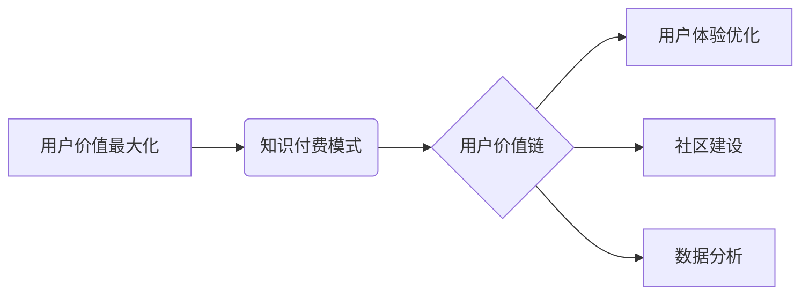

> 知识付费、用户价值、最大化策略、用户体验、内容运营、社区建设、数据分析

## 1. 背景介绍

知识付费行业近年来发展迅速，从线上课程、付费咨询到会员体系，各种模式层出不穷。然而，在激烈的市场竞争中，如何最大化用户价值，提升用户粘性和转化率，成为众多知识付费创业者面临的共同挑战。

传统的知识付费模式往往侧重于内容的生产和销售，忽视了用户体验和互动。用户购买课程后，往往缺乏有效的学习指导和交流平台，导致学习效果不佳，用户流失率高。

## 2. 核心概念与联系

**2.1 用户价值最大化**

用户价值最大化是指通过提供优质的产品和服务，满足用户需求，提升用户体验，最终实现用户价值最大化。

**2.2 知识付费模式**

知识付费模式是指通过付费的方式获取知识、技能和经验。

**2.3 用户价值链**

用户价值链是指用户在与知识付费平台互动过程中，从获取信息到最终实现价值的整个过程。

**2.4 用户体验优化**

用户体验优化是指通过改进产品设计、功能交互和服务流程，提升用户使用产品的愉悦度和满意度。

**2.5 社区建设**

社区建设是指围绕知识付费平台构建一个用户互动、交流学习的平台，增强用户粘性和归属感。

**2.6 数据分析**

数据分析是指通过收集和分析用户行为数据，洞察用户需求和痛点，为产品和服务改进提供依据。

**2.7 核心概念关系图**



## 3. 核心算法原理 & 具体操作步骤

**3.1 算法原理概述**

用户价值最大化算法是一种基于数据分析和用户行为模式识别的算法，旨在通过个性化推荐、内容定制和互动体验优化，提升用户价值。

**3.2 算法步骤详解**

1. **数据收集:** 收集用户行为数据，包括学习记录、互动行为、反馈意见等。
2. **数据清洗:** 对收集到的数据进行清洗和处理，去除无效数据和噪声。
3. **特征提取:** 从用户行为数据中提取特征，例如学习偏好、知识点掌握程度、学习时间等。
4. **模型训练:** 利用机器学习算法，训练用户价值预测模型，预测用户的学习效果、付费意愿和长期价值。
5. **个性化推荐:** 根据用户特征和模型预测结果，为用户推荐个性化的学习内容和服务。
6. **内容定制:** 根据用户学习进度和反馈，定制个性化的学习路径和学习内容。
7. **互动体验优化:** 通过社区建设、互动问答、在线辅导等方式，提升用户学习体验和互动参与度。

**3.3 算法优缺点**

**优点:**

* 能够精准预测用户价值，提高资源利用效率。
* 提供个性化学习体验，提升用户学习效果和满意度。
* 促进用户互动和社区建设，增强用户粘性和忠诚度。

**缺点:**

* 需要大量的数据支持，数据质量对算法效果至关重要。
* 模型训练和维护需要专业技术人员，成本较高。
* 算法可能会存在偏差，需要不断优化和改进。

**3.4 算法应用领域**

* 在线教育平台
* 知识付费社区
* 个人品牌运营
* 内容创作平台

## 4. 数学模型和公式 & 详细讲解 & 举例说明

**4.1 数学模型构建**

用户价值最大化模型可以采用以下数学模型构建：

$$
V = f(U, C, I, E)
$$

其中：

* $V$：用户价值
* $U$：用户特征（例如年龄、教育背景、职业等）
* $C$：内容特征（例如主题、难度、时长等）
* $I$：互动特征（例如学习时长、参与度、反馈等）
* $E$：体验特征（例如学习效果、满意度、推荐意愿等）

**4.2 公式推导过程**

用户价值可以看作是用户特征、内容特征、互动特征和体验特征的综合影响。

* 用户特征影响用户对知识的接受程度和学习能力。
* 内容特征影响用户学习兴趣和学习效果。
* 互动特征影响用户学习参与度和学习效果。
* 体验特征影响用户学习满意度和付费意愿。

通过构建数学模型，可以量化用户价值的各个因素，并通过数据分析和模型训练，预测用户的学习效果、付费意愿和长期价值。

**4.3 案例分析与讲解**

假设一个在线教育平台，想要最大化用户价值。

* 可以通过收集用户数据，分析用户的学习偏好、知识点掌握程度和学习时间等特征。
* 可以根据用户的学习特征，推荐个性化的学习内容和学习路径。
* 可以通过社区建设和互动问答，提升用户的学习参与度和学习效果。
* 可以通过数据分析，了解用户的学习满意度和付费意愿，并根据反馈进行产品和服务改进。

通过以上措施，平台可以提升用户的学习体验和学习效果，最终实现用户价值最大化。

## 5. 项目实践：代码实例和详细解释说明

**5.1 开发环境搭建**

* 操作系统：Windows/macOS/Linux
* 编程语言：Python
* 开发工具：Jupyter Notebook/VS Code
* 数据存储：MySQL/MongoDB

**5.2 源代码详细实现**

```python
# 用户价值预测模型
from sklearn.linear_model import LogisticRegression

# 数据加载
data = pd.read_csv('user_data.csv')

# 特征工程
X = data[['age', 'education', 'learning_time']]
y = data['purchase_flag']

# 模型训练
model = LogisticRegression()
model.fit(X, y)

# 模型预测
new_user_data = pd.DataFrame({'age': [25], 'education': ['本科'], 'learning_time': [10]})
prediction = model.predict(new_user_data)

# 输出预测结果
print(prediction)
```

**5.3 代码解读与分析**

* 代码首先加载用户数据，并进行特征工程，提取用户特征和目标变量。
* 然后使用逻辑回归模型训练用户价值预测模型。
* 最后使用训练好的模型预测新用户的购买意愿。

**5.4 运行结果展示**

运行结果将输出新用户的购买意愿预测结果，例如：

```
[1]
```

表示新用户有购买意愿。

## 6. 实际应用场景

**6.1 在线教育平台**

* 个性化推荐课程和学习路径
* 预测用户学习效果和付费意愿
* 提供个性化学习辅导和答疑服务

**6.2 知识付费社区**

* 建立用户兴趣标签和知识图谱
* 推荐相关内容和专家
* 促进用户互动和交流学习

**6.3 个人品牌运营**

* 分析粉丝特征和兴趣爱好
* 提供个性化内容和服务
* 提升粉丝粘性和转化率

**6.4 内容创作平台**

* 预测内容受欢迎程度和用户付费意愿
* 提供内容创作指导和优化建议
* 提升内容质量和用户体验

**6.5 未来应用展望**

随着人工智能技术的不断发展，用户价值最大化算法将应用于更多领域，例如：

* 个性化医疗服务
* 智能客服系统
* 智慧城市建设

## 7. 工具和资源推荐

**7.1 学习资源推荐**

* 《深度学习》
* 《机器学习实战》
* 《Python数据科学手册》

**7.2 开发工具推荐**

* Jupyter Notebook
* VS Code
* TensorFlow
* PyTorch

**7.3 相关论文推荐**

* 《基于深度学习的用户价值预测模型》
* 《用户价值最大化策略在知识付费平台中的应用》

## 8. 总结：未来发展趋势与挑战

**8.1 研究成果总结**

用户价值最大化算法为知识付费创业者提供了一种有效的方法，通过数据分析和个性化推荐，提升用户体验和学习效果，最终实现用户价值最大化。

**8.2 未来发展趋势**

* 模型精度提升：通过更先进的机器学习算法和数据分析技术，提升用户价值预测模型的精度。
* 个性化程度增强：通过更细粒度的用户特征和内容特征，提供更个性化的学习体验和服务。
* 多模态数据融合：融合文本、图像、音频等多模态数据，构建更全面的用户画像和内容理解模型。

**8.3 面临的挑战**

* 数据隐私保护：收集和使用用户数据需要严格遵守隐私保护规定。
* 模型公平性：模型训练数据可能存在偏差，导致模型预测结果存在公平性问题。
* 技术迭代速度：人工智能技术发展迅速，需要不断更新和改进算法模型。

**8.4 研究展望**

未来，用户价值最大化算法将继续发展，并应用于更多领域，为用户提供更个性化、更智能化的服务体验。


## 9. 附录：常见问题与解答

**9.1 如何收集用户数据？**

可以通过以下方式收集用户数据：

* 用户注册信息
* 学习记录
* 互动行为
* 反馈意见

**9.2 如何保证数据隐私？**

* 严格遵守隐私保护规定，获取用户同意后才收集和使用数据。
* 对用户数据进行匿名化处理，保护用户个人信息。
* 建立安全的数据存储和传输机制，防止数据泄露。

**9.3 如何评估模型效果？**

可以通过以下指标评估模型效果：

* 准确率
* 召回率
* F1-score
* AUC

**9.4 如何应对模型偏差？**

* 使用更全面和均衡的训练数据。
* 使用公平性评估指标，检测模型是否存在偏差。
* 定期评估模型效果，并进行模型调整和优化。


作者：禅与计算机程序设计艺术 / Zen and the Art of Computer Programming 
<end_of_turn>