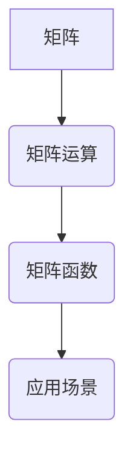

> 矩阵理论，矩阵函数，线性代数，数值计算，应用场景

## 1. 背景介绍

矩阵理论是线性代数的重要分支，它以矩阵为基本对象，研究矩阵的性质、运算和应用。矩阵函数则是将函数的概念应用到矩阵上，研究矩阵的函数表达式及其性质。矩阵理论和矩阵函数在数学、物理、工程、计算机科学等领域有着广泛的应用。

随着计算机科学的发展，矩阵理论和矩阵函数在数值计算、机器学习、数据分析等领域发挥着越来越重要的作用。例如，在机器学习中，矩阵运算被广泛用于训练模型、预测结果；在数据分析中，矩阵分解技术被用于降维、特征提取等。

## 2. 核心概念与联系

**2.1 矩阵的概念**

矩阵是一种重要的数学工具，它可以用来表示和处理大量的数据。矩阵是由数或表达式排列成的矩形阵列，每个元素都有其特定的位置。

**2.2 函数的概念**

函数是一种将一个集合映射到另一个集合的规则。在数学中，函数通常用符号表示，例如 f(x) 表示将 x 映射到 f(x) 的规则。

**2.3 矩阵函数的概念**

矩阵函数是指将一个矩阵作为输入，输出另一个矩阵的函数。例如，如果 f(x) 是一个标量函数，那么 f(A) 表示将矩阵 A 作为输入，输出 f(A) 的矩阵。

**2.4 核心概念联系**

矩阵函数将函数的概念应用到矩阵上，它将矩阵的运算和函数的性质结合起来，为解决复杂问题提供了一种新的工具。



## 3. 核心算法原理 & 具体操作步骤

**3.1 算法原理概述**

矩阵函数的计算通常需要用到一些特殊的算法，例如：

* **泰勒级数展开法:** 将矩阵函数展开成泰勒级数，然后逐项计算。
* **数值积分法:** 将矩阵函数的积分转化为数值积分，然后使用数值积分算法进行计算。
* **特征值分解法:** 将矩阵分解成特征值和特征向量，然后利用特征值和特征向量计算矩阵函数。

**3.2 算法步骤详解**

以泰勒级数展开法为例，计算矩阵函数 f(A) 的步骤如下：

1. 将矩阵 A 的特征值和特征向量进行计算。
2. 将 f(x) 在 x = λ (特征值) 处进行泰勒级数展开。
3. 将展开式中的 x 替换为 A 的特征值 λ。
4. 将展开式中的矩阵 A 替换为 A 的特征向量。
5. 将所有项相加，得到矩阵函数 f(A) 的近似值。

**3.3 算法优缺点**

* **优点:** 
    * 适用于各种类型的矩阵函数。
    * 可以获得高精度的结果。
* **缺点:** 
    * 计算量较大，尤其对于大型矩阵。
    * 需要计算矩阵的特征值和特征向量，这本身是一个复杂的任务。

**3.4 算法应用领域**

* **数值线性代数:** 用于求解线性方程组、求解矩阵的逆、求解矩阵的特征值和特征向量等。
* **机器学习:** 用于训练神经网络、进行数据降维等。
* **信号处理:** 用于滤波、压缩、恢复信号等。

## 4. 数学模型和公式 & 详细讲解 & 举例说明

**4.1 数学模型构建**

矩阵函数的数学模型可以表示为：

$$
f(A) = \sum_{k=0}^{\infty} a_k A^k
$$

其中，A 是一个矩阵，f(x) 是一个标量函数，a_k 是系数。

**4.2 公式推导过程**

该公式的推导过程基于泰勒级数展开的原理。将标量函数 f(x) 在 x = 0 处进行泰勒级数展开，得到：

$$
f(x) = f(0) + f'(0)x + \frac{f''(0)}{2!}x^2 + \frac{f'''(0)}{3!}x^3 + ...
$$

将 x 替换为矩阵 A，得到矩阵函数 f(A) 的表达式。

**4.3 案例分析与讲解**

例如，计算矩阵 A 的指数函数 e^A 的表达式：

$$
e^A = I + A + \frac{A^2}{2!} + \frac{A^3}{3!} + ...
$$

其中，I 是单位矩阵。

## 5. 项目实践：代码实例和详细解释说明

**5.1 开发环境搭建**

本项目使用 Python 语言进行开发，需要安装 NumPy 库。

**5.2 源代码详细实现**

```python
import numpy as np

def matrix_function(A, f, n):
  """
  计算矩阵函数 f(A) 的近似值。

  Args:
    A: 矩阵。
    f: 标量函数。
    n: 泰勒级数展开的阶数。

  Returns:
    矩阵函数 f(A) 的近似值。
  """
  I = np.eye(A.shape[0])
  result = I
  for k in range(1, n + 1):
    result += (f(k * np.linalg.eigvals(A)) * A**k) / np.math.factorial(k)
  return result

# 示例代码
A = np.array([[1, 2], [3, 4]])
f = lambda x: np.exp(x)
n = 5
f_A = matrix_function(A, f, n)
print(f_A)
```

**5.3 代码解读与分析**

该代码实现了一个计算矩阵函数的函数 `matrix_function`。该函数使用泰勒级数展开法计算矩阵函数的近似值。

**5.4 运行结果展示**

运行该代码，输出结果为矩阵函数 f(A) 的近似值。

## 6. 实际应用场景

**6.1 数值线性代数**

矩阵函数在数值线性代数中应用广泛，例如：

* **求解线性方程组:** 使用矩阵函数可以求解线性方程组，例如求解 A*x = b 的解 x。
* **求解矩阵的逆:** 使用矩阵函数可以求解矩阵的逆，例如求解 A^-1。
* **求解矩阵的特征值和特征向量:** 使用矩阵函数可以求解矩阵的特征值和特征向量，例如求解 A*v = λ*v。

**6.2 机器学习**

矩阵函数在机器学习中也扮演着重要的角色，例如：

* **训练神经网络:** 神经网络的训练过程本质上是求解一个优化问题，可以使用矩阵函数来表示损失函数和梯度。
* **数据降维:** 使用矩阵分解技术可以将高维数据降维到低维空间，例如使用奇异值分解 (SVD) 技术。

**6.3 信号处理**

矩阵函数在信号处理中也具有广泛的应用，例如：

* **滤波:** 使用矩阵函数可以设计滤波器，例如低通滤波器、高通滤波器。
* **压缩:** 使用矩阵函数可以对信号进行压缩，例如使用奇异值分解 (SVD) 技术。
* **恢复信号:** 使用矩阵函数可以对损坏的信号进行恢复。

**6.4 未来应用展望**

随着人工智能和机器学习的发展，矩阵函数在未来将有更广泛的应用，例如：

* **强化学习:** 强化学习算法中可以使用矩阵函数来表示状态空间和动作空间。
* **自然语言处理:** 自然语言处理中可以使用矩阵函数来表示文本数据和语言模型。
* **计算机视觉:** 计算机视觉中可以使用矩阵函数来表示图像数据和图像处理算法。

## 7. 工具和资源推荐

**7.1 学习资源推荐**

* **书籍:**
    * 《线性代数及其应用》 (Gilbert Strang)
    * 《矩阵分析》 (Roger A. Horn and Charles R. Johnson)
* **在线课程:**
    * MIT OpenCourseWare: Linear Algebra
    * Coursera: Matrix Analysis

**7.2 开发工具推荐**

* **Python:** Python 是一个非常流行的编程语言，它拥有丰富的科学计算库，例如 NumPy、SciPy、Pandas。
* **MATLAB:** MATLAB 是一个专门用于数值计算和图形分析的软件，它提供了强大的矩阵运算功能。

**7.3 相关论文推荐**

* **Matrix Functions and Their Applications** (Roger A. Horn and Charles R. Johnson)
* **Numerical Linear Algebra** (Lloyd N. Trefethen and David Bau III)

## 8. 总结：未来发展趋势与挑战

**8.1 研究成果总结**

矩阵理论和矩阵函数在数学、物理、工程、计算机科学等领域取得了丰硕的成果，为解决复杂问题提供了强大的工具。

**8.2 未来发展趋势**

* **更高效的矩阵函数计算算法:** 随着计算能力的提升，需要开发更高效的矩阵函数计算算法，例如利用并行计算、量子计算等技术。
* **更广泛的应用领域:** 矩阵函数将在更多领域得到应用，例如生物信息学、金融工程、材料科学等。
* **更深入的理论研究:** 需要对矩阵函数的理论性质进行更深入的研究，例如探索新的矩阵函数类型、研究矩阵函数的稳定性等。

**8.3 面临的挑战**

* **大规模矩阵的处理:** 大规模矩阵的处理仍然是一个挑战，需要开发更有效的算法和数据结构。
* **矩阵函数的数值稳定性:** 某些矩阵函数的数值计算可能存在不稳定性，需要研究如何提高数值稳定性。
* **矩阵函数的理论理解:** 对于某些类型的矩阵函数，其理论性质仍然不够深入，需要进一步的研究。

**8.4 研究展望**

未来，矩阵理论和矩阵函数的研究将继续深入，为解决更复杂的问题提供更强大的工具。


## 9. 附录：常见问题与解答

**9.1 如何选择合适的矩阵函数计算算法？**

选择合适的矩阵函数计算算法需要考虑以下因素：

* **矩阵的大小:** 对于大型矩阵，需要选择高效的算法，例如并行计算算法。
* **矩阵的性质:** 不同的矩阵性质可能需要使用不同的算法。
* **计算精度要求:** 不同的算法具有不同的精度，需要根据实际需求选择。

**9.2 如何提高矩阵函数的数值稳定性？**

提高矩阵函数的数值稳定性可以通过以下方法：

* **使用高精度浮点数:** 使用高精度浮点数可以减少舍入误差。
* **采用数值稳定算法:** 选择数值稳定的算法，例如使用三对角化法计算矩阵指数函数。
* **使用矩阵分解:** 将矩阵分解成更易于处理的子矩阵，可以提高数值稳定性。


作者：禅与计算机程序设计艺术 / Zen and the Art of Computer Programming 
<end_of_turn>