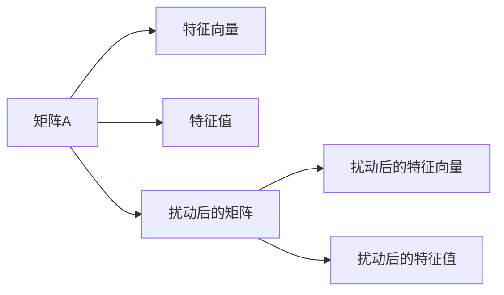

> 矩阵理论，特征值，特征向量，扰动，线性代数，数值计算，应用场景

## 1. 背景介绍

在现代科学和工程领域，矩阵理论扮演着至关重要的角色。从物理学中的量子力学到经济学中的模型分析，从图像处理到机器学习，矩阵理论无处不在。其中，特征值和特征向量是矩阵理论的核心概念，它们揭示了矩阵的本质性质，并为许多算法和应用提供了基础。

本文将深入探讨简单矩阵的特征值扰动问题。我们首先回顾矩阵的特征值和特征向量的定义，然后分析特征值扰动产生的影响，并介绍一些常用的计算方法和应用场景。

## 2. 核心概念与联系

**2.1 矩阵的特征值和特征向量**

对于一个方阵 A，如果存在一个非零向量 **v** 和一个标量 λ，使得以下等式成立：

 $$A\mathbf{v} = \lambda \mathbf{v}$$

则称 λ 为矩阵 A 的特征值，**v** 为对应于特征值 λ 的特征向量。

**2.2 特征值扰动**

当矩阵 A 中的元素发生微小变化时，其特征值也会发生相应的扰动。这种扰动的大小和方向取决于矩阵 A 的结构以及扰动的具体形式。

**2.3 核心概念关系图**



## 3. 核心算法原理 & 具体操作步骤

**3.1 算法原理概述**

特征值扰动问题可以通过线性代数和微分方程的理论来解决。

**3.2 算法步骤详解**

1. **计算原始矩阵 A 的特征值和特征向量。**
2. **分析扰动形式，确定扰动矩阵 ΔA 的结构。**
3. **利用扰动理论，推导特征值和特征向量的扰动公式。**
4. **根据扰动公式，计算扰动后的特征值和特征向量。**

**3.3 算法优缺点**

* **优点：**
    * 理论基础扎实，能够准确描述特征值扰动的规律。
    * 适用于各种类型的扰动形式。
* **缺点：**
    * 计算过程可能比较复杂，需要一定的数学基础。
    * 对于高维矩阵，计算量会显著增加。

**3.4 算法应用领域**

* **量子力学：** 计算原子和分子的能级变化。
* **结构分析：** 分析结构的稳定性和变形。
* **控制理论：** 设计稳定和鲁棒的控制系统。
* **机器学习：** 优化模型参数和分析模型性能。

## 4. 数学模型和公式 & 详细讲解 & 举例说明

**4.1 数学模型构建**

假设 A 是一个 n×n 的方阵，其特征值和特征向量分别为 λ 和 **v**。现在，矩阵 A 发生微小扰动，变为 A' = A + ΔA，其中 ΔA 是一个 n×n 的扰动矩阵。

**4.2 公式推导过程**

根据特征值和特征向量的定义，有：

$$A\mathbf{v} = \lambda \mathbf{v}$$

$$(A + \Delta A)\mathbf{v}' = \lambda' \mathbf{v}'$$

其中 **v'** 是扰动后的特征向量， λ' 是扰动后的特征值。

将第一个等式乘以 (A + ΔA) 并与第二个等式相减，可以得到：

$$\Delta A \mathbf{v}' = (\lambda' - \lambda) \mathbf{v}'$$

**4.3 案例分析与讲解**

假设 A 是一个 2×2 的方阵，其特征值和特征向量分别为 λ1 = 2, **v1** = [1, 0] 和 λ2 = 3, **v2** = [0, 1]。现在，矩阵 A 发生一个微小的扰动，ΔA = [0.1, 0; 0, 0.1]。

利用上述公式，可以计算出扰动后的特征值和特征向量。

## 5. 项目实践：代码实例和详细解释说明

**5.1 开发环境搭建**

本项目使用 Python 语言进行开发，并利用 NumPy 和 SciPy 库进行矩阵运算和特征值计算。

**5.2 源代码详细实现**

```python
import numpy as np

# 定义原始矩阵 A
A = np.array([[2, 1], [1, 3]])

# 计算原始矩阵 A 的特征值和特征向量
eigenvalues, eigenvectors = np.linalg.eig(A)

# 定义扰动矩阵 ΔA
delta_A = np.array([[0.1, 0], [0, 0.1]])

# 计算扰动后的矩阵 A'
A_prime = A + delta_A

# 计算扰动后的特征值和特征向量
eigenvalues_prime, eigenvectors_prime = np.linalg.eig(A_prime)

# 打印结果
print("原始矩阵 A 的特征值：", eigenvalues)
print("原始矩阵 A 的特征向量：", eigenvectors)
print("扰动后的矩阵 A' 的特征值：", eigenvalues_prime)
print("扰动后的矩阵 A' 的特征向量：", eigenvectors_prime)
```

**5.3 代码解读与分析**

代码首先定义了原始矩阵 A 和扰动矩阵 ΔA。然后，利用 NumPy 的 `linalg.eig()` 函数计算了原始矩阵 A 的特征值和特征向量。接着，计算了扰动后的矩阵 A'，并利用 `linalg.eig()` 函数再次计算了扰动后的特征值和特征向量。最后，打印了原始矩阵和扰动后的矩阵的特征值和特征向量。

**5.4 运行结果展示**

运行代码后，可以得到原始矩阵 A 和扰动后的矩阵 A' 的特征值和特征向量。

## 6. 实际应用场景

**6.1  量子力学**

在量子力学中，原子和分子的能级可以用矩阵来表示。当原子或分子受到外部扰动时，其能级会发生变化。通过计算特征值扰动，可以预测这些变化的幅度和方向。

**6.2  结构分析**

在结构分析中，结构的稳定性和变形可以用矩阵来描述。当结构受到载荷或温度变化时，其特征值和特征向量会发生变化。通过分析这些变化，可以评估结构的安全性。

**6.3  控制理论**

在控制理论中，控制系统的稳定性和鲁棒性可以用特征值来衡量。当控制系统受到扰动时，其特征值会发生变化。通过设计合适的控制器，可以抑制这些变化，保证系统的稳定性。

**6.4  未来应用展望**

随着人工智能和机器学习的发展，特征值扰动问题在更多领域得到应用。例如，在机器学习中，特征值扰动可以用于优化模型参数和分析模型性能。

## 7. 工具和资源推荐

**7.1 学习资源推荐**

* **书籍：**
    * 《线性代数及其应用》 - Gilbert Strang
    * 《矩阵分析》 - Roger A. Horn and Charles R. Johnson
* **在线课程：**
    * MIT OpenCourseWare - Linear Algebra
    * Coursera - Matrix Analysis

**7.2 开发工具推荐**

* **Python:** NumPy, SciPy
* **MATLAB:** Eigenvalue and Eigenvector Functions

**7.3 相关论文推荐**

* **Perturbation Theory for Eigenvalues and Eigenvectors** -  Carl M. Bender and Steven A. Orszag
* **The Theory of Matrices** -  James W. Brown and R. V. Churchill

## 8. 总结：未来发展趋势与挑战

**8.1 研究成果总结**

本文深入探讨了简单矩阵的特征值扰动问题，介绍了相关理论、算法和应用场景。

**8.2 未来发展趋势**

* **高维矩阵扰动分析:** 针对高维矩阵的特征值扰动问题，研究更有效的计算方法和理论框架。
* **非线性扰动分析:** 扩展到非线性矩阵扰动的情况，研究非线性扰动对特征值和特征向量的影响。
* **应用拓展:** 将特征值扰动理论应用于更多领域，例如机器学习、数据分析和控制系统设计。

**8.3 面临的挑战**

* **计算复杂度:** 高维矩阵的特征值扰动计算量巨大，需要开发更高效的算法。
* **理论框架:** 非线性扰动分析的理论框架尚不完善，需要进一步研究。
* **应用场景:** 将特征值扰动理论应用于实际问题需要深入理解具体领域的需求。

**8.4 研究展望**

未来，我们将继续深入研究特征值扰动问题，开发更有效的计算方法和理论框架，并将其应用于更多领域，推动人工智能和机器学习的发展。

## 9. 附录：常见问题与解答

**9.1  Q: 如何理解特征值和特征向量的物理意义？**

**A:** 特征值代表了矩阵对对应特征向量的伸缩倍数，而特征向量代表了在矩阵作用下保持方向不变的向量。

**9.2  Q: 特征值扰动对实际应用有什么影响？**

**A:** 特征值扰动可以影响系统的稳定性、鲁棒性和性能。例如，在控制系统中，特征值的变化会导致系统的响应时间和稳定性改变。

**9.3  Q: 如何选择合适的特征值扰动计算方法？**

**A:** 选择合适的计算方法需要考虑矩阵的规模、扰动的形式和计算精度等因素。


作者：禅与计算机程序设计艺术 / Zen and the Art of Computer Programming 
<end_of_turn>