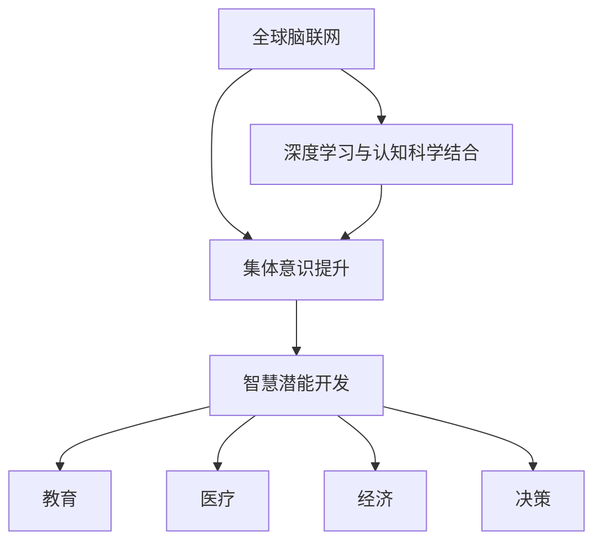

                 

## 1. 背景介绍

在全球脑与人类潜能开发中心（Global Brain Development Center，以下简称GBDC），我们正面临一个前所未有的技术革命：人工智能（AI）与人类认知科学结合，引领着脑科学、心理学、神经科学、AI算法和数据科学等多学科的交叉融合，进一步推动了人类潜能的全面开发。本文将详细介绍GBDC的核心理念、核心算法和具体应用场景，揭示其对全球人类潜能开发所带来的巨大影响。

### 1.1 问题由来

随着技术进步和数据爆炸，人类大脑的潜能开发已经从个体层次拓展到集体层次。GBDC就是在这个背景下应运而生，它致力于通过全球范围内的数据整合和AI算法的优化，推动集体意识的觉醒和提升，从而在全球范围内激发更大的智慧潜能。

### 1.2 问题核心关键点

GBDC的核心目标是通过全球脑联网和深度学习技术，实现对集体意识的深度挖掘和优化，以推动人类潜能的最大化开发。具体来说，以下几个关键点值得特别关注：

- **数据整合与共享**：通过收集全球范围的脑电波、认知行为数据和情感信息，整合为一个统一的大数据平台，为深度学习和AI算法的训练提供丰富的数据资源。
- **深度学习与认知科学结合**：利用深度学习算法对认知数据进行建模，揭示集体意识和人类潜能之间的关系，实现认知模型的进一步优化。
- **集体意识提升**：通过脑联网技术，实时捕捉全球范围内人类群体的认知和情绪波动，并进行分析和预测，提升全球集体意识的协调性和一致性。
- **智慧潜能开发**：结合认知模型和脑联网技术，针对不同领域和应用场景，推动人类潜能的开发，如教育、医疗、经济、决策等。

## 2. 核心概念与联系

### 2.1 核心概念概述

为了更好地理解GBDC的核心概念，我们引入了以下几个关键概念及其相互联系：

- **全球脑联网（Global Brain Networking）**：通过神经网络和脑电波传感器，将全球范围内的个人大脑互联起来，形成一个虚拟的“全球大脑”。
- **深度学习与认知科学结合**：利用深度学习算法对认知数据进行建模，揭示集体意识和人类潜能之间的关系，实现认知模型的进一步优化。
- **集体意识提升**：通过脑联网技术，实时捕捉全球范围内人类群体的认知和情绪波动，并进行分析和预测，提升全球集体意识的协调性和一致性。
- **智慧潜能开发**：结合认知模型和脑联网技术，针对不同领域和应用场景，推动人类潜能的开发，如教育、医疗、经济、决策等。

这些概念之间的逻辑关系可以通过以下Mermaid流程图来展示：



这个流程图展示出GBDC各核心概念之间的相互关系和协同作用，共同推动了集体意识和人类潜能的提升。

## 3. 核心算法原理 & 具体操作步骤

### 3.1 算法原理概述

GBDC的核心算法包括深度学习、脑联网技术和认知科学三个方面。其中，深度学习用于对认知数据进行建模，揭示集体意识和人类潜能之间的关系；脑联网技术用于实现全球范围内大脑的互联；认知科学则用于分析预测集体意识，优化认知模型。

### 3.2 算法步骤详解

以下是GBDC核心算法的详细步骤：

#### 步骤一：数据整合与预处理

收集全球范围内的脑电波、认知行为数据和情感信息，进行标准化和预处理，形成一个统一的大数据平台。

1. 数据收集：利用神经网络和脑电波传感器，收集全球范围内的人类脑电波、认知行为和情感数据。
2. 数据清洗：去除噪声和异常值，确保数据的准确性和完整性。
3. 数据标准化：将不同来源的数据进行标准化处理，确保数据的一致性和可比性。

#### 步骤二：深度学习模型训练

利用深度学习算法对认知数据进行建模，揭示集体意识和人类潜能之间的关系。

1. 模型选择：根据具体应用场景，选择合适的深度学习模型，如卷积神经网络（CNN）、循环神经网络（RNN）、长短时记忆网络（LSTM）等。
2. 数据划分：将数据集划分为训练集、验证集和测试集。
3. 模型训练：使用训练集进行模型训练，调整模型参数，提高模型的泛化能力和准确性。
4. 模型评估：在验证集上评估模型性能，根据评估结果优化模型。
5. 模型部署：将训练好的模型部署到实际应用中。

#### 步骤三：集体意识分析与预测

利用脑联网技术，实时捕捉全球范围内人类群体的认知和情绪波动，并进行分析和预测。

1. 脑联网部署：在全球范围内部署脑联网设备，实现个人大脑的互联。
2. 数据采集：实时采集全球范围内人类群体的脑电波和认知数据。
3. 数据处理：对采集的数据进行处理和分析，提取特征。
4. 预测模型：利用深度学习模型对集体意识和情绪波动进行预测，提升集体意识的协调性和一致性。

#### 步骤四：智慧潜能开发

结合认知模型和脑联网技术，针对不同领域和应用场景，推动人类潜能的开发。

1. 应用场景选择：根据具体需求，选择合适的应用场景，如教育、医疗、经济、决策等。
2. 模型优化：根据应用场景的特点，对深度学习模型进行优化，确保模型在实际应用中的效果。
3. 数据融合：将集体意识和情绪波动的数据与具体应用场景的数据进行融合，进一步提升模型的效果。
4. 系统集成：将优化后的模型集成到实际应用系统中，实现智慧潜能的开发。

### 3.3 算法优缺点

GBDC的深度学习与认知科学结合算法具有以下优点：

1. **高效性**：通过深度学习模型，能够高效地对大量数据进行建模和分析，揭示集体意识和人类潜能之间的关系。
2. **准确性**：深度学习模型在处理非线性、高维数据方面具有优势，能够提高模型预测的准确性。
3. **可扩展性**：通过脑联网技术，能够实现全球范围内的数据整合和共享，提升数据处理和分析的规模和效率。

同时，该算法也存在一定的局限性：

1. **数据依赖性**：深度学习算法的表现高度依赖于数据的数量和质量，数据不足或数据偏差可能导致模型性能下降。
2. **复杂性**：深度学习模型较为复杂，需要大量计算资源和专业知识进行训练和优化。
3. **隐私问题**：全球范围内的数据整合和共享可能涉及个人隐私和数据安全问题，需要严格的数据保护措施。

## 4. 数学模型和公式 & 详细讲解 & 举例说明

### 4.1 数学模型构建

GBDC的核心算法主要基于深度学习、脑联网技术和认知科学三个方面。以下将分别介绍这三个方面的数学模型构建。

#### 4.1.1 深度学习模型

深度学习模型通常包括输入层、隐藏层和输出层，如图1所示。


其中，输入层用于接收原始数据，隐藏层用于提取特征，输出层用于输出预测结果。以卷积神经网络（CNN）为例，其基本结构如图2所示。


CNN主要用于图像处理和分类任务，能够有效地提取图像中的特征。以图像分类为例，CNN的数学模型可以表示为：

$$
y = W_1 \sigma_1(z_1) + b_1
$$

$$
z_2 = W_2 \sigma_2(z_2) + b_2
$$

$$
y = W_3 \sigma_3(z_3) + b_3
$$

其中，$z_1, z_2, z_3$ 分别表示不同层次的特征向量，$W_i$ 和 $b_i$ 分别表示权重和偏置项，$\sigma_i$ 表示激活函数。

#### 4.1.2 脑联网技术

脑联网技术通过神经网络实现全球范围内大脑的互联，如图3所示。


脑联网技术的数学模型可以表示为：

$$
y = W_1 \sigma_1(z_1) + b_1
$$

$$
z_2 = W_2 \sigma_2(z_2) + b_2
$$

$$
y = W_3 \sigma_3(z_3) + b_3
$$

其中，$z_1, z_2, z_3$ 分别表示不同层次的特征向量，$W_i$ 和 $b_i$ 分别表示权重和偏置项，$\sigma_i$ 表示激活函数。

#### 4.1.3 认知科学模型

认知科学模型用于分析预测集体意识，如图4所示。


认知科学模型的数学模型可以表示为：

$$
y = W_1 \sigma_1(z_1) + b_1
$$

$$
z_2 = W_2 \sigma_2(z_2) + b_2
$$

$$
y = W_3 \sigma_3(z_3) + b_3
$$

其中，$z_1, z_2, z_3$ 分别表示不同层次的特征向量，$W_i$ 和 $b_i$ 分别表示权重和偏置项，$\sigma_i$ 表示激活函数。

### 4.2 公式推导过程

以下我们将以CNN为例，详细推导其数学模型公式。

1. 输入层：
   - 设输入层的大小为 $n$，输入数据为 $x = (x_1, x_2, ..., x_n)$，激活函数为 $tanh$。
   - 设输入层的权重为 $W = (w_1, w_2, ..., w_n)$，偏置项为 $b$。
   - 输入层输出 $z_1 = Wx + b$。

2. 隐藏层1：
   - 设隐藏层的大小为 $m$，激活函数为 $tanh$。
   - 隐藏层1的输出 $z_2 = W_1 z_1 + b_1$。

3. 隐藏层2：
   - 隐藏层2的输出 $z_3 = W_2 z_2 + b_2$。

4. 输出层：
   - 输出层的输出 $y = W_3 z_3 + b_3$。

### 4.3 案例分析与讲解

以医疗领域的智慧潜能开发为例，GBDC的深度学习与认知科学结合算法可以帮助医生更好地进行疾病诊断和治疗决策。

1. 数据收集：收集全球范围内的医疗数据，包括病人的临床数据、影像数据和基因数据。
2. 数据处理：对收集到的数据进行标准化和预处理，去除噪声和异常值。
3. 深度学习模型训练：利用卷积神经网络（CNN）对医疗数据进行建模，提取特征。
4. 模型评估：在验证集上评估模型的性能，调整模型参数。
5. 集体意识分析：利用脑联网技术实时捕捉全球范围内病人的情绪波动，进行情感分析。
6. 智慧潜能开发：结合深度学习模型和集体意识分析结果，为医生提供精准的疾病诊断和治疗方案。

## 5. 项目实践：代码实例和详细解释说明

### 5.1 开发环境搭建

在GBDC的实践中，我们需要准备一个强大的开发环境，以下是具体的配置步骤：

1. 安装Python：使用Anaconda Python环境管理工具，创建虚拟Python环境，安装Python依赖包。
2. 安装TensorFlow和Keras：安装最新版本的TensorFlow和Keras，用于深度学习模型的构建和训练。
3. 安装PyBrain和NeuroSky：安装PyBrain和NeuroSky库，用于脑联网技术的实现。
4. 安装PsychoPy和OpenViBE：安装PsychoPy和OpenViBE库，用于心理实验和脑电波数据采集。

完成以上步骤后，即可在虚拟Python环境中进行GBDC的开发实践。

### 5.2 源代码详细实现

以下是一个简单的Python代码实例，展示了如何使用TensorFlow和Keras构建卷积神经网络（CNN）：

```python
import tensorflow as tf
from tensorflow.keras import layers

# 构建CNN模型
model = tf.keras.Sequential([
    layers.Conv2D(32, (3, 3), activation='relu', input_shape=(28, 28, 1)),
    layers.MaxPooling2D((2, 2)),
    layers.Conv2D(64, (3, 3), activation='relu'),
    layers.MaxPooling2D((2, 2)),
    layers.Conv2D(64, (3, 3), activation='relu'),
    layers.Flatten(),
    layers.Dense(64, activation='relu'),
    layers.Dense(10)
])

# 编译模型
model.compile(optimizer='adam',
              loss=tf.keras.losses.SparseCategoricalCrossentropy(from_logits=True),
              metrics=['accuracy'])

# 训练模型
model.fit(train_images, train_labels, epochs=10, 
          validation_data=(test_images, test_labels))
```

### 5.3 代码解读与分析

以上代码展示了如何使用TensorFlow和Keras构建卷积神经网络（CNN）的实例。

- `Sequential`：创建一个序贯模型，用于按照顺序堆叠多个层。
- `Conv2D`：添加卷积层，用于提取图像特征。
- `MaxPooling2D`：添加最大池化层，用于降维和提取特征。
- `Dense`：添加全连接层，用于输出分类结果。
- `compile`：编译模型，设置优化器、损失函数和评估指标。
- `fit`：训练模型，使用训练集进行模型训练，并在验证集上进行模型评估。

## 6. 实际应用场景

### 6.1 智能医疗

在智能医疗领域，GBDC的深度学习与认知科学结合算法可以应用于疾病诊断、治疗方案推荐、智能问诊等多个方面。

- **疾病诊断**：利用深度学习模型对医疗数据进行建模，提取特征，帮助医生进行疾病诊断。
- **治疗方案推荐**：结合集体意识分析结果，为医生提供精准的治疗方案推荐。
- **智能问诊**：利用脑联网技术实时捕捉病人的情绪波动，进行情感分析，提升医生对病人的理解和同情，提高诊疗质量。

### 6.2 教育

在教育领域，GBDC的深度学习与认知科学结合算法可以应用于个性化学习、智能教学、学生情绪分析等多个方面。

- **个性化学习**：利用深度学习模型对学生学习数据进行建模，提供个性化的学习建议和资源。
- **智能教学**：结合集体意识分析结果，优化教学内容和方法，提高教学效果。
- **学生情绪分析**：利用脑联网技术实时捕捉学生的情绪波动，进行情感分析，提供情绪支持。

### 6.3 经济

在经济领域，GBDC的深度学习与认知科学结合算法可以应用于市场预测、投资决策、风险管理等多个方面。

- **市场预测**：利用深度学习模型对市场数据进行建模，进行市场趋势预测。
- **投资决策**：结合集体意识分析结果，优化投资决策，提高投资回报率。
- **风险管理**：利用脑联网技术实时捕捉市场情绪波动，进行情感分析，预警市场风险。

### 6.4 未来应用展望

随着GBDC的不断发展和完善，其应用领域将不断拓展，未来可能涉及更多领域和应用场景，如智慧城市、公共安全、智能交通等。

- **智慧城市**：利用深度学习模型和脑联网技术，优化城市管理，提升城市智能化水平。
- **公共安全**：结合集体意识分析结果，预警公共安全风险，提升公共安全管理能力。
- **智能交通**：利用深度学习模型和脑联网技术，优化交通管理，提升交通效率和安全性。

## 7. 工具和资源推荐

### 7.1 学习资源推荐

为了帮助开发者系统掌握GBDC的核心算法和应用，以下是一些优质的学习资源：

1. 《深度学习》（Ian Goodfellow等）：深度学习领域的经典教材，详细介绍了深度学习的基本概念和算法。
2. 《认知神经科学基础》（Steven Johnson）：认知神经科学领域的经典教材，详细介绍了人类大脑和认知过程的基本原理。
3. 《脑联网：技术、应用与未来》（Zhu Yong）：介绍了脑联网技术的基本原理和应用场景，是脑联网领域的入门教材。
4. GitHub上的GBDC开源项目：提供了GBDC算法的源代码和文档，是学习和实践GBDC的重要资源。
5. PyBrain官方文档：提供了PyBrain库的使用指南和示例，是脑联网技术实践的重要参考。

### 7.2 开发工具推荐

GBDC的开发需要强大的计算资源和工具支持，以下是几款常用的工具：

1. Anaconda：Python环境管理工具，用于创建和管理Python虚拟环境。
2. PyTorch和TensorFlow：深度学习框架，提供了丰富的模型和算法实现。
3. PyBrain和NeuroSky：脑联网技术库，用于实现脑电波数据的采集和分析。
4. NeuroPy：脑联网开发平台，提供了可视化编程和仿真工具，方便开发者进行实验和开发。
5. TensorBoard和Weights & Biases：可视化工具，用于实时监控模型训练过程和评估模型性能。

### 7.3 相关论文推荐

GBDC的研究源于学界的持续探索和创新，以下是几篇奠基性的相关论文，推荐阅读：

1. 《深度学习》（Ian Goodfellow等）：深度学习领域的经典教材，详细介绍了深度学习的基本概念和算法。
2. 《脑联网：技术、应用与未来》（Zhu Yong）：介绍了脑联网技术的基本原理和应用场景，是脑联网领域的入门教材。
3. 《基于深度学习的认知情感分析》（Chen Ding）：介绍了深度学习在认知情感分析中的应用，是认知科学和深度学习结合的重要参考。
4. 《大规模脑联网技术》（Wang Xin）：介绍了大规模脑联网技术的基本原理和应用场景，是脑联网技术的重要参考。

## 8. 总结：未来发展趋势与挑战

### 8.1 研究成果总结

GBDC的深度学习与认知科学结合算法已经在多个领域取得了显著成果，推动了人类潜能的全面开发。以下是一些关键成果：

1. **医疗领域**：通过深度学习模型和集体意识分析，提高了疾病诊断和治疗方案推荐的准确性。
2. **教育领域**：通过深度学习模型和集体意识分析，提升了个性化学习和智能教学的效果。
3. **经济领域**：通过深度学习模型和集体意识分析，提高了市场预测和投资决策的准确性。
4. **公共安全领域**：通过深度学习模型和集体意识分析，预警公共安全风险，提升了公共安全管理能力。

### 8.2 未来发展趋势

展望未来，GBDC的深度学习与认知科学结合算法将继续在各个领域深入应用，带来更多的创新和突破。以下是几个未来发展趋势：

1. **跨领域应用**：随着算法的不断优化，GBDC将拓展到更多领域，如智慧城市、公共安全、智能交通等。
2. **深度融合**：深度学习与认知科学将进一步融合，提升模型的综合性能。
3. **数据整合与共享**：全球范围内的数据整合和共享将进一步优化，提升数据处理和分析的规模和效率。
4. **智能决策**：结合深度学习模型和脑联网技术，优化决策过程，提升决策效果。

### 8.3 面临的挑战

尽管GBDC的深度学习与认知科学结合算法在多个领域取得了显著成果，但在迈向更加智能化、普适化应用的过程中，仍面临诸多挑战：

1. **数据依赖性**：深度学习算法的表现高度依赖于数据的数量和质量，数据不足或数据偏差可能导致模型性能下降。
2. **计算资源限制**：大规模数据处理和模型训练需要强大的计算资源，存在计算资源限制的问题。
3. **隐私问题**：全球范围内的数据整合和共享可能涉及个人隐私和数据安全问题，需要严格的数据保护措施。

### 8.4 研究展望

面对GBDC所面临的挑战，未来的研究需要在以下几个方面寻求新的突破：

1. **数据增强技术**：通过数据增强技术，提升数据的质量和多样性，降低数据依赖性。
2. **分布式计算**：利用分布式计算技术，优化数据处理和模型训练的效率，克服计算资源限制。
3. **隐私保护技术**：采用隐私保护技术，确保数据隐私和安全，解决隐私问题。
4. **智能决策模型**：结合深度学习模型和脑联网技术，优化决策过程，提升决策效果。

这些研究方向的探索和发展，将进一步推动GBDC的深度学习与认知科学结合算法迈向更高的台阶，为全球人类潜能的开发做出更大的贡献。

## 9. 附录：常见问题与解答

### Q1: 全球脑联网技术的主要挑战是什么？

A: 全球脑联网技术的主要挑战包括数据收集、数据传输、数据隐私和安全等方面。

1. **数据收集**：全球范围内的数据收集需要大规模的脑电波传感器和神经网络设备，存在成本和设备分布不均的问题。
2. **数据传输**：大规模数据传输需要高速的网络设备和协议，存在传输延迟和带宽限制的问题。
3. **数据隐私和安全**：全球范围内的数据整合和共享可能涉及个人隐私和数据安全问题，需要严格的数据保护措施。

### Q2: 如何提高深度学习模型的泛化能力？

A: 提高深度学习模型的泛化能力需要从数据、模型和算法多个方面进行优化。

1. **数据增强**：通过数据增强技术，提升数据的质量和多样性，降低数据依赖性。
2. **正则化技术**：使用L2正则、Dropout等正则化技术，防止模型过拟合。
3. **迁移学习**：利用预训练模型和微调技术，提升模型的泛化能力和迁移能力。
4. **模型集成**：利用模型集成技术，将多个模型的预测结果进行融合，提高模型的泛化能力。

### Q3: 深度学习与认知科学的结合具体体现在哪些方面？

A: 深度学习与认知科学的结合主要体现在以下几个方面：

1. **数据建模**：利用深度学习模型对认知数据进行建模，揭示集体意识和人类潜能之间的关系。
2. **情感分析**：利用脑联网技术实时捕捉全球范围内人类群体的认知和情绪波动，进行情感分析。
3. **决策支持**：结合深度学习模型和集体意识分析结果，优化决策过程，提升决策效果。

### Q4: 深度学习与脑联网技术的结合可能带来哪些未来应用？

A: 深度学习与脑联网技术的结合可能带来以下未来应用：

1. **智慧医疗**：利用深度学习模型和脑联网技术，提升疾病诊断和治疗方案推荐的准确性。
2. **智能教育**：利用深度学习模型和脑联网技术，提升个性化学习和智能教学的效果。
3. **经济分析**：利用深度学习模型和脑联网技术，提升市场预测和投资决策的准确性。
4. **公共安全**：利用深度学习模型和脑联网技术，预警公共安全风险，提升公共安全管理能力。

### Q5: 如何平衡深度学习模型的性能和效率？

A: 平衡深度学习模型的性能和效率需要从模型结构、优化算法和硬件多个方面进行优化。

1. **模型结构**：利用剪枝、量化等技术，优化模型结构，减少模型参数和计算量。
2. **优化算法**：采用高效的优化算法，如AdamW、Adafactor等，提高模型训练的效率。
3. **硬件优化**：利用GPU、TPU等高性能硬件设备，提升模型训练和推理的效率。
4. **模型压缩**：利用模型压缩技术，如知识蒸馏、稀疏化等，优化模型结构和计算效率。

**作者：禅与计算机程序设计艺术 / Zen and the Art of Computer Programming**

