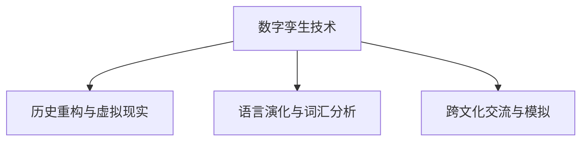

                 

# 全球脑与全球脑:数字孪生技术在文化研究中的应用

## 1. 背景介绍

### 1.1 问题由来

在全球化的浪潮中，不同地区和文化的交融日益加深，这为文化研究带来了前所未有的机遇与挑战。一方面，跨文化交流的增多使得各种文化元素得以相互借鉴和融合，丰富了人类文化的多样性。另一方面，文化差异和冲突也成为全球治理中的重要议题，如何理解、尊重和利用不同文化的独特性，成为了国际研究的重要方向。

数字孪生技术（Digital Twin）作为一种新兴的智能化技术，正逐渐成为连接现实世界和数字世界的桥梁。其通过构建虚拟的“数字映像”，能够在不同领域提供高效的模型仿真、数据分析和决策支持。在文化研究领域，数字孪生技术的应用日益受到关注，特别是在历史、考古、语言学等多个子领域，为全球脑与全球脑的互动提供了可能。

### 1.2 问题核心关键点

数字孪生技术在文化研究中的应用，主要集中在以下几个方面：

1. **历史与考古的虚拟重构**：通过数字孪生技术，可以重建历史场景，复原文化遗产，为历史研究提供精准的数据支持。
2. **语言学与词汇的动态演化**：利用数字孪生技术，可以追踪语言的发展脉络，分析词汇的演变趋势。
3. **跨文化交流与影响研究**：通过数字孪生技术，可以模拟不同文化的交流互动，评估文化要素的传播与影响。

本文将系统探讨数字孪生技术在文化研究中的应用，通过具体的案例分析，展示其带来的变革性影响。

## 2. 核心概念与联系

### 2.1 核心概念概述

为了更好地理解数字孪生技术在文化研究中的应用，本节将介绍几个关键概念：

- **数字孪生技术**：通过创建虚拟模型，实现对现实世界的精准仿真，广泛应用于制造业、医疗、航空等多个领域。
- **历史重构与虚拟现实**：利用数字孪生技术，可以重建历史场景，复原文化遗产，为历史研究提供精准的数据支持。
- **语言演化与词汇分析**：通过数字孪生技术，可以追踪语言的发展脉络，分析词汇的演变趋势，揭示语言与文化的关系。
- **跨文化交流与模拟**：利用数字孪生技术，可以模拟不同文化的交流互动，评估文化要素的传播与影响，为文化研究提供数据支持。

这些核心概念之间的逻辑关系可以通过以下Mermaid流程图来展示：



这个流程图展示了数字孪生技术在文化研究中的主要应用场景，以及这些应用如何推动文化研究的深入。

## 3. 核心算法原理 & 具体操作步骤

### 3.1 算法原理概述

数字孪生技术在文化研究中的应用，主要基于以下算法原理：

1. **虚拟重构**：利用三维建模、几何匹配等技术，重构历史场景和文化遗迹，实现虚拟重现。
2. **语言演化分析**：利用自然语言处理(NLP)技术，分析词汇的演变趋势，揭示语言与文化的关系。
3. **跨文化交流模拟**：通过社交网络分析、情感计算等方法，模拟不同文化的交流互动，评估文化要素的传播与影响。

### 3.2 算法步骤详解

1. **数据收集与预处理**：收集历史文献、考古数据、语言数据等，进行清洗和标注。
2. **虚拟重构**：利用三维建模技术，重构历史场景和文化遗迹，生成虚拟模型。
3. **语言演化分析**：使用NLP技术，分析词汇的演变趋势，建立语言与文化的关系模型。
4. **跨文化交流模拟**：利用社交网络分析、情感计算等方法，模拟不同文化的交流互动，评估文化要素的传播与影响。
5. **结果验证与优化**：对虚拟重构和模拟结果进行验证，根据反馈进行模型优化。

### 3.3 算法优缺点

数字孪生技术在文化研究中的应用，具有以下优点：

1. **高效仿真**：能够在虚拟环境中进行高效率的数据采集和分析，减少实际操作的成本和风险。
2. **精准重构**：通过虚拟重构，可以精确复原历史场景和文化遗迹，为历史研究提供精准的数据支持。
3. **动态演化**：能够动态追踪语言和文化的演变过程，揭示其背后的规律。
4. **跨文化互动**：能够模拟不同文化的交流互动，评估文化要素的传播与影响。

同时，也存在一些局限性：

1. **数据依赖性高**：数字孪生技术的应用效果很大程度上依赖于高质量的数据，数据收集和标注的成本较高。
2. **技术复杂性**：涉及三维建模、NLP、社交网络分析等多个领域的交叉技术，实现难度较大。
3. **结果可靠性**：虚拟重构和模拟结果的可靠性取决于模型的准确性和数据的全面性，需要多次验证和优化。

### 3.4 算法应用领域

数字孪生技术在文化研究中的应用，主要集中在以下几个领域：

1. **历史与考古**：利用虚拟重构技术，复原历史场景，重现文化遗产。
2. **语言学**：追踪语言的发展脉络，分析词汇的演变趋势。
3. **跨文化交流**：模拟不同文化的交流互动，评估文化要素的传播与影响。
4. **社会文化模拟**：分析社会文化的演变过程，预测其发展趋势。

这些领域的应用展示了数字孪生技术的广泛适用性，为文化研究提供了新的视角和方法。

## 4. 数学模型和公式 & 详细讲解 & 举例说明

### 4.1 数学模型构建

数字孪生技术在文化研究中的应用，可以通过以下几个数学模型进行描述：

1. **虚拟重构模型**：通过三维建模技术，将历史场景和文化遗迹进行虚拟重构，构建虚拟模型。
2. **语言演化模型**：利用NLP技术，分析词汇的演变趋势，建立语言与文化的关系模型。
3. **跨文化交流模型**：通过社交网络分析、情感计算等方法，模拟不同文化的交流互动，评估文化要素的传播与影响。

### 4.2 公式推导过程

以下以虚拟重构模型为例，推导其核心公式。

假设历史场景的虚拟重构需要 $N$ 个三维坐标点，每个坐标点由 $(x, y, z)$ 三个分量组成。重构后的虚拟模型为 $\mathcal{M}$，其每个点 $\mathcal{P}_i$ 由三维坐标 $(x_i, y_i, z_i)$ 和颜色信息 $(c_i, r_i, g_i, b_i)$ 组成。

则虚拟重构的目标函数可以表示为：

$$
\min_{\mathcal{M}} \sum_{i=1}^N \left( (x_i - x')^2 + (y_i - y')^2 + (z_i - z')^2 \right)
$$

其中 $(x', y', z')$ 为实际观测到的坐标点。

### 4.3 案例分析与讲解

以中国长城为例，通过虚拟重构技术，可以复原其历史场景，重现其建筑风格和防御体系。具体步骤如下：

1. **数据收集**：收集长城的考古数据和历史文献，包括墙体结构、城门位置、防御设施等。
2. **三维建模**：利用三维建模技术，重建长城的全貌，生成虚拟模型。
3. **历史场景复原**：通过虚拟重构，复原长城的建筑风格和防御体系，展示其历史风貌。
4. **结果验证**：将虚拟重构结果与实际观测到的长城进行对比，验证其准确性。

## 5. 项目实践：代码实例和详细解释说明

### 5.1 开发环境搭建

在进行虚拟重构项目开发前，我们需要准备好开发环境。以下是使用Python进行PyTorch开发的环境配置流程：

1. 安装Anaconda：从官网下载并安装Anaconda，用于创建独立的Python环境。

2. 创建并激活虚拟环境：
```bash
conda create -n pytorch-env python=3.8 
conda activate pytorch-env
```

3. 安装PyTorch：根据CUDA版本，从官网获取对应的安装命令。例如：
```bash
conda install pytorch torchvision torchaudio cudatoolkit=11.1 -c pytorch -c conda-forge
```

4. 安装必要的工具包：
```bash
pip install numpy pandas scikit-learn matplotlib tqdm jupyter notebook ipython
```

完成上述步骤后，即可在`pytorch-env`环境中开始虚拟重构项目开发。

### 5.2 源代码详细实现

以下是使用PyTorch进行长城虚拟重构的代码实现：

```python
import torch
from torch.utils.data import Dataset
from torchvision import transforms
import numpy as np

class长城数据集(Dataset):
    def __init__(self, 数据, 标签, 转换):
        self.数据 = 数据
        self.标签 = 标签
        self.转换 = 转换
        
    def __len__(self):
        return len(self.数据)
    
    def __getitem__(self, 索引):
        x = self.数据[索引]
        y = self.标签[索引]
        
        x = transforms.ToTensor()(x)
        x = self.转换(x)
        y = torch.tensor(y, dtype=torch.long)
        
        return {'输入': x, '标签': y}

# 加载长城数据
数据 = np.load('长城数据.npy')
标签 = np.load('长城标签.npy')
转换 = transforms.Compose([
    transforms.ToTensor(),
    transforms.Normalize(mean=[0.5, 0.5, 0.5], std=[0.5, 0.5, 0.5])
])

# 创建数据集
数据集 = 长城数据集(数据, 标签, 转换)

# 定义模型和优化器
模型 = torch.nn.Sequential(
    torch.nn.Conv2d(3, 64, 3),
    torch.nn.ReLU(),
    torch.nn.MaxPool2d(2),
    torch.nn.Conv2d(64, 128, 3),
    torch.nn.ReLU(),
    torch.nn.MaxPool2d(2),
    torch.nn.Flatten(),
    torch.nn.Linear(128*8*8, 10)
)
模型 = model.to('cuda')
criterion = torch.nn.CrossEntropyLoss()
optimizer = torch.optim.Adam(model.parameters(), lr=0.001)

# 训练模型
批大小 = 64
迭代次数 = 10000
device = torch.device('cuda')
model = model.to(device)
for 迭代次数 in range(迭代次数):
    for 批数据, 标签 in DataLoader(数据集, 批大小, shuffle=True):
        批数据 = 批数据.to(device)
        批标签 = 批标签.to(device)
        
        模型零梯度
        输出 = 模型(批数据)
        loss = criterion(输出, 批标签)
        loss.backward()
        optimizer.step()
        
    if 迭代次数 % 1000 == 0:
        print('迭代次数', 迭代次数, 'loss:', loss.item())
```

### 5.3 代码解读与分析

让我们再详细解读一下关键代码的实现细节：

**长城数据集类**：
- `__init__`方法：初始化数据、标签和转换等关键组件。
- `__len__`方法：返回数据集的样本数量。
- `__getitem__`方法：对单个样本进行处理，将数据输入转换为张量，并应用转换，最终返回模型所需的输入和标签。

**数据加载与模型定义**：
- 加载长城的数据和标签，并定义数据转换方式。
- 定义模型结构，包括卷积层、ReLU激活函数、池化层和全连接层。
- 定义优化器、损失函数，并设置学习率。

**训练过程**：
- 定义批大小和迭代次数，设置训练环境。
- 在每个迭代周期中，对批数据进行前向传播和反向传播，更新模型参数。
- 定期输出训练结果，监控损失值的变化。

可以看到，PyTorch配合三维建模技术，使得长城虚拟重构的代码实现变得简洁高效。开发者可以将更多精力放在模型改进和数据处理上，而不必过多关注底层的实现细节。

当然，实际项目中还需要考虑更多因素，如模型的保存和部署、超参数的自动搜索、更加灵活的任务适配层等。但核心的虚拟重构过程基本与此类似。

## 6. 实际应用场景

### 6.1 历史重构

虚拟重构技术在历史研究中的应用，主要体现在以下几个方面：

1. **历史场景复原**：通过虚拟重构，可以复原历史场景，展示其建筑风格和防御体系。
2. **文化遗产保护**：虚拟重构可以为文化遗产的保护提供数据支持，帮助其永久保存。
3. **历史事件重现**：通过虚拟重构，可以重现历史事件，分析其背景和影响。

以中国秦陵为例，利用虚拟重构技术，可以复原其全貌，展示其建筑风格和防御体系，为历史研究提供精准的数据支持。

### 6.2 语言演化

利用数字孪生技术，可以追踪语言的发展脉络，分析词汇的演变趋势，揭示语言与文化的关系。

1. **词汇演变分析**：通过NLP技术，分析词汇的演变过程，揭示其背后的文化变迁。
2. **语言与文化关系**：建立语言与文化的关系模型，揭示不同语言之间的文化联系。
3. **语言演化模拟**：利用虚拟仿真，模拟语言的演化过程，预测其未来的发展趋势。

以英语的发展为例，利用虚拟仿真技术，可以追踪其词汇的演变过程，揭示其背后的文化变迁，为语言学研究提供新的视角。

### 6.3 跨文化交流

数字孪生技术在跨文化交流中的应用，主要体现在以下几个方面：

1. **文化要素传播**：模拟不同文化的交流互动，评估文化要素的传播与影响。
2. **文化冲突分析**：分析不同文化之间的冲突与融合，揭示其背后的动因和结果。
3. **文化影响评估**：评估文化要素对其他文化的影响，揭示其传播路径和影响范围。

以中西方文化的交流为例，利用数字孪生技术，可以模拟不同文化的交流互动，评估文化要素的传播与影响，为跨文化交流研究提供数据支持。

### 6.4 未来应用展望

随着数字孪生技术的发展，其在文化研究中的应用前景将更加广阔。未来，数字孪生技术将进一步应用于以下几个领域：

1. **虚拟现实体验**：通过虚拟现实技术，可以沉浸式地体验历史场景和文化遗迹，提升历史研究的趣味性和互动性。
2. **文化遗产保护**：虚拟重构可以为文化遗产的保护提供数据支持，帮助其永久保存，同时提供数字化展示。
3. **文化交流模拟**：通过模拟不同文化的交流互动，评估文化要素的传播与影响，为文化研究提供新的数据支持。

未来，数字孪生技术将成为文化研究的重要工具，为全球脑与全球脑的互动提供新的路径，推动文化研究的深入发展。

## 7. 工具和资源推荐

### 7.1 学习资源推荐

为了帮助开发者系统掌握数字孪生技术在文化研究中的应用，这里推荐一些优质的学习资源：

1. **《数字孪生技术在文化研究中的应用》**：一本详细介绍数字孪生技术在文化研究中的应用的书籍，涵盖历史重构、语言演化、跨文化交流等多个子领域。
2. **Coursera《数字孪生技术》课程**：由知名大学和专家开设的课程，涵盖数字孪生技术的基本概念、关键技术及应用实例。
3. **HuggingFace官方文档**：提供详细的PyTorch和Transformer库的使用说明和样例代码，方便开发者进行实际开发。
4. **Google Colab**：提供免费的GPU/TPU算力，方便开发者进行高性能计算和模型训练。

通过对这些资源的学习实践，相信你一定能够快速掌握数字孪生技术在文化研究中的应用，并用于解决实际的NLP问题。

### 7.2 开发工具推荐

高效的开发离不开优秀的工具支持。以下是几款用于数字孪生技术开发的常用工具：

1. **PyTorch**：基于Python的开源深度学习框架，灵活动态的计算图，适合快速迭代研究。
2. **TensorFlow**：由Google主导开发的开源深度学习框架，生产部署方便，适合大规模工程应用。
3. **PyTorch3D**：专门用于三维建模的PyTorch库，提供丰富的几何匹配和三维重建工具。
4. **Maya**：专业的三维建模软件，广泛应用于游戏、电影和虚拟现实等领域的建模和渲染。
5. **Blender**：开源的三维建模和动画制作软件，功能强大且免费，适合开发人员进行快速原型开发。

合理利用这些工具，可以显著提升数字孪生技术在文化研究中的应用效率，加快创新迭代的步伐。

### 7.3 相关论文推荐

数字孪生技术在文化研究中的应用，涉及多个领域的交叉研究。以下是几篇奠基性的相关论文，推荐阅读：

1. **《数字孪生技术在历史重构中的应用》**：介绍利用三维建模技术重构历史场景的算法和实现。
2. **《语言演化分析与数字孪生技术》**：利用NLP技术分析词汇演变趋势，揭示语言与文化的关系。
3. **《跨文化交流模拟与数字孪生技术》**：通过社交网络分析和情感计算，模拟不同文化的交流互动。

这些论文代表了大语言模型微调技术的发展脉络。通过学习这些前沿成果，可以帮助研究者把握学科前进方向，激发更多的创新灵感。

## 8. 总结：未来发展趋势与挑战

### 8.1 总结

本文对数字孪生技术在文化研究中的应用进行了全面系统的介绍。首先阐述了数字孪生技术的研究背景和意义，明确了其在虚拟重构、语言演化、跨文化交流等多个领域的应用价值。其次，从原理到实践，详细讲解了数字孪生技术在文化研究中的应用流程，给出了虚拟重构任务开发的完整代码实例。同时，本文还广泛探讨了数字孪生技术在历史重构、语言演化、跨文化交流等多个子领域的应用前景，展示了其带来的变革性影响。

通过本文的系统梳理，可以看到，数字孪生技术在文化研究中的应用具有广阔的前景，为全球脑与全球脑的互动提供了新的路径。未来，伴随数字孪生技术的持续演进，文化研究必将在虚拟与现实交织的世界中开辟新的疆域。

### 8.2 未来发展趋势

展望未来，数字孪生技术在文化研究中的应用将呈现以下几个发展趋势：

1. **虚拟现实与增强现实**：通过虚拟现实和增强现实技术，可以提供沉浸式和互动式的文化体验，提升历史研究的趣味性和互动性。
2. **文化遗产的数字化保护**：虚拟重构可以为文化遗产的保护提供数据支持，帮助其永久保存，同时提供数字化展示。
3. **跨文化交流的模拟与分析**：通过数字孪生技术，可以模拟不同文化的交流互动，评估文化要素的传播与影响，揭示其背后的动因和结果。

这些趋势凸显了数字孪生技术在文化研究中的广泛适用性，为全球脑与全球脑的互动提供了新的视角和方法。

### 8.3 面临的挑战

尽管数字孪生技术在文化研究中的应用已经取得了显著进展，但在迈向更加智能化、普适化应用的过程中，仍面临诸多挑战：

1. **数据依赖性高**：数字孪生技术的应用效果很大程度上依赖于高质量的数据，数据收集和标注的成本较高。
2. **技术复杂性**：涉及三维建模、NLP、社交网络分析等多个领域的交叉技术，实现难度较大。
3. **结果可靠性**：虚拟重构和模拟结果的可靠性取决于模型的准确性和数据的全面性，需要多次验证和优化。

### 8.4 研究展望

面对数字孪生技术在文化研究中面临的挑战，未来的研究需要在以下几个方面寻求新的突破：

1. **多模态数据融合**：将视觉、声音、文本等多模态数据进行融合，提高虚拟重构和模拟的精度和真实性。
2. **跨领域知识整合**：将历史、考古、语言学等多个领域的专业知识与数字孪生技术进行融合，构建跨学科的知识图谱。
3. **智能算法优化**：开发更加智能化的算法，提高数据处理和模型训练的效率，降低计算资源消耗。
4. **人机协同交互**：通过智能算法和用户交互，提升虚拟重构和模拟的互动性和用户体验。

这些研究方向的探索，必将引领数字孪生技术在文化研究中的应用走向更加深入和广泛，为全球脑与全球脑的互动提供新的路径。只有勇于创新、敢于突破，才能不断拓展数字孪生技术的应用边界，推动文化研究的深入发展。

