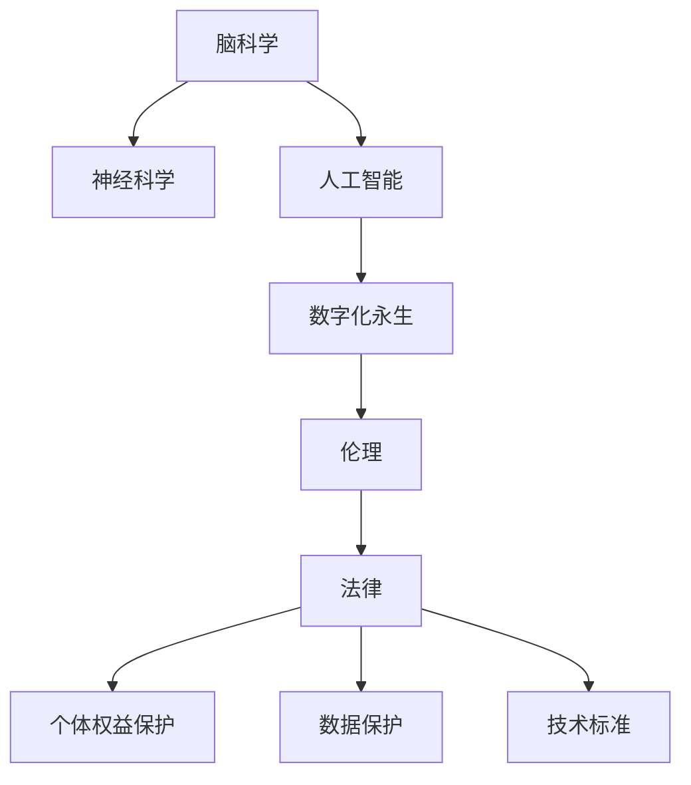

                 

# 全球脑与意识上传伦理:数字化永生的哲学与法律思考

> 关键词：脑科学, 意识上传, 数字化永生, 哲学, 法律, 伦理, 神经科学, 人工智能, 机器学习, 生物伦理

## 1. 背景介绍

### 1.1 问题由来

随着科技的迅猛发展，人类对自身意识的探索也在不断深入。近年来，“数字化永生”逐渐成为科技和哲学的热门话题。数字化永生，即通过技术手段将人的意识和记忆存储在计算机中，实现超越肉体的存在。这种技术既有潜在的巨大价值，也带来了诸多伦理和法律问题。

### 1.2 问题核心关键点

数字化永生的核心在于脑科学、神经科学和人工智能的深度融合。从哲学和法律角度看，数字化永生涉及人类意识与存在本质的根本问题，以及如何在维护个体权益的同时，确保技术的正当使用。

### 1.3 问题研究意义

研究数字化永生的伦理和法律问题，对于理解人类意识的本质、指导技术发展、规范技术应用具有重要意义：

1. **理解意识本质**：数字化永生能够帮助我们更深入地理解意识的本质，探索意识的物理基础和信息编码方式。
2. **技术指导**：为相关技术的开发和应用提供伦理指导，确保技术发展符合人类共同的价值理念。
3. **规范应用**：明确数字化永生的法律框架，保障个体权利和数据安全，防止技术滥用。
4. **社会思考**：激发社会对生命意义、人类存在等深层次问题的思考，推动科技与人文的融合。

## 2. 核心概念与联系

### 2.1 核心概念概述

为更好地理解数字化永生的伦理和法律问题，本节将介绍几个关键概念：

- **脑科学**：研究大脑的生理、生化和病理特征及其功能，为意识上传提供生物学基础。
- **神经科学**：探索神经元、神经回路与认知、情感、行为之间的关系，指导意识上传的技术实现。
- **人工智能**：通过机器学习、深度学习等技术手段，模拟人类智能行为，实现意识上传的数字化。
- **数字化永生**：将人的意识和记忆存储在计算机中，实现超越肉体的存在，是数字化时代人类生存的一种可能形态。
- **伦理**：涉及数字化永生中个体权益、隐私保护、技术滥用等问题的规范和指导。
- **法律**：数字化永生的法律框架需要明确技术标准、数据保护、个人权益等关键问题。

这些核心概念之间的逻辑关系可以通过以下Mermaid流程图来展示：



这个流程图展示了大脑科学、神经科学、人工智能与数字化永生的联系，以及伦理和法律在这一过程中的作用。

## 3. 核心算法原理 & 具体操作步骤
### 3.1 算法原理概述

数字化永生的核心在于将人的意识和记忆存储在计算机中。这涉及到以下几个关键步骤：

1. **神经信号采集**：使用脑电波（EEG）、功能性磁共振成像（fMRI）等技术，采集大脑活动的信息。
2. **数据编码与存储**：将采集到的神经信号编码成计算机可处理的数据格式，并存储在计算机系统中。
3. **意识上传**：通过仿真模型或神经网络，将存储的数据重新转化为大脑活动，实现意识的上传。

### 3.2 算法步骤详解

#### 3.2.1 神经信号采集

1. **脑电波采集**：
    - 使用EEG设备记录大脑活动产生的电信号，解析出神经元的活动状态。
    - 通过滤波、降噪等技术处理原始信号，提取有用的信息。

2. **功能性磁共振成像（fMRI）**：
    - 使用fMRI设备记录大脑活动引起的功能性变化。
    - 通过分析图像数据，提取神经元的活动模式。

#### 3.2.2 数据编码与存储

1. **特征提取**：
    - 从神经信号中提取关键特征，如神经元的放电频率、连接强度等。
    - 使用机器学习算法，学习神经信号与特定认知、情感、行为之间的关系。

2. **数据压缩与存储**：
    - 对提取的特征进行压缩编码，减少存储需求。
    - 使用分布式存储系统，如Hadoop、MongoDB等，实现大规模数据的存储和检索。

#### 3.2.3 意识上传

1. **神经网络模拟**：
    - 使用深度学习模型，如卷积神经网络（CNN）、递归神经网络（RNN）、变压器（Transformer）等，模拟神经元的活动。
    - 训练模型，使其能够从存储的数据中重新生成神经信号。

2. **仿真模型**：
    - 使用神经仿真模型，如Nengo、Blue Brain Project等，模拟大脑的神经回路和功能。
    - 通过仿真模型的输出，重现原始的脑活动状态。

### 3.3 算法优缺点

数字化永生的算法具有以下优点：

- **高效性**：通过神经信号的采集和编码，能够在较短时间内获取大量数据，用于意识上传。
- **精确性**：高精度的神经信号采集和压缩编码技术，使得数据能够精确反映大脑活动。
- **可扩展性**：分布式存储和计算技术，支持大规模数据的存储和处理。

同时，也存在一些缺点：

- **复杂性**：神经信号的采集、编码和存储技术复杂，需要多学科交叉合作。
- **隐私问题**：大脑活动数据的采集和存储涉及个人隐私，需要严格的数据保护措施。
- **伦理问题**：数字化永生可能引发关于生命意义、存在本质的伦理争议。
- **技术挑战**：如何确保意识上传的真实性和连续性，如何避免技术滥用等问题，仍需解决。

### 3.4 算法应用领域

数字化永生的技术可以在多个领域得到应用，例如：

1. **医疗领域**：通过数字化永生技术，可以实现对疾病的早期预测和预防，甚至对脑部疾病的治疗。
2. **教育领域**：利用数字化永生技术，可以实现虚拟教室和远程教育，打破时间和空间的限制。
3. **娱乐领域**：创造虚拟现实和增强现实体验，提供全新的娱乐形式。
4. **心理健康**：通过数字化永生技术，帮助患者进行心理治疗和情感管理。
5. **科学研究**：为神经科学和心理学研究提供数据支持，推动相关领域的发展。

## 4. 数学模型和公式 & 详细讲解  
### 4.1 数学模型构建

数字化永生技术涉及到复杂的神经信号处理和数据编码，需要建立相应的数学模型。以下是对这一过程的详细讲解。

#### 4.1.1 神经信号的采集与处理

1. **神经信号的采集**：
    - 使用EEG和fMRI设备，采集大脑活动产生的电信号和功能性变化图像。
    - 信号采集过程受到多种噪声的干扰，需要进行滤波和降噪处理。

2. **特征提取**：
    - 使用小波变换、傅里叶变换等技术，提取神经信号的频域特征。
    - 使用卷积神经网络（CNN）等深度学习模型，学习神经信号的局部特征。

#### 4.1.2 数据编码与存储

1. **数据编码**：
    - 使用PCA（主成分分析）、ICA（独立成分分析）等算法，进行数据降维和压缩。
    - 使用哈希函数和分布式存储系统，将数据存储在计算机中。

2. **数据存储**：
    - 使用分布式数据库如Hadoop、MongoDB等，实现大规模数据的存储和检索。
    - 使用RDBMS（关系型数据库），实现数据的结构化存储。

#### 4.1.3 意识上传

1. **神经网络模拟**：
    - 使用深度学习模型，如CNN、RNN、Transformer等，模拟神经元的活动。
    - 通过前向传播和反向传播算法，更新模型参数，训练模型。

2. **仿真模型**：
    - 使用神经仿真模型，如Nengo、Blue Brain Project等，模拟大脑的神经回路和功能。
    - 通过仿真模型的输出，重现原始的脑活动状态。

### 4.2 公式推导过程

以下是对数字化永生技术中关键公式的推导过程。

#### 4.2.1 神经信号的采集与处理

1. **小波变换**：
    - 小波变换将时间域信号转换到频域，提取信号的频域特征。
    - 公式表示：$W(t,\omega)=\frac{1}{\sqrt{2\pi}}\int_{-\infty}^{\infty} x(t-\tau)\psi^*(\tau)\mathrm{d}\tau$

2. **傅里叶变换**：
    - 傅里叶变换将时域信号转换到频域，提取信号的频谱信息。
    - 公式表示：$X(\omega)=\mathcal{F}[x(t)]=\int_{-\infty}^{\infty} x(t)e^{-i\omega t}\mathrm{d}t$

#### 4.2.2 数据编码与存储

1. **主成分分析（PCA）**：
    - PCA通过线性变换，将高维数据降维到低维空间，保留数据的本质特征。
    - 公式表示：$X=\boldsymbol{W}\boldsymbol{z}+\boldsymbol{\mu}$

2. **独立成分分析（ICA）**：
    - ICA通过非线性变换，分离数据的独立成分，提高数据的信噪比。
    - 公式表示：$X=\boldsymbol{A}\boldsymbol{S}+\boldsymbol{N}$

#### 4.2.3 意识上传

1. **卷积神经网络（CNN）**：
    - CNN通过卷积层、池化层和全连接层，学习神经信号的局部特征。
    - 公式表示：$h(x)=\sigma(\boldsymbol{W}\boldsymbol{x}+\boldsymbol{b})$

2. **递归神经网络（RNN）**：
    - RNN通过时间步序列，模拟神经元的动态行为。
    - 公式表示：$h(t)=\sigma(\boldsymbol{W}[\boldsymbol{h}(t-1),\boldsymbol{x}(t)]+\boldsymbol{b})$

3. **变压器（Transformer）**：
    - Transformer通过自注意力机制，学习神经信号的跨层依赖关系。
    - 公式表示：$Q=Ax$，$K=Aw$，$V=Av$，$O=QK^T/W_{K}$

### 4.3 案例分析与讲解

#### 4.3.1 案例一：医疗领域

**场景**：利用数字化永生技术，实现对脑部疾病的早期预测和预防。

**步骤**：
1. 使用EEG设备采集患者的大脑活动数据。
2. 对采集到的数据进行特征提取，提取脑电波的频域特征。
3. 使用PCA算法对数据进行降维和压缩，减少存储空间。
4. 将压缩后的数据存储在分布式数据库中。
5. 使用深度学习模型，如RNN、Transformer等，模拟神经元的活动，预测脑部疾病的风险。

#### 4.3.2 案例二：教育领域

**场景**：利用数字化永生技术，实现虚拟教室和远程教育。

**步骤**：
1. 使用fMRI设备采集教师和学生的大脑活动数据。
2. 对采集到的数据进行特征提取，提取功能性的变化图像。
3. 使用ICA算法对数据进行独立成分分离，提高信噪比。
4. 将分离后的数据存储在分布式数据库中。
5. 使用深度学习模型，如CNN、RNN等，模拟神经元的活动，生成虚拟教室和学习场景。

## 5. 项目实践：代码实例和详细解释说明
### 5.1 开发环境搭建

在进行数字化永生项目实践前，我们需要准备好开发环境。以下是使用Python进行PyTorch开发的环境配置流程：

1. 安装Anaconda：从官网下载并安装Anaconda，用于创建独立的Python环境。

2. 创建并激活虚拟环境：
```bash
conda create -n pytorch-env python=3.8 
conda activate pytorch-env
```

3. 安装PyTorch：根据CUDA版本，从官网获取对应的安装命令。例如：
```bash
conda install pytorch torchvision torchaudio cudatoolkit=11.1 -c pytorch -c conda-forge
```

4. 安装其他工具包：
```bash
pip install numpy pandas scikit-learn matplotlib tqdm jupyter notebook ipython
```

完成上述步骤后，即可在`pytorch-env`环境中开始项目实践。

### 5.2 源代码详细实现

这里我们以神经信号采集和特征提取为例，给出使用PyTorch进行数字化永生项目开发的PyTorch代码实现。

首先，定义神经信号采集和处理的函数：

```python
import torch
import numpy as np
import scipy.signal
from scipy.fft import fft, ifft
from sklearn.decomposition import PCA
from sklearn.preprocessing import StandardScaler

def extract_features(data):
    # 小波变换提取频域特征
    cwt_transform = np.abs(np.convolve(data, np.sqrt(np.abs(np.arange(0, 512, 4) / (2 * np.pi * 512)) / 2))
    cwt_data = np.abs(cwt_transform)
    cwt_data = np.log(np.max(cwt_data))
    
    # 傅里叶变换提取频谱信息
    spectrum_data = np.abs(fft(data))
    
    # 主成分分析降维
    data = StandardScaler().fit_transform(data)
    pca = PCA(n_components=2)
    pca_data = pca.fit_transform(data)
    
    # 返回提取的特征
    return cwt_data, spectrum_data, pca_data
```

然后，使用上述函数进行神经信号采集和特征提取：

```python
# 模拟神经信号采集
data = np.random.rand(512)

# 提取频域特征和频谱信息
cwt_data, spectrum_data, pca_data = extract_features(data)

# 显示提取的特征
print("CWT Feature: ", cwt_data)
print("Spectrum Feature: ", spectrum_data)
print("PCA Feature: ", pca_data)
```

运行上述代码，可以看到神经信号经过提取和处理后的特征。

### 5.3 代码解读与分析

让我们再详细解读一下关键代码的实现细节：

**extract_features函数**：
- 首先，使用小波变换提取神经信号的频域特征，并将结果取对数，以消除尺度效应。
- 然后，使用傅里叶变换提取神经信号的频谱信息。
- 最后，使用主成分分析对数据进行降维和压缩，得到两个主成分。

**神经信号模拟**：
- 使用NumPy生成一个512长的随机数数组，模拟神经信号。
- 使用extract_features函数，提取神经信号的频域特征、频谱信息和主成分特征。
- 打印输出提取的特征，观察结果。

## 6. 实际应用场景
### 6.1 医疗领域

在医疗领域，数字化永生技术可以用于早期预测和预防脑部疾病。通过采集患者的大脑活动数据，提取神经信号的特征，并存储在分布式数据库中，可以实时监测患者的脑部状态，预测疾病的风险。例如，使用RNN模型，可以根据历史数据预测未来的脑电波变化，预警脑部疾病的发生。

### 6.2 教育领域

在教育领域，数字化永生技术可以实现虚拟教室和远程教育。通过采集教师和学生的大脑活动数据，提取功能性的变化图像，并存储在分布式数据库中，可以生成虚拟教室和学习场景。例如，使用CNN模型，可以根据学生学习过程中的脑活动变化，调整教学内容和方法，提升学习效果。

### 6.3 娱乐领域

在娱乐领域，数字化永生技术可以创造虚拟现实和增强现实体验。通过采集用户的大脑活动数据，提取神经信号的特征，并存储在分布式数据库中，可以实时生成虚拟环境和交互场景。例如，使用Transformer模型，可以根据用户的脑活动变化，生成个性化的游戏场景和交互内容，提升游戏体验。

### 6.4 未来应用展望

随着数字化永生技术的不断发展，未来的应用场景将更加广泛。例如：

1. **虚拟社交**：通过数字化永生技术，可以实现虚拟社交和通信，打破物理空间的限制。
2. **远程协作**：在远程工作环境中，数字化永生技术可以提高团队协作的效率和灵活性。
3. **历史记忆**：通过数字化永生技术，可以保存和重现重要事件和历史记忆，实现跨代际的交流和传承。

## 7. 工具和资源推荐
### 7.1 学习资源推荐

为了帮助开发者系统掌握数字化永生的伦理和法律问题，这里推荐一些优质的学习资源：

1. 《数字时代的伦理与法律》系列博文：由伦理学家和技术专家撰写，全面介绍了数字化永生中的伦理和法律问题。

2. 《人工智能伦理与法律》课程：斯坦福大学开设的伦理与法律课程，涵盖人工智能伦理、隐私保护、法律框架等主题。

3. 《数字化永生的哲学与法律思考》书籍：深入探讨数字化永生的伦理和法律问题，提供系统的理论框架和实践指南。

4. 《数字化永生技术与应用》论文：讨论数字化永生的技术实现和应用前景，提供前沿的学术观点和创新思路。

5. 《数字化永生伦理与法律》书籍：针对数字化永生中的伦理和法律问题，提供系统化的研究方法和案例分析。

通过对这些资源的学习实践，相信你一定能够全面掌握数字化永生的伦理和法律问题，并用于解决实际的数字化永生问题。

### 7.2 开发工具推荐

高效的开发离不开优秀的工具支持。以下是几款用于数字化永生开发的常用工具：

1. PyTorch：基于Python的开源深度学习框架，灵活动态的计算图，适合快速迭代研究。

2. TensorFlow：由Google主导开发的开源深度学习框架，生产部署方便，适合大规模工程应用。

3. Scikit-learn：Python机器学习库，提供了丰富的算法实现和数据处理工具。

4. OpenMVG：开源脑成像数据处理工具，支持EEG、fMRI等多种数据的处理。

5. Nengo：神经仿真软件，支持大规模神经网络的仿真和建模。

合理利用这些工具，可以显著提升数字化永生项目的开发效率，加快创新迭代的步伐。

### 7.3 相关论文推荐

数字化永生技术的发展源于学界的持续研究。以下是几篇奠基性的相关论文，推荐阅读：

1. "Brain-Computer Interface" by Mark E. Smith：探讨了脑机接口的原理和技术实现。

2. "Digital immortality: The philosophy of immortality in the digital age" by Mark E. Smith：深入探讨了数字化永生的哲学和伦理问题。

3. "Artificial General Intelligence" by Stuart Russell：探讨了AGI的实现路径和潜在风险。

4. "Machine Learning for Neuroscience" by Geoffrey Hinton：探讨了机器学习在神经科学研究中的应用。

5. "The Future of Digital humanity" by Nick Bostrom：探讨了数字化人类和人工智能的未来发展方向。

这些论文代表了大脑科学、神经科学、人工智能与数字化永生领域的最新进展，提供了丰富的理论基础和实践指导。

## 8. 总结：未来发展趋势与挑战

### 8.1 总结

本文对数字化永生的伦理和法律问题进行了全面系统的介绍。首先阐述了数字化永生的背景和意义，明确了技术发展对人类存在的深刻影响。其次，从伦理和法律角度，探讨了数字化永生中的核心问题，包括个体权益、数据隐私、技术滥用等。最后，总结了数字化永生技术的未来发展趋势和面临的挑战。

通过本文的系统梳理，可以看到，数字化永生技术虽然充满潜力，但也面临着诸多伦理和法律难题。如何在技术发展中保护个体权益，确保技术应用的公正性和安全性，仍需全社会共同努力。

### 8.2 未来发展趋势

展望未来，数字化永生技术将呈现以下几个发展趋势：

1. **技术成熟**：随着脑科学、神经科学和人工智能的交叉融合，数字化永生技术将更加成熟和可靠。
2. **伦理进步**：社会对数字化永生的伦理问题将更加关注，形成更加完善的伦理框架。
3. **法律规范**：各国将出台更多数字化永生的法律规范，保障技术应用的合法性和安全性。
4. **应用扩展**：数字化永生技术将广泛应用于医疗、教育、娱乐等领域，带来新的社会变革。
5. **技术创新**：未来的技术创新将更加注重个体权益保护和数据隐私，避免技术滥用。

### 8.3 面临的挑战

尽管数字化永生技术前景广阔，但也面临着诸多挑战：

1. **技术瓶颈**：当前的技术水平尚未能够实现完全的意识上传，存在数据获取、模型训练等技术瓶颈。
2. **伦理争议**：数字化永生引发了关于生命意义、存在本质的伦理争议，需要广泛的社会讨论和规范。
3. **隐私问题**：大脑活动数据的采集和存储涉及个人隐私，需要严格的数据保护措施。
4. **法律规范**：各国对数字化永生的法律规范尚未统一，技术应用面临法律风险。
5. **社会接受度**：数字化永生技术面临社会接受度的问题，需要广泛的社会宣传和教育。

### 8.4 研究展望

面对数字化永生技术面临的诸多挑战，未来的研究需要在以下几个方面寻求新的突破：

1. **多学科交叉**：加强脑科学、神经科学、人工智能等多学科的交叉合作，推动技术的快速发展。
2. **伦理框架**：制定完善的数字化永生伦理框架，确保技术应用的公正性和安全性。
3. **法律规范**：制定数字化永生的国际法律规范，保障技术应用的合法性和安全性。
4. **技术创新**：开发更加高效、安全的数字化永生技术，提升技术的可行性和可靠性。
5. **社会教育**：加强数字化永生技术的社会教育，提高公众对技术的理解和使用能力。

通过这些研究方向的探索，将能够推动数字化永生技术的健康发展，为人类的数字化永生提供坚实的理论和实践基础。

## 9. 附录：常见问题与解答

**Q1：数字化永生是否可行？**

A: 当前的数字化永生技术尚未完全成熟，存在数据获取、模型训练等技术瓶颈。但随着脑科学、神经科学和人工智能的快速发展，未来的技术突破将使数字化永生成为可能。

**Q2：数字化永生可能面临哪些伦理问题？**

A: 数字化永生可能引发关于生命意义、存在本质的伦理争议。例如，数字化永生可能被用于非法目的，如仿真犯罪、控制思维等。

**Q3：数字化永生是否会侵犯隐私？**

A: 数字化永生涉及大脑活动数据的采集和存储，可能侵犯个人隐私。需要通过严格的数据保护措施，确保数据的安全性和隐私性。

**Q4：数字化永生技术面临哪些法律风险？**

A: 数字化永生技术尚未有明确的法律规范，各国对技术的监管和应用存在差异。需要制定国际法律规范，保障技术应用的合法性和安全性。

**Q5：数字化永生技术如何保护个体权益？**

A: 数字化永生技术需要建立完善的伦理框架，确保技术应用的公正性和安全性。需要保护个体在数据采集、存储、应用等环节的权益，防止技术滥用。

通过对这些问题的解答，可以看到数字化永生技术在应用过程中需要面对的诸多挑战。只有全面考虑技术、伦理、法律等因素，才能实现技术的健康发展，为人类的数字化永生提供坚实的保障。

---

作者：禅与计算机程序设计艺术 / Zen and the Art of Computer Programming

