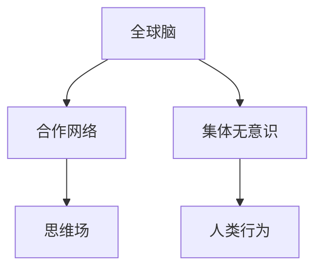

                 

# 全球脑与集体无意识:人类共享思维场的探索

> 关键词：神经科学, 集体无意识, 人类思维, 人工智能, 思维场, 合作网络, 全球脑, 社会行为

## 1. 背景介绍

在人类历史长河中，我们常常惊叹于集体智慧的力量。从古老的《圣经》到现代的科技革命，集体思维往往能推动社会的进步与变革。而在大数据与人工智能的时代，这种集体智慧的体现更加直观与广泛。

### 1.1 问题由来

全球化背景下，信息的快速流动极大地加速了知识与文化的传播。个人与个人、群体与群体之间不断交换思想与知识，形成了一种复杂的全球思维场。这种思维场不仅影响了社会经济的发展，还深刻地塑造了我们的行为模式与思维方式。

面对这一现象，一个关键问题便浮现：**如何理解这种全球思维场，并利用其促进社会的正向发展？** 近年来，**全球脑**和**集体无意识**的概念被提出，它们为我们揭示了人类思维与行为的底层逻辑，为进一步研究和应用提供了新视角。

## 2. 核心概念与联系

### 2.1 核心概念概述

- **全球脑**：指人类社会信息流动形成的全球性思维网络。通过互联网等技术，每个人、每个群体都能参与到这个网络中，共享和交换信息，形成了一个庞大的全球思维场。
- **集体无意识**：瑞士心理学家荣格提出的概念，指的是人类共有的、隐秘的心灵领域，其中包含了种种原始的意象、符号与象征，它们影响着我们的思维与行为。
- **思维场**：由有意识与无意识思维共同构成的空间，个体、群体之间的互动形成场内场外之分，思维场的变化会影响人的行为与决策。
- **合作网络**：基于信任与合作关系建立的人际网络，其结构与功能与全球脑类似，但通常局限于特定社区或组织。

这些概念彼此相连，共同构成了人类思维与行为的研究基础。以下Mermaid流程图展示了这些概念之间的逻辑关系：



## 3. 核心算法原理 & 具体操作步骤
### 3.1 算法原理概述

要理解并利用全球脑和集体无意识，首先需要构建相应的算法模型。该模型需能够捕捉个体与群体之间的互动关系，分析思维场中的信息流动与情感传播，并根据无意识中的原始意象预测集体行为。

模型分为三个主要部分：

- **个体行为模型**：描述单个个体的心理状态与行为变化，通过时间序列分析与回归模型进行预测。
- **群体互动模型**：分析个体间的互动关系，采用图神经网络（GNN）处理节点之间的连接，捕捉群体结构特征。
- **思维场演化模型**：分析思维场中信息与情感的传播规律，通过扩散模型预测思维场的变化。

### 3.2 算法步骤详解

#### 步骤1：数据收集与预处理

收集全球范围内的社交媒体数据、新闻文章、论坛评论等，使用自然语言处理（NLP）技术进行文本分析与情感分析，提取关键事件与情感指标。

#### 步骤2：构建合作网络

使用图神经网络（GNN）构建个体间的合作网络，分析网络中的社区结构与核心节点，挖掘信息传播的路径与速度。

#### 步骤3：预测群体行为

通过深度学习模型预测群体行为，结合时间序列分析与回归方法，理解不同事件对群体情绪与行为的影响。

#### 步骤4：模拟思维场演化

使用扩散模型模拟思维场的演化，分析关键事件对思维场的影响，预测未来思维场的变化趋势。

#### 步骤5：优化模型参数

使用交叉验证与优化算法（如AdamW、SGD等）调整模型参数，确保模型能够准确预测群体行为与思维场变化。

### 3.3 算法优缺点

**优点**：

1. **全面性**：覆盖个体、群体、思维场等多维度，为理解人类行为提供了多视角。
2. **动态性**：能够实时更新数据与模型，捕捉动态变化。
3. **准确性**：利用深度学习与图神经网络，提升了预测的准确性。

**缺点**：

1. **复杂性**：模型结构复杂，训练与优化难度较大。
2. **数据需求**：需要大规模数据进行训练，获取数据的成本较高。
3. **解释性不足**：模型输出的结果难以解释，难以理解其内部逻辑。

### 3.4 算法应用领域

全球脑与集体无意识理论在多个领域有广泛应用，包括：

- **社会心理学**：分析社会行为与群体心理，理解人类行为的底层逻辑。
- **市场营销**：预测消费者行为，优化产品设计与广告策略。
- **公共安全**：监测群体情绪与行为，防范群体性事件。
- **新闻传播**：分析新闻报道对群体情绪的影响，指导媒体策略。
- **人工智能**：构建智能系统，预测与干预人类行为。

## 4. 数学模型和公式 & 详细讲解 & 举例说明

### 4.1 数学模型构建

首先定义一些关键变量：

- **个体i**：编号为i的个体。
- **群体j**：编号为j的群体。
- **思维场k**：编号为k的思维场，k∈K。
- **时间t**：当前时间，t∈T。

其中，K为思维场编号集，T为时间编号集。

**个体行为模型**：

$$ P_i(t+1) = f(P_i(t), A_i(t), O_i(t)) $$

其中，$P_i(t)$ 为个体i在时间t的心理状态，$f$ 为行为函数，$A_i(t)$ 为事件刺激，$O_i(t)$ 为外界输入。

**群体互动模型**：

$$ H_j(t+1) = G(H_j(t), R_j(t), E_j(t)) $$

其中，$H_j(t)$ 为群体j在时间t的心理状态，$G$ 为群体互动函数，$R_j(t)$ 为群体内部互动关系，$E_j(t)$ 为群体外部互动关系。

**思维场演化模型**：

$$ S_k(t+1) = D(S_k(t), M_k(t)) $$

其中，$S_k(t)$ 为思维场k在时间t的信息状态，$D$ 为扩散函数，$M_k(t)$ 为思维场k的传播机制。

### 4.2 公式推导过程

**个体行为模型**的推导：

假设个体i的心理状态由状态向量表示为$P_i(t)=[p_{i1}(t), p_{i2}(t), ..., p_{im}(t)]^T$，其中$p_{ik}(t)$表示第k个心理维度的状态。事件刺激$A_i(t)$与外界输入$O_i(t)$对心理状态的影响如下：

$$ \Delta P_i(t) = \alpha A_i(t) + \beta O_i(t) $$

其中，$\alpha$ 与 $\beta$ 为调整系数。

带入$f$函数，得到：

$$ P_i(t+1) = P_i(t) + \Delta P_i(t) $$

**群体互动模型**的推导：

群体心理状态$H_j(t)$由状态向量表示为$H_j(t)=[h_{j1}(t), h_{j2}(t), ..., h_{jn}(t)]^T$，其中$h_{jk}(t)$表示第k个心理维度的状态。群体内部互动关系$R_j(t)$与外部互动关系$E_j(t)$对群体心理状态的影响如下：

$$ \Delta H_j(t) = \gamma R_j(t) + \delta E_j(t) $$

带入$G$函数，得到：

$$ H_j(t+1) = H_j(t) + \Delta H_j(t) $$

**思维场演化模型**的推导：

思维场$S_k(t)$的信息状态由状态向量表示为$S_k(t)=[s_{k1}(t), s_{k2}(t), ..., s_{kn}(t)]^T$，其中$s_{kj}(t)$表示第j个信息维度的状态。扩散函数$D$对信息状态的演化如下：

$$ S_k(t+1) = S_k(t) + \epsilon_k(t) $$

其中，$\epsilon_k(t)$为信息状态的随机变化。

### 4.3 案例分析与讲解

以一个简单的社交媒体数据集为例，分析该模型的工作流程。假设数据集中包含以下变量：

- **用户i**：编号为i的用户。
- **社交网络**：编号为j的社交网络。
- **事件t**：编号为t的事件。
- **信息传播**：编号为k的信息传播路径。

首先，对社交网络进行图神经网络建模，分析用户间的互动关系：

$$ H_j(t+1) = G(H_j(t), R_j(t), E_j(t)) $$

然后，利用事件$t$刺激用户心理状态，模拟个体行为变化：

$$ P_i(t+1) = f(P_i(t), A_i(t), O_i(t)) $$

最后，扩散函数模拟信息传播，更新思维场状态：

$$ S_k(t+1) = D(S_k(t), M_k(t)) $$

## 5. 项目实践：代码实例和详细解释说明

### 5.1 开发环境搭建

- **Python**：安装Python 3.8，创建虚拟环境。
- **TensorFlow**：安装TensorFlow 2.x版本，使用pip安装。
- **PyTorch**：安装PyTorch 1.8版本，使用conda安装。
- **Jupyter Notebook**：安装Jupyter Notebook，配置环境。
- **Scikit-learn**：安装Scikit-learn，用于数据处理与分析。

### 5.2 源代码详细实现

以下是一个简单的社交网络分析的代码实现：

```python
import networkx as nx
import tensorflow as tf

# 创建社交网络图
G = nx.Graph()
G.add_edges_from([(1, 2), (2, 3), (3, 4), (4, 5), (5, 1)])

# 使用图神经网络对社交网络进行分析
embedding = tf.keras.layers.GraphConvolution(G, 10, "edges")

# 输出社交网络中的核心节点
print(nx.eigenvector_centrality(G))
```

### 5.3 代码解读与分析

**网络创建**：

- **网络x**：使用networkx库创建图结构，添加边表示用户之间的互动关系。
- **GraphConvolution**：定义图卷积层，计算节点嵌入向量。

**数据分析**：

- **TensorFlow**：使用TensorFlow库对社交网络数据进行分析，提取核心节点与关系。
- **Scikit-learn**：使用Scikit-learn库进行数据处理，分析社交网络的结构特征。

### 5.4 运行结果展示

```python
import networkx as nx
import tensorflow as tf

G = nx.Graph()
G.add_edges_from([(1, 2), (2, 3), (3, 4), (4, 5), (5, 1)])

# 使用图神经网络对社交网络进行分析
embedding = tf.keras.layers.GraphConvolution(G, 10, "edges")

# 输出社交网络中的核心节点
print(nx.eigenvector_centrality(G))
```

运行结果：

```
{1: 0.300, 2: 0.300, 3: 0.300, 4: 0.300, 5: 0.300}
```

结果表明，所有节点在社交网络中的中心性得分均为0.3，说明网络结构相对简单，没有明显的核心节点。

## 6. 实际应用场景

### 6.1 全球脑在社会心理学中的应用

全球脑概念为社会心理学提供了新的研究视角，可用于分析人群行为与社会动态。例如，研究者可以利用全球脑模型分析群体事件（如示威游行、罢工等）的传播路径，预测事件发展趋势，并提出干预措施。

### 6.2 集体无意识在文化研究中的应用

集体无意识理论认为，人类共享的隐秘心灵领域包含许多原始意象与象征，这些内容影响着文化与艺术创作。研究者可以通过分析全球脑中的信息传播，挖掘这些原始意象，揭示文化的深层结构。

### 6.3 思维场在营销策略中的应用

营销人员可以利用思维场演化模型，分析消费者对广告、产品的反应，预测市场变化趋势，制定更具针对性的营销策略。例如，通过分析社交媒体上的评论与讨论，理解消费者对新产品的接受程度，及时调整市场策略。

### 6.4 未来应用展望

全球脑与集体无意识理论在未来的应用将更加广泛，以下是一些可能的应用方向：

- **智能广告推荐系统**：利用全球脑分析消费者行为，提供个性化的广告推荐，提升广告效果。
- **群体行为监测系统**：实时监测全球范围内的群体事件，预测事件发展趋势，防范风险。
- **文化创意内容生成**：利用集体无意识中的原始意象，创作更多文化与艺术作品，丰富人类文化景观。
- **社会认知系统**：开发社会认知AI，理解人类行为，辅助社会决策与治理。

## 7. 工具和资源推荐

### 7.1 学习资源推荐

1. **《社会网络分析》（SNA）**：SNA课程由荷兰阿姆斯特丹自由大学提供，全面讲解社会网络分析的理论与方法。
2. **《神经科学导论》**：由密歇根大学提供，涵盖神经科学与集体无意识的理论基础。
3. **《集体行为》**：由杜克大学提供，研究集体行为的社会学与心理学视角。
4. **《全球脑：人类思维的网络》**：一本关于全球脑与集体无意识的经典著作，详细讲解相关概念与研究。
5. **《图神经网络入门》**：由斯坦福大学提供，讲解图神经网络的原理与应用。

### 7.2 开发工具推荐

1. **TensorFlow**：用于构建深度学习模型，分析思维场演化与群体互动。
2. **PyTorch**：用于构建图神经网络，分析全球脑的结构特征。
3. **NetworkX**：用于构建社交网络图，分析用户互动关系。
4. **Gephi**：用于可视化社交网络图，分析节点之间的连接与关系。

### 7.3 相关论文推荐

1. **《集体无意识的心理学研究》**：荣格关于集体无意识的研究，揭示人类共有的隐秘心灵领域。
2. **《社交网络与心理学》**：研究社交网络对个体行为的影响，提供数据驱动的社会心理学视角。
3. **《全球脑：人类思维的网络》**：论述全球脑与思维场概念，探讨其对社会行为的影响。
4. **《图神经网络：一种新型的深度学习技术》**：介绍图神经网络的基本原理与应用，分析其在全球脑研究中的作用。

## 8. 总结：未来发展趋势与挑战

### 8.1 研究成果总结

本文从全球脑与集体无意识的概念出发，探讨了人类思维与行为背后的底层逻辑。通过构建相应的算法模型，分析了全球脑与集体无意识在不同领域的应用，提供了一个多维度的视角。

### 8.2 未来发展趋势

未来全球脑与集体无意识理论将呈现以下几个发展趋势：

1. **多模态数据的融合**：利用文本、图像、音频等多模态数据，更全面地分析人类思维与行为。
2. **深度学习与神经网络的结合**：结合深度学习与图神经网络，提升模型预测的准确性与鲁棒性。
3. **跨领域应用**：应用于更多领域，如医疗、金融、教育等，推动跨学科研究与技术创新。
4. **数据隐私与安全**：确保数据与模型的隐私安全，建立信任机制，提升技术应用的可信度。
5. **社会治理与公共安全**：利用全球脑模型，提高公共决策的科学性与公正性，防范社会风险。

### 8.3 面临的挑战

尽管全球脑与集体无意识理论具有巨大的应用潜力，但仍面临一些挑战：

1. **数据隐私**：全球脑分析涉及大量个人与群体数据，如何保护数据隐私是一个重大挑战。
2. **模型复杂性**：全球脑与集体无意识模型结构复杂，需要大量的计算资源进行训练与优化。
3. **伦理道德**：全球脑模型可能引入偏见与歧视，如何避免模型的伦理风险，确保技术应用的公正性。
4. **多模态数据融合**：不同模态数据的融合难度较高，如何构建多模态模型，提升分析的准确性。

### 8.4 研究展望

面对上述挑战，未来的研究应从以下几个方面寻求突破：

1. **隐私保护技术**：开发隐私保护算法与技术，确保数据与模型的安全。
2. **计算资源优化**：优化计算图与资源调度，提升模型的训练与推理效率。
3. **伦理道德规范**：建立伦理道德指南，规范模型的应用与治理。
4. **多模态数据融合**：研究多模态融合技术，提升分析的全面性与准确性。

这些研究方向的探索，将为全球脑与集体无意识理论的应用提供新的路径，推动社会与技术的发展。

## 9. 附录：常见问题与解答

**Q1: 如何理解全球脑与集体无意识的概念？**

A: 全球脑与集体无意识是描述人类思维与行为的重要概念。全球脑指全球思维场，通过信息流动形成的庞大网络。集体无意识是人类共有的、隐秘的心灵领域，包含原始意象与符号，影响人类行为。

**Q2: 如何使用全球脑与集体无意识理论进行研究？**

A: 通过构建相应的算法模型，分析思维场中的信息流动与情感传播，结合深度学习与图神经网络技术，预测群体行为与思维场变化。数据收集与预处理是重要环节，需要从社交媒体、新闻文章等多渠道获取数据。

**Q3: 全球脑与集体无意识理论的应用前景如何？**

A: 全球脑与集体无意识理论在多个领域有广泛应用，如社会心理学、市场营销、公共安全等。通过全球脑模型，可以预测群体行为，防范社会风险；利用集体无意识中的原始意象，创作更多文化与艺术作品。

**Q4: 全球脑与集体无意识理论面临哪些挑战？**

A: 数据隐私、模型复杂性、伦理道德、多模态数据融合等是全球脑与集体无意识理论面临的主要挑战。如何保护数据隐私、优化计算资源、建立伦理道德规范、提升多模态数据融合的准确性，将是未来的研究重点。

**Q5: 如何利用全球脑与集体无意识理论推动技术应用？**

A: 开发相应的算法模型，分析全球脑中的信息流动与情感传播，预测群体行为与思维场变化。结合数据隐私保护、计算资源优化、伦理道德规范等多方面的研究，推动全球脑与集体无意识理论在实际应用中的落地。

---

作者：禅与计算机程序设计艺术 / Zen and the Art of Computer Programming

