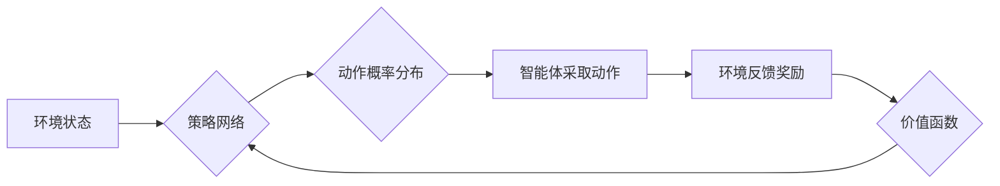

> 策略梯度、强化学习、深度学习、神经网络、梯度上升、价值函数、策略网络

## 1. 背景介绍

强化学习 (Reinforcement Learning, RL) 作为机器学习的一个重要分支，旨在训练智能体在与环境交互的过程中学习最优策略，以最大化累积奖励。策略梯度方法是强化学习中的一种重要算法，它通过直接优化策略网络的参数来学习最优策略，无需估计价值函数。

策略梯度方法的优势在于：

* **直接优化策略:**  策略梯度方法直接优化策略网络的参数，避免了估计价值函数的复杂性和误差积累。
* **适用于连续动作空间:**  策略梯度方法可以处理连续动作空间的问题，而许多其他强化学习算法只能处理离散动作空间。
* **灵活性和适应性强:**  策略梯度方法可以结合各种神经网络架构，并适应不同的环境和任务。

## 2. 核心概念与联系

策略梯度方法的核心概念包括策略网络、价值函数、奖励函数和梯度上升。

* **策略网络:**  策略网络是一个神经网络，它接受环境状态作为输入，输出动作的概率分布。
* **价值函数:**  价值函数估计某个状态下采取特定动作的长期奖励总和。
* **奖励函数:**  奖励函数定义了智能体在每个时间步长获得的奖励。
* **梯度上升:**  梯度上升是一种优化算法，它通过计算目标函数的梯度来更新参数，使其朝着目标函数最大化的方向更新。

**Mermaid 流程图:**



## 3. 核心算法原理 & 具体操作步骤

### 3.1  算法原理概述

策略梯度方法的基本原理是利用梯度上升算法来优化策略网络的参数。目标函数是策略网络输出的期望奖励，梯度上升算法通过计算目标函数的梯度来更新策略网络的参数，使其朝着期望奖励最大化的方向更新。

### 3.2  算法步骤详解

1. **初始化策略网络:**  随机初始化策略网络的参数。
2. **环境交互:**  智能体与环境交互，根据策略网络输出的动作概率分布选择动作。
3. **计算奖励:**  根据环境反馈获得奖励。
4. **更新策略网络:**  利用梯度上升算法更新策略网络的参数，使其朝着期望奖励最大化的方向更新。
5. **重复步骤2-4:**  重复以上步骤，直到策略网络收敛或达到预设的训练次数。

### 3.3  算法优缺点

**优点:**

* 直接优化策略，避免了价值函数估计的复杂性和误差积累。
* 适用于连续动作空间的问题。
* 灵活性和适应性强。

**缺点:**

* 训练过程可能比较不稳定，需要仔细调参。
* 收敛速度可能较慢。

### 3.4  算法应用领域

策略梯度方法在许多领域都有应用，例如：

* **机器人控制:**  训练机器人执行复杂的任务，例如导航、抓取和 Manipulation。
* **游戏 AI:**  训练游戏 AI 策略，使其能够在游戏中取得胜利。
* **金融投资:**  训练投资策略，使其能够在金融市场中获得利润。

## 4. 数学模型和公式 & 详细讲解 & 举例说明

### 4.1  数学模型构建

策略梯度方法的核心是策略网络和奖励函数。策略网络是一个参数化的函数，它将环境状态映射到动作的概率分布。奖励函数定义了智能体在每个时间步长获得的奖励。

**策略网络:**

$$
\pi(a|s; \theta)
$$

其中，$\pi(a|s; \theta)$ 表示在状态 $s$ 下采取动作 $a$ 的概率，$\theta$ 是策略网络的参数。

**奖励函数:**

$$
r(s, a)
$$

其中，$r(s, a)$ 表示在状态 $s$ 下采取动作 $a$ 获得的奖励。

### 4.2  公式推导过程

策略梯度方法的目标是最大化策略网络输出的期望奖励。期望奖励可以表示为：

$$
J(\theta) = E_{\tau \sim \pi_{\theta}} [R(\tau)]
$$

其中，$J(\theta)$ 是策略网络参数 $\theta$ 的期望奖励，$\tau$ 是一个轨迹，$\pi_{\theta}$ 是策略网络。

策略梯度算法利用梯度上升算法来更新策略网络的参数：

$$
\theta = \theta + \alpha \nabla_{\theta} J(\theta)
$$

其中，$\alpha$ 是学习率。

梯度 $\nabla_{\theta} J(\theta)$ 可以通过以下公式计算：

$$
\nabla_{\theta} J(\theta) = E_{\tau \sim \pi_{\theta}} [ \nabla_{\theta} \log \pi_{\theta}(a|s) \cdot R(\tau)]
$$

### 4.3  案例分析与讲解

假设我们有一个简单的环境，智能体可以选择向上或向下移动，每个时间步长获得的奖励为 1 或 -1。策略网络是一个简单的线性模型，将状态作为输入，输出向上移动的概率。

我们可以使用策略梯度算法来训练智能体，使其能够最大化累积奖励。在训练过程中，智能体会与环境交互，根据策略网络输出的动作概率分布选择动作。然后，根据环境反馈获得奖励，并利用梯度上升算法更新策略网络的参数。

## 5. 项目实践：代码实例和详细解释说明

### 5.1  开发环境搭建

本项目使用 Python 语言和 TensorFlow 库进行开发。

**依赖库:**

```
pip install tensorflow
```

### 5.2  源代码详细实现

```python
import tensorflow as tf

# 定义策略网络
class PolicyNetwork(tf.keras.Model):
    def __init__(self):
        super(PolicyNetwork, self).__init__()
        self.dense1 = tf.keras.layers.Dense(128, activation='relu')
        self.dense2 = tf.keras.layers.Dense(1, activation='sigmoid')

    def call(self, state):
        x = self.dense1(state)
        output = self.dense2(x)
        return output

# 定义训练函数
def train_policy(policy_network, env, num_episodes, learning_rate):
    optimizer = tf.keras.optimizers.Adam(learning_rate=learning_rate)
    for episode in range(num_episodes):
        state = env.reset()
        done = False
        total_reward = 0
        while not done:
            # 根据策略网络输出的动作概率分布选择动作
            action_probs = policy_network(state)
            action = tf.random.categorical(tf.math.log(action_probs), num_samples=1)[0, 0]
            # 执行动作并获得奖励
            next_state, reward, done, _ = env.step(action)
            # 更新策略网络
            with tf.GradientTape() as tape:
                # 计算策略梯度
                loss = -tf.math.log(action_probs[0, action]) * reward
            gradients = tape.gradient(loss, policy_network.trainable_variables)
            optimizer.apply_gradients(zip(gradients, policy_network.trainable_variables))
            # 更新状态
            state = next_state
            total_reward += reward
        print(f"Episode {episode+1} total reward: {total_reward}")

# 实例化环境和策略网络
env = ...  # 实例化环境
policy_network = PolicyNetwork()

# 训练策略网络
train_policy(policy_network, env, num_episodes=1000, learning_rate=0.01)
```

### 5.3  代码解读与分析

* **策略网络:**  代码中定义了一个简单的策略网络，它是一个两层全连接神经网络，输出动作的概率分布。
* **训练函数:**  `train_policy` 函数实现了策略梯度算法的训练过程。
* **梯度计算:**  代码中使用 `tf.GradientTape` 来计算策略梯度。
* **参数更新:**  使用 `tf.keras.optimizers.Adam` 优化器更新策略网络的参数。

### 5.4  运行结果展示

训练完成后，可以观察到智能体的累积奖励随着训练次数的增加而增加。

## 6. 实际应用场景

策略梯度方法在许多实际应用场景中都有应用，例如：

* **机器人控制:**  训练机器人执行复杂的任务，例如导航、抓取和 Manipulation。
* **游戏 AI:**  训练游戏 AI 策略，使其能够在游戏中取得胜利。
* **金融投资:**  训练投资策略，使其能够在金融市场中获得利润。

### 6.4  未来应用展望

随着深度学习和强化学习技术的不断发展，策略梯度方法在未来将有更广泛的应用场景。例如：

* **自动驾驶:**  训练自动驾驶汽车的决策策略。
* **医疗诊断:**  训练医疗诊断系统，提高诊断准确率。
* **个性化推荐:**  训练个性化推荐系统，为用户提供更精准的推荐。

## 7. 工具和资源推荐

### 7.1  学习资源推荐

* **书籍:**
    * Reinforcement Learning: An Introduction by Sutton and Barto
    * Deep Reinforcement Learning Hands-On by Maxim Lapan
* **在线课程:**
    * Deep Reinforcement Learning Specialization by DeepLearning.AI
    * Reinforcement Learning by David Silver (University of DeepMind)

### 7.2  开发工具推荐

* **TensorFlow:**  开源深度学习框架，支持策略梯度算法的实现。
* **PyTorch:**  开源深度学习框架，也支持策略梯度算法的实现。
* **OpenAI Gym:**  强化学习环境库，提供各种标准的强化学习环境。

### 7.3  相关论文推荐

* **Policy Gradient Methods for Reinforcement Learning** by Williams, 1992
* **Actor-Critic Algorithms** by Sutton and Barto, 1998
* **Proximal Policy Optimization Algorithms** by Schulman et al., 2017

## 8. 总结：未来发展趋势与挑战

### 8.1  研究成果总结

策略梯度方法在强化学习领域取得了显著的成果，在许多实际应用场景中取得了成功。

### 8.2  未来发展趋势

* **更有效的策略梯度算法:**  研究更有效的策略梯度算法，提高训练效率和稳定性。
* **结合其他机器学习方法:**  将策略梯度方法与其他机器学习方法结合，例如迁移学习和元学习，提高算法的泛化能力。
* **应用于更复杂的环境:**  将策略梯度方法应用于更复杂的环境，例如多智能体环境和连续动作空间环境。

### 8.3  面临的挑战

* **训练不稳定性:**  策略梯度方法的训练过程可能比较不稳定，需要仔细调参。
* **收敛速度慢:**  策略梯度方法的收敛速度可能较慢，需要大量的训练数据和计算资源。
* **探索与利用的平衡:**  在强化学习中，需要平衡探索新策略和利用已知策略，这对于策略梯度方法来说是一个挑战。

### 8.4  研究展望

未来，策略梯度方法将继续是强化学习领域的重要研究方向，随着算法的改进和应用场景的扩展，策略梯度方法将在更多领域发挥重要作用。

## 9. 附录：常见问题与解答

**Q1: 策略梯度方法与价值函数方法有什么区别？**

**A1:** 策略梯度方法直接优化策略网络的参数，而价值函数方法需要先估计价值函数，然后根据价值函数更新策略网络。

**Q2: 策略梯度方法的训练过程为什么不稳定？**

**A2:** 策略梯度方法的训练过程不稳定主要是因为梯度估计的