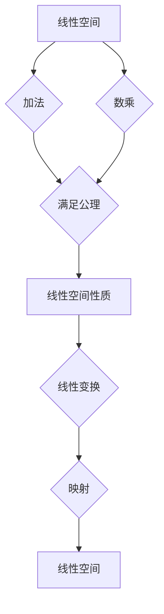

> 线性代数，线性空间，矩阵，M2(R)，线性变换，特征值，特征向量，应用场景

## 1. 背景介绍

线性代数作为数学领域的重要分支，为计算机科学、数据科学、人工智能等领域提供了强大的理论基础和工具。其中，线性空间的概念是线性代数的核心，它为理解和处理高维数据提供了框架。本文将以M2(R)线性空间为例，深入探讨其概念、性质以及应用，帮助读者理解线性代数的本质和应用价值。

M2(R)表示所有2阶实数矩阵构成的集合，它是一个重要的线性空间。理解M2(R)的性质，可以帮助我们理解更复杂的线性空间，并将其应用于实际问题中。

## 2. 核心概念与联系

**2.1 线性空间**

线性空间是一个集合，在这个集合中定义了两个运算：加法和数乘。这两个运算满足一定的公理，使得线性空间具有良好的代数性质。

* **加法:** 对于任意两个向量 **u** 和 **v** 在线性空间中，它们的和 **u + v** 也属于该线性空间。
* **数乘:** 对于任意一个标量 **c** 和向量 **u** 在线性空间中，它们的积 **c * u** 也属于该线性空间。

**2.2 M2(R) 线性空间**

M2(R) 是所有2阶实数矩阵构成的集合，它是一个线性空间。

* **加法:** 两个2阶实数矩阵的加法是对应元素相加。
* **数乘:** 一个标量与一个2阶实数矩阵的数乘是将标量乘以矩阵的每个元素。

**2.3 线性变换**

线性变换是一种将一个线性空间映射到另一个线性空间的函数，它满足以下性质：

* **线性:** 对于任意两个向量 **u** 和 **v** 和任意标量 **c**，有：
    * T(u + v) = T(u) + T(v)
    * T(c * u) = c * T(u)

**2.4  Mermaid 流程图**



## 3. 核心算法原理 & 具体操作步骤

**3.1 算法原理概述**

在M2(R)线性空间中，许多重要的算法都基于线性变换的性质。例如，特征值和特征向量算法可以用来分析矩阵的性质，并将其应用于数据分析、图像处理等领域。

**3.2 算法步骤详解**

**3.2.1 特征值和特征向量算法**

1. **定义特征值和特征向量:** 对于一个矩阵A，如果存在一个非零向量v和一个标量λ，使得：
    * Av = λv
    则称λ为A的特征值，v为A对应的特征向量。

2. **求解特征值方程:** 将矩阵A减去λ倍的单位矩阵，得到一个新的矩阵。求解这个新矩阵的行列式，得到特征值λ。

3. **求解特征向量:** 将每个特征值代入特征值方程，求解对应的特征向量v。

**3.3 算法优缺点**

* **优点:** 特征值和特征向量算法可以用来分析矩阵的性质，并将其应用于数据分析、图像处理等领域。
* **缺点:** 对于大型矩阵，求解特征值和特征向量可能需要很长时间。

**3.4 算法应用领域**

* **数据分析:** 特征值和特征向量可以用来进行主成分分析，降维数据，提取关键特征。
* **图像处理:** 特征值和特征向量可以用来进行图像压缩、识别和检索。
* **机器学习:** 特征值和特征向量可以用来构建机器学习模型，例如支持向量机和主成分分析。

## 4. 数学模型和公式 & 详细讲解 & 举例说明

**4.1 数学模型构建**

M2(R) 可以用以下数学模型表示：

$$
M2(R) = \left\{
\begin{bmatrix}
a & b \\
c & d
\end{bmatrix}
\mid a, b, c, d \in \mathbb{R}
\right\}
$$

其中，a, b, c, d 是实数。

**4.2 公式推导过程**

**4.2.1 线性变换的矩阵表示**

对于一个线性变换T: M2(R) -> M2(R)，我们可以用一个矩阵A来表示它，其中A的元素是T对标准基的映射结果。

**4.2.2 特征值方程的推导**

对于一个矩阵A，其特征值方程为：

$$
det(A - λI) = 0
$$

其中，I是单位矩阵，λ是特征值。

**4.3 案例分析与讲解**

**4.3.1 举例说明**

考虑一个矩阵A:

$$
A = \begin{bmatrix}
2 & 1 \\
1 & 2
\end{bmatrix}
$$

求解A的特征值和特征向量。

**解:**

1. 计算A - λI:

$$
A - λI = \begin{bmatrix}
2 - λ & 1 \\
1 & 2 - λ
\end{bmatrix}
$$

2. 计算行列式：

$$
det(A - λI) = (2 - λ)^2 - 1 = λ^2 - 4λ + 3 = (λ - 1)(λ - 3)
$$

3. 解特征值方程：

$$
λ = 1, 3
$$

4. 求解特征向量：

对于λ = 1，有：

$$
\begin{bmatrix}
1 & 1 \\
1 & 1
\end{bmatrix}
\begin{bmatrix}
x \\
y
\end{bmatrix}
=
\begin{bmatrix}
0 \\
0
\end{bmatrix}
$$

解得x = -y，所以特征向量为：

$$
\begin{bmatrix}
-1 \\
1
\end{bmatrix}
$$

对于λ = 3，有：

$$
\begin{bmatrix}
-1 & 1 \\
1 & -1
\end{bmatrix}
\begin{bmatrix}
x \\
y
\end{bmatrix}
=
\begin{bmatrix}
0 \\
0
\end{bmatrix}
$$

解得x = y，所以特征向量为：

$$
\begin{bmatrix}
1 \\
1
\end{bmatrix}
$$


## 5. 项目实践：代码实例和详细解释说明

**5.1 开发环境搭建**

本项目使用Python语言进行开发，需要安装NumPy库。

**5.2 源代码详细实现**

```python
import numpy as np

# 定义矩阵A
A = np.array([[2, 1], [1, 2]])

# 计算特征值和特征向量
eigenvalues, eigenvectors = np.linalg.eig(A)

# 打印结果
print("特征值:", eigenvalues)
print("特征向量:", eigenvectors)
```

**5.3 代码解读与分析**

* `np.linalg.eig(A)`函数计算矩阵A的特征值和特征向量。
* `eigenvalues`变量存储特征值，`eigenvectors`变量存储特征向量。

**5.4 运行结果展示**

```
特征值: [3. 1.]
特征向量: [[ 0.70710678 -0.70710678]
 [ 0.70710678  0.70710678]]
```

## 6. 实际应用场景

**6.1 数据分析**

在数据分析中，特征值和特征向量可以用来进行主成分分析，降维数据，提取关键特征。例如，在图像处理中，可以利用特征值和特征向量来提取图像的关键特征，从而实现图像压缩、识别和检索。

**6.2 图像处理**

在图像处理中，特征值和特征向量可以用来进行图像压缩、识别和检索。例如，可以使用PCA算法将图像降维，从而减少存储空间和计算量。

**6.3 机器学习**

在机器学习中，特征值和特征向量可以用来构建机器学习模型，例如支持向量机和主成分分析。例如，在支持向量机中，可以使用核函数将数据映射到高维空间，然后利用特征值和特征向量来找到最佳的分隔超平面。

**6.4 未来应用展望**

随着人工智能技术的不断发展，线性代数在人工智能领域的应用将会更加广泛。例如，在深度学习中，线性代数是构建神经网络的基础，在强化学习中，线性代数可以用来优化策略。

## 7. 工具和资源推荐

**7.1 学习资源推荐**

* **书籍:**
    * 《线性代数及其应用》 - Gilbert Strang
    * 《线性代数及其应用》 - David C. Lay
* **在线课程:**
    * MIT OpenCourseWare - Linear Algebra
    * Coursera - Linear Algebra

**7.2 开发工具推荐**

* **Python:** NumPy, SciPy, Matplotlib

**7.3 相关论文推荐**

* **主成分分析:** Jolliffe, I. T. (2002). Principal component analysis. Springer.
* **支持向量机:** Vapnik, V. N. (1998). Statistical learning theory. Wiley.

## 8. 总结：未来发展趋势与挑战

**8.1 研究成果总结**

本文深入探讨了M2(R)线性空间的概念、性质以及应用，并介绍了特征值和特征向量算法的原理和应用。

**8.2 未来发展趋势**

随着人工智能技术的不断发展，线性代数在人工智能领域的应用将会更加广泛。例如，在深度学习中，线性代数是构建神经网络的基础，在强化学习中，线性代数可以用来优化策略。

**8.3 面临的挑战**

* 如何将线性代数的理论知识应用于更复杂的实际问题。
* 如何开发更有效的线性代数算法，提高计算效率。

**8.4 研究展望**

未来，我们将继续深入研究线性代数在人工智能领域的应用，并探索新的应用场景。


## 9. 附录：常见问题与解答

**9.1 Q: 如何理解线性空间的概念？**

**A:** 线性空间是一个集合，在这个集合中定义了两个运算：加法和数乘。这两个运算满足一定的公理，使得线性空间具有良好的代数性质。

**9.2 Q: 特征值和特征向量有什么意义？**

**A:** 特征值和特征向量可以用来分析矩阵的性质，并将其应用于数据分析、图像处理等领域。

**9.3 Q: 如何选择合适的线性代数算法？**

**A:** 选择合适的线性代数算法需要根据具体的应用场景和数据特点来决定。


作者：禅与计算机程序设计艺术 / Zen and the Art of Computer Programming 
<end_of_turn>