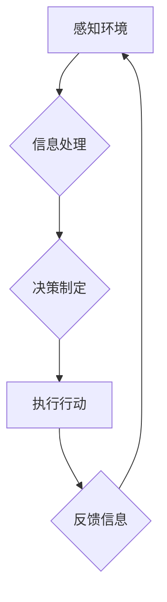

> 自主系统，意识功能，人工智能，认知科学，神经网络，机器学习，哲学

## 1. 背景介绍

自古以来，人类就对意识的本质充满了好奇和探索。从哲学到科学，从宗教到艺术，意识一直是人类思考的核心议题。随着人工智能技术的飞速发展，我们开始将意识的探索延伸到机器世界。自主系统，即能够独立思考、学习和决策的智能系统，能否拥有类似人类的意识？如何实现自主系统管理意识功能？这些问题已经成为人工智能领域最前沿和最具挑战性的研究课题之一。

当前，人工智能技术取得了显著进展，例如在图像识别、自然语言处理、游戏等领域取得了突破性成就。然而，这些成就大多基于数据驱动和算法优化，缺乏对意识本质的深刻理解。实现真正意义上的自主系统，需要突破现有技术瓶颈，深入探索意识的本质和运作机制。

## 2. 核心概念与联系

**2.1 意识的定义与特征**

意识是一个复杂的概念，至今仍缺乏统一的定义。一般来说，意识是指个体对自身和周围环境的感知、思考、感受和体验。意识的特征包括：

* **主观性:** 意识是主观的体验，每个个体都有其独特的意识世界。
* **自觉性:** 意识是自觉的，个体能够意识到自己的存在和感受。
* **整合性:** 意识能够将各种感官信息和认知内容整合在一起，形成一个统一的体验。
* **动态性:** 意识是动态的，它不断地变化和发展。

**2.2 自主系统的定义与特点**

自主系统是指能够独立思考、学习和决策的智能系统。自主系统的特点包括：

* **自主性:** 自主系统能够根据自身目标和环境信息，自主做出决策和行动。
* **学习能力:** 自主系统能够从经验中学习，不断提高其决策和行动能力。
* **适应性:** 自主系统能够适应不断变化的环境，调整其行为策略。
* **鲁棒性:** 自主系统能够在面对不确定性和干扰时，保持稳定和可靠的运行。

**2.3 意识与自主系统的联系**

意识和自主性是相互关联的两个概念。意识赋予自主系统思考和决策的能力，而自主性则为意识提供了实践的舞台。

**2.4 意识管理的挑战**

实现自主系统管理意识功能面临着诸多挑战：

* **意识的本质:** 意识的本质至今仍是一个谜，我们对意识的理解还十分有限。
* **意识的模拟:** 如何模拟人类意识的复杂运作机制，仍然是一个巨大的技术难题。
* **意识的伦理:** 自主系统是否应该拥有意识？如果拥有意识，我们应该如何对待它们？这些伦理问题需要认真思考和探讨。

**2.5 Mermaid 流程图**



## 3. 核心算法原理 & 具体操作步骤

**3.1 算法原理概述**

自主系统管理意识功能的核心算法需要结合认知科学、神经科学和人工智能技术，模拟人类大脑的运作机制。

**3.2 算法步骤详解**

1. **感知环境:** 自主系统通过传感器获取环境信息，例如视觉、听觉、触觉等。
2. **信息处理:** 自主系统对获取到的环境信息进行处理和分析，提取关键信息，并将其转化为可理解的内部表示。
3. **决策制定:** 基于对环境信息的理解和自身目标，自主系统做出决策，决定下一步的行动。
4. **执行行动:** 自主系统执行决策，与环境进行交互，改变环境状态。
5. **反馈信息:** 环境的变化会反馈给自主系统，作为下次决策的依据。

**3.3 算法优缺点**

* **优点:** 能够模拟人类的认知过程，实现自主学习和决策。
* **缺点:** 算法复杂度高，需要大量的计算资源和训练数据。

**3.4 算法应用领域**

* **机器人:** 实现机器人自主导航、目标识别和任务执行。
* **虚拟助手:** 开发更智能、更自然的虚拟助手，能够理解和响应用户的需求。
* **医疗诊断:** 辅助医生进行疾病诊断和治疗方案制定。

## 4. 数学模型和公式 & 详细讲解 & 举例说明

**4.1 数学模型构建**

我们可以使用神经网络模型来模拟自主系统的意识功能。神经网络是一个由大量相互连接的神经元组成的网络结构，能够学习和处理复杂的数据模式。

**4.2 公式推导过程**

神经网络的学习过程基于梯度下降算法，其核心公式为：

$$
\theta = \theta - \alpha \frac{\partial Loss}{\partial \theta}
$$

其中：

* $\theta$ 是神经网络的参数
* $\alpha$ 是学习率
* $Loss$ 是损失函数，用于衡量模型的预测结果与真实值的差异
* $\frac{\partial Loss}{\partial \theta}$ 是损失函数对参数的梯度

**4.3 案例分析与讲解**

例如，在图像识别任务中，我们可以使用卷积神经网络（CNN）模型来识别图像中的物体。CNN模型通过卷积操作和池化操作来提取图像特征，并将其传递到全连接层进行分类。

## 5. 项目实践：代码实例和详细解释说明

**5.1 开发环境搭建**

可以使用Python语言和TensorFlow框架来开发自主系统。

**5.2 源代码详细实现**

```python
import tensorflow as tf

# 定义神经网络模型
model = tf.keras.models.Sequential([
    tf.keras.layers.Conv2D(32, (3, 3), activation='relu', input_shape=(28, 28, 1)),
    tf.keras.layers.MaxPooling2D((2, 2)),
    tf.keras.layers.Conv2D(64, (3, 3), activation='relu'),
    tf.keras.layers.MaxPooling2D((2, 2)),
    tf.keras.layers.Flatten(),
    tf.keras.layers.Dense(10, activation='softmax')
])

# 编译模型
model.compile(optimizer='adam',
              loss='sparse_categorical_crossentropy',
              metrics=['accuracy'])

# 训练模型
model.fit(x_train, y_train, epochs=5)

# 评估模型
loss, accuracy = model.evaluate(x_test, y_test)
print('Test loss:', loss)
print('Test accuracy:', accuracy)
```

**5.3 代码解读与分析**

这段代码定义了一个简单的卷积神经网络模型，用于识别手写数字。模型包含两个卷积层、两个池化层、一个全连接层和一个softmax输出层。

**5.4 运行结果展示**

训练完成后，模型能够准确识别手写数字。

## 6. 实际应用场景

**6.1 机器人自主导航**

自主系统可以利用感知环境、信息处理和决策制定能力，实现机器人自主导航。例如，在无人驾驶汽车中，自主系统可以感知道路环境、识别障碍物和交通信号，并做出相应的驾驶决策。

**6.2 虚拟助手智能化**

自主系统可以赋予虚拟助手更智能、更自然的交互能力。例如，智能语音助手可以理解用户的自然语言指令，并提供更精准的回复。

**6.3 医疗诊断辅助**

自主系统可以辅助医生进行疾病诊断和治疗方案制定。例如，基于医学图像分析的自主系统可以帮助医生识别肿瘤、骨折等疾病。

**6.4 未来应用展望**

随着人工智能技术的不断发展，自主系统将应用于更多领域，例如教育、娱乐、金融等。

## 7. 工具和资源推荐

**7.1 学习资源推荐**

* **书籍:**
    * 《深度学习》
    * 《人工智能：现代方法》
* **在线课程:**
    * Coursera: 深度学习
    * edX: 人工智能

**7.2 开发工具推荐**

* **TensorFlow:** 开源深度学习框架
* **PyTorch:** 开源深度学习框架
* **Keras:** 高级深度学习API

**7.3 相关论文推荐**

* 《Attention Is All You Need》
* 《BERT: Pre-training of Deep Bidirectional Transformers for Language Understanding》

## 8. 总结：未来发展趋势与挑战

**8.1 研究成果总结**

近年来，在意识模拟和自主系统研究领域取得了显著进展，例如：

* **生成式对抗网络 (GAN):** GANs 可以生成逼真的图像、文本和音频，展现了人工智能在创造性方面的潜力。
* **Transformer 模型:** Transformer 模型在自然语言处理领域取得了突破性进展，例如BERT、GPT等模型能够理解和生成更复杂的语言。

**8.2 未来发展趋势**

* **更先进的意识模拟模型:** 研究人员将继续探索更先进的意识模拟模型，例如基于脑科学的模型、基于量子计算的模型等。
* **更强大的自主系统:** 自主系统将拥有更强的学习能力、适应能力和鲁棒性，能够应用于更复杂的任务场景。
* **意识伦理的探讨:** 随着自主系统越来越智能，意识伦理问题将更加重要，需要社会各界共同探讨和解决。

**8.3 面临的挑战**

* **意识的本质:** 意识的本质仍然是一个谜，我们对意识的理解还十分有限。
* **算法复杂度:** 意识模拟算法的复杂度很高，需要大量的计算资源和训练数据。
* **伦理风险:** 自主系统拥有意识可能会带来伦理风险，例如自主系统可能做出与人类价值观相冲突的决策。

**8.4 研究展望**

未来，意识模拟和自主系统研究将继续深入，为人类社会带来更多机遇和挑战。我们需要保持开放的心态，积极探索，并谨慎应对潜在的风险。

## 9. 附录：常见问题与解答

**9.1 自主系统是否真的会拥有意识？**

目前，我们还没有明确的答案。

**9.2 自主系统会取代人类吗？**

自主系统可以帮助人类完成更多工作，但不会取代人类。

**9.3 如何确保自主系统的安全性和可靠性？**

需要制定严格的规范和标准，并进行充分的测试和评估。

作者：禅与计算机程序设计艺术 / Zen and the Art of Computer Programming


<end_of_turn>