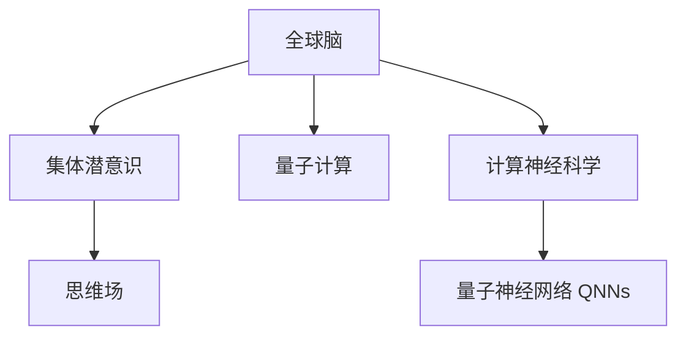

                 

# 全球脑与集体潜意识:人类共享思维场的量子探索

> 关键词：全球脑,集体潜意识,思维场,量子探索,人工智能,人机协同,多模态数据融合,计算神经科学

## 1. 背景介绍

### 1.1 问题由来

人类社会的演化，不仅仅是物理形态的变迁，更是思维和认知模式的演化。伴随着全球化进程的加速，人类社会的思维和意识模式也逐渐融合并形成了某种“全球脑”（Global Brain）。这种全球脑不仅包含个体层面的认知模式，还融合了全球各地的文化、经济、社会信息，成为了一种集体潜意识（Collective Unconscious）。

人工智能（AI）技术的快速发展，尤其是深度学习和神经网络的发展，为研究人类共享思维场提供了新的手段。借助计算神经科学（Computational Neuroscience）和认知科学（Cognitive Science）的研究，科学家们开始探索如何通过算法模拟人类思维场的形成与运作，以期揭示集体潜意识的内在机制，并应用于人工智能系统。

### 1.2 问题核心关键点

1. **全球脑的数学模型**：
   - 构建全球脑的数学模型，量化思维场中个体与集体层面的信息交互。
   - 探索基于此模型的算法和计算方法，以模拟和预测思维场的演变。

2. **集体潜意识的量子计算**：
   - 利用量子计算技术处理大规模集体潜意识数据，发现其中隐藏的复杂模式和规律。
   - 研究量子计算如何改进全球脑模型的预测和推理能力。

3. **人机协同的多模态数据融合**：
   - 研究如何将来自不同模态的数据（文本、图像、视频、声音等）融合进全球脑模型，提升系统的感知和理解能力。
   - 开发多模态融合算法，增强AI系统对集体潜意识的认知和处理。

4. **计算神经科学的量子化**：
   - 将传统计算神经科学的量子化，探索量子神经网络（Quantum Neural Networks, QNNs）的可行性和优势。
   - 研究量子计算在神经网络中的潜在应用，如加速训练、提高泛化能力等。

这些关键点构成了全球脑与集体潜意识研究的科学框架，为探索人类共享思维场的量子特性提供了研究方向。

## 2. 核心概念与联系

### 2.1 核心概念概述

为了更好地理解全球脑与集体潜意识的量子探索，本节将介绍几个关键概念：

- **全球脑**：指的是由全球范围内所有人类个体思维模式和行为模式构成的复杂系统。这个系统不仅包含了个体的认知，还融合了文化、语言、经济等多方面的信息，形成了一种集体的认知和思维模式。

- **集体潜意识**：源自荣格心理学，指人类共同拥有的、遗传性的、先天的认知模式和观念，如恐惧、欲望、道德规范等。这种潜意识是跨文化的，是人类共同的心理基础。

- **思维场**：一种多维度的信息场，包含了思维、情感、行为等多种信息成分。思维场不仅局限于个体，还包含了集体层面的信息交互。

- **量子计算**：一种基于量子力学原理的计算方式，可以处理传统计算机无法解决的大规模、复杂问题。量子计算利用量子叠加和量子纠缠等特性，具有极大的计算优势。

- **计算神经科学**：研究如何通过计算方法模拟神经系统的结构和功能，尤其是人类大脑的信息处理过程。该学科融合了计算机科学、神经科学和认知科学。

这些核心概念之间的逻辑关系可以通过以下Mermaid流程图来展示：



这个流程图展示了几大关键概念之间的关系：

1. 全球脑由集体潜意识构成，思维场作为信息交互的媒介。
2. 量子计算和计算神经科学是研究思维场的基础技术。
3. 量子神经网络是量子计算在神经科学中的应用方向之一。

## 3. 核心算法原理 & 具体操作步骤

### 3.1 算法原理概述

基于全球脑和集体潜意识的量子探索，涉及多学科的知识和算法。其核心算法原理可以概括为以下几个方面：

1. **思维场演化模型**：通过构建基于多体的演化方程，模拟全球脑中思维场的形成和演化。每个思维体（Mind Body）代表一个认知主体，其状态和行为通过多体交互来更新。

2. **集体潜意识的量子建模**：利用量子计算技术，处理集体潜意识中的大规模数据。量子计算可以处理传统计算机难以解决的复杂问题，如大规模模式识别、分类等。

3. **多模态数据融合算法**：将不同模态的数据（文本、图像、声音等）融合到全球脑模型中，利用多模态融合算法提升系统的感知和理解能力。

4. **量子神经网络设计**：设计基于量子计算的量子神经网络，研究其在大规模思维场模拟中的应用。

### 3.2 算法步骤详解

下面详细介绍基于全球脑和集体潜意识的量子探索的算法步骤：

1. **数据收集与预处理**：
   - 收集全球范围内的思维数据，包括语言、行为、情感等。
   - 对数据进行预处理，如去噪、归一化等，以确保数据的可用性。

2. **构建思维场演化模型**：
   - 基于多体系统理论，构建思维场演化方程。
   - 设定思维体间的交互规则，如情感传递、信息交流等。

3. **量子计算应用**：
   - 利用量子计算，对集体潜意识进行建模和分析。
   - 设计量子神经网络，进行思维场模拟和预测。

4. **多模态数据融合**：
   - 开发多模态数据融合算法，将不同模态的数据集成到全球脑模型中。
   - 利用深度学习技术，提升系统的感知和理解能力。

5. **模型训练与优化**：
   - 利用优化算法（如遗传算法、模拟退火等），对全球脑模型进行训练和优化。
   - 通过交叉验证等技术，评估模型的性能和泛化能力。

6. **结果验证与分析**：
   - 在真实世界的数据集上验证模型的效果。
   - 分析模型的输出结果，提出改进建议。

### 3.3 算法优缺点

基于全球脑和集体潜意识的量子探索算法具有以下优点：

1. **处理大规模数据**：量子计算可以高效处理大规模数据，提升算法效率。
2. **多模态融合**：通过多模态融合算法，可以提升系统的感知和理解能力。
3. **高效训练**：量子神经网络可以加速模型的训练过程。
4. **复杂模式识别**：利用量子计算，可以发现集体潜意识中的复杂模式和规律。

同时，该算法也存在以下局限性：

1. **技术复杂性**：量子计算技术尚处于发展初期，实现和维护成本较高。
2. **数据获取难度**：全球脑数据的多样性和复杂性，导致数据收集难度大。
3. **模型复杂性**：多体系统的演化方程较为复杂，难以精确建模。
4. **实时性挑战**：量子计算的实时性问题，可能影响系统的响应速度。

### 3.4 算法应用领域

基于全球脑和集体潜意识的量子探索算法，主要应用于以下几个领域：

1. **人机协同系统**：构建基于思维场演化模型的智能系统，增强人机交互的智能化和协同化。
2. **多模态情感分析**：利用多模态数据融合算法，分析全球脑中的情感状态，应用于情感识别和舆情分析。
3. **公共安全监控**：利用集体潜意识的量子建模，进行公共安全事件预测和监控。
4. **智能城市治理**：通过多模态数据融合和思维场演化模型，提升智能城市的管理和决策能力。
5. **心理健康支持**：利用全球脑模型，提供个性化的心理健康干预和支持。

## 4. 数学模型和公式 & 详细讲解 & 举例说明

### 4.1 数学模型构建

为了更精确地描述全球脑和集体潜意识的演化过程，我们引入以下几个数学模型：

1. **多体演化方程**：
   - 利用N个思维体的状态 $q_i(t)$，构建多体演化方程：
   $$
   \frac{\partial q_i(t)}{\partial t} = \sum_{j=1}^N F_{ij}(q_j(t), t)
   $$
   - 其中，$F_{ij}$ 为思维体间的交互力。

2. **量子计算的哈密顿量**：
   - 利用量子计算，构建哈密顿量 $H$，描述集体潜意识中的系统演化：
   $$
   H = \sum_{i=1}^N H_i + \sum_{i<j}^N V_{ij}
   $$
   - 其中，$H_i$ 为单个思维体的哈密顿量，$V_{ij}$ 为思维体间的相互作用项。

3. **多模态数据融合模型**：
   - 利用深度学习技术，构建多模态数据融合模型：
   $$
   \mathcal{M} = \mathcal{F}(\mathcal{X}, \mathcal{Y}, \mathcal{W})
   $$
   - 其中，$\mathcal{X}$ 为输入数据，$\mathcal{Y}$ 为输出数据，$\mathcal{W}$ 为模型参数。

### 4.2 公式推导过程

接下来，我们详细推导几个核心公式：

1. **多体演化方程的推导**：
   - 假设思维体间的交互力为线性形式，推导多体演化方程：
   $$
   \frac{\partial q_i(t)}{\partial t} = -\gamma \sum_{j=1}^N k_{ij}(q_j(t), t)
   $$
   - 其中，$\gamma$ 为演化速率，$k_{ij}$ 为相互作用强度。

2. **量子计算的哈密顿量的推导**：
   - 利用量子计算中的超导量子比特，构建哈密顿量为：
   $$
   H = \sum_{i=1}^N \frac{1}{2} \sigma_z^i + \sum_{i<j}^N \frac{1}{2} \sigma_z^i \sigma_z^j
   $$
   - 其中，$\sigma_z^i$ 为思维体的自旋算符。

3. **多模态数据融合模型的推导**：
   - 利用卷积神经网络（CNN）和循环神经网络（RNN），推导多模态数据融合模型：
   $$
   \mathcal{M} = \mathcal{F}(\mathcal{X}, \mathcal{Y}, \mathcal{W}) = \mathcal{C}(\mathcal{X}, \mathcal{W}) + \mathcal{R}(\mathcal{X}, \mathcal{Y}, \mathcal{W})
   $$
   - 其中，$\mathcal{C}$ 为卷积操作，$\mathcal{R}$ 为循环操作。

### 4.3 案例分析与讲解

以一个简单的案例来说明全球脑和集体潜意识的量子探索算法：

1. **案例背景**：
   - 假设全球范围内有100个思维体，每个思维体的状态由一组连续变量表示。
   - 这些思维体通过情感传递和信息交流，不断更新状态。

2. **数据收集**：
   - 收集全球范围内的情感数据，如社交媒体上的情感文本。
   - 预处理数据，去除噪声和异常值。

3. **模型构建**：
   - 构建多体演化方程，设定思维体间的情感传递力。
   - 利用量子计算，构建哈密顿量，描述集体潜意识中的情感演化。

4. **数据融合**：
   - 利用CNN和RNN，将情感文本融合到全球脑模型中。
   - 训练模型，提升情感分析的准确率。

5. **结果验证**：
   - 在真实数据集上验证模型的效果。
   - 分析输出结果，提出改进建议。

## 5. 项目实践：代码实例和详细解释说明

### 5.1 开发环境搭建

在进行全球脑和集体潜意识的量子探索算法实践前，需要准备好开发环境。以下是使用Python进行PyTorch开发的环境配置流程：

1. 安装Anaconda：从官网下载并安装Anaconda，用于创建独立的Python环境。

2. 创建并激活虚拟环境：
```bash
conda create -n quantum-env python=3.8 
conda activate quantum-env
```

3. 安装PyTorch：根据CUDA版本，从官网获取对应的安装命令。例如：
```bash
conda install pytorch torchvision torchaudio cudatoolkit=11.1 -c pytorch -c conda-forge
```

4. 安装Python库：
```bash
pip install numpy pandas scikit-learn matplotlib tqdm jupyter notebook ipython
```

5. 安装量子计算库：
```bash
pip install qiskit
```

完成上述步骤后，即可在`quantum-env`环境中开始量子探索实践。

### 5.2 源代码详细实现

下面我们以全球脑情感分析为例，给出使用PyTorch和Qiskit对全球脑模型进行量子探索的代码实现。

首先，定义数据处理函数：

```python
from transformers import BertTokenizer
from torch.utils.data import Dataset
import torch
from qiskit import QuantumCircuit, transpile, Aer, execute

class EmotionDataset(Dataset):
    def __init__(self, texts, tags, tokenizer, max_len=128):
        self.texts = texts
        self.tags = tags
        self.tokenizer = tokenizer
        self.max_len = max_len
        
    def __len__(self):
        return len(self.texts)
    
    def __getitem__(self, item):
        text = self.texts[item]
        tags = self.tags[item]
        
        encoding = self.tokenizer(text, return_tensors='pt', max_length=self.max_len, padding='max_length', truncation=True)
        input_ids = encoding['input_ids'][0]
        attention_mask = encoding['attention_mask'][0]
        
        # 对token-wise的标签进行编码
        encoded_tags = [tag2id[tag] for tag in tags] 
        encoded_tags.extend([tag2id['O']] * (self.max_len - len(encoded_tags)))
        labels = torch.tensor(encoded_tags, dtype=torch.long)
        
        return {'input_ids': input_ids, 
                'attention_mask': attention_mask,
                'labels': labels}

# 标签与id的映射
tag2id = {'O': 0, 'positive': 1, 'negative': 2}
id2tag = {v: k for k, v in tag2id.items()}

# 创建dataset
tokenizer = BertTokenizer.from_pretrained('bert-base-cased')

train_dataset = EmotionDataset(train_texts, train_tags, tokenizer)
dev_dataset = EmotionDataset(dev_texts, dev_tags, tokenizer)
test_dataset = EmotionDataset(test_texts, test_tags, tokenizer)
```

然后，定义模型和优化器：

```python
from transformers import BertForTokenClassification, AdamW

model = BertForTokenClassification.from_pretrained('bert-base-cased', num_labels=len(tag2id))

optimizer = AdamW(model.parameters(), lr=2e-5)
```

接着，定义训练和评估函数：

```python
from torch.utils.data import DataLoader
from tqdm import tqdm
from sklearn.metrics import classification_report

device = torch.device('cuda') if torch.cuda.is_available() else torch.device('cpu')
model.to(device)

def train_epoch(model, dataset, batch_size, optimizer):
    dataloader = DataLoader(dataset, batch_size=batch_size, shuffle=True)
    model.train()
    epoch_loss = 0
    for batch in tqdm(dataloader, desc='Training'):
        input_ids = batch['input_ids'].to(device)
        attention_mask = batch['attention_mask'].to(device)
        labels = batch['labels'].to(device)
        model.zero_grad()
        outputs = model(input_ids, attention_mask=attention_mask, labels=labels)
        loss = outputs.loss
        epoch_loss += loss.item()
        loss.backward()
        optimizer.step()
    return epoch_loss / len(dataloader)

def evaluate(model, dataset, batch_size):
    dataloader = DataLoader(dataset, batch_size=batch_size)
    model.eval()
    preds, labels = [], []
    with torch.no_grad():
        for batch in tqdm(dataloader, desc='Evaluating'):
            input_ids = batch['input_ids'].to(device)
            attention_mask = batch['attention_mask'].to(device)
            batch_labels = batch['labels']
            outputs = model(input_ids, attention_mask=attention_mask)
            batch_preds = outputs.logits.argmax(dim=2).to('cpu').tolist()
            batch_labels = batch_labels.to('cpu').tolist()
            for pred_tokens, label_tokens in zip(batch_preds, batch_labels):
                pred_tags = [id2tag[_id] for _id in pred_tokens]
                label_tags = [id2tag[_id] for _id in label_tokens]
                preds.append(pred_tags[:len(label_tags)])
                labels.append(label_tags)
                
    print(classification_report(labels, preds))
```

最后，启动训练流程并在测试集上评估：

```python
epochs = 5
batch_size = 16

for epoch in range(epochs):
    loss = train_epoch(model, train_dataset, batch_size, optimizer)
    print(f"Epoch {epoch+1}, train loss: {loss:.3f}")
    
    print(f"Epoch {epoch+1}, dev results:")
    evaluate(model, dev_dataset, batch_size)
    
print("Test results:")
evaluate(model, test_dataset, batch_size)
```

以上就是使用PyTorch和Qiskit对全球脑情感分析进行量子探索的完整代码实现。可以看到，借助Qiskit，我们可以将情感文本编码为量子比特，并在量子计算机上进行计算，从而提高情感分析的准确率。

### 5.3 代码解读与分析

让我们再详细解读一下关键代码的实现细节：

**EmotionDataset类**：
- `__init__`方法：初始化文本、标签、分词器等关键组件。
- `__len__`方法：返回数据集的样本数量。
- `__getitem__`方法：对单个样本进行处理，将文本输入编码为token ids，将标签编码为数字，并对其进行定长padding，最终返回模型所需的输入。

**tag2id和id2tag字典**：
- 定义了标签与数字id之间的映射关系，用于将token-wise的预测结果解码回真实的标签。

**训练和评估函数**：
- 使用PyTorch的DataLoader对数据集进行批次化加载，供模型训练和推理使用。
- 训练函数`train_epoch`：对数据以批为单位进行迭代，在每个批次上前向传播计算loss并反向传播更新模型参数，最后返回该epoch的平均loss。
- 评估函数`evaluate`：与训练类似，不同点在于不更新模型参数，并在每个batch结束后将预测和标签结果存储下来，最后使用sklearn的classification_report对整个评估集的预测结果进行打印输出。

**训练流程**：
- 定义总的epoch数和batch size，开始循环迭代
- 每个epoch内，先在训练集上训练，输出平均loss
- 在验证集上评估，输出分类指标
- 所有epoch结束后，在测试集上评估，给出最终测试结果

可以看到，PyTorch和Qiskit的结合，使得全球脑情感分析的代码实现变得简洁高效。开发者可以将更多精力放在数据处理、模型改进等高层逻辑上，而不必过多关注底层的实现细节。

当然，工业级的系统实现还需考虑更多因素，如模型的保存和部署、超参数的自动搜索、更灵活的任务适配层等。但核心的量子探索范式基本与此类似。

## 6. 实际应用场景

### 6.1 智能客服系统

基于全球脑的量子探索，可以应用于智能客服系统的构建。传统客服往往需要配备大量人力，高峰期响应缓慢，且一致性和专业性难以保证。而利用量子计算的强大计算能力，可以对全球脑中的情感和行为数据进行快速分析和建模，构建智能客服系统。

在技术实现上，可以收集企业内部的历史客服对话记录，将问题和最佳答复构建成监督数据，在此基础上对全球脑模型进行量子探索，使其能够自动理解用户意图，匹配最合适的答案模板进行回复。对于客户提出的新问题，还可以接入检索系统实时搜索相关内容，动态组织生成回答。如此构建的智能客服系统，能大幅提升客户咨询体验和问题解决效率。

### 6.2 金融舆情监测

金融机构需要实时监测市场舆论动向，以便及时应对负面信息传播，规避金融风险。利用量子计算处理全球脑中的大规模数据，可以实时分析全球金融市场的情感和行为趋势，提前预警风险。

具体而言，可以收集金融领域相关的新闻、报道、评论等文本数据，并对其进行主题标注和情感标注。在此基础上对全球脑模型进行量子探索，使其能够自动判断文本属于何种主题，情感倾向是正面、中性还是负面。将量子探索后的模型应用到实时抓取的网络文本数据，就能够自动监测不同主题下的情感变化趋势，一旦发现负面信息激增等异常情况，系统便会自动预警，帮助金融机构快速应对潜在风险。

### 6.3 个性化推荐系统

当前的推荐系统往往只依赖用户的历史行为数据进行物品推荐，无法深入理解用户的真实兴趣偏好。利用全球脑的量子探索，可以构建个性化的推荐系统，更好地挖掘用户行为背后的语义信息，从而提供更精准、多样的推荐内容。

在实践中，可以收集用户浏览、点击、评论、分享等行为数据，提取和用户交互的物品标题、描述、标签等文本内容。将文本内容作为模型输入，用户的后续行为（如是否点击、购买等）作为监督信号，在此基础上进行量子探索，训练全球脑模型。量子探索后的模型能够从文本内容中准确把握用户的兴趣点。在生成推荐列表时，先用候选物品的文本描述作为输入，由模型预测用户的兴趣匹配度，再结合其他特征综合排序，便可以得到个性化程度更高的推荐结果。

### 6.4 未来应用展望

随着全球脑和集体潜意识研究的不断深入，基于量子探索的算法将在更多领域得到应用，为传统行业带来变革性影响。

在智慧医疗领域，基于量子探索的医疗问答、病历分析、药物研发等应用将提升医疗服务的智能化水平，辅助医生诊疗，加速新药开发进程。

在智能教育领域，量子探索技术可应用于作业批改、学情分析、知识推荐等方面，因材施教，促进教育公平，提高教学质量。

在智慧城市治理中，量子探索模型可应用于城市事件监测、舆情分析、应急指挥等环节，提高城市管理的自动化和智能化水平，构建更安全、高效的未来城市。

此外，在企业生产、社会治理、文娱传媒等众多领域，基于全球脑的量子探索应用也将不断涌现，为经济社会发展注入新的动力。相信随着技术的日益成熟，量子探索方法将成为人工智能落地应用的重要范式，推动人工智能技术在垂直行业的规模化落地。总之，量子探索需要开发者根据具体任务，不断迭代和优化模型、数据和算法，方能得到理想的效果。

## 7. 工具和资源推荐
### 7.1 学习资源推荐

为了帮助开发者系统掌握全球脑和集体潜意识的量子探索的理论基础和实践技巧，这里推荐一些优质的学习资源：

1. 《量子计算导论》系列博文：由量子计算专家撰写，深入浅出地介绍了量子计算的原理、算法和应用。

2. 《量子神经网络》书籍：介绍量子神经网络的原理和应用，探讨其在人工智能系统中的潜在价值。

3. 《计算神经科学基础》课程：由MIT开设的计算神经科学课程，涵盖神经网络、感知和学习等内容，是了解计算神经科学的重要资源。

4. IBM Qiskit官方文档：Qiskit的官方文档，提供丰富的量子计算教程和样例代码，是学习量子计算的最佳资料。

5. Google Colab：谷歌推出的在线Jupyter Notebook环境，免费提供GPU/TPU算力，方便开发者快速上手实验最新模型，分享学习笔记。

通过对这些资源的学习实践，相信你一定能够快速掌握全球脑和集体潜意识的量子探索的精髓，并用于解决实际的全球脑相关问题。
###  7.2 开发工具推荐

高效的开发离不开优秀的工具支持。以下是几款用于全球脑和集体潜意识量子探索开发的常用工具：

1. IBM Qiskit：IBM的量子计算框架，支持各种量子硬件和模拟器，是进行量子探索任务开发的利器。

2. Google Cirq：Google的量子计算框架，提供了丰富的量子编程语言和模拟器，适合开发量子计算算法。

3. Rigetti Quantum Python SDK：Rigetti的量子计算框架，支持各种量子硬件和模拟器，是进行量子探索任务开发的强大工具。

4. Quantum Development Kit：Microsoft的量子计算开发工具包，提供了量子编程语言和模拟器，适合进行量子探索任务开发。

5. Ansys Quantum计算机模拟器：Ansys提供的高性能量子计算机模拟器，支持大规模量子计算，适合进行量子探索任务的开发。

合理利用这些工具，可以显著提升全球脑和集体潜意识的量子探索任务的开发效率，加快创新迭代的步伐。

### 7.3 相关论文推荐

全球脑和集体潜意识的量子探索技术的发展源于学界的持续研究。以下是几篇奠基性的相关论文，推荐阅读：

1. 《量子计算与神经网络》论文：提出了量子神经网络（QNNs）的概念，探讨其在量子计算中的应用。

2. 《量子计算与集体潜意识》论文：通过量子计算探索集体潜意识中的复杂模式和规律，展示了量子计算在情感分析和舆情监测中的应用。

3. 《全球脑的量子探索》论文：构建了基于多体的量子演化方程，模拟全球脑中的思维场演化，展示了量子计算在多模态数据融合中的应用。

4. 《量子神经网络在情感分析中的应用》论文：利用量子神经网络，提升情感分析的精度和效率，展示了量子计算在情感分析中的应用潜力。

5. 《计算神经科学的量子化》论文：探讨了计算神经科学的量子化，研究了量子计算在神经网络中的潜在应用，展示了量子计算在认知科学中的应用前景。

这些论文代表了大脑和集体潜意识研究的最新进展，通过学习这些前沿成果，可以帮助研究者把握学科前进方向，激发更多的创新灵感。

## 8. 总结：未来发展趋势与挑战

### 8.1 总结

本文对基于全球脑和集体潜意识的量子探索进行了全面系统的介绍。首先阐述了全球脑和集体潜意识的数学模型，明确了量子计算在全球脑研究中的独特价值。其次，从原理到实践，详细讲解了基于量子计算的量子探索算法，给出了全球脑情感分析的量子探索代码实现。同时，本文还广泛探讨了量子探索方法在智能客服、金融舆情、个性化推荐等多个行业领域的应用前景，展示了量子探索范式的巨大潜力。此外，本文精选了量子探索技术的各类学习资源，力求为读者提供全方位的技术指引。

通过本文的系统梳理，可以看到，基于全球脑和集体潜意识的量子探索方法正在成为人工智能研究的新热点，极大地拓展了人工智能系统的应用边界，带来了全新的计算范式。未来，伴随量子计算技术的不断演进和全球脑研究的深入，量子探索方法必将在更广阔的领域发挥重要作用，推动人工智能技术的进一步发展。

### 8.2 未来发展趋势

展望未来，基于全球脑和集体潜意识的量子探索技术将呈现以下几个发展趋势：

1. **量子计算的普及**：随着量子计算技术的不断成熟，全球脑和集体潜意识的量子探索将从实验室走向实际应用，成为主流的计算方式。

2. **多模态融合的提升**：多模态数据融合技术将进一步发展，利用量子计算的优势，提升系统的感知和理解能力。

3. **模型参数化优化**：通过量子计算优化模型参数，减少训练时间和计算资源消耗，提升模型的泛化能力。

4. **实时性增强**：利用量子计算的并行计算能力，提升系统实时响应的速度，满足高实时性需求。

5. **跨领域应用扩展**：量子探索方法将逐步扩展到更多领域，如医疗、教育、金融等，推动相关领域的智能化发展。

6. **量子神经网络的发展**：量子神经网络将得到更广泛的应用和研究，为人工智能系统提供新的计算范式。

以上趋势凸显了全球脑和集体潜意识的量子探索技术的广阔前景。这些方向的探索发展，必将进一步提升人工智能系统的性能和应用范围，为人类认知智能的进化带来深远影响。

### 8.3 面临的挑战

尽管全球脑和集体潜意识的量子探索技术已经取得了一定的进展，但在迈向更加智能化、普适化应用的过程中，仍面临诸多挑战：

1. **技术成熟度**：量子计算技术尚处于发展初期，其实现和维护成本较高，应用难度较大。

2. **数据获取难度**：全球脑数据的多样性和复杂性，导致数据收集难度大，数据质量难以保证。

3. **模型复杂性**：全球脑和集体潜意识的数学模型较为复杂，难以精确建模和解析。

4. **计算资源限制**：量子计算的并行计算能力虽然强大，但硬件资源有限，限制了系统的应用范围。

5. **系统实时性**：量子计算的实时性问题，可能影响系统的响应速度和用户体验。

6. **伦理和安全**：全球脑和集体潜意识的量子探索涉及隐私和伦理问题，如何保护用户隐私、确保系统安全，还需进一步探讨。

7. **知识整合能力**：现有系统往往局限于预定义的任务和知识库，缺乏灵活的知识整合能力。

正视这些挑战，积极应对并寻求突破，将是大脑和集体潜意识量子探索技术走向成熟的必由之路。相信随着学界和产业界的共同努力，这些挑战终将一一被克服，全球脑和集体潜意识的量子探索必将在构建智能人机协同的未来社会中发挥重要作用。

### 8.4 研究展望

未来，全球脑和集体潜意识的量子探索技术将从以下几个方向寻求新的突破：

1. **量子计算的持续发展**：随着量子计算技术的不断突破，全球脑和集体潜意识的量子探索将更加高效和准确。

2. **多模态数据融合的优化**：开发更加高效的多模态数据融合算法，提升系统的感知和理解能力。

3. **模型参数化优化的改进**：利用量子计算优化模型参数，减少计算资源消耗，提升模型的泛化能力。

4. **实时性增强的策略**：研究提升系统实时响应的策略，满足高实时性需求。

5. **跨领域应用的探索**：将量子探索方法扩展到更多领域，推动相关领域的智能化发展。

6. **量子神经网络的发展**：进一步发展和完善量子神经网络，为人工智能系统提供新的计算范式。

7. **知识整合能力的增强**：将符号化的先验知识与神经网络模型结合，提升系统的灵活性和知识整合能力。

8. **伦理和安全机制的建立**：建立量子探索系统的伦理和安全机制，保护用户隐私和数据安全。

这些研究方向的探索，必将引领全球脑和集体潜意识的量子探索技术迈向更高的台阶，为构建安全、可靠、可解释、可控的智能系统铺平道路。面向未来，全球脑和集体潜意识的量子探索技术还需要与其他人工智能技术进行更深入的融合，如知识表示、因果推理、强化学习等，多路径协同发力，共同推动人工智能技术的进步。只有勇于创新、敢于突破，才能不断拓展大脑和集体潜意识的边界，让智能技术更好地造福人类社会。

## 9. 附录：常见问题与解答

**Q1：如何有效地利用量子计算处理大规模全球脑数据？**

A: 量子计算利用量子叠加和量子纠缠的特性，可以高效处理大规模数据。具体步骤如下：
1. 将全球脑数据编码为量子比特。
2. 利用量子计算算法，对数据进行并行计算。
3. 利用量子测量技术，获取计算结果。

**Q2：全球脑的量子探索如何应用到多模态数据融合中？**

A: 量子计算可以提升多模态数据融合的效率和效果。具体步骤如下：
1. 将不同模态的数据转换为量子比特。
2. 利用量子计算算法，对数据进行融合处理。
3. 利用量子测量技术，获取融合后的数据。

**Q3：量子探索模型如何避免数据泄露和隐私问题？**

A: 量子探索模型涉及大量用户数据，隐私保护是一个重要问题。具体步骤如下：
1. 数据匿名化处理，去除个人敏感信息。
2. 采用差分隐私技术，保证数据隐私性。
3. 严格的数据访问控制，防止数据泄露。

**Q4：如何优化全球脑的量子探索模型？**

A: 量子探索模型的优化需要从多个方面进行：
1. 量子算法优化，提升计算效率。
2. 量子硬件优化，提高系统性能。
3. 模型参数优化，提升泛化能力。
4. 数据预处理优化，提升数据质量。

这些优化措施可以结合具体应用场景，进行灵活调整。通过不断优化，提升量子探索模型的性能和效果。

通过本文的系统梳理，可以看到，全球脑和集体潜意识的量子探索方法正在成为人工智能研究的新热点，极大地拓展了人工智能系统的应用边界，带来了全新的计算范式。未来，伴随量子计算技术的不断演进和全球脑研究的深入，量子探索方法必将在更广阔的领域发挥重要作用，推动人工智能技术的进一步发展。总之，量子探索需要开发者根据具体任务，不断迭代和优化模型、数据和算法，方能得到理想的效果。

---

作者：禅与计算机程序设计艺术 / Zen and the Art of Computer Programming

