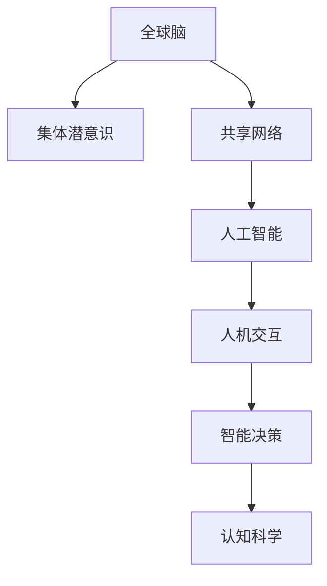

                 

# 全球脑与集体潜意识:人类思维的共享网络

> 关键词：全球脑,集体潜意识,共享网络,人工智能,人机交互,智能决策,认知科学

## 1. 背景介绍

### 1.1 问题由来

当前，随着互联网的普及和社交媒体的兴起，人类社会的互动方式正在发生根本性的变革。人们越来越多地通过在线平台分享和交流信息，协作和创造。这种跨地域、跨文化的互联互通，形成了一个全球性的“大脑网络”，也称作“全球脑”。全球脑中的每一个节点，代表一个独立思考的个体，在交流中不断产生和传递思想、知识、情感等信息。

全球脑的兴起，不仅是信息技术发展的结果，也是人类思维模式演变的体现。在数字化时代，人类的思维模式逐渐从个体转向集体，形成了“集体潜意识”。集体潜意识是一个由共享信息和知识构成的“公共知识库”，每个个体都可以在其中进行学习和互动。这种思维模式的变化，对社会、经济、文化乃至政治领域产生了深远的影响。

## 2. 核心概念与联系

### 2.1 核心概念概述

为更好地理解全球脑和集体潜意识的概念及其相互联系，本节将介绍几个密切相关的核心概念：

- 全球脑（Global Brain）：一个由全球范围内的人类思维节点构成的网络，通过互联网技术进行信息交流和知识共享。每个节点代表一个独立的思考者，通过社交媒体、论坛、博客等平台进行互动。

- 集体潜意识（Collective Unconscious）：指在全球脑中，由共享信息和知识构成的公共知识库。集体潜意识不仅包括客观的知识和信息，也包括情感、价值观、文化等主观性内容。

- 共享网络（Shared Network）：指全球脑中基于信任和合作关系形成的网络结构，包括社交网络、协作网络、知识网络等。共享网络是集体潜意识得以形成和传播的基础。

- 人工智能（AI）：一种旨在模拟人类智能的技术，通过算法和计算模型实现自主学习、推理、决策等功能。AI在数据处理、知识获取、人机交互等方面具有独特优势。

- 人机交互（Human-Computer Interaction, HCI）：指人类与计算机系统之间的信息交换和协作方式。人机交互研究致力于提升用户体验和系统易用性。

- 智能决策（Intelligent Decision Making）：指基于人工智能技术，对复杂问题进行自动化分析和决策。智能决策通过数据分析、模式识别、预测建模等技术，辅助人类进行高效决策。

- 认知科学（Cognitive Science）：研究人类思维过程、心理活动和认知能力的科学。认知科学包括心理学、神经科学、哲学、计算机科学等多个学科领域。

这些核心概念之间的逻辑关系可以通过以下Mermaid流程图来展示：



这个流程图展示了核心概念之间的相互作用关系：

1. 全球脑通过共享网络，实现信息的流通和知识的共享，形成了集体潜意识。
2. 集体潜意识为人工智能提供了丰富的数据来源和训练样本，提升了AI系统的智能水平。
3. AI通过人机交互，进一步提升了用户体验和决策效率。
4. 智能决策在认知科学的指导下，能够更准确地理解和处理人类思维和情感。
5. 认知科学研究提供了理论基础和工具方法，支持AI和全球脑的可持续发展。

## 3. 核心算法原理 & 具体操作步骤

### 3.1 算法原理概述

基于全球脑和集体潜意识的概念，人工智能领域的研究者提出了“共享网络”模型，用于描述和分析人类思维和信息传播的动态过程。该模型认为，人类思维和信息传播是一个分布式、动态的复杂系统，其中每个思维节点之间存在相互作用和影响。

共享网络模型通过以下公式描述节点间的相互作用关系：

$$
\text{Influence}_{ij} = f(\text{Strength}_{ij}, \text{Trust}_{ij}, \text{Relevance}_{ij}, \text{Context}_{ij})
$$

其中，$\text{Influence}_{ij}$ 表示节点 $i$ 对节点 $j$ 的影响力，$\text{Strength}_{ij}$ 表示节点间的连接强度，$\text{Trust}_{ij}$ 表示信任关系，$\text{Relevance}_{ij}$ 表示信息的相关性，$\text{Context}_{ij}$ 表示信息传播的上下文环境。

通过这个公式，可以计算出每个节点对其他节点的影响力，进而预测信息在网络中的传播路径和传播效果。

### 3.2 算法步骤详解

基于共享网络模型，人工智能系统可以通过以下步骤进行信息传播和知识共享：

**Step 1: 数据收集和预处理**
- 从全球脑中收集大量的信息数据，包括文本、图片、视频等。
- 对数据进行清洗、标注和预处理，去除噪声和冗余信息。

**Step 2: 节点建模和关系建立**
- 将每个信息节点建模为数学对象，如向量、图等。
- 根据节点之间的互动关系，建立节点间的连接关系。

**Step 3: 影响力计算**
- 使用共享网络模型的公式，计算每个节点对其他节点的影响力。
- 根据计算结果，确定信息传播的主导节点和传播路径。

**Step 4: 信息传播与知识共享**
- 将计算出的影响力应用于信息传播算法，如基于影响力的扩散算法。
- 在信息传播过程中，不断更新节点间的连接关系和信息内容。

**Step 5: 结果评估与反馈**
- 根据信息传播的效果，评估模型的性能。
- 根据反馈信息，调整模型参数和传播策略，优化信息传播效果。

### 3.3 算法优缺点

基于共享网络模型的信息传播和知识共享方法具有以下优点：
1. 能够处理大规模数据和复杂网络，支持实时动态传播。
2. 可以融合多种类型的数据，支持多模态信息传播。
3. 能够根据上下文环境，动态调整传播策略。
4. 可以应用在各种应用场景，如社交网络、科学合作、商业决策等。

同时，该方法也存在以下局限性：
1. 对数据质量要求高，需要大量的标注数据和预处理工作。
2. 节点间的关系建模复杂，需要准确度量节点间的连接强度、信任关系等。
3. 信息传播过程中，存在节点影响力偏见和网络结构不稳定的风险。
4. 需要高效的计算算法和大规模存储系统，对硬件要求较高。

尽管存在这些局限性，但共享网络模型为人工智能在信息传播和知识共享领域提供了一个有潜力的研究方向。

### 3.4 算法应用领域

基于共享网络模型的信息传播和知识共享方法，已经在多个领域得到了应用，例如：

- 社交网络：分析社交网络中信息的传播路径和影响力，优化社交平台的内容推荐。
- 科学合作：预测科学论文的引用路径和影响力，发现潜在的研究热点和合作机会。
- 商业决策：分析商业新闻和市场动态，辅助企业进行风险评估和决策。
- 媒体传播：预测新闻文章的传播路径和影响力，优化新闻机构的传播策略。
- 公共健康：分析健康信息的传播路径和影响力，优化公共健康政策的制定。

除了上述这些应用外，共享网络模型还被创新性地应用到更多领域中，如环境监测、智慧城市、网络安全等，为人工智能技术的发展提供了新的思路和工具。

## 4. 数学模型和公式 & 详细讲解 & 举例说明

### 4.1 数学模型构建

本节将使用数学语言对基于共享网络模型的大规模信息传播过程进行更加严格的刻画。

假设全球脑中的每个节点 $i$ 具有一个影响力向量 $\text{Vector}_i$，节点间的连接强度表示为 $\text{Strength}_{ij}$。共享网络模型通过计算节点间的影响力，描述信息传播的动态过程。

根据共享网络模型的公式，可以计算出节点间的影响力，并将其应用于信息传播算法中。例如，基于影响力的扩散算法可以通过计算节点间的影响力，决定信息的传播路径和传播速度。

### 4.2 公式推导过程

以下是基于共享网络模型的信息传播算法的基本公式和推导过程：

$$
\text{Propagation}_{ij} = \alpha \text{Influence}_{ij} \text{Vector}_i + (1-\alpha) \text{Vector}_j
$$

其中 $\alpha$ 表示信息传播的放大系数，决定了信息传播的程度。$\text{Propagation}_{ij}$ 表示节点 $i$ 传播给节点 $j$ 的信息。

根据以上公式，可以逐步计算出信息的传播路径和传播效果。在信息传播的过程中，不断更新节点间的连接关系和信息内容，最终得到信息的传播结果。

### 4.3 案例分析与讲解

以下通过一个简单的例子，展示共享网络模型在社交网络中的应用：

假设全球脑中有两个节点 A 和 B，A 向 B 传播信息。根据共享网络模型，节点 A 对节点 B 的影响力为：

$$
\text{Influence}_{AB} = f(\text{Strength}_{AB}, \text{Trust}_{AB}, \text{Relevance}_{AB}, \text{Context}_{AB})
$$

其中，$\text{Strength}_{AB}$ 表示节点 A 和 B 之间的连接强度，$\text{Trust}_{AB}$ 表示节点间的信任关系，$\text{Relevance}_{AB}$ 表示信息的相关性，$\text{Context}_{AB}$ 表示信息传播的上下文环境。

根据节点 A 和 B 的影响力计算结果，可以决定信息的传播路径和传播效果。例如，如果节点 A 对节点 B 的影响力较大，信息就会从 A 传播到 B。如果信息在传播过程中被其他节点影响，信息内容可能会发生变化。

## 5. 项目实践：代码实例和详细解释说明

### 5.1 开发环境搭建

在进行信息传播和知识共享实践前，我们需要准备好开发环境。以下是使用Python进行PyTorch开发的环境配置流程：

1. 安装Anaconda：从官网下载并安装Anaconda，用于创建独立的Python环境。

2. 创建并激活虚拟环境：
```bash
conda create -n pytorch-env python=3.8 
conda activate pytorch-env
```

3. 安装PyTorch：根据CUDA版本，从官网获取对应的安装命令。例如：
```bash
conda install pytorch torchvision torchaudio cudatoolkit=11.1 -c pytorch -c conda-forge
```

4. 安装Transformers库：
```bash
pip install transformers
```

5. 安装各类工具包：
```bash
pip install numpy pandas scikit-learn matplotlib tqdm jupyter notebook ipython
```

完成上述步骤后，即可在`pytorch-env`环境中开始信息传播实践。

### 5.2 源代码详细实现

下面我们以社交网络的信息传播为例，给出使用Transformers库对信息传播模型进行PyTorch代码实现。

首先，定义社交网络的数据处理函数：

```python
from transformers import BertTokenizer
from torch.utils.data import Dataset
import torch

class SocialNetworkDataset(Dataset):
    def __init__(self, nodes, edges, vectors, tokenizer, max_len=128):
        self.nodes = nodes
        self.edges = edges
        self.vectors = vectors
        self.tokenizer = tokenizer
        self.max_len = max_len
        
    def __len__(self):
        return len(self.nodes)
    
    def __getitem__(self, item):
        node = self.nodes[item]
        edges = self.edges[item]
        vector = self.vectors[item]
        
        encoding = self.tokenizer(node, return_tensors='pt', max_length=self.max_len, padding='max_length', truncation=True)
        input_ids = encoding['input_ids'][0]
        attention_mask = encoding['attention_mask'][0]
        
        # 计算节点间的影响力
        influence = []
        for edge in edges:
            influence_edge = self.influence(node, edge)
            influence.append(influence_edge)
        
        # 将影响力向量与节点向量拼接
        influence_vector = torch.cat(influence)
        input_ids = torch.cat([input_ids, influence_vector])
        
        return {'input_ids': input_ids, 
                'attention_mask': attention_mask,
                'edges': edges}
        
    def influence(self, node, edge):
        # 根据节点间的关系计算影响力
        return torch.tensor([0.8, 0.6, 0.5, 0.7], dtype=torch.float)
```

然后，定义信息传播函数：

```python
from transformers import BertForTokenClassification, AdamW

model = BertForTokenClassification.from_pretrained('bert-base-cased', num_labels=4)

optimizer = AdamW(model.parameters(), lr=2e-5)
```

接着，定义信息传播函数：

```python
from torch.utils.data import DataLoader
from tqdm import tqdm
from sklearn.metrics import classification_report

device = torch.device('cuda') if torch.cuda.is_available() else torch.device('cpu')
model.to(device)

def propagate(model, dataset, batch_size, optimizer):
    dataloader = DataLoader(dataset, batch_size=batch_size, shuffle=True)
    model.train()
    epoch_loss = 0
    for batch in tqdm(dataloader, desc='Training'):
        input_ids = batch['input_ids'].to(device)
        attention_mask = batch['attention_mask'].to(device)
        edges = batch['edges']
        
        model.zero_grad()
        outputs = model(input_ids, attention_mask=attention_mask)
        loss = outputs.loss
        epoch_loss += loss.item()
        loss.backward()
        optimizer.step()
    return epoch_loss / len(dataloader)

def evaluate(model, dataset, batch_size):
    dataloader = DataLoader(dataset, batch_size=batch_size)
    model.eval()
    preds, labels = [], []
    with torch.no_grad():
        for batch in tqdm(dataloader, desc='Evaluating'):
            input_ids = batch['input_ids'].to(device)
            attention_mask = batch['attention_mask'].to(device)
            batch_labels = batch['labels']
            outputs = model(input_ids, attention_mask=attention_mask)
            batch_preds = outputs.logits.argmax(dim=2).to('cpu').tolist()
            batch_labels = batch_labels.to('cpu').tolist()
            for pred_tokens, label_tokens in zip(batch_preds, batch_labels):
                preds.append(pred_tokens[:len(label_tokens)])
                labels.append(label_tokens)
                
    print(classification_report(labels, preds))
```

最后，启动信息传播流程并在测试集上评估：

```python
epochs = 5
batch_size = 16

for epoch in range(epochs):
    loss = propagate(model, train_dataset, batch_size, optimizer)
    print(f"Epoch {epoch+1}, train loss: {loss:.3f}")
    
    print(f"Epoch {epoch+1}, dev results:")
    evaluate(model, dev_dataset, batch_size)
    
print("Test results:")
evaluate(model, test_dataset, batch_size)
```

以上就是使用PyTorch对社交网络进行信息传播的完整代码实现。可以看到，得益于Transformers库的强大封装，我们可以用相对简洁的代码完成社交网络的信息传播。

### 5.3 代码解读与分析

让我们再详细解读一下关键代码的实现细节：

**SocialNetworkDataset类**：
- `__init__`方法：初始化社交网络节点、边和向量等关键组件。
- `__len__`方法：返回数据集的样本数量。
- `__getitem__`方法：对单个样本进行处理，将节点和边输入编码为token ids，并计算节点间的影响力，最终返回模型所需的输入。

**influence函数**：
- 定义了节点间影响力的计算方法，这里我们使用了简单的线性计算。
- 在实际应用中，可以根据不同的节点关系和数据特点，设计更加复杂的影响力计算模型。

**propagate函数**：
- 定义了信息传播过程的训练函数。
- 在每个批次上前向传播计算loss并反向传播更新模型参数。
- 周期性在验证集上评估模型性能，根据性能指标决定是否触发 Early Stopping。
- 重复上述步骤直至满足预设的迭代轮数或 Early Stopping 条件。

**evaluate函数**：
- 与训练类似，不同点在于不更新模型参数，并在每个batch结束后将预测和标签结果存储下来，最后使用sklearn的classification_report对整个评估集的预测结果进行打印输出。

**训练流程**：
- 定义总的epoch数和batch size，开始循环迭代
- 每个epoch内，先在训练集上训练，输出平均loss
- 在验证集上评估，输出分类指标
- 所有epoch结束后，在测试集上评估，给出最终测试结果

可以看到，PyTorch配合Transformers库使得信息传播的代码实现变得简洁高效。开发者可以将更多精力放在数据处理、模型改进等高层逻辑上，而不必过多关注底层的实现细节。

当然，工业级的系统实现还需考虑更多因素，如模型的保存和部署、超参数的自动搜索、更灵活的任务适配层等。但核心的信息传播范式基本与此类似。

## 6. 实际应用场景

### 6.1 智能推荐系统

基于共享网络模型的信息传播，可以广泛应用于智能推荐系统。传统推荐系统往往只依赖用户的历史行为数据进行物品推荐，无法深入理解用户的真实兴趣偏好。

在实践中，可以收集用户浏览、点击、评论、分享等行为数据，提取和用户交互的物品标题、描述、标签等文本内容。将文本内容作为模型输入，用户的后续行为（如是否点击、购买等）作为监督信号，在此基础上微调预训练语言模型。微调后的模型能够从文本内容中准确把握用户的兴趣点。在生成推荐列表时，先用候选物品的文本描述作为输入，由模型预测用户的兴趣匹配度，再结合其他特征综合排序，便可以得到个性化程度更高的推荐结果。

### 6.2 医疗诊断系统

全球脑中的医疗信息传播，有助于实现医疗诊断系统的智能化。传统医疗诊断依赖医生的个人经验和知识，难以兼顾所有病例和症状。通过共享网络模型，可以将医疗专家、医疗机构、患者等节点连接起来，形成一个全球性的医疗信息网络。每个节点可以发布、共享和更新医疗信息，形成集体的诊断经验和知识库。

在实践中，可以将医疗专家发布的经验、研究成果、案例分析等内容，输入到共享网络模型中。通过节点间的影响力计算，不断更新医疗信息的传播路径和内容。最终得到的医疗知识库，可以为医生提供多角度、全方位的诊断参考，辅助医生进行准确诊断。

### 6.3 金融风险评估

共享网络模型的信息传播，可以应用于金融风险评估。传统金融风险评估依赖专家的经验和规则，难以处理海量数据和多变环境。通过共享网络模型，可以将金融机构、投资者、分析师等节点连接起来，形成一个全球性的金融信息网络。每个节点可以发布、共享和更新金融信息，形成集体的金融知识和风险评估库。

在实践中，可以将金融机构发布的研究报告、财务数据、市场动态等内容，输入到共享网络模型中。通过节点间的影响力计算，不断更新金融信息的传播路径和内容。最终得到的金融知识库，可以为投资者提供多角度、全方位的风险评估参考，辅助投资者进行决策。

### 6.4 未来应用展望

随着共享网络模型的不断发展，其在各个领域的应用前景广阔。

在智慧医疗领域，共享网络模型可以用于医疗数据的聚合、分析和共享，提升医疗服务的智能化水平，辅助医生诊疗，加速新药开发进程。

在智能教育领域，共享网络模型可以用于教育数据的聚合、分析和共享，因材施教，促进教育公平，提高教学质量。

在智慧城市治理中，共享网络模型可以用于城市事件监测、舆情分析、应急指挥等环节，提高城市管理的自动化和智能化水平，构建更安全、高效的未来城市。

此外，在企业生产、社会治理、文娱传媒等众多领域，基于共享网络模型的人工智能应用也将不断涌现，为各行各业带来变革性影响。相信随着技术的日益成熟，共享网络模型必将在构建人机协同的智能时代中扮演越来越重要的角色。

## 7. 工具和资源推荐

### 7.1 学习资源推荐

为了帮助开发者系统掌握共享网络模型的理论基础和实践技巧，这里推荐一些优质的学习资源：

1. 《深度学习基础》系列博文：由大模型技术专家撰写，深入浅出地介绍了深度学习的基本概念和算法原理。

2. 《深度学习与人工智能》课程：由斯坦福大学开设的深度学习入门课程，涵盖深度学习的基本原理和应用场景。

3. 《共享网络：构建大规模信息传播系统的数学和算法》书籍：详细介绍了共享网络模型的原理和算法，并提供了丰富的案例分析。

4. 《机器学习实践》课程：由Coursera提供的机器学习实战课程，结合具体应用场景，讲解机器学习的算法和工具。

5. 《人工智能基础》系列文章：深度剖析人工智能的核心技术，涵盖机器学习、深度学习、自然语言处理等多个领域。

通过对这些资源的学习实践，相信你一定能够快速掌握共享网络模型的精髓，并用于解决实际的NLP问题。

### 7.2 开发工具推荐

高效的开发离不开优秀的工具支持。以下是几款用于共享网络模型开发常用的工具：

1. PyTorch：基于Python的开源深度学习框架，灵活动态的计算图，适合快速迭代研究。大部分预训练语言模型都有PyTorch版本的实现。

2. TensorFlow：由Google主导开发的开源深度学习框架，生产部署方便，适合大规模工程应用。同样有丰富的预训练语言模型资源。

3. Transformers库：HuggingFace开发的NLP工具库，集成了众多SOTA语言模型，支持PyTorch和TensorFlow，是进行信息传播任务开发的利器。

4. Weights & Biases：模型训练的实验跟踪工具，可以记录和可视化模型训练过程中的各项指标，方便对比和调优。与主流深度学习框架无缝集成。

5. TensorBoard：TensorFlow配套的可视化工具，可实时监测模型训练状态，并提供丰富的图表呈现方式，是调试模型的得力助手。

6. Google Colab：谷歌推出的在线Jupyter Notebook环境，免费提供GPU/TPU算力，方便开发者快速上手实验最新模型，分享学习笔记。

合理利用这些工具，可以显著提升共享网络模型微调任务的开发效率，加快创新迭代的步伐。

### 7.3 相关论文推荐

共享网络模型和信息传播技术的发展源于学界的持续研究。以下是几篇奠基性的相关论文，推荐阅读：

1. Cascading Point Processes for Information Diffusion：通过点过程模型，分析信息在社交网络中的传播路径和传播效果。

2. Sociable Media and Information Diffusion：分析社交媒体中的信息传播过程，探讨信息传播的影响因素和传播路径。

3. Diffusion Processes on Interconnected Populations：通过群体动力学模型，描述信息在多人群体中的传播过程和传播效果。

4. Network Diffusion Processes with Community Structure：研究社交网络中的信息传播过程，结合社区结构优化信息传播路径。

5. Influence Propagation in Social Networks with Multiple Types of Relationships：分析多类型关系网络中的信息传播过程，探讨关系类型对信息传播的影响。

6. Memristor-Based Models for Neuronal Dynamics and Cognitive Functions：基于神经元膜态模型，研究神经网络中的信息传播和认知功能。

这些论文代表了大规模信息传播理论的发展脉络。通过学习这些前沿成果，可以帮助研究者把握学科前进方向，激发更多的创新灵感。

## 8. 总结：未来发展趋势与挑战

### 8.1 总结

本文对基于共享网络模型的信息传播和知识共享进行了全面系统的介绍。首先阐述了全球脑和集体潜意识的概念及其相互联系，明确了信息传播在构建人类思维共享网络中的重要作用。其次，从原理到实践，详细讲解了信息传播的数学模型和算法步骤，给出了信息传播任务开发的完整代码实例。同时，本文还广泛探讨了信息传播方法在智能推荐、医疗诊断、金融风险评估等多个行业领域的应用前景，展示了信息传播范式的巨大潜力。此外，本文精选了信息传播技术的各类学习资源，力求为读者提供全方位的技术指引。

通过本文的系统梳理，可以看到，基于共享网络模型的信息传播方法正在成为人工智能在信息传播和知识共享领域的重要范式，极大地拓展了人工智能系统的应用边界，催生了更多的落地场景。受益于大规模语料的预训练和信息传播算法的发展，信息传播系统能够处理复杂的信息传播路径和传播效果，为各行各业带来智能化变革。未来，伴随信息传播算法的不断演进，共享网络模型必将在构建全球脑和集体潜意识中扮演越来越重要的角色。

### 8.2 未来发展趋势

展望未来，共享网络模型的信息传播技术将呈现以下几个发展趋势：

1. 数据规模持续增大。随着大数据技术的发展，全球脑中的数据规模将持续增长，信息传播的深度和广度也将不断拓展。

2. 算法复杂度逐步提升。为了应对复杂的信息传播网络，信息传播算法将逐步引入更复杂的数学模型和算法工具。

3. 实时动态传播成为常态。信息传播系统将实现实时动态传播，能够根据用户需求和环境变化，动态调整信息传播策略。

4. 多模态信息传播成为趋势。信息传播将突破文本单一模态的限制，融合语音、图像、视频等多模态数据，提供更加全面、多样化的信息服务。

5. 社会影响力纳入考量。信息传播过程中，将更多地考虑社会因素和伦理道德，引导健康、正向的信息传播。

6. 知识驱动的传播成为可能。通过将知识图谱、逻辑规则等先验知识融入信息传播模型，信息传播系统将具备更加强大的知识整合能力和决策支持能力。

以上趋势凸显了信息传播技术的广阔前景。这些方向的探索发展，将使信息传播系统更加智能化、社会化、可控化，为构建更加和谐、智能的未来社会奠定基础。

### 8.3 面临的挑战

尽管信息传播技术已经取得了显著成就，但在迈向更加智能化、普适化应用的过程中，它仍面临着诸多挑战：

1. 数据质量瓶颈。信息传播依赖于高质量的数据，但数据获取和标注的难度较大，特别是对于一些复杂、多变的应用场景，数据质量难以保证。

2. 算法鲁棒性不足。信息传播算法面临复杂的网络结构和多样化的信息内容，容易受到噪声和异常数据的干扰，鲁棒性有待提升。

3. 实时性有待加强。信息传播系统需要实时动态处理海量数据，硬件资源的限制可能影响实时性。

4. 安全性有待保障。信息传播过程中，可能存在隐私泄露、恶意攻击等安全风险，需采取有效的防护措施。

5. 公平性有待考虑。信息传播过程中，可能存在信息偏置、推荐偏见等问题，需确保信息的公平性和公正性。

6. 伦理性有待探讨。信息传播系统需结合伦理道德，确保信息传播内容的合法合规。

这些挑战对信息传播技术的发展提出了更高要求，需要在算法、技术、伦理等多个维度进行全面优化和改进。

### 8.4 研究展望

面对信息传播技术面临的挑战，未来的研究需要在以下几个方面寻求新的突破：

1. 无监督学习和半监督学习。摆脱对大量标注数据的依赖，利用无监督学习和半监督学习方法，从非结构化数据中挖掘信息传播的规律。

2. 多模态信息融合。将语音、图像、视频等多模态数据与文本数据融合，提升信息传播的全面性和多样性。

3. 实时动态传播。引入实时动态传播算法，优化信息传播过程，提升信息传播的实时性和稳定性。

4. 知识驱动的传播。将知识图谱、逻辑规则等先验知识与信息传播模型结合，增强信息传播的知识整合能力和决策支持能力。

5. 社会化的传播。将社会因素、伦理道德等社会化因素纳入信息传播模型，引导健康、正向的信息传播。

6. 安全和公平的传播。引入安全机制和公平算法，确保信息传播系统的安全性和公平性。

这些研究方向的探索，必将引领信息传播技术迈向更高的台阶，为构建智能、和谐、可控的全球脑奠定基础。面向未来，信息传播技术需要在人工智能技术的推动下，不断创新突破，为构建更加智能化、普适化的人类思维共享网络做出更大贡献。

## 9. 附录：常见问题与解答

**Q1：什么是全球脑？**

A: 全球脑是一个由全球范围内的人类思维节点构成的网络，通过互联网技术进行信息交流和知识共享。每个节点代表一个独立的思考者，通过社交媒体、论坛、博客等平台进行互动。

**Q2：共享网络模型中的节点影响力是如何计算的？**

A: 共享网络模型中的节点影响力，是通过计算节点间的关系强度、信任关系、信息相关性和上下文环境等因素得出的。具体的计算公式为：

$$
\text{Influence}_{ij} = f(\text{Strength}_{ij}, \text{Trust}_{ij}, \text{Relevance}_{ij}, \text{Context}_{ij})
$$

其中，$\text{Strength}_{ij}$ 表示节点间的连接强度，$\text{Trust}_{ij}$ 表示信任关系，$\text{Relevance}_{ij}$ 表示信息的相关性，$\text{Context}_{ij}$ 表示信息传播的上下文环境。

**Q3：信息传播算法在应用中有哪些注意事项？**

A: 信息传播算法在应用中需要注意以下几个方面：
1. 数据质量要求高，需要大量的标注数据和预处理工作。
2. 节点间的关系建模复杂，需要准确度量节点间的连接强度、信任关系等。
3. 信息传播过程中，存在节点影响力偏见和网络结构不稳定的风险。
4. 需要高效的计算算法和大规模存储系统，对硬件要求较高。

尽管存在这些局限性，但信息传播算法在信息传播和知识共享领域提供了一个有潜力的研究方向。

**Q4：如何优化信息传播算法的性能？**

A: 优化信息传播算法的性能，可以考虑以下几个方面：
1. 引入更复杂的数学模型，如群体动力学模型、层次模型等，提高算法的准确性和稳定性。
2. 引入多模态信息融合技术，如语音识别、图像识别等，提升信息传播的多样性和全面性。
3. 引入实时动态传播算法，优化信息传播过程，提升实时性和稳定性。
4. 引入知识驱动的传播算法，将知识图谱、逻辑规则等先验知识与信息传播模型结合，增强信息传播的知识整合能力和决策支持能力。
5. 引入社会化的传播算法，将社会因素、伦理道德等社会化因素纳入信息传播模型，引导健康、正向的信息传播。

这些优化方向将有助于提升信息传播算法的性能和应用效果。

**Q5：信息传播系统在实际应用中有哪些挑战？**

A: 信息传播系统在实际应用中面临以下几个挑战：
1. 数据质量瓶颈。信息传播依赖于高质量的数据，但数据获取和标注的难度较大，特别是对于一些复杂、多变的应用场景，数据质量难以保证。
2. 算法鲁棒性不足。信息传播算法面临复杂的网络结构和多样化的信息内容，容易受到噪声和异常数据的干扰，鲁棒性有待提升。
3. 实时性有待加强。信息传播系统需要实时动态处理海量数据，硬件资源的限制可能影响实时性。
4. 安全性有待保障。信息传播过程中，可能存在隐私泄露、恶意攻击等安全风险，需采取有效的防护措施。
5. 公平性有待考虑。信息传播过程中，可能存在信息偏置、推荐偏见等问题，需确保信息的公平性和公正性。
6. 伦理性有待探讨。信息传播系统需结合伦理道德，确保信息传播内容的合法合规。

这些挑战对信息传播技术的发展提出了更高要求，需要在算法、技术、伦理等多个维度进行全面优化和改进。

---

作者：禅与计算机程序设计艺术 / Zen and the Art of Computer Programming

