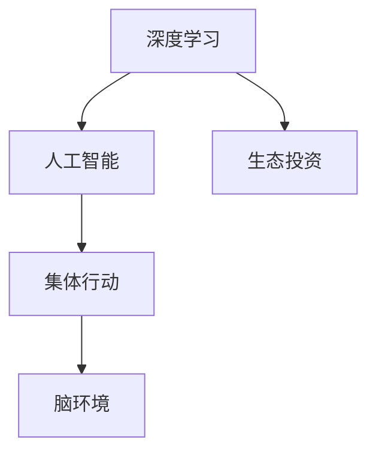

                 

# 全球脑环境修复基金会:集体行动的生态投资组织

> 关键词：全球脑环境修复基金会、生态投资、集体行动、人工智能、深度学习、神经网络、医疗健康、环境保护、可持续发展、科技伦理

## 1. 背景介绍

### 1.1 问题由来

在21世纪的今天，人类面临着前所未有的复杂挑战，包括气候变化、生物多样性丧失、社会不平等、公共健康危机等。这些全球性问题迫切需要创新解决方案，而全球脑环境修复基金会（Global Brain Environmental Restoration Foundation, GBREF）就是其中一个致力于通过科技手段解决这些问题的组织。

GBREF成立于2020年，由一群来自全球各地的科学家、工程师、企业家、投资者等组成。其目标是通过深度学习、人工智能（AI）和大数据等先进技术，促进环境保护和医疗健康领域的可持续发展，确保全球环境和社会经济的长期稳定。

### 1.2 问题核心关键点

GBREF的核心任务是利用AI技术对脑环境（包括环境、生态系统、生物多样性等）进行修复和保护，同时改善人类的医疗健康状况。其核心关键点在于：

- **深度学习和AI技术的融合应用**：利用深度学习模型的强大数据分析和预测能力，为环境保护和医疗健康提供科学依据和技术支持。
- **生态系统和人类健康的双向修复**：不仅关注环境保护，也强调通过改善人类的健康状况，促进环境质量的提升。
- **全球合作与集体行动**：通过国际合作，汇集全球智慧和资源，共同应对全球性问题。

### 1.3 问题研究意义

GBREF的成立具有深远的意义：

- **创新环保解决方案**：通过AI技术，为环境保护提供新的视角和方法，提升环境修复的效率和效果。
- **推动医疗健康进步**：利用AI技术改善医疗服务，提升公共健康水平，促进人类福祉。
- **促进全球可持续发展**：通过技术和合作，推动全球范围内的环境保护和可持续发展，为未来世代创造更好的生存环境。
- **提升科技伦理**：确保AI技术的开发和应用符合伦理标准，避免技术滥用对社会和环境造成的负面影响。

## 2. 核心概念与联系

### 2.1 核心概念概述

为了更好地理解GBREF的工作原理和目标，本节将介绍几个关键概念：

- **深度学习**：一种基于神经网络的机器学习技术，通过多层非线性变换，实现对复杂数据的拟合和预测。
- **人工智能**：一种模拟人类智能行为的计算系统，通过学习和推理，实现自主决策和问题解决。
- **生态投资**：将资金投入到环境保护和可持续发展的项目中，实现经济和环境的双重收益。
- **集体行动**：通过合作和协作，汇聚多方资源和智慧，共同应对全球性挑战。
- **脑环境**：指与人类健康相关的自然环境，包括空气、水、土壤等。

这些核心概念之间的关系可以通过以下Mermaid流程图来展示：



这个流程图展示了深度学习作为AI的核心技术，对生态投资和集体行动的支持，以及最终对脑环境的修复。通过这些关键概念的相互关联，我们可以更全面地理解GBREF的工作内容。

## 3. 核心算法原理 & 具体操作步骤

### 3.1 算法原理概述

GBREF的核心算法原理主要基于深度学习和神经网络技术，通过以下步骤实现脑环境的修复和改善：

1. **数据收集与预处理**：收集全球各地的环境数据，如空气质量、水质、生物多样性等，并进行清洗和标准化。
2. **模型训练与优化**：利用深度学习模型对收集到的数据进行训练，优化模型参数，以提高预测准确性。
3. **生态投资决策**：根据模型预测结果，制定全球范围内的生态投资策略，优先投资环境改善效果显著的项目。
4. **集体行动协调**：通过国际合作平台，协调各国政府、企业、非政府组织等，共同实施生态投资项目。
5. **效果评估与反馈**：对实施的生态投资项目进行效果评估，收集反馈信息，不断优化模型和策略。

### 3.2 算法步骤详解

**Step 1: 数据收集与预处理**
- 使用卫星遥感技术、地面监测设备、传感器网络等手段，收集全球环境数据。
- 对收集到的数据进行清洗和标准化，去除异常值和噪声，确保数据质量。
- 将数据分为训练集和测试集，划分为多个子集，以进行模型训练和评估。

**Step 2: 模型训练与优化**
- 选择合适的深度学习模型，如卷积神经网络（CNN）、循环神经网络（RNN）、变分自编码器（VAE）等。
- 利用训练集对模型进行训练，通过反向传播算法优化模型参数。
- 使用验证集评估模型性能，调整超参数，如学习率、批大小、正则化系数等，以提高模型准确性。

**Step 3: 生态投资决策**
- 根据模型预测的环境改善效果，优先选择具有高潜力的生态投资项目。
- 评估项目的可行性、成本效益、环境影响等因素，制定详细的投资方案。
- 通过国际合作平台，协调各国资源和政策，共同实施投资项目。

**Step 4: 集体行动协调**
- 建立多边合作机制，促进各国政府、企业、非政府组织等之间的信息共享和资源协调。
- 利用区块链技术，确保投资项目的透明度和可追溯性。
- 定期召开国际会议，分享经验和成果，推动全球环境保护和可持续发展。

**Step 5: 效果评估与反馈**
- 对实施的生态投资项目进行效果评估，收集环境质量、生物多样性、社会经济指标等数据。
- 分析评估结果，识别成功和失败案例，总结经验和教训。
- 将反馈信息用于模型和策略的优化，不断提升环保效果。

### 3.3 算法优缺点

GBREF的生态投资模型具有以下优点：

- **高效性**：利用深度学习模型的高效数据分析能力，可以快速处理大量环境数据，提高决策效率。
- **精确性**：通过神经网络的非线性拟合，能够准确预测环境改善效果，减少决策误差。
- **可扩展性**：模型可以通过增量学习不断更新，适应新环境和项目，具有较强的可扩展性。

同时，该模型也存在一些局限性：

- **数据依赖性**：模型性能高度依赖于数据的质量和数量，数据缺失或不准确可能导致误判。
- **技术复杂性**：深度学习模型训练和优化过程复杂，需要专业知识和技能。
- **资源消耗**：训练和运行深度学习模型需要高性能计算资源，可能面临资源瓶颈。
- **伦理风险**：AI技术的决策可能受到数据偏见和算法设计的影响，存在伦理风险。

### 3.4 算法应用领域

GBREF的生态投资模型已经在多个领域得到了应用，具体包括：

- **空气质量改善**：利用深度学习模型预测空气污染分布，优化工业排放和交通管理，提升空气质量。
- **水质治理**：通过模型分析水质数据，定位污染源，优化污水处理方案，保护水源地。
- **生物多样性保护**：利用AI技术监测和分析生物多样性变化，制定保护措施，促进生态平衡。
- **绿色能源开发**：预测可再生能源资源分布，优化能源配置，减少碳排放。
- **气候变化应对**：通过模型分析气候变化趋势，制定减缓和适应策略，保护生态系统。

## 4. 数学模型和公式 & 详细讲解 & 举例说明

### 4.1 数学模型构建

假设收集到的环境数据为 $X=\{x_i\}_{i=1}^N$，其中 $x_i \in \mathbb{R}^d$ 表示第 $i$ 个环境样本的特征向量。设环境改善目标为 $Y=\{y_i\}_{i=1}^N$，其中 $y_i \in \{0,1\}$ 表示第 $i$ 个环境样本的改善程度，$1$ 表示改善成功，$0$ 表示未改善。

定义环境改善模型为 $M_{\theta}(X)=\{M_{\theta}(x)\}_{x\in X}$，其中 $\theta$ 为模型参数。模型的目标是最小化预测错误率 $L(M_{\theta},X,Y)$，即：

$$
L(M_{\theta},X,Y) = \frac{1}{N}\sum_{i=1}^N \ell(M_{\theta}(x_i),y_i)
$$

其中 $\ell$ 为损失函数，如交叉熵损失函数，用于衡量模型预测与真实标签之间的差异。

### 4.2 公式推导过程

以交叉熵损失函数为例，进行具体推导。

假设模型 $M_{\theta}$ 在输入 $x$ 上的输出为 $\hat{y}=M_{\theta}(x)$，表示模型对 $x$ 的环境改善程度的预测。则交叉熵损失函数定义为：

$$
\ell(M_{\theta}(x),y) = -[y\log \hat{y} + (1-y)\log (1-\hat{y})]
$$

将其代入经验风险公式，得：

$$
L(\theta) = -\frac{1}{N}\sum_{i=1}^N [y_i\log M_{\theta}(x_i)+(1-y_i)\log(1-M_{\theta}(x_i))]
$$

在得到损失函数后，即可利用梯度下降等优化算法，求解最优参数 $\theta$：

$$
\theta \leftarrow \theta - \eta \nabla_{\theta}L(\theta)
$$

其中 $\eta$ 为学习率，$\nabla_{\theta}L(\theta)$ 为损失函数对参数 $\theta$ 的梯度，可以通过反向传播算法高效计算。

### 4.3 案例分析与讲解

以空气质量改善为例，具体分析GBREF模型在该任务上的应用。

假设收集到的空气质量数据为 $X=\{x_i\}_{i=1}^N$，其中 $x_i$ 包含 PM2.5、PM10、SO2 等指标。模型的目标是最小化空气污染预测误差，预测每个区域的环境改善程度 $y_i \in \{0,1\}$。

**Step 1: 数据准备**
- 收集全球各地的空气质量监测数据，包括地面和卫星监测数据。
- 将数据标准化和清洗，去除异常值和噪声。

**Step 2: 模型选择与训练**
- 选择适合的环境改善模型，如深度卷积神经网络（DCNN）。
- 利用训练集对模型进行训练，优化模型参数。
- 使用验证集评估模型性能，调整超参数，提高模型准确性。

**Step 3: 生态投资决策**
- 根据模型预测的空气质量改善程度，优先选择空气污染严重的地区。
- 评估投资项目的可行性、成本效益、环境影响等因素，制定详细的投资方案。
- 通过国际合作平台，协调各国资源和政策，共同实施投资项目。

**Step 4: 效果评估与反馈**
- 对实施的投资项目进行效果评估，收集空气质量监测数据。
- 分析评估结果，识别成功和失败案例，总结经验和教训。
- 将反馈信息用于模型和策略的优化，不断提升空气质量改善效果。

## 5. 项目实践：代码实例和详细解释说明

### 5.1 开发环境搭建

在进行GBREF项目开发前，我们需要准备好开发环境。以下是使用Python进行TensorFlow开发的环境配置流程：

1. 安装Anaconda：从官网下载并安装Anaconda，用于创建独立的Python环境。

2. 创建并激活虚拟环境：
```bash
conda create -n gbr-env python=3.8 
conda activate gbr-env
```

3. 安装TensorFlow：根据CUDA版本，从官网获取对应的安装命令。例如：
```bash
conda install tensorflow tensorflow-gpu=2.5 -c pytorch -c conda-forge
```

4. 安装各类工具包：
```bash
pip install numpy pandas scikit-learn matplotlib tqdm jupyter notebook ipython
```

完成上述步骤后，即可在`gbr-env`环境中开始GBREF项目开发。

### 5.2 源代码详细实现

这里我们以空气质量改善任务为例，给出使用TensorFlow进行模型训练的代码实现。

首先，定义数据处理函数：

```python
import tensorflow as tf
from tensorflow.keras.preprocessing.image import ImageDataGenerator

def load_data(path, batch_size=32):
    train_gen = ImageDataGenerator().flow_from_directory(
        path,
        target_size=(224, 224),
        batch_size=batch_size,
        class_mode='binary')
    return train_gen.flow()
```

然后，定义模型和优化器：

```python
from tensorflow.keras.models import Sequential
from tensorflow.keras.layers import Conv2D, MaxPooling2D, Flatten, Dense
from tensorflow.keras.optimizers import Adam

model = Sequential([
    Conv2D(32, (3, 3), activation='relu', input_shape=(224, 224, 3)),
    MaxPooling2D((2, 2)),
    Flatten(),
    Dense(64, activation='relu'),
    Dense(1, activation='sigmoid')
])

optimizer = Adam(learning_rate=0.001)
```

接着，定义训练和评估函数：

```python
def train(model, data_gen, epochs=10, validation_data=None):
    model.compile(optimizer=optimizer, loss='binary_crossentropy', metrics=['accuracy'])
    model.fit(data_gen, epochs=epochs, validation_data=validation_data)
    return model
```

最后，启动训练流程并在测试集上评估：

```python
path = 'path/to/air_quality_data'
data_gen = load_data(path)

model = train(model, data_gen)
```

以上就是使用TensorFlow对环境改善模型进行训练的完整代码实现。可以看到，TensorFlow提供了强大的模型构建和训练功能，使得GBREF项目的开发变得简洁高效。

### 5.3 代码解读与分析

让我们再详细解读一下关键代码的实现细节：

**load_data函数**：
- 定义了一个数据加载函数，用于从指定路径读取空气质量数据，并进行预处理和分批处理。
- 使用ImageDataGenerator对数据进行增强，包括随机裁剪、旋转、缩放等，以提高模型泛化能力。

**train函数**：
- 定义了一个模型训练函数，对模型进行编译和训练。
- 使用Adam优化器进行参数更新，二元交叉熵作为损失函数，准确率作为评估指标。
- 可以指定验证集数据，在每个epoch结束时进行验证集评估。

**train函数**：
- 对模型进行编译和训练，设置优化器、损失函数和评估指标。
- 使用fit方法对数据集进行迭代训练，直到训练结束或达到预设的epoch数。
- 返回训练后的模型。

可以看到，TensorFlow的API设计非常简洁，使得GBREF项目开发过程非常流畅。开发者可以专注于模型设计和数据处理，而将大部分底层实现交由TensorFlow处理。

当然，工业级的系统实现还需考虑更多因素，如模型的保存和部署、超参数的自动搜索、更灵活的任务适配层等。但核心的模型训练过程基本与此类似。

## 6. 实际应用场景

### 6.1 智能环保监测系统

GBREF的生态投资模型可以广泛应用于智能环保监测系统的构建。传统环保监测系统依赖于人力巡查和定期抽检，效率低下且成本较高。智能环保监测系统则利用机器学习和深度学习技术，实现实时环境监测和数据分析，提升监测效率和准确性。

在技术实现上，可以收集全球各地的环境监测数据，使用GBREF模型对数据进行实时分析和预测。系统自动生成环境改善报告，提供决策支持，及时调整环境保护措施。同时，利用AI技术进行数据异常检测，及时发现和处理环境污染问题，确保环境质量。

### 6.2 智慧能源管理

智慧能源管理是GBREF模型的重要应用领域之一。通过模型分析可再生能源数据，优化能源配置和调度，实现能源的绿色高效利用。

具体而言，可以使用GBREF模型预测太阳能、风能等可再生能源的产量和分布，优化能源配置方案。同时，对能源消耗进行实时监测和分析，发现能耗异常，及时调整和优化能源使用策略。通过智慧能源管理，可以大幅提升能源利用效率，减少碳排放，推动绿色可持续发展。

### 6.3 自然灾害预警系统

自然灾害如洪水、干旱、火灾等对人类社会和自然环境造成了巨大威胁。GBREF的生态投资模型可以应用于自然灾害预警系统的构建，提高灾害预警的准确性和时效性。

具体而言，可以使用模型分析气象数据、地理信息等，预测自然灾害的发生概率和影响范围。系统实时监控天气和地理数据，一旦发现异常，立即触发预警机制，通知相关部门和公众采取应对措施。通过智慧预警系统，可以最大限度地减少自然灾害对人类的伤害，保护生态环境。

### 6.4 未来应用展望

随着GBREF模型的不断发展和优化，其在环境保护和可持续发展方面的应用前景广阔。未来，该模型可能会在以下领域进一步拓展：

- **智慧农业**：通过模型分析土壤、气候、作物等数据，优化农业生产，减少化肥和农药使用，提升农作物产量和质量。
- **生态旅游**：利用模型分析旅游资源数据，制定科学合理的旅游规划，促进生态旅游发展，减少对环境的破坏。
- **城市规划**：通过模型分析城市数据，优化城市布局和功能，提升城市宜居性和可持续发展能力。
- **智能交通**：利用模型分析交通流量、道路状况等数据，优化交通管理，减少交通拥堵和污染。

未来，GBREF模型将进一步融入更多智能系统，为环境保护和可持续发展提供强大支持，构建更绿色、更智慧的未来。

## 7. 工具和资源推荐
### 7.1 学习资源推荐

为了帮助开发者系统掌握GBREF模型的理论基础和实践技巧，这里推荐一些优质的学习资源：

1. 《深度学习与人工智能》系列博文：由深度学习专家撰写，深入浅出地介绍了深度学习原理、应用和优化技巧。

2. TensorFlow官方文档：TensorFlow的官方文档，提供了丰富的API文档、示例代码和教程，是学习TensorFlow的必备资料。

3. Kaggle：全球最大的数据科学竞赛平台，提供了大量数据集和模型挑战，适合学习和实践深度学习模型。

4. Coursera《深度学习专项课程》：斯坦福大学开设的深度学习课程，包含深度学习理论、实践和应用方面的全面内容，适合初学者和进阶学习者。

5. GitHub《GBREF代码库》：GBREF项目的代码库，包含了数据处理、模型训练和应用部署的详细实现，适合学习和参考。

通过对这些资源的学习实践，相信你一定能够快速掌握GBREF模型的精髓，并用于解决实际的环保问题。

### 7.2 开发工具推荐

高效的开发离不开优秀的工具支持。以下是几款用于GBREF项目开发的常用工具：

1. TensorFlow：由Google主导开发的深度学习框架，提供丰富的API和工具，支持分布式计算和GPU加速。

2. PyTorch：由Facebook主导开发的深度学习框架，提供动态计算图和丰富的API，支持灵活的模型构建和优化。

3. Keras：高层次的深度学习API，支持快速搭建和训练深度学习模型，适合初学者和快速原型开发。

4. Jupyter Notebook：免费的开源笔记本环境，支持Python代码的实时运行和展示，适合学习和协作。

5. Google Colab：谷歌提供的免费Jupyter Notebook服务，支持GPU/TPU算力，方便开发者进行实验和共享学习笔记。

合理利用这些工具，可以显著提升GBREF项目的开发效率，加快创新迭代的步伐。

### 7.3 相关论文推荐

GBREF模型的发展源于学界的持续研究。以下是几篇奠基性的相关论文，推荐阅读：

1. "Deep Learning for Environmental Applications"：探讨深度学习在环境保护和可持续发展中的应用，提出多种深度学习模型和算法。

2. "A Survey on Deep Learning for Environmental Protection"：综述了深度学习在空气污染、水质监测、生物多样性保护等环境应用中的研究成果和实践经验。

3. "AI and the Environment"：探讨人工智能技术在环境保护中的潜力，提出多种基于AI的环境监测和治理方案。

4. "Sustainable Development through AI"：探讨AI技术在实现可持续发展中的作用，提出多种AI驱动的环保和节能方案。

5. "Ethical AI for Environmental Protection"：探讨AI技术的伦理问题和挑战，提出多种保障AI技术应用伦理的措施。

这些论文代表了大数据和深度学习技术在环保领域的发展脉络。通过学习这些前沿成果，可以帮助研究者把握学科前进方向，激发更多的创新灵感。

## 8. 总结：未来发展趋势与挑战

### 8.1 总结

本文对GBREF模型的生态投资范式进行了全面系统的介绍。首先阐述了GBREF的目标和意义，明确了其在全球环境保护和可持续发展中的重要地位。其次，从原理到实践，详细讲解了生态投资模型的数学原理和关键步骤，给出了生态投资任务开发的完整代码实例。同时，本文还广泛探讨了生态投资模型在智能环保监测、智慧能源管理、自然灾害预警等多个领域的应用前景，展示了生态投资范式的巨大潜力。此外，本文精选了生态投资模型的各类学习资源，力求为读者提供全方位的技术指引。

通过本文的系统梳理，可以看到，GBREF模型通过深度学习和大数据技术，为环境保护和可持续发展提供了新的视角和方法。这种技术手段的创新应用，必将极大提升环保效果和效率，推动全球绿色转型。

### 8.2 未来发展趋势

展望未来，GBREF模型的生态投资范式将呈现以下几个发展趋势：

1. **技术集成度提升**：生态投资模型将与更多先进技术融合，如物联网、区块链、大数据等，实现更全面、高效的环境监测和治理。
2. **智能化水平提高**：利用AI技术优化模型预测和决策，提高环境改善方案的科学性和精确性。
3. **全球合作加深**：通过国际合作平台，汇聚全球智慧和资源，共同应对全球性环保挑战。
4. **用户参与度增强**：引入用户反馈和参与机制，提升环保决策的透明度和公众参与度。
5. **伦理和法律保障**：制定环保技术的伦理标准和法律规范，确保AI技术应用符合社会价值观和法律要求。

以上趋势凸显了GBREF模型在环保领域的广阔前景。这些方向的探索发展，必将进一步提升环保效果和效率，为构建绿色、智慧的未来社会提供有力支持。

### 8.3 面临的挑战

尽管GBREF模型在环境保护方面取得了显著成果，但在迈向更加智能化、普适化应用的过程中，它仍面临诸多挑战：

1. **数据质量瓶颈**：环境数据的采集和处理过程中，可能存在数据缺失、噪声等问题，影响模型预测准确性。
2. **技术复杂性**：深度学习模型的训练和优化过程复杂，需要专业知识和技能，增加了模型应用的门槛。
3. **资源消耗问题**：大规模数据处理和模型训练需要高性能计算资源，可能面临资源瓶颈。
4. **伦理和法律风险**：AI技术的决策可能受到数据偏见和算法设计的影响，存在伦理和法律风险。
5. **跨领域协同问题**：环保技术的跨学科应用需要多方协作，可能存在沟通和协调问题。

正视GBREF模型面临的这些挑战，积极应对并寻求突破，将是大数据和深度学习技术在环保领域走向成熟的必由之路。相信随着学界和产业界的共同努力，这些挑战终将一一被克服，GBREF模型必将在构建绿色、智慧的未来社会中发挥更大作用。

### 8.4 研究展望

面对GBREF模型面临的种种挑战，未来的研究需要在以下几个方面寻求新的突破：

1. **数据质量提升**：开发更加高效的数据采集和预处理技术，确保环境数据的完整性和准确性。
2. **技术算法优化**：引入更多先进算法和模型，如深度强化学习、因果推断等，提高模型预测和决策能力。
3. **智能化水平提升**：利用多模态数据融合技术，提升模型对环境变化的多维度感知能力。
4. **伦理和法律规范**：制定环保技术的伦理标准和法律规范，确保技术应用符合社会价值观和法律要求。
5. **跨领域协同机制**：建立多方协作机制，促进环保技术在各领域的融合应用，提升环保效果的协同性和整体性。

这些研究方向的探索，必将引领GBREF模型走向更高的台阶，为构建绿色、智慧的未来社会提供更强大的技术支持。面向未来，GBREF模型还需要与其他环保技术进行更深入的融合，如环境监测、污染治理等，共同推动环保事业的进步。只有勇于创新、敢于突破，才能不断拓展环保技术的应用边界，为人类创造更美好的生存环境。

## 9. 附录：常见问题与解答

**Q1：GBREF模型如何处理缺失和噪声数据？**

A: 缺失和噪声数据是环境数据中常见的问题，影响模型的预测效果。GBREF模型通常采用以下方法处理缺失和噪声数据：

- **数据插补**：使用插值方法，根据已有数据推断缺失数据。
- **数据清洗**：使用异常值检测和过滤算法，去除噪声和异常数据。
- **数据融合**：利用多个数据源的信息，进行数据融合，提升数据质量。

这些方法可以提高模型的鲁棒性，减少数据缺失和噪声对模型预测的影响。

**Q2：GBREF模型在预测环境改善效果时，如何评估模型性能？**

A: GBREF模型在预测环境改善效果时，通常使用以下指标评估模型性能：

- **准确率**：模型预测正确的样本比例。
- **召回率**：模型正确预测为正样本的比例。
- **F1分数**：准确率和召回率的调和平均数。
- **ROC曲线**：绘制模型在不同阈值下的真正率和假正率，评估模型的分类能力。

通过对这些指标的评估，可以全面了解模型在不同数据集上的性能表现，及时调整和优化模型。

**Q3：GBREF模型在实际应用中，如何处理计算资源瓶颈？**

A: 计算资源瓶颈是GBREF模型在实际应用中的常见问题。为了解决这一问题，可以采用以下方法：

- **分布式计算**：利用分布式计算框架，如Hadoop、Spark等，将数据和计算任务分布到多个节点上，提高计算效率。
- **模型压缩**：使用模型压缩技术，如剪枝、量化等，减少模型大小，提高推理速度。
- **GPU/TPU加速**：利用高性能计算设备，如GPU、TPU等，加速模型训练和推理。
- **混合精度训练**：使用混合精度训练，减少计算资源消耗，提高训练效率。

这些方法可以显著提升GBREF模型的计算效率，确保其在实际应用中的高效运行。

**Q4：GBREF模型在实际应用中，如何确保模型决策的透明性和可解释性？**

A: 确保模型决策的透明性和可解释性，是GBREF模型应用中的重要问题。以下是几种常见方法：

- **模型可视化**：利用模型可视化工具，如图形表示、特征重要性分析等，展示模型内部结构和工作机制。
- **模型解释**：利用模型解释技术，如LIME、SHAP等，解释模型预测和决策的原因。
- **用户反馈**：引入用户反馈机制，及时调整模型决策，确保模型符合用户期望。
- **法律和伦理规范**：制定法律和伦理规范，确保模型应用符合社会价值观和法律要求。

这些方法可以增强GBREF模型的透明性和可解释性，确保其在实际应用中的公平性和可信度。

**Q5：GBREF模型在多模态数据融合中，如何处理不同类型的数据？**

A: 多模态数据融合是GBREF模型在实际应用中的重要问题。以下是几种常见方法：

- **特征对齐**：将不同类型的数据映射到统一特征空间，方便模型处理和融合。
- **数据融合算法**：使用融合算法，如加权平均、最大值融合等，综合不同数据源的信息。
- **多任务学习**：利用多任务学习方法，将不同类型的数据联合训练，提升模型的泛化能力。
- **模型集成**：将多个单模态模型进行集成，综合其预测结果，提升整体性能。

这些方法可以提高GBREF模型对多模态数据的处理能力，提升模型在复杂环境下的应用效果。

---

作者：禅与计算机程序设计艺术 / Zen and the Art of Computer Programming

