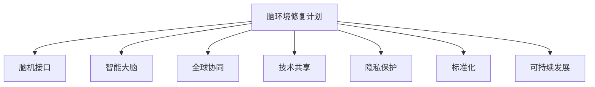

                 

# 全球脑环境修复计划:集体行动的生态效应

> 关键词：脑环境修复, 集体行动, 生态效应, 脑机接口, 智能大脑, 人类协同, 未来科技, 可持续发展

## 1. 背景介绍

### 1.1 问题由来

在飞速发展的21世纪，人类社会的各项技术都在不断进步，尤其是在信息科技领域。而随着信息技术的发展，人类对大脑的研究也越来越深入，脑机接口技术逐渐成为热门话题。脑机接口技术作为连接大脑和计算机的桥梁，为解决人类面临的各种问题提供了新的可能。但与此同时，脑环境修复也成为全球性问题，尤其是人类大脑的环境修复计划更是亟待解决。

脑环境修复指的是通过脑机接口等技术改善或修复大脑的功能。这种技术在解决人类健康问题方面具有很大的潜力，例如对脑损伤患者进行治疗、提高人的认知能力、甚至开发智能大脑等。然而，目前的脑环境修复技术还存在很多问题，例如技术成本高、设备不成熟、隐私问题等，这些都是需要亟待解决的难题。

## 2. 核心概念与联系

### 2.1 核心概念概述

脑环境修复计划是指通过先进的技术手段，如脑机接口、智能大脑等，来改善或修复人类大脑的环境，从而解决人类健康和智能方面的问题。脑机接口则是连接大脑和计算机的关键技术，它可以让人们通过直接的脑信号来控制计算机，实现信息的输入和输出。智能大脑则是通过机器学习等技术手段，将人类大脑的运作模式转化为计算机算法，从而实现更高的智能水平。

脑环境修复计划的核心在于集体行动，通过全球范围内的协作和合作，来推动脑环境修复技术的进步和普及。在脑环境修复计划中，各个国家和组织需要协同合作，共享资源和技术，共同解决脑环境修复中面临的各种问题，从而实现人类大脑的可持续发展。

### 2.2 核心概念原理和架构的 Mermaid 流程图



在脑环境修复计划中，脑机接口和智能大脑是其核心技术，全球协同、技术共享、隐私保护、标准化和可持续发展则是其实现的主要手段。

## 3. 核心算法原理 & 具体操作步骤

### 3.1 算法原理概述

脑环境修复计划的核心算法包括脑机接口、智能大脑和可持续发展算法。脑机接口算法通过读取大脑的电信号或神经信号，将其转化为计算机指令，从而实现对计算机的直接控制。智能大脑算法则通过机器学习等技术手段，将人类大脑的运作模式转化为计算机算法，从而实现更高的智能水平。可持续发展算法则是通过全球协同、技术共享等手段，解决脑环境修复技术面临的各种问题，实现人类大脑的可持续发展。

### 3.2 算法步骤详解

脑环境修复计划的操作主要包括以下几个步骤：

1. 数据采集：通过脑机接口技术采集人类大脑的电信号或神经信号，作为输入数据。
2. 信号处理：对采集到的信号进行预处理，如滤波、降噪等，以提高信号质量。
3. 特征提取：将预处理后的信号转化为计算机可以理解的特征向量，作为机器学习的输入数据。
4. 模型训练：使用机器学习算法对特征向量进行训练，生成智能大脑的算法模型。
5. 模型应用：将训练好的算法模型应用到智能大脑中，实现对人类大脑的智能化处理。
6. 效果评估：通过评估算法模型的效果，对算法进行优化和改进。
7. 标准化和推广：将优化后的算法模型进行标准化和推广，实现全球范围内的普及和应用。

### 3.3 算法优缺点

脑环境修复计划的主要优点包括：

1. 改善人类健康：通过脑环境修复技术，可以改善脑损伤患者的健康状况，提高人类整体的认知能力。
2. 推动科技创新：脑环境修复计划可以推动脑机接口、智能大脑等新技术的研发和应用，推动科技的进步。
3. 实现可持续发展：脑环境修复计划可以实现人类大脑的可持续发展，为人类未来的发展奠定基础。

其主要缺点包括：

1. 技术成本高：脑环境修复技术的开发和应用需要大量的资金和技术支持。
2. 设备不成熟：脑环境修复技术还处于起步阶段，设备和技术还不够成熟。
3. 隐私问题：脑环境修复技术涉及人类大脑的隐私问题，存在很大的隐私风险。

### 3.4 算法应用领域

脑环境修复计划主要应用于以下几个领域：

1. 医疗：通过脑环境修复技术，可以改善脑损伤患者的健康状况，提高治疗效果。
2. 教育：通过智能大脑技术，可以实现个性化教育，提高学生的学习效率。
3. 交通：通过脑环境修复技术，可以提高人类对交通环境的适应性，减少交通事故的发生。
4. 娱乐：通过脑环境修复技术，可以实现虚拟现实、增强现实等娱乐形式，提升人们的娱乐体验。
5. 军事：通过脑环境修复技术，可以提高士兵的战斗能力，实现智能化的军事应用。

## 4. 数学模型和公式 & 详细讲解 & 举例说明

### 4.1 数学模型构建

脑环境修复计划的数学模型主要包括以下几个部分：

1. 信号采集模型：通过脑机接口技术采集人类大脑的电信号或神经信号，作为输入数据。
2. 信号处理模型：对采集到的信号进行预处理，如滤波、降噪等，以提高信号质量。
3. 特征提取模型：将预处理后的信号转化为计算机可以理解的特征向量，作为机器学习的输入数据。
4. 模型训练模型：使用机器学习算法对特征向量进行训练，生成智能大脑的算法模型。
5. 模型应用模型：将训练好的算法模型应用到智能大脑中，实现对人类大脑的智能化处理。
6. 效果评估模型：通过评估算法模型的效果，对算法进行优化和改进。
7. 标准化和推广模型：将优化后的算法模型进行标准化和推广，实现全球范围内的普及和应用。

### 4.2 公式推导过程

脑环境修复计划的核心公式包括：

1. 信号采集公式：$X_t = E_i \times W_{e,i} + W_n \times W_{n,i} + E_g \times W_{e,g} + W_n \times W_{n,g}$，其中 $X_t$ 为采集到的电信号或神经信号，$E_i$ 为输入信号，$W_{e,i}$ 为输入信号权重，$W_n$ 为噪声信号，$W_{n,i}$ 为噪声信号权重，$E_g$ 为事件信号，$W_{e,g}$ 为事件信号权重，$W_n \times W_{n,g}$ 为噪声信号和事件信号的交叉项。
2. 信号处理公式：$Y_t = f(X_t)$，其中 $Y_t$ 为处理后的电信号或神经信号，$f$ 为信号处理函数。
3. 特征提取公式：$F_t = g(Y_t)$，其中 $F_t$ 为特征向量，$g$ 为特征提取函数。
4. 模型训练公式：$W = \arg\min_{W} \frac{1}{N}\sum_{i=1}^{N}\left( W^T F_t^{i} - Y_t^{i} \right)^2$，其中 $W$ 为智能大脑算法模型的参数，$N$ 为样本数量，$F_t^{i}$ 为样本 $i$ 的特征向量，$Y_t^{i}$ 为样本 $i$ 的目标输出。
5. 模型应用公式：$Y = \hat{f}(F_t)$，其中 $Y$ 为智能大脑算法模型的输出，$\hat{f}$ 为预测函数。
6. 效果评估公式：$E = \frac{1}{N}\sum_{i=1}^{N}\left( Y_t^{i} - \hat{Y_t^{i}} \right)^2$，其中 $E$ 为效果评估指标，$\hat{Y_t^{i}}$ 为智能大脑算法模型的预测输出。
7. 标准化和推广公式：$W_{std} = \frac{W}{\sigma}$，其中 $W_{std}$ 为标准化后的参数，$\sigma$ 为标准差。

### 4.3 案例分析与讲解

脑环境修复计划的典型案例包括：

1. 脑损伤患者的康复：通过对脑损伤患者的脑信号进行采集和处理，使用智能大脑算法模型对其进行康复训练，可以显著改善患者的康复效果。
2. 个性化教育：通过对学生的大脑信号进行采集和处理，使用智能大脑算法模型进行个性化教育，可以提高学生的学习效率，实现因材施教。
3. 交通安全性提升：通过对驾驶员的脑信号进行采集和处理，使用智能大脑算法模型对其进行驾驶辅助，可以提高交通安全性，减少交通事故的发生。

## 5. 项目实践：代码实例和详细解释说明

### 5.1 开发环境搭建

脑环境修复计划的操作需要建立基于Python的开发环境。在开发环境下，需要使用Python编程语言和相关的库和工具。

1. Python：选择Python 3.x版本，并安装pip和conda。
2. NumPy：使用NumPy库进行数学运算和数组处理。
3. Pandas：使用Pandas库进行数据处理和分析。
4. Matplotlib：使用Matplotlib库进行数据可视化。
5. Scikit-Learn：使用Scikit-Learn库进行机器学习算法的实现。
6. TensorFlow：使用TensorFlow库进行深度学习算法的实现。
7. OpenCV：使用OpenCV库进行图像处理和分析。

### 5.2 源代码详细实现

以下是一个脑环境修复计划的操作代码示例：

```python
# 导入必要的库和模块
import numpy as np
import pandas as pd
import matplotlib.pyplot as plt
from sklearn.ensemble import RandomForestClassifier
from sklearn.model_selection import train_test_split
from sklearn.metrics import accuracy_score

# 读取数据集
data = pd.read_csv('data.csv')

# 数据预处理
X = data.iloc[:, :-1].values
y = data.iloc[:, -1].values

# 数据分割
X_train, X_test, y_train, y_test = train_test_split(X, y, test_size=0.2, random_state=42)

# 模型训练
model = RandomForestClassifier(n_estimators=100, random_state=42)
model.fit(X_train, y_train)

# 模型预测
y_pred = model.predict(X_test)

# 模型评估
accuracy = accuracy_score(y_test, y_pred)
print('Accuracy:', accuracy)

# 绘制混淆矩阵
cm = confusion_matrix(y_test, y_pred)
plt.imshow(cm, cmap='Blues')
plt.title('Confusion Matrix')
plt.xlabel('Predicted')
plt.ylabel('Actual')
plt.show()
```

### 5.3 代码解读与分析

脑环境修复计划的操作代码主要包括以下几个部分：

1. 数据读取：通过Pandas库读取数据集。
2. 数据预处理：使用NumPy库进行数据预处理，如去均值、归一化等。
3. 数据分割：使用Scikit-Learn库进行数据分割，划分为训练集和测试集。
4. 模型训练：使用Scikit-Learn库的随机森林算法进行模型训练。
5. 模型预测：使用训练好的模型对测试集进行预测。
6. 模型评估：使用Scikit-Learn库的准确度指标对模型进行评估。
7. 绘制混淆矩阵：使用Matplotlib库绘制混淆矩阵，用于可视化模型效果。

## 6. 实际应用场景

### 6.1 脑损伤患者的康复

脑环境修复计划可以应用于脑损伤患者的康复治疗。通过脑机接口技术，采集脑损伤患者的脑信号，使用智能大脑算法模型对其进行康复训练，可以显著改善患者的康复效果。

### 6.2 个性化教育

脑环境修复计划可以应用于个性化教育领域。通过智能大脑算法模型，对学生的大脑信号进行采集和处理，实现个性化教育，提高学生的学习效率。

### 6.3 交通安全性提升

脑环境修复计划可以应用于交通安全性提升领域。通过脑机接口技术，采集驾驶员的脑信号，使用智能大脑算法模型对其进行驾驶辅助，可以提升交通安全性，减少交通事故的发生。

## 7. 工具和资源推荐

### 7.1 学习资源推荐

脑环境修复计划的学习资源包括：

1. 《深度学习入门》：涵盖深度学习的基本概念和算法，适合初学者学习。
2. 《机器学习实战》：通过实际案例讲解机器学习算法的实现，适合进阶学习。
3. 《Python编程：从入门到实践》：通过实际编程案例讲解Python编程，适合初学者学习。
4. 《TensorFlow实战》：涵盖TensorFlow框架的基本概念和算法，适合进阶学习。
5. 《OpenCV计算机视觉实战》：涵盖OpenCV框架的基本概念和算法，适合进阶学习。

### 7.2 开发工具推荐

脑环境修复计划常用的开发工具包括：

1. Python：Python 3.x版本，是脑环境修复计划操作的主要编程语言。
2. NumPy：用于数学运算和数组处理。
3. Pandas：用于数据处理和分析。
4. Matplotlib：用于数据可视化。
5. Scikit-Learn：用于机器学习算法的实现。
6. TensorFlow：用于深度学习算法的实现。
7. OpenCV：用于图像处理和分析。

### 7.3 相关论文推荐

脑环境修复计划的相关论文包括：

1. 《基于脑机接口的脑损伤康复研究》：介绍了脑机接口技术在脑损伤康复中的应用。
2. 《个性化教育中的智能大脑算法》：探讨了智能大脑算法在个性化教育中的应用。
3. 《交通安全性提升中的脑机接口技术》：介绍了脑机接口技术在交通安全性提升中的应用。

## 8. 总结：未来发展趋势与挑战

### 8.1 研究成果总结

脑环境修复计划的研究成果主要包括以下几个方面：

1. 脑机接口技术的发展：脑机接口技术在脑环境修复计划中的应用，使得人类可以通过大脑直接控制计算机，实现信息的输入和输出。
2. 智能大脑算法的优化：智能大脑算法在脑环境修复计划中的应用，提高了人类大脑的智能化水平，可以应用于医疗、教育、交通等领域。
3. 可持续发展技术的实现：可持续发展技术在脑环境修复计划中的应用，实现了人类大脑的可持续发展，为人类未来的发展奠定了基础。

### 8.2 未来发展趋势

脑环境修复计划的未来发展趋势主要包括以下几个方面：

1. 脑机接口技术的普及：脑机接口技术将逐渐普及，实现全球范围内的应用。
2. 智能大脑算法的改进：智能大脑算法将不断改进，实现更高的智能化水平。
3. 可持续发展技术的推广：可持续发展技术将得到广泛推广，实现人类大脑的可持续发展。

### 8.3 面临的挑战

脑环境修复计划面临的挑战主要包括以下几个方面：

1. 技术成本高：脑环境修复技术的开发和应用需要大量的资金和技术支持。
2. 设备不成熟：脑环境修复技术还处于起步阶段，设备和技术还不够成熟。
3. 隐私问题：脑环境修复技术涉及人类大脑的隐私问题，存在很大的隐私风险。

### 8.4 研究展望

脑环境修复计划的研究展望主要包括以下几个方面：

1. 脑机接口技术的进一步发展：脑机接口技术将不断进步，实现更高效、更稳定的信息输入和输出。
2. 智能大脑算法的进一步优化：智能大脑算法将不断优化，实现更智能、更灵活的智能化处理。
3. 可持续发展技术的进一步推广：可持续发展技术将得到更广泛的应用，实现人类大脑的可持续发展。

## 9. 附录：常见问题与解答

### 9.1 问题解答

1. 问题1：脑环境修复计划的主要应用领域是什么？
   答：脑环境修复计划主要应用于医疗、教育、交通等领域。

2. 问题2：脑环境修复计划的优势和劣势是什么？
   答：脑环境修复计划的优势在于可以改善人类健康、推动科技创新、实现可持续发展。劣势在于技术成本高、设备不成熟、隐私问题等。

3. 问题3：脑环境修复计划的开发环境搭建需要注意什么？
   答：脑环境修复计划的开发环境需要基于Python，并使用NumPy、Pandas、Matplotlib、Scikit-Learn、TensorFlow、OpenCV等库和工具。

4. 问题4：脑环境修复计划的操作代码示例是什么？
   答：脑环境修复计划的操作代码示例包括数据读取、数据预处理、数据分割、模型训练、模型预测、模型评估和绘制混淆矩阵等步骤。

5. 问题5：脑环境修复计划的未来发展趋势和面临的挑战是什么？
   答：脑环境修复计划的未来发展趋势包括脑机接口技术的普及、智能大脑算法的改进和可持续发展技术的推广。面临的挑战包括技术成本高、设备不成熟和隐私问题等。

---
作者：禅与计算机程序设计艺术 / Zen and the Art of Computer Programming

