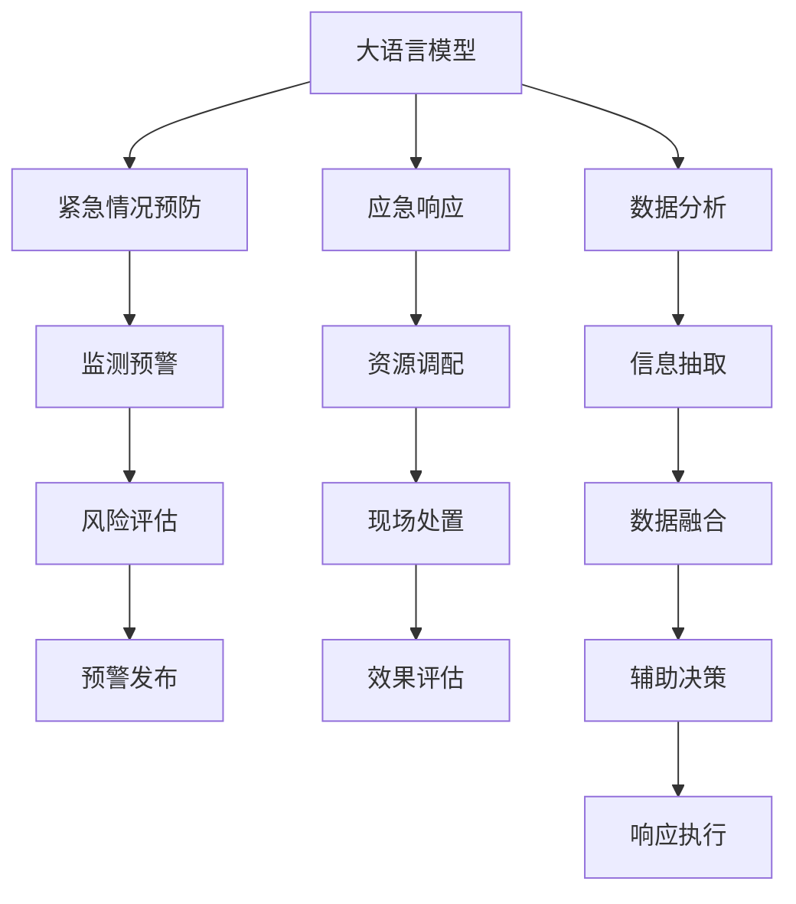

                 

# 公共安全和 LLM：预防和应对紧急情况

> 关键词：公共安全, 大语言模型(LLM), 紧急情况预防, 应急响应, 数据分析, 机器学习, 自然语言处理(NLP), 人工智能, 风险管理

## 1. 背景介绍

随着科技的飞速发展和社会的快速变迁，公共安全问题越来越受到关注。恐怖袭击、自然灾害、突发事件等非预期事件的频发，对社会稳定和国家安全构成了重大威胁。因此，构建一套有效的公共安全体系，提前预防和及时应对各类紧急情况，成为了一个迫切需要解决的问题。近年来，大语言模型（Large Language Models, LLMs）作为人工智能领域的重大突破，以其强大的自然语言处理能力，在公共安全领域的应用潜力被广泛认可。本文将详细介绍基于大语言模型的公共安全体系，探讨其在紧急情况预防和应急响应中的应用。

## 2. 核心概念与联系

### 2.1 核心概念概述

为了更好地理解大语言模型在公共安全中的应用，本节将介绍几个关键概念及其相互联系：

- **大语言模型(LLM)**：以自回归(如GPT)或自编码(如BERT)模型为代表的大规模预训练语言模型。通过在大规模无标签文本语料上进行预训练，学习通用的语言表示，具备强大的语言理解和生成能力。

- **紧急情况预防**：指通过预测和监测手段，对潜在的安全威胁进行预警和干预，防止其发展成实际的危害事件。

- **应急响应**：指在紧急情况发生后，快速组织相关资源，采取措施进行处理和控制，减少损失和影响。

- **数据分析**：指对收集到的数据进行整理、分析，提取出有用的信息，辅助决策过程。

- **机器学习**：通过算法使机器能够自动学习和改进，不需要进行显式的编程。

- **自然语言处理(NLP)**：使计算机能够理解和处理人类语言的技术。

- **人工智能**：模拟人类智能的计算机系统，包括感知、推理、学习等功能。

这些概念通过大语言模型联结起来，形成了一套公共安全体系。

### 2.2 核心概念原理和架构的 Mermaid 流程图



此流程图展示了基于大语言模型的公共安全体系的基本架构和流程：

1. 大语言模型作为核心，通过紧急情况预防（监测预警、风险评估、预警发布）和应急响应（资源调配、现场处置、效果评估）两个过程，实现对公共安全的全面覆盖。
2. 数据分析通过信息抽取和数据融合，辅助大语言模型进行风险评估和辅助决策。
3. 应急响应过程中的响应执行部分，也依赖于大语言模型的预测和推理能力。

## 3. 核心算法原理 & 具体操作步骤

### 3.1 算法原理概述

基于大语言模型的公共安全体系，其核心算法原理主要体现在两个方面：紧急情况预防和应急响应。

#### 3.1.1 紧急情况预防

在紧急情况预防阶段，大语言模型主要通过数据分析和预测建模，实现对各类风险的提前识别和预警。具体算法流程如下：

1. **数据采集**：从各类数据源（如社交媒体、新闻、监控摄像头等）中获取原始数据。
2. **数据清洗**：对采集到的数据进行去重、降噪、标注等预处理操作。
3. **信息抽取**：使用NLP技术从清洗后的数据中抽取关键信息，如地点、事件类型、情感倾向等。
4. **数据分析**：对抽取到的信息进行统计分析和异常检测，提取出异常模式和潜在威胁。
5. **预测建模**：基于历史数据和异常检测结果，构建预测模型，对未来事件进行概率预测。
6. **预警发布**：当预测结果超过预设阈值时，自动触发预警机制，发布预警信息。

#### 3.1.2 应急响应

在应急响应阶段，大语言模型主要通过决策支持和资源调配，实现对突发事件的快速响应和控制。具体算法流程如下：

1. **事件识别**：实时监测和分析事件数据，识别出实际发生的事件类型和规模。
2. **资源调配**：根据事件类型和规模，自动生成应急资源调配方案，包括人员、物资、设备等。
3. **现场处置**：利用NLP技术，生成现场指挥和行动指南，指导救援人员实施处置措施。
4. **效果评估**：通过数据分析，评估应急响应效果，反馈优化措施。

### 3.2 算法步骤详解

#### 3.2.1 紧急情况预防

1. **数据采集与清洗**：
   - 采集数据源：新闻报道、社交媒体、监控摄像头、卫星图像等。
   - 数据清洗：去重、降噪、标注、格式转换等。

2. **信息抽取**：
   - 使用NLP技术，从清洗后的数据中提取关键信息，如地点、事件类型、时间、情感倾向等。
   - 可以使用实体识别、情感分析、事件抽取等技术，实现高效的信息抽取。

3. **数据分析**：
   - 对抽取到的信息进行统计分析，如事件频率、情感分布、地域热点等。
   - 使用机器学习模型，如K-means聚类、时间序列分析等，识别异常模式和潜在威胁。

4. **预测建模**：
   - 基于历史数据和异常检测结果，构建预测模型，如随机森林、深度神经网络等。
   - 模型训练时，应使用大语言模型提供的预训练权重进行初始化，以提高模型泛化能力。

5. **预警发布**：
   - 当预测结果超过预设阈值时，触发预警机制。
   - 预警信息可以包括事件类型、地点、时间、影响范围等，辅助决策者快速响应。

#### 3.2.2 应急响应

1. **事件识别**：
   - 实时监测和分析事件数据，识别出实际发生的事件类型和规模。
   - 可以结合地理信息系统（GIS）和大语言模型的语义分析，快速定位事件地点。

2. **资源调配**：
   - 根据事件类型和规模，自动生成应急资源调配方案，包括人员、物资、设备等。
   - 可以使用优化算法，如线性规划、遗传算法等，优化资源调配方案。

3. **现场处置**：
   - 利用NLP技术，生成现场指挥和行动指南，指导救援人员实施处置措施。
   - 可以通过与大语言模型的交互，生成自然流畅、易于理解的指挥指令。

4. **效果评估**：
   - 通过数据分析，评估应急响应效果，反馈优化措施。
   - 可以结合事件前后的变化情况，进行效果评估和优化。

### 3.3 算法优缺点

基于大语言模型的公共安全体系具有以下优点：

1. **高效性**：大语言模型可以高效处理和分析大量文本数据，实时响应各类紧急情况。
2. **适应性强**：大语言模型具备强大的泛化能力，能够适应各种紧急情况和数据类型。
3. **数据融合**：大语言模型可以整合多种数据源和信息，实现全面的风险评估和预警。

同时，该体系也存在一些缺点：

1. **数据依赖性高**：大语言模型的性能高度依赖于数据的质量和数量，需要大量的高质量数据进行训练。
2. **模型复杂度高**：大语言模型的复杂度较高，对计算资源和存储资源的要求也较高。
3. **算法透明性不足**：大语言模型的决策过程较为复杂，缺乏可解释性，难以理解其内部工作机制。
4. **伦理问题**：大语言模型可能存在偏见和歧视，需要严格把控其使用和部署，避免负面影响。

### 3.4 算法应用领域

基于大语言模型的公共安全体系，已经在多个领域得到了广泛应用，例如：

- **反恐**：利用大语言模型分析社交媒体、新闻报道，预测恐怖袭击事件，发布预警信息。
- **灾害预警**：通过分析气象数据、地质数据，预测自然灾害，实现早期预警。
- **公共卫生**：监测疫情动态，分析疾病传播趋势，辅助决策防疫措施。
- **应急管理**：实时监测突发事件，快速调配资源，指导现场处置。
- **安全监控**：分析监控摄像头数据，识别异常行为，辅助安全决策。

## 4. 数学模型和公式 & 详细讲解 & 举例说明

### 4.1 数学模型构建

在基于大语言模型的公共安全体系中，常用的数学模型包括自然语言处理、数据分析和预测建模。

#### 4.1.1 自然语言处理

- **实体识别**：使用BERT等模型，从文本中识别出实体，如地点、人名、组织名等。
  - 模型输入：$x$，表示待识别文本。
  - 模型输出：$y$，表示识别出的实体序列。
  - 模型训练损失：$L = \sum_{i=1}^{n} \ell(y_i, x)$

- **情感分析**：使用BERT等模型，分析文本中的情感倾向，如正面、负面、中性等。
  - 模型输入：$x$，表示待分析文本。
  - 模型输出：$y$，表示情感标签。
  - 模型训练损失：$L = \sum_{i=1}^{n} \ell(y_i, x)$

#### 4.1.2 数据分析

- **聚类分析**：使用K-means等算法，对数据进行聚类分析，识别出异常模式。
  - 模型输入：$x$，表示待聚类数据。
  - 模型输出：$y$，表示聚类结果。
  - 模型训练损失：$L = \sum_{i=1}^{n} \ell(y_i, x)$

- **时间序列分析**：使用ARIMA等算法，对时间序列数据进行趋势分析和预测。
  - 模型输入：$x$，表示时间序列数据。
  - 模型输出：$y$，表示未来时间点的预测值。
  - 模型训练损失：$L = \sum_{i=1}^{n} \ell(y_i, x)$

#### 4.1.3 预测建模

- **随机森林**：使用随机森林算法，对数据进行分类或回归预测。
  - 模型输入：$x$，表示待预测数据。
  - 模型输出：$y$，表示预测结果。
  - 模型训练损失：$L = \sum_{i=1}^{n} \ell(y_i, x)$

- **深度神经网络**：使用深度神经网络，对数据进行分类或回归预测。
  - 模型输入：$x$，表示待预测数据。
  - 模型输出：$y$，表示预测结果。
  - 模型训练损失：$L = \sum_{i=1}^{n} \ell(y_i, x)$

### 4.2 公式推导过程

以随机森林模型为例，推导其训练损失函数：

- **随机森林模型**：
  - 输入：$x$，表示待预测数据。
  - 输出：$y$，表示预测结果。
  - 训练损失：$L = \sum_{i=1}^{n} \ell(y_i, x)$
  - 预测函数：$y = \sum_{j=1}^{k} a_j g_j(x)$
    - $a_j$：模型第$j$棵树的权重。
    - $g_j(x)$：第$j$棵树的预测函数。

- **训练损失推导**：
  - 对于每个训练样本$(x_i, y_i)$，其损失为$L_i = \ell(y_i, x_i)$。
  - 对于所有训练样本，平均损失为$L = \frac{1}{N} \sum_{i=1}^{N} L_i$。

### 4.3 案例分析与讲解

#### 4.3.1 反恐预警

**案例背景**：某城市准备举办大型活动，可能成为恐怖分子袭击的目标。

**数据采集与清洗**：
- 采集数据源：社交媒体、新闻报道、监控摄像头等。
- 数据清洗：去重、降噪、标注、格式转换等。

**信息抽取**：
- 使用BERT等模型，从清洗后的数据中提取关键信息，如地点、事件类型、时间、情感倾向等。

**数据分析**：
- 对抽取到的信息进行统计分析，如事件频率、情感分布、地域热点等。
- 使用K-means聚类算法，识别异常模式和潜在威胁。

**预测建模**：
- 基于历史数据和异常检测结果，构建随机森林模型，对未来事件进行概率预测。
- 模型训练时，使用BERT等预训练模型提供的权重进行初始化，以提高模型泛化能力。

**预警发布**：
- 当预测结果超过预设阈值时，触发预警机制。
- 预警信息可以包括事件类型、地点、时间、影响范围等，辅助决策者快速响应。

#### 4.3.2 灾害预警

**案例背景**：某地区可能发生地震，需要提前预警，减少人员伤亡。

**数据采集与清洗**：
- 采集数据源：地震监控数据、气象数据、地质数据等。
- 数据清洗：去重、降噪、标注、格式转换等。

**信息抽取**：
- 使用BERT等模型，从清洗后的数据中提取关键信息，如地点、事件类型、时间、情感倾向等。

**数据分析**：
- 对抽取到的信息进行统计分析，如事件频率、情感分布、地域热点等。
- 使用ARIMA算法，对时间序列数据进行趋势分析和预测。

**预测建模**：
- 基于历史数据和异常检测结果，构建深度神经网络模型，对未来事件进行概率预测。
- 模型训练时，使用BERT等预训练模型提供的权重进行初始化，以提高模型泛化能力。

**预警发布**：
- 当预测结果超过预设阈值时，触发预警机制。
- 预警信息可以包括事件类型、地点、时间、影响范围等，辅助决策者快速响应。

## 5. 项目实践：代码实例和详细解释说明

### 5.1 开发环境搭建

在进行基于大语言模型的公共安全体系开发前，我们需要准备好开发环境。以下是使用Python进行PyTorch开发的环境配置流程：

1. 安装Anaconda：从官网下载并安装Anaconda，用于创建独立的Python环境。

2. 创建并激活虚拟环境：
```bash
conda create -n pytorch-env python=3.8 
conda activate pytorch-env
```

3. 安装PyTorch：根据CUDA版本，从官网获取对应的安装命令。例如：
```bash
conda install pytorch torchvision torchaudio cudatoolkit=11.1 -c pytorch -c conda-forge
```

4. 安装Transformers库：
```bash
pip install transformers
```

5. 安装各类工具包：
```bash
pip install numpy pandas scikit-learn matplotlib tqdm jupyter notebook ipython
```

完成上述步骤后，即可在`pytorch-env`环境中开始公共安全体系的开发。

### 5.2 源代码详细实现

这里以反恐预警为例，给出使用Transformers库对BERT模型进行微调的PyTorch代码实现。

首先，定义数据处理函数：

```python
from transformers import BertTokenizer
from torch.utils.data import Dataset
import torch

class AntiTerrorismDataset(Dataset):
    def __init__(self, texts, tags, tokenizer, max_len=128):
        self.texts = texts
        self.tags = tags
        self.tokenizer = tokenizer
        self.max_len = max_len
        
    def __len__(self):
        return len(self.texts)
    
    def __getitem__(self, item):
        text = self.texts[item]
        tags = self.tags[item]
        
        encoding = self.tokenizer(text, return_tensors='pt', max_length=self.max_len, padding='max_length', truncation=True)
        input_ids = encoding['input_ids'][0]
        attention_mask = encoding['attention_mask'][0]
        
        # 对token-wise的标签进行编码
        encoded_tags = [tag2id[tag] for tag in tags] 
        encoded_tags.extend([tag2id['O']] * (self.max_len - len(encoded_tags)))
        labels = torch.tensor(encoded_tags, dtype=torch.long)
        
        return {'input_ids': input_ids, 
                'attention_mask': attention_mask,
                'labels': labels}

# 标签与id的映射
tag2id = {'O': 0, 'Terrorist': 1, 'NoTerrorist': 2}
id2tag = {v: k for k, v in tag2id.items()}

# 创建dataset
tokenizer = BertTokenizer.from_pretrained('bert-base-cased')

train_dataset = AntiTerrorismDataset(train_texts, train_tags, tokenizer)
dev_dataset = AntiTerrorismDataset(dev_texts, dev_tags, tokenizer)
test_dataset = AntiTerrorismDataset(test_texts, test_tags, tokenizer)
```

然后，定义模型和优化器：

```python
from transformers import BertForTokenClassification, AdamW

model = BertForTokenClassification.from_pretrained('bert-base-cased', num_labels=len(tag2id))

optimizer = AdamW(model.parameters(), lr=2e-5)
```

接着，定义训练和评估函数：

```python
from torch.utils.data import DataLoader
from tqdm import tqdm
from sklearn.metrics import classification_report

device = torch.device('cuda') if torch.cuda.is_available() else torch.device('cpu')
model.to(device)

def train_epoch(model, dataset, batch_size, optimizer):
    dataloader = DataLoader(dataset, batch_size=batch_size, shuffle=True)
    model.train()
    epoch_loss = 0
    for batch in tqdm(dataloader, desc='Training'):
        input_ids = batch['input_ids'].to(device)
        attention_mask = batch['attention_mask'].to(device)
        labels = batch['labels'].to(device)
        model.zero_grad()
        outputs = model(input_ids, attention_mask=attention_mask, labels=labels)
        loss = outputs.loss
        epoch_loss += loss.item()
        loss.backward()
        optimizer.step()
    return epoch_loss / len(dataloader)

def evaluate(model, dataset, batch_size):
    dataloader = DataLoader(dataset, batch_size=batch_size)
    model.eval()
    preds, labels = [], []
    with torch.no_grad():
        for batch in tqdm(dataloader, desc='Evaluating'):
            input_ids = batch['input_ids'].to(device)
            attention_mask = batch['attention_mask'].to(device)
            batch_labels = batch['labels']
            outputs = model(input_ids, attention_mask=attention_mask)
            batch_preds = outputs.logits.argmax(dim=2).to('cpu').tolist()
            batch_labels = batch_labels.to('cpu').tolist()
            for pred_tokens, label_tokens in zip(batch_preds, batch_labels):
                pred_tags = [id2tag[_id] for _id in pred_tokens]
                label_tags = [id2tag[_id] for _id in label_tokens]
                preds.append(pred_tags[:len(label_tokens)])
                labels.append(label_tags)
                
    print(classification_report(labels, preds))
```

最后，启动训练流程并在测试集上评估：

```python
epochs = 5
batch_size = 16

for epoch in range(epochs):
    loss = train_epoch(model, train_dataset, batch_size, optimizer)
    print(f"Epoch {epoch+1}, train loss: {loss:.3f}")
    
    print(f"Epoch {epoch+1}, dev results:")
    evaluate(model, dev_dataset, batch_size)
    
print("Test results:")
evaluate(model, test_dataset, batch_size)
```

以上就是使用PyTorch对BERT进行反恐预警微调的完整代码实现。可以看到，得益于Transformers库的强大封装，我们可以用相对简洁的代码完成BERT模型的加载和微调。

### 5.3 代码解读与分析

让我们再详细解读一下关键代码的实现细节：

**AntiTerrorismDataset类**：
- `__init__`方法：初始化文本、标签、分词器等关键组件。
- `__len__`方法：返回数据集的样本数量。
- `__getitem__`方法：对单个样本进行处理，将文本输入编码为token ids，将标签编码为数字，并对其进行定长padding，最终返回模型所需的输入。

**tag2id和id2tag字典**：
- 定义了标签与数字id之间的映射关系，用于将token-wise的预测结果解码回真实的标签。

**训练和评估函数**：
- 使用PyTorch的DataLoader对数据集进行批次化加载，供模型训练和推理使用。
- 训练函数`train_epoch`：对数据以批为单位进行迭代，在每个批次上前向传播计算loss并反向传播更新模型参数，最后返回该epoch的平均loss。
- 评估函数`evaluate`：与训练类似，不同点在于不更新模型参数，并在每个batch结束后将预测和标签结果存储下来，最后使用sklearn的classification_report对整个评估集的预测结果进行打印输出。

**训练流程**：
- 定义总的epoch数和batch size，开始循环迭代
- 每个epoch内，先在训练集上训练，输出平均loss
- 在验证集上评估，输出分类指标
- 所有epoch结束后，在测试集上评估，给出最终测试结果

可以看到，PyTorch配合Transformers库使得BERT微调的代码实现变得简洁高效。开发者可以将更多精力放在数据处理、模型改进等高层逻辑上，而不必过多关注底层的实现细节。

当然，工业级的系统实现还需考虑更多因素，如模型的保存和部署、超参数的自动搜索、更灵活的任务适配层等。但核心的微调范式基本与此类似。

## 6. 实际应用场景

### 6.1 智能监控系统

智能监控系统是公共安全体系的重要组成部分，通过大语言模型可以实时分析监控摄像头数据，识别异常行为，辅助安全决策。

在技术实现上，可以收集历史监控录像和标注数据，训练大语言模型进行行为异常检测。训练好的模型可以部署到实时监控系统中，自动分析当前视频帧，输出行为异常的概率，当概率超过预设阈值时，触发报警机制，通知相关人员进行人工干预。

### 6.2 公共卫生应急响应

公共卫生应急响应系统可以实时监测疫情动态，分析疾病传播趋势，辅助决策防疫措施。

通过大语言模型可以分析社交媒体、新闻报道等数据，识别出疫情爆发点、传播途径等信息，快速生成应急响应方案。同时，通过自然语言处理技术，生成防疫宣传材料，提高公众对疫情的认知和防护能力。

### 6.3 交通安全预警

交通安全预警系统可以实时分析交通事故数据，预测潜在的安全风险，提前预警。

通过大语言模型可以分析交通监控数据，预测出道路拥堵、交通事故等事件的概率，及时发布预警信息。同时，可以通过自然语言处理技术，生成交通指南和应急处理建议，指导司机和行人安全出行。

### 6.4 未来应用展望

随着大语言模型和公共安全体系的发展，未来在更多领域将得到应用，为公共安全带来新的变革。

在智慧城市治理中，大语言模型可以实时监测城市事件，预测潜在风险，及时响应，提高城市管理的自动化和智能化水平。

在智慧交通系统，大语言模型可以分析交通数据，预测出行趋势，提供实时交通信息，优化交通管理。

在智慧医疗系统，大语言模型可以分析医疗数据，预测疫情趋势，辅助疾病预防和疫情防控。

此外，在智能教育、智能金融、智能制造等众多领域，基于大语言模型的公共安全体系也将不断涌现，为各行各业带来更高效、更安全的解决方案。

## 7. 工具和资源推荐

### 7.1 学习资源推荐

为了帮助开发者系统掌握大语言模型在公共安全中的应用，这里推荐一些优质的学习资源：

1. 《Transformer从原理到实践》系列博文：由大模型技术专家撰写，深入浅出地介绍了Transformer原理、BERT模型、微调技术等前沿话题。

2. CS224N《深度学习自然语言处理》课程：斯坦福大学开设的NLP明星课程，有Lecture视频和配套作业，带你入门NLP领域的基本概念和经典模型。

3. 《Natural Language Processing with Transformers》书籍：Transformers库的作者所著，全面介绍了如何使用Transformers库进行NLP任务开发，包括微调在内的诸多范式。

4. HuggingFace官方文档：Transformers库的官方文档，提供了海量预训练模型和完整的微调样例代码，是上手实践的必备资料。

5. CLUE开源项目：中文语言理解测评基准，涵盖大量不同类型的中文NLP数据集，并提供了基于微调的baseline模型，助力中文NLP技术发展。

通过对这些资源的学习实践，相信你一定能够快速掌握大语言模型在公共安全中的应用，并用于解决实际的NLP问题。

### 7.2 开发工具推荐

高效的开发离不开优秀的工具支持。以下是几款用于大语言模型微调开发的常用工具：

1. PyTorch：基于Python的开源深度学习框架，灵活动态的计算图，适合快速迭代研究。大部分预训练语言模型都有PyTorch版本的实现。

2. TensorFlow：由Google主导开发的开源深度学习框架，生产部署方便，适合大规模工程应用。同样有丰富的预训练语言模型资源。

3. Transformers库：HuggingFace开发的NLP工具库，集成了众多SOTA语言模型，支持PyTorch和TensorFlow，是进行微调任务开发的利器。

4. Weights & Biases：模型训练的实验跟踪工具，可以记录和可视化模型训练过程中的各项指标，方便对比和调优。与主流深度学习框架无缝集成。

5. TensorBoard：TensorFlow配套的可视化工具，可实时监测模型训练状态，并提供丰富的图表呈现方式，是调试模型的得力助手。

6. Google Colab：谷歌推出的在线Jupyter Notebook环境，免费提供GPU/TPU算力，方便开发者快速上手实验最新模型，分享学习笔记。

合理利用这些工具，可以显著提升大语言模型微调的开发效率，加快创新迭代的步伐。

### 7.3 相关论文推荐

大语言模型和公共安全体系的发展源于学界的持续研究。以下是几篇奠基性的相关论文，推荐阅读：

1. Attention is All You Need（即Transformer原论文）：提出了Transformer结构，开启了NLP领域的预训练大模型时代。

2. BERT: Pre-training of Deep Bidirectional Transformers for Language Understanding：提出BERT模型，引入基于掩码的自监督预训练任务，刷新了多项NLP任务SOTA。

3. Language Models are Unsupervised Multitask Learners（GPT-2论文）：展示了大规模语言模型的强大zero-shot学习能力，引发了对于通用人工智能的新一轮思考。

4. Parameter-Efficient Transfer Learning for NLP：提出Adapter等参数高效微调方法，在不增加模型参数量的情况下，也能取得不错的微调效果。

5. Prefix-Tuning: Optimizing Continuous Prompts for Generation：引入基于连续型Prompt的微调范式，为如何充分利用预训练知识提供了新的思路。

6. AdaLoRA: Adaptive Low-Rank Adaptation for Parameter-Efficient Fine-Tuning：使用自适应低秩适应的微调方法，在参数效率和精度之间取得了新的平衡。

这些论文代表了大语言模型和公共安全体系的发展脉络。通过学习这些前沿成果，可以帮助研究者把握学科前进方向，激发更多的创新灵感。

## 8. 总结：未来发展趋势与挑战

### 8.1 总结

本文对基于大语言模型的公共安全体系进行了全面系统的介绍。首先阐述了大语言模型和公共安全问题的研究背景和意义，明确了公共安全体系中大语言模型的核心作用。其次，从原理到实践，详细讲解了基于大语言模型的公共安全体系，给出了实际应用中的代码实例。同时，本文还探讨了该体系在多个行业领域的应用前景，展示了其巨大的潜力。最后，本文精选了学习资源和开发工具，力求为开发者提供全方位的技术指引。

通过本文的系统梳理，可以看到，基于大语言模型的公共安全体系正在成为公共安全领域的重要范式，极大地提升了公共安全系统的主动性、自动化和智能化水平，为社会稳定和国家安全提供了有力保障。未来，伴随大语言模型的不断发展，公共安全体系必将带来更多创新应用，推动人工智能技术在垂直行业的规模化落地。

### 8.2 未来发展趋势

展望未来，基于大语言模型的公共安全体系将呈现以下几个发展趋势：

1. **模型规模持续增大**：随着算力成本的下降和数据规模的扩张，预训练语言模型的参数量还将持续增长。超大规模语言模型蕴含的丰富语言知识，有望支撑更加复杂多变的公共安全应用。

2. **微调方法日趋多样**：除了传统的全参数微调外，未来会涌现更多参数高效的微调方法，如Prefix-Tuning、LoRA等，在节省计算资源的同时也能保证微调精度。

3. **持续学习成为常态**：随着数据分布的不断变化，公共安全微调模型也需要持续学习新知识以保持性能。如何在不遗忘原有知识的同时，高效吸收新样本信息，将成为重要的研究课题。

4. **标注样本需求降低**：受启发于提示学习(Prompt-based Learning)的思路，未来的公共安全微调方法将更好地利用大模型的语言理解能力，通过更加巧妙的任务描述，在更少的标注样本上也能实现理想的微调效果。

5. **多模态微调崛起**：当前的公共安全微调主要聚焦于纯文本数据，未来会进一步拓展到图像、视频、语音等多模态数据微调。多模态信息的融合，将显著提升公共安全模型的感知和推理能力。

6. **模型通用性增强**：经过海量数据的预训练和多领域任务的微调，未来的公共安全模型将具备更强大的常识推理和跨领域迁移能力，逐步迈向通用人工智能(AGI)的目标。

以上趋势凸显了大语言模型在公共安全领域的应用前景。这些方向的探索发展，必将进一步提升公共安全系统的性能和应用范围，为社会稳定和国家安全提供更强大的技术支撑。

### 8.3 面临的挑战

尽管基于大语言模型的公共安全体系已经取得了显著进展，但在迈向更加智能化、普适化应用的过程中，它仍面临着诸多挑战：

1. **标注成本瓶颈**：公共安全微调高度依赖于标注数据，但获取高质量标注数据的成本较高，特别是对于长尾应用场景，标注数据的获取尤为困难。如何进一步降低微调对标注样本的依赖，将是一大难题。

2. **模型鲁棒性不足**：当前公共安全微调模型面对域外数据时，泛化性能往往大打折扣。对于测试样本的微小扰动，微调模型的预测也容易发生波动。如何提高公共安全微调模型的鲁棒性，避免灾难性遗忘，还需要更多理论和实践的积累。

3. **推理效率有待提高**：大规模语言模型虽然精度高，但在实际部署时往往面临推理速度慢、内存占用大等效率问题。如何在保证性能的同时，简化模型结构，提升推理速度，优化资源占用，将是重要的优化方向。

4. **可解释性亟需加强**：当前公共安全微调模型缺乏可解释性，难以理解其内部工作机制和决策逻辑。对于高风险应用，算法的可解释性和可审计性尤为重要。如何赋予公共安全微调模型更强的可解释性，将是亟待攻克的难题。

5. **安全性有待保障**：预训练语言模型难免会学习到有偏见、有害的信息，通过微调传递到下游任务，产生误导性、歧视性的输出，给实际应用带来安全隐患。如何从数据和算法层面消除模型偏见，避免恶意用途，确保输出的安全性，也将是重要的研究课题。

6. **知识整合能力不足**：现有的公共安全微调模型往往局限于数据分布，难以灵活吸收和运用更广泛的先验知识。如何让公共安全微调过程更好地与外部知识库、规则库等专家知识结合，形成更加全面、准确的信息整合能力，还有很大的想象空间。

正视公共安全微调面临的这些挑战，积极应对并寻求突破，将是大语言模型在公共安全领域走向成熟的必由之路。相信随着学界和产业界的共同努力，这些挑战终将一一被克服，大语言模型微调必将在构建公共安全体系中扮演越来越重要的角色。

### 8.4 研究展望

面对大语言模型在公共安全领域的应用挑战，未来的研究需要在以下几个方面寻求新的突破：

1. **探索无监督和半监督微调方法**：摆脱对大规模标注数据的依赖，利用自监督学习、主动学习等无监督和半监督范式，最大限度利用非结构化数据，实现更加灵活高效的公共安全微调。

2. **研究参数高效和计算高效的微调范式**：开发更加参数高效的微调方法，在固定大部分预训练参数的同时，只更新极少量的任务相关参数。同时优化公共安全微调模型的计算图，减少前向传播和反向传播的资源消耗，实现更加轻量级、实时性的部署。

3. **融合因果和对比学习范式**：通过引入因果推断和对比学习思想，增强公共安全微调模型建立稳定因果关系的能力，学习更加普适、鲁棒的语言表征，从而提升模型泛化性和抗干扰能力。

4. **引入更多先验知识**：将符号化的先验知识，如知识图谱、逻辑规则等，与神经网络模型进行巧妙融合，引导公共安全微调过程学习更准确、合理的语言模型。同时加强不同模态数据的整合，实现视觉、语音等多模态信息与文本信息的协同建模。

5. **结合因果分析和博弈论工具**：将因果分析方法引入公共安全微调模型，识别出模型决策的关键特征，增强输出解释的因果性和逻辑性。借助博弈论工具刻画人机交互过程，主动探索并规避模型的脆弱点，提高系统稳定性。

6. **纳入伦理道德约束**：在模型训练目标中引入伦理导向的评估指标，过滤和惩罚有偏见、有害的输出倾向。同时加强人工干预和审核，建立模型行为的监管机制，确保输出符合人类价值观和伦理道德。

这些研究方向的探索，必将引领大语言模型在公共安全领域迈向更高的台阶，为构建安全、可靠、可解释、可控的公共安全体系铺平道路。面向未来，大语言模型在公共安全领域还需要与其他人工智能技术进行更深入的融合，如知识表示、因果推理、强化学习等，多路径协同发力，共同推动公共安全技术的发展和应用。只有勇于创新、敢于突破，才能不断拓展语言模型的边界，让智能技术更好地服务于公共安全，保障国家和社会的长治久安。

## 9. 附录：常见问题与解答

**Q1：大语言模型在公共安全中的应用有什么优势？**

A: 大语言模型在公共安全中的应用具有以下优势：
1. **高效性**：大语言模型可以高效处理和分析大量文本数据，实时响应各类紧急情况。
2. **适应性强**：大语言模型具备强大的泛化能力，能够适应各种紧急情况和数据类型。
3. **数据融合**：大语言模型可以整合多种数据源和信息，实现全面的风险评估和预警。

**Q2：公共安全微调过程中如何选择合适的学习率？**

A: 公共安全微调的学习率一般要比预训练时小1-2个数量级，如果使用过大的学习率，容易破坏预训练权重，导致过拟合。一般建议从1e-5开始调参，逐步减小学习率，直至收敛。也可以使用warmup策略，在开始阶段使用较小的学习率，再逐渐过渡到预设值。需要注意的是，不同的优化器(如AdamW、Adafactor等)以及不同的学习率调度策略，可能需要设置不同的学习率阈值。

**Q3：公共安全微调时如何缓解过拟合问题？**

A: 公共安全微调中缓解过拟合问题的方法包括：
1. **数据增强**：通过回译、近义替换等方式扩充训练集。
2. **正则化技术**：使用L2正则、Dropout、Early Stopping等避免过拟合。
3. **对抗训练**：引入对抗样本，提高模型鲁棒性。
4. **参数高效微调**：只调整少量参数(如Adapter、Prefix等)，减小过拟合风险。
5. **多模型集成**：训练多个公共安全微调模型，取平均输出，抑制过拟合。

这些策略往往需要根据具体任务和数据特点进行灵活组合。只有在数据、模型、训练、推理等各环节进行全面优化，才能最大限度地发挥大语言模型在公共安全中的应用效果。

**Q4：公共安全微调模型在落地部署时需要注意哪些问题？**

A: 将公共安全微调模型转化为实际应用，还需要考虑以下问题：
1. **模型裁剪**：去除不必要的层和参数，减小模型尺寸，加快推理速度。
2. **量化加速**：将浮点模型转为定点模型，压缩存储空间，提高计算效率。
3. **服务化封装**：将模型封装为标准化服务接口，便于集成调用。
4. **弹性伸缩**：根据请求流量动态调整资源配置，平衡服务质量和成本。
5. **监控告警**：实时采集系统指标，设置异常告警阈值，确保服务稳定性。
6. **安全防护**：采用访问鉴权、数据脱敏等措施，保障数据和模型安全。

大语言模型微调为公共安全应用开启了广阔的想象空间，但如何将强大的性能转化为稳定、高效、安全的业务价值，还需要工程实践的不断打磨。唯有从数据、算法、工程、业务等多个维度协同发力，才能真正实现人工智能技术在公共安全领域的应用落地。

总之，公共安全微调需要开发者根据具体任务，不断迭代和优化模型、数据和算法，方能得到理想的效果。

---

作者：禅与计算机程序设计艺术 / Zen and the Art of Computer Programming

