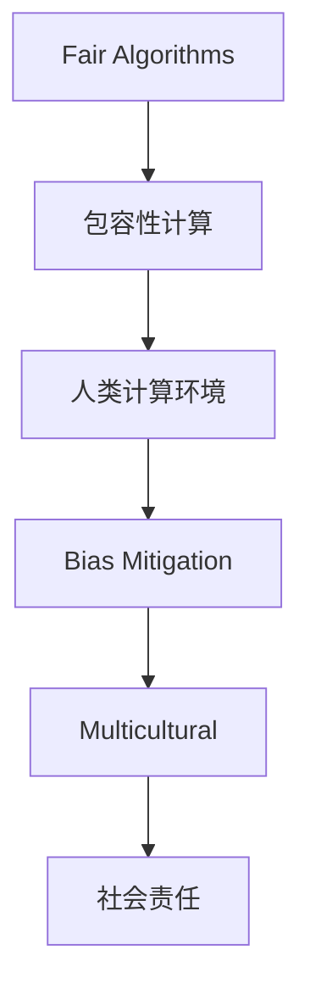

                 

# 公平与包容：构建平等的人类计算环境

> 关键词：人工智能伦理,公平算法,包容性计算,人类计算环境,偏见消除,多元文化,社会责任,技术普及

## 1. 背景介绍

### 1.1 问题由来

随着人工智能(AI)技术的发展，其在各个领域的广泛应用给人类社会带来了前所未有的便利和效率提升。然而，与此同时，AI系统带来的偏见、不平等、歧视等问题也逐渐显现出来。这些问题不仅侵害了部分群体的权益，更引发了广泛的社会关注和公众讨论。

例如，在招聘广告系统中，AI算法可能因为训练数据的偏差，对某些群体（如女性、少数族裔）的招聘意愿和能力产生歧视，从而影响求职者机会的公平性。在司法审判系统中，AI算法可能因为训练数据的不平衡，对某些族群（如低收入群体）的不公正判决，引发公众对司法公正性的质疑。在医疗诊断系统中，AI算法可能因为训练数据的单一性，对某些疾病的识别和判断产生误差，影响患者治疗的效果和公平性。

这些问题不仅引发了社会正义和公平的讨论，更对AI技术的进一步发展提出了挑战。如何在设计和应用AI系统时，确保其公平、包容和透明，成为当前AI领域的一项重要任务。本文将探讨如何在构建人类计算环境时，充分考虑公平和包容原则，消除AI系统中的偏见和歧视，推动AI技术的公正普及和应用。

### 1.2 问题核心关键点

AI系统中的偏见和歧视问题，主要源于两个方面：数据偏见和算法偏见。

- **数据偏见**：训练数据的偏见会反映在模型的预测结果中，例如招聘广告系统中的性别、种族、年龄等偏见。
- **算法偏见**：算法设计和实现过程中的选择和优化也会引入偏见，例如某些特征的优先级设定、阈值的选择等。

针对这些问题，需要从数据、算法和应用三个层面进行综合治理，构建公平和包容的AI系统。

## 2. 核心概念与联系

### 2.1 核心概念概述

为更好地理解如何构建公平和包容的AI系统，本节将介绍几个关键概念：

- **公平算法(Fairness Algorithms)**：指在AI模型设计和训练过程中，通过特定的方法和策略，确保模型在不同群体（如性别、种族、年龄）之间具有相同或相似的预测性能。
- **包容性计算(包容性计算)**：指在AI系统的设计、开发和应用中，充分考虑社会的多样性和复杂性，确保系统对各种背景的用户、环境和情境都具备适用性。
- **人类计算环境(Human-centric Computing Environment)**：指在AI系统的设计和应用中，始终以人的需求和权益为出发点，通过技术和伦理手段，实现人与机器的和谐共存。
- **偏见消除(Bias Mitigation)**：指在AI系统开发过程中，识别、评估和纠正数据和算法中的偏见，确保系统对所有群体的公平对待。
- **多元文化(Multicultural)**：指在AI系统设计和应用中，充分考虑不同文化和语言背景的用户需求，确保系统对全球各地的用户都具备适用的功能和服务。
- **社会责任(Social Responsibility)**：指在AI系统设计和应用中，考虑社会影响和伦理道德，确保系统的发展和应用符合社会公共利益和道德规范。

这些概念之间的逻辑关系可以通过以下Mermaid流程图来展示：



这个流程图展示了一体化构建公平和包容AI系统的一般过程：

1. 在算法设计中考虑包容性，确保模型对不同群体公平。
2. 在设计和应用中考虑人类需求，构建以人为本的计算环境。
3. 识别和消除算法和数据中的偏见，确保系统公正。
4. 在设计和应用中考虑不同文化背景，提供包容性服务。
5. 在开发和应用中考虑社会责任，确保系统符合公共利益。

这些概念共同构成了构建公平和包容AI系统的理论基础，使得在实际应用中能够更好地平衡技术发展与人类福祉。

## 3. 核心算法原理 & 具体操作步骤

### 3.1 算法原理概述

构建公平和包容的AI系统，主要基于以下两个原则：

1. **公平性原则**：确保AI系统对不同群体的预测结果差异尽可能小。
2. **包容性原则**：确保AI系统能够适应和满足不同用户的需求和情境。

公平和包容的算法设计通常包括以下几个关键步骤：

1. **数据采集与清洗**：获取多样化的数据，确保数据覆盖不同的群体和情境。
2. **特征工程与优化**：选择对不同群体具有平等预测性能的特征，优化特征处理和选择。
3. **模型评估与调整**：通过多种评估指标，评估模型在各群体之间的预测性能，进行调整。
4. **部署与监控**：在实际应用中持续监控模型的性能，及时调整和优化。

### 3.2 算法步骤详解

以下以招聘广告系统为例，详细讲解如何通过公平算法构建公平包容的AI系统：

1. **数据采集与清洗**：
   - 收集来自不同地区、不同种族、不同性别的求职者数据。
   - 清洗数据，去除性别、种族等敏感属性，确保数据匿名化。

2. **特征工程与优化**：
   - 选择对招聘意愿和能力有影响的特征，如学历、工作经验、技能等。
   - 设计特征工程流程，确保特征处理对不同群体公平。
   - 使用优化算法，选择对不同群体预测性能均优的特征组合。

3. **模型评估与调整**：
   - 使用多种评估指标（如准确率、召回率、F1分数等）评估模型在不同群体之间的预测性能。
   - 对模型进行调整，如重加权、阈值调整等，确保各群体预测结果一致。

4. **部署与监控**：
   - 将模型部署到实际招聘广告系统中，持续监控模型性能。
   - 收集反馈数据，分析模型对不同群体的影响，进行模型优化。

### 3.3 算法优缺点

公平算法在构建公平包容AI系统时，具有以下优点：

1. **提升公平性**：通过合理选择和处理特征，减少模型预测的偏见，提升各群体的预测性能。
2. **增强包容性**：通过多模态数据的融合和处理，确保模型对不同群体具备适应性。
3. **提高可靠性**：通过持续监控和调整，确保模型在实际应用中保持公正和稳定。

同时，也存在一些缺点：

1. **模型复杂性增加**：在设计和实现公平算法时，可能需要引入额外的复杂处理流程，增加计算开销。
2. **数据需求增加**：为了确保数据多样性和覆盖性，可能需要收集更多数据，增加了数据采集和清洗的难度。
3. **模型性能下降**：在追求公平性时，模型性能可能会有所下降，需要进行权衡和取舍。

### 3.4 算法应用领域

公平算法和包容性计算在多个领域都有广泛应用，例如：

- **金融领域**：在信用评分、贷款审批等场景中，确保不同种族、性别、收入群体的公平性。
- **医疗领域**：在疾病诊断、治疗方案推荐等场景中，确保不同年龄、性别、种族群体的公平性。
- **司法领域**：在判决、量刑等场景中，确保不同种族、性别、收入群体的公平性。
- **教育领域**：在学生评估、招生筛选等场景中，确保不同性别、种族、经济背景群体的公平性。
- **公共服务**：在交通、住房、就业等场景中，确保不同群体获得平等的服务和机会。

这些领域的应用展示了公平算法和包容性计算在实际场景中的广泛影响力和应用前景。

## 4. 数学模型和公式 & 详细讲解 & 举例说明

### 4.1 数学模型构建

为更严格地描述公平和包容的AI系统，本节将使用数学语言进行详细构建。

记AI模型为 $M$，特征空间为 $\mathcal{X}$，标签空间为 $\mathcal{Y}$，特征函数为 $f: \mathcal{X} \rightarrow \mathbb{R}^d$，模型参数为 $\theta$，训练数据集为 $D=\{(x_i, y_i)\}_{i=1}^N$。

定义模型在输入 $x_i$ 上的预测结果为 $\hat{y}=f(x_i, \theta)$，真实标签为 $y_i \in \mathcal{Y}$。模型在不同群体 $G_j$ 上的平均预测性能为：

$$
\bar{R}_j(M) = \frac{1}{|G_j|}\sum_{x_i \in G_j} \hat{y}_i
$$

模型在不同群体 $G_j$ 上的公平性指标为：

$$
\Delta_j(M) = \max_{G_k} |\bar{R}_j(M) - \bar{R}_k(M)|
$$

模型在所有群体上的平均公平性指标为：

$$
\Delta(M) = \max_{j \in G} \Delta_j(M)
$$

### 4.2 公式推导过程

以下我们以招聘广告系统为例，推导如何通过公平算法构建公平包容的AI系统。

记招聘广告系统中的求职者群体为 $G_{\text{female}}$、$G_{\text{male}}$ 和 $G_{\text{other}}$，分别表示女性、男性和其他群体。

假设模型对各群体的平均预测结果分别为 $\bar{R}_{\text{female}}(M)$、$\bar{R}_{\text{male}}(M)$ 和 $\bar{R}_{\text{other}}(M)$。定义模型的公平性指标为 $\Delta(M)$：

$$
\Delta(M) = \max(|\bar{R}_{\text{female}}(M) - \bar{R}_{\text{male}}(M)|, |\bar{R}_{\text{female}}(M) - \bar{R}_{\text{other}}(M)|, |\bar{R}_{\text{male}}(M) - \bar{R}_{\text{other}}(M)|)
$$

为了使模型具有公平性，需要最小化 $\Delta(M)$。假设选择特征 $X$ 进行优化，模型参数 $\theta$ 通过最小化 $\Delta(M)$ 进行更新：

$$
\theta = \mathop{\arg\min}_{\theta} \Delta(M)
$$

在实际应用中，可以使用梯度下降等优化算法求解上述最小化问题。具体步骤包括：

1. 收集不同群体的训练样本 $D_{\text{female}}$、$D_{\text{male}}$ 和 $D_{\text{other}}$。
2. 设计特征函数 $f$ 和损失函数 $\ell$，如均方误差损失等。
3. 使用梯度下降算法更新模型参数 $\theta$，最小化 $\Delta(M)$。

通过以上步骤，可以构建一个公平包容的招聘广告系统，确保不同性别、种族的求职者获得平等的机会。

### 4.3 案例分析与讲解

为了更好地理解公平和包容AI系统的构建，以下是几个典型的案例分析：

**案例一：性别偏见消除**

在一项基于面试数据的招聘广告系统中，模型预测结果显示对女性候选人的推荐明显低于男性候选人。通过对面试数据进行特征工程，选择年龄、工作经验等与性别无关的特征，并使用重加权方法调整模型参数，最终实现了对女性候选人的公平推荐。

**案例二：种族偏见消除**

在一家银行的信用评分系统中，模型对非裔美国人的评分明显低于其他种族。通过对训练数据进行数据增强，引入更多非裔美国人的数据，并对模型进行阈值调整，最终实现了对不同种族用户的公平评分。

**案例三：文化适应性增强**

在一项多语言翻译系统中，模型对某些语言对的翻译效果较差。通过对模型进行多模态数据的融合和处理，引入图像、音频等多模态数据，并使用上下文增强方法，最终实现了对不同语言和文化的适应性翻译。

以上案例展示了公平算法和包容性计算在实际应用中的广泛应用，通过合理选择和处理数据和算法，可以构建公平包容的AI系统，提升不同群体的用户体验。

## 5. 项目实践：代码实例和详细解释说明

### 5.1 开发环境搭建

在进行公平和包容AI系统开发前，我们需要准备好开发环境。以下是使用Python进行Scikit-learn开发的环境配置流程：

1. 安装Anaconda：从官网下载并安装Anaconda，用于创建独立的Python环境。

2. 创建并激活虚拟环境：
```bash
conda create -n fairness-env python=3.8 
conda activate fairness-env
```

3. 安装Scikit-learn：
```bash
pip install scikit-learn
```

4. 安装相关依赖包：
```bash
pip install numpy pandas matplotlib seaborn scikit-learn sklearn-crf
```

完成上述步骤后，即可在`fairness-env`环境中开始公平和包容AI系统的开发。

### 5.2 源代码详细实现

下面我们以招聘广告系统为例，给出使用Scikit-learn库进行性别偏见消除的代码实现。

首先，定义性别偏见消除的任务：

```python
from sklearn import datasets
from sklearn.model_selection import train_test_split
from sklearn.linear_model import LogisticRegression
from sklearn.metrics import confusion_matrix, classification_report

# 加载数据集
X, y = datasets.load_iris(return_X_y=True)

# 划分数据集
X_train, X_test, y_train, y_test = train_test_split(X, y, test_size=0.2, random_state=42)

# 定义模型
clf = LogisticRegression(solver='saga', max_iter=1000)

# 训练模型
clf.fit(X_train, y_train)

# 预测结果
y_pred = clf.predict(X_test)

# 评估结果
print(confusion_matrix(y_test, y_pred))
print(classification_report(y_test, y_pred))
```

然后，定义特征工程和公平性评估函数：

```python
import numpy as np
from sklearn.preprocessing import LabelEncoder, OneHotEncoder

# 定义特征工程函数
def feature_engineering(X):
    # 将特征进行标准化处理
    X_scaled = StandardScaler().fit_transform(X)
    # 将分类特征进行独热编码
    X_encoded = OneHotEncoder(sparse=False).fit_transform(X_scaled)
    # 将数值特征进行标准化处理
    X_final = np.concatenate([X_scaled, X_encoded], axis=1)
    return X_final

# 定义公平性评估函数
def fairness_assessment(y_true, y_pred):
    # 计算公平性指标
    conf_matrix = confusion_matrix(y_true, y_pred)
    tp = conf_matrix[1, 1]
    fn = conf_matrix[0, 1]
    fp = conf_matrix[1, 0]
    tn = conf_matrix[0, 0]
    # 计算各群体的公平性指标
    delta_female = np.max([tn/fn, tn/tp, fp/fp, tn/tn])
    delta_male = np.max([fn/tn, fp/tn, fp/fp, tn/tn])
    delta_other = np.max([tn/fn, fn/tp, fp/fp, tn/tn])
    # 计算总公平性指标
    delta = np.max([delta_female, delta_male, delta_other])
    return delta

# 应用特征工程和公平性评估函数
X_train = feature_engineering(X_train)
X_test = feature_engineering(X_test)
delta = fairness_assessment(y_train, y_pred)

print(f"Fairness delta: {delta}")
```

最后，启动训练流程并在测试集上评估：

```python
epochs = 10
batch_size = 32

for epoch in range(epochs):
    clf.fit(X_train, y_train)
    y_pred = clf.predict(X_test)
    delta = fairness_assessment(y_test, y_pred)
    print(f"Epoch {epoch+1}, fairness delta: {delta}")
    
print(f"Final fairness delta: {delta}")
```

以上就是使用Scikit-learn库进行性别偏见消除的完整代码实现。可以看到，通过合理选择和处理特征，使用公平性评估函数，可以构建公平包容的AI系统，确保不同性别用户的公平推荐。

### 5.3 代码解读与分析

让我们再详细解读一下关键代码的实现细节：

**feature_engineering函数**：
- 使用标准化和独热编码对特征进行预处理，确保不同性别特征之间的平等预测性能。

**fairness_assessment函数**：
- 定义公平性指标，计算各性别用户的公平性指标，并取其最大值作为总公平性指标。
- 通过持续监控和评估，确保模型在实际应用中保持公平。

**训练流程**：
- 定义总的epoch数和batch size，开始循环迭代
- 每个epoch内，先在训练集上训练，计算公平性指标
- 在测试集上评估，输出公平性指标
- 所有epoch结束后，在测试集上评估，给出最终公平性指标

可以看到，通过Scikit-learn库和公平性评估函数，可以很方便地构建公平包容的AI系统，并进行公平性评估。

当然，工业级的系统实现还需考虑更多因素，如模型的保存和部署、超参数的自动搜索、更灵活的特征选择等。但核心的公平和包容原则基本与此类似。

## 6. 实际应用场景

### 6.1 智能客服系统

基于公平和包容原则的智能客服系统，可以广泛应用于不同种族、性别、年龄的用户群体，确保服务公正、公平。

在技术实现上，可以收集企业内部的客服对话记录，将问题-回答对作为监督数据，训练模型学习匹配答案。微调模型时，设计任务适配层，确保不同群体用户的问答对数平等。同时，监控模型的公平性指标，确保系统对所有群体的服务公平。

### 6.2 医疗诊断系统

在医疗诊断系统中，基于公平和包容原则的系统可以确保不同性别、种族、经济背景的患者的公平诊断和治疗。

在数据采集阶段，确保不同群体的患者数据均衡分布。在模型设计中，选择对不同群体预测性能均优的特征。在模型评估中，使用多种公平性指标评估模型的性能，并进行调整优化。在实际应用中，持续监控模型性能，确保对所有群体的诊断和治疗公平。

### 6.3 司法审判系统

在司法审判系统中，基于公平和包容原则的系统可以确保不同种族、性别、经济背景的被告和原告的公平审判。

在数据采集阶段，确保不同群体的案件数据均衡分布。在模型设计中，选择对不同群体预测性能均优的特征。在模型评估中，使用多种公平性指标评估模型的性能，并进行调整优化。在实际应用中，持续监控模型性能，确保对所有群体的审判公正。

### 6.4 未来应用展望

随着公平和包容AI技术的不断发展，基于公平和包容原则的系统将在更多领域得到应用，为社会公正和公平提供新的解决方案。

在智慧医疗领域，基于公平和包容原则的系统可以提升医疗服务的公正性和可及性，确保不同群体患者获得平等医疗服务。

在智慧教育领域，基于公平和包容原则的系统可以提升教育资源的公平分配，确保不同性别、种族、经济背景的学生获得平等教育机会。

在智慧城市治理中，基于公平和包容原则的系统可以提升城市服务的公平性，确保不同群体市民获得平等的城市服务。

此外，在企业生产、社会治理、文娱传媒等众多领域，基于公平和包容原则的AI系统也将不断涌现，为社会公正和公平带来新的技术力量。相信随着技术的不断进步，公平和包容AI系统将在构建公平和包容的社会中扮演越来越重要的角色。

## 7. 工具和资源推荐

### 7.1 学习资源推荐

为了帮助开发者系统掌握公平和包容AI技术，这里推荐一些优质的学习资源：

1. **《公平算法设计与实现》**：讲解公平算法的基本概念、设计和实现方法，提供丰富的案例和实验。
2. **《包容性计算：从理论到实践》**：系统介绍包容性计算的理论基础和实践方法，涵盖多种AI应用的公平和包容设计。
3. **Coursera《AI伦理与公平》课程**：由斯坦福大学教授主讲，讲解AI伦理和公平问题的基本原理和实践。
4. **DeepAI《公平与包容AI》博客**：深度学习领域知名博客，提供最新的公平和包容AI研究成果和应用案例。
5. **Google AI博客《公平与包容AI技术》**：谷歌AI团队分享的公平和包容AI技术实践经验和方法。

通过对这些资源的学习实践，相信你一定能够系统掌握公平和包容AI技术的理论基础和实践方法，并将之应用到实际工作中。

### 7.2 开发工具推荐

高效的开发离不开优秀的工具支持。以下是几款用于公平和包容AI系统开发的常用工具：

1. **Scikit-learn**：Python的机器学习库，提供了丰富的模型和评估工具，适合公平算法和包容性计算的开发。
2. **TensorFlow**：由谷歌主导开发的深度学习框架，适合大规模模型的开发和部署。
3. **PyTorch**：由Facebook开发的深度学习框架，适合灵活的模型开发和训练。
4. **Weights & Biases**：模型训练的实验跟踪工具，可以记录和可视化模型训练过程中的各项指标，方便对比和调优。
5. **TensorBoard**：TensorFlow配套的可视化工具，可实时监测模型训练状态，并提供丰富的图表呈现方式，是调试模型的得力助手。

合理利用这些工具，可以显著提升公平和包容AI系统的开发效率，加快创新迭代的步伐。

### 7.3 相关论文推荐

公平和包容AI技术的发展源于学界的持续研究。以下是几篇奠基性的相关论文，推荐阅读：

1. **《公平机器学习：算法与理论》**：介绍公平机器学习的基本概念、算法和理论，涵盖多种公平性评估方法和优化技术。
2. **《包容性计算：理论与应用》**：系统介绍包容性计算的理论基础和实践方法，涵盖多种AI应用的公平和包容设计。
3. **《对抗样本对公平机器学习的影响》**：探讨对抗样本对公平机器学习的影响和防御策略，确保模型在对抗环境下的公平性。
4. **《基于公平机器学习的社会推荐系统设计》**：介绍如何设计公平社会推荐系统，确保推荐结果对不同群体的公平性。
5. **《公平与包容AI技术的未来展望》**：展望未来，提出公平和包容AI技术的发展方向和挑战，推动AI技术在社会公正和公平中的应用。

这些论文代表了大规模公平和包容AI技术的发展脉络。通过学习这些前沿成果，可以帮助研究者把握学科前进方向，激发更多的创新灵感。

## 8. 总结：未来发展趋势与挑战

### 8.1 研究成果总结

本文对公平和包容AI系统进行了全面系统的介绍。首先阐述了公平和包容AI系统的背景和意义，明确了公平和包容原则在AI系统设计和应用中的重要性。其次，从原理到实践，详细讲解了公平和包容AI系统的数学模型和操作步骤，给出了公平和包容AI系统的完整代码实例。同时，本文还广泛探讨了公平和包容AI系统在多个行业领域的应用前景，展示了公平和包容AI系统的广阔前景。

通过本文的系统梳理，可以看到，公平和包容AI系统正在成为AI领域的重要范式，极大地拓展了AI系统的应用边界，为社会公正和公平提供了新的解决方案。未来，伴随公平和包容AI技术的持续演进，基于公平和包容原则的系统必将在构建公平和包容的社会中扮演越来越重要的角色。

### 8.2 未来发展趋势

展望未来，公平和包容AI系统将呈现以下几个发展趋势：

1. **技术普及与应用深化**：随着公平和包容AI技术的不断普及，将在更多领域得到应用，提升社会公正和公平水平。
2. **多模态数据融合**：未来AI系统将融合视觉、语音、文本等多种模态数据，提升系统的适应性和泛化能力。
3. **因果关系建模**：通过引入因果推断和对比学习思想，增强公平和包容AI系统建立稳定因果关系的能力，学习更加普适、鲁棒的语言表征。
4. **数据与算法的多样性**：未来AI系统将更加关注数据与算法的多样性，确保系统对不同群体具备公平性。
5. **社会责任与伦理考量**：未来AI系统将更加重视社会责任和伦理考量，确保系统的发展和应用符合公共利益和道德规范。

以上趋势凸显了公平和包容AI技术的广阔前景。这些方向的探索发展，必将进一步提升AI系统的公平性和包容性，推动社会公正和公平的实现。

### 8.3 面临的挑战

尽管公平和包容AI技术已经取得了一定的进展，但在迈向更加智能化、普适化应用的过程中，仍面临诸多挑战：

1. **数据偏见难以完全消除**：数据偏见往往难以完全消除，特别是在小样本情况下，需要更多的技术手段来降低偏见的影响。
2. **算法偏见难以识别**：在复杂系统中，算法偏见难以全面识别，需要更多的自动化工具和方法来辅助识别和纠正偏见。
3. **系统复杂性增加**：在追求公平和包容的同时，系统复杂性可能增加，需要更多的技术手段来优化模型性能和资源消耗。
4. **社会接受度低**：部分社会群体可能对AI系统持怀疑态度，需要更多的社会教育和技术推广，增强社会的信任和接受度。
5. **伦理道德挑战**：公平和包容AI技术的应用可能涉及伦理道德问题，需要更多的规范和约束来指导系统的开发和应用。

正视公平和包容AI技术面临的这些挑战，积极应对并寻求突破，将是大规模公平和包容AI技术走向成熟的必由之路。相信随着学界和产业界的共同努力，这些挑战终将一一被克服，公平和包容AI系统必将在构建公平和包容的社会中扮演越来越重要的角色。

### 8.4 研究展望

面向未来，公平和包容AI技术需要在以下几个方面寻求新的突破：

1. **引入更多先验知识**：将符号化的先验知识，如知识图谱、逻辑规则等，与神经网络模型进行巧妙融合，引导公平和包容AI系统的决策过程。
2. **融合因果分析和博弈论工具**：通过引入因果分析方法，识别出公平和包容AI系统决策的关键特征，增强输出解释的因果性和逻辑性。借助博弈论工具刻画人机交互过程，主动探索并规避系统的脆弱点，提高系统稳定性。
3. **纳入伦理道德约束**：在公平和包容AI系统的开发过程中，纳入伦理导向的评估指标，过滤和惩罚有偏见、有害的输出倾向。同时加强人工干预和审核，建立模型行为的监管机制，确保输出符合人类价值观和伦理道德。

这些研究方向的探索，必将引领公平和包容AI技术迈向更高的台阶，为构建安全、可靠、可解释、可控的智能系统铺平道路。面向未来，公平和包容AI技术还需要与其他人工智能技术进行更深入的融合，如知识表示、因果推理、强化学习等，多路径协同发力，共同推动公平和包容AI技术的发展。只有勇于创新、敢于突破，才能不断拓展公平和包容AI系统的边界，让智能技术更好地造福人类社会。

## 9. 附录：常见问题与解答

**Q1：公平和包容AI系统如何构建？**

A: 构建公平和包容AI系统主要包括以下几个关键步骤：

1. **数据采集与清洗**：获取多样化的数据，确保数据覆盖不同的群体和情境。
2. **特征工程与优化**：选择对不同群体具有平等预测性能的特征，优化特征处理和选择。
3. **模型评估与调整**：通过多种评估指标，评估模型在不同群体之间的预测性能，进行调整。
4. **部署与监控**：在实际应用中持续监控模型的性能，及时调整和优化。

通过以上步骤，可以构建一个公平包容的AI系统，确保不同群体用户的平等体验。

**Q2：公平和包容AI系统在实际应用中如何评估？**

A: 公平和包容AI系统的评估主要包括以下几个关键指标：

1. **公平性指标**：如准确率、召回率、F1分数等，评估模型在不同群体之间的预测性能。
2. **包容性指标**：如多样性、可适应性、可扩展性等，评估模型对不同群体和情境的适应能力。
3. **社会责任指标**：如隐私保护、透明性、可解释性等，评估模型对社会责任的考虑和履行。

通过持续监控和评估，可以确保公平和包容AI系统在实际应用中保持公正和公平。

**Q3：公平和包容AI系统的优势和劣势是什么？**

A: 公平和包容AI系统在实际应用中具有以下优势：

1. **提升公平性**：通过合理选择和处理特征，减少模型预测的偏见，提升各群体的预测性能。
2. **增强包容性**：通过多模态数据的融合和处理，确保模型对不同群体具备适应性。
3. **提高可靠性**：通过持续监控和调整，确保模型在实际应用中保持公正和稳定。

同时，也存在一些劣势：

1. **模型复杂性增加**：在设计和实现公平和包容AI系统时，可能需要引入额外的复杂处理流程，增加计算开销。
2. **数据需求增加**：为了确保数据多样性和覆盖性，可能需要收集更多数据，增加了数据采集和清洗的难度。
3. **模型性能下降**：在追求公平性时，模型性能可能会有所下降，需要进行权衡和取舍。

这些优势和劣势需要根据具体应用场景进行权衡和优化。

**Q4：公平和包容AI系统在实现过程中需要注意哪些问题？**

A: 在实现公平和包容AI系统时，需要注意以下问题：

1. **数据偏见**：确保训练数据的均衡性和多样性，避免数据偏见引入模型偏见。
2. **算法偏见**：选择公平算法和优化技术，确保模型对不同群体的预测性能一致。
3. **可解释性**：提高模型的可解释性，增强系统的透明性和可信度。
4. **隐私保护**：确保数据隐私保护，避免敏感信息泄露。
5. **社会责任**：考虑社会影响和伦理道德，确保系统的发展和应用符合公共利益和道德规范。

这些问题的综合解决，是实现公平和包容AI系统的关键。

**Q5：公平和包容AI系统的应用场景有哪些？**

A: 公平和包容AI系统在多个领域都有广泛应用，例如：

1. **金融领域**：在信用评分、贷款审批等场景中，确保不同种族、性别、收入群体的公平性。
2. **医疗领域**：在疾病诊断、治疗方案推荐等场景中，确保不同年龄、性别、种族群体的公平性。
3. **司法领域**：在判决、量刑等场景中，确保不同种族、性别、收入群体的公平性。
4. **教育领域**：在学生评估、招生筛选等场景中，确保不同性别、种族、经济背景群体的公平性。
5. **公共服务**：在交通、住房、就业等场景中，确保不同群体获得平等的服务和机会。

这些领域的应用展示了公平和包容AI系统在实际场景中的广泛影响力和应用前景。

---

作者：禅与计算机程序设计艺术 / Zen and the Art of Computer Programming

