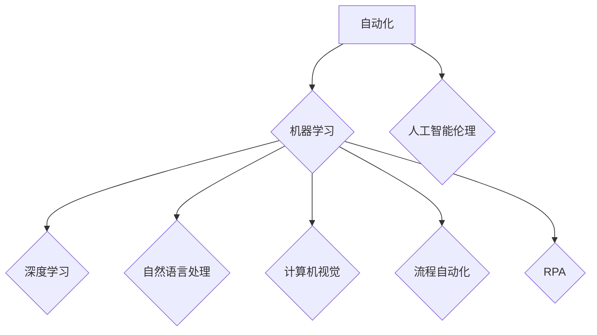

> 自动化、机器学习、深度学习、自然语言处理、计算机视觉、流程自动化、Robotic Process Automation (RPA)、人工智能伦理

## 1. 背景介绍

自动化一直是人类文明进步的驱动力，从最初的轮子发明到如今的智能机器，自动化技术不断革新，推动着社会生产力和生活水平的提升。随着人工智能（AI）技术的飞速发展，自动化领域迎来了前所未有的机遇和挑战。

近年来，机器学习（ML）和深度学习（DL）等人工智能技术取得了突破性进展，为自动化领域带来了革命性的变革。这些技术赋予机器学习能力，使其能够从数据中提取知识，并根据学习到的知识自动完成各种任务。例如，在制造业，机器人可以利用机器视觉技术识别和处理不同类型的物体；在金融业，AI系统可以自动分析财务数据，识别潜在的风险和机会；在医疗保健领域，AI算法可以辅助医生诊断疾病，提高医疗效率。

然而，自动化技术的发展也引发了一些伦理和社会问题，例如：

* **工作岗位替代**: 自动化技术可能会导致大量工作岗位被取代，引发社会失业问题。
* **算法偏见**: AI算法的训练数据可能存在偏见，导致算法输出结果存在偏差，加剧社会不平等。
* **隐私安全**: 自动化系统可能收集和使用大量个人数据，引发隐私安全问题。

## 2. 核心概念与联系

**2.1 自动化**

自动化是指利用技术手段，使生产或工作过程无需人工干预即可自动完成的过程。

**2.2 机器学习**

机器学习是人工智能的一个分支，它使机器能够从数据中学习，并根据学习到的知识进行预测或决策。

**2.3 深度学习**

深度学习是机器学习的一个子领域，它利用多层神经网络来模拟人类大脑的学习过程，能够处理更复杂的数据，并取得更优的学习效果。

**2.4 自然语言处理**

自然语言处理（NLP）是人工智能的一个分支，它致力于使计算机能够理解和处理人类语言。

**2.5 计算机视觉**

计算机视觉是人工智能的一个分支，它致力于使计算机能够“看”和理解图像和视频。

**2.6 流程自动化**

流程自动化是指利用软件工具自动执行重复性任务，提高工作效率和准确性。

**2.7 Robotic Process Automation (RPA)**

Robotic Process Automation（RPA）是一种流程自动化技术，它利用软件机器人模拟人类操作，自动执行重复性任务。

**2.8 人工智能伦理**

人工智能伦理是指在人工智能技术发展和应用过程中，需要遵循的道德准则和社会规范。

**2.9 流程图**



## 3. 核心算法原理 & 具体操作步骤

### 3.1 算法原理概述

机器学习算法的核心原理是通过学习数据中的模式和规律，建立数学模型，并利用这个模型对新的数据进行预测或分类。常见的机器学习算法包括：

* **监督学习**: 利用标记数据训练模型，例如分类和回归问题。
* **无监督学习**: 利用未标记数据发现数据中的隐藏结构，例如聚类和降维。
* **强化学习**: 通过试错学习，使智能体在环境中获得最大奖励。

### 3.2 算法步骤详解

**3.2.1 监督学习算法步骤**

1. **数据收集和预处理**: 收集相关数据，并进行清洗、转换和特征工程等预处理操作。
2. **模型选择**: 根据具体问题选择合适的监督学习算法，例如线性回归、逻辑回归、决策树、支持向量机等。
3. **模型训练**: 利用标记数据训练模型，调整模型参数，使模型能够准确地预测或分类数据。
4. **模型评估**: 利用测试数据评估模型的性能，例如准确率、召回率、F1-score等。
5. **模型部署**: 将训练好的模型部署到实际应用场景中，用于预测或分类新的数据。

**3.2.2 无监督学习算法步骤**

1. **数据收集和预处理**: 收集相关数据，并进行清洗、转换等预处理操作。
2. **模型选择**: 根据具体问题选择合适的无监督学习算法，例如k-means聚类、主成分分析等。
3. **模型训练**: 利用未标记数据训练模型，发现数据中的隐藏结构。
4. **结果分析**: 分析模型输出的结果，例如聚类结果、降维后的数据等。

### 3.3 算法优缺点

**3.3.1 监督学习算法**

* **优点**: 能够实现高准确率的预测和分类。
* **缺点**: 需要大量的标记数据，训练成本较高。

**3.3.2 无监督学习算法**

* **优点**: 不需要标记数据，可以发现数据中的隐藏结构。
* **缺点**: 难以评估模型性能，结果解释性较弱。

### 3.4 算法应用领域

机器学习算法广泛应用于各个领域，例如：

* **图像识别**: 自动识别图像中的物体、场景和人物。
* **语音识别**: 将语音转换为文本。
* **自然语言处理**: 理解和生成人类语言。
* **推荐系统**: 根据用户的历史行为推荐相关商品或服务。
* **金融风险管理**: 识别和评估金融风险。
* **医疗诊断**: 辅助医生诊断疾病。

## 4. 数学模型和公式 & 详细讲解 & 举例说明

### 4.1 数学模型构建

机器学习算法通常基于数学模型，例如线性回归模型、逻辑回归模型、神经网络模型等。这些模型通过数学公式来描述数据之间的关系，并利用这些关系进行预测或分类。

### 4.2 公式推导过程

例如，线性回归模型的数学公式如下：

$$
y = \theta_0 + \theta_1 x_1 + \theta_2 x_2 + ... + \theta_n x_n
$$

其中：

* $y$ 是预测值。
* $\theta_0, \theta_1, ..., \theta_n$ 是模型参数。
* $x_1, x_2, ..., x_n$ 是输入特征。

通过最小化模型预测值与真实值的误差，可以求解出模型参数。

### 4.3 案例分析与讲解

例如，假设我们想要预测房屋价格，输入特征包括房屋面积、房间数量、地理位置等。我们可以使用线性回归模型来建立房屋价格预测模型。

通过训练模型，我们可以得到模型参数，例如：

* $\theta_0 = 100000$
* $\theta_1 = 500$
* $\theta_2 = 10000$

这意味着，房屋面积每增加1平方米，价格会增加500元；房间数量每增加1个，价格会增加10000元。

## 5. 项目实践：代码实例和详细解释说明

### 5.1 开发环境搭建

* Python 3.x
* TensorFlow 或 PyTorch 等深度学习框架
* Jupyter Notebook 或 VS Code 等代码编辑器

### 5.2 源代码详细实现

```python
import tensorflow as tf

# 定义模型结构
model = tf.keras.models.Sequential([
    tf.keras.layers.Dense(64, activation='relu', input_shape=(784,)),
    tf.keras.layers.Dense(10, activation='softmax')
])

# 编译模型
model.compile(optimizer='adam',
              loss='sparse_categorical_crossentropy',
              metrics=['accuracy'])

# 训练模型
model.fit(x_train, y_train, epochs=10)

# 评估模型
loss, accuracy = model.evaluate(x_test, y_test)
print('Test loss:', loss)
print('Test accuracy:', accuracy)
```

### 5.3 代码解读与分析

这段代码实现了使用 TensorFlow 框架训练一个简单的深度学习模型。

* `tf.keras.models.Sequential` 定义了一个顺序模型，即层级结构的模型。
* `tf.keras.layers.Dense` 定义了一个全连接层，每个神经元都连接到上一层的每个神经元。
* `activation='relu'` 指定了激活函数为 ReLU 函数，用于引入非线性。
* `input_shape=(784,)` 指定了输入数据的形状，这里假设输入数据为 784 维向量。
* `optimizer='adam'` 指定了优化算法为 Adam 算法，用于更新模型参数。
* `loss='sparse_categorical_crossentropy'` 指定了损失函数为类别交叉熵损失函数，用于分类问题。
* `metrics=['accuracy']` 指定了评估指标为准确率。
* `model.fit()` 函数用于训练模型，传入训练数据和训练轮数。
* `model.evaluate()` 函数用于评估模型，传入测试数据。

### 5.4 运行结果展示

训练完成后，可以查看模型的测试准确率，评估模型的性能。

## 6. 实际应用场景

### 6.1 自动化办公

* 自动化邮件回复
* 自动化文档处理
* 自动化数据录入

### 6.2 自动化制造

* 机器人自动化生产线
* 自动化质量检测
* 自动化物流配送

### 6.3 自动化金融

* 自动化交易
* 自动化风险管理
* 自动化客户服务

### 6.4 未来应用展望

* 更广泛的应用场景
* 更智能的自动化系统
* 更安全的自动化技术

## 7. 工具和资源推荐

### 7.1 学习资源推荐

* **书籍**:
    * 《深度学习》
    * 《机器学习实战》
    * 《Python机器学习》
* **在线课程**:
    * Coursera
    * edX
    * Udacity

### 7.2 开发工具推荐

* **Python**: 
* **TensorFlow**: 
* **PyTorch**: 
* **Keras**: 

### 7.3 相关论文推荐

* **《ImageNet Classification with Deep Convolutional Neural Networks》**
* **《Attention Is All You Need》**
* **《BERT: Pre-training of Deep Bidirectional Transformers for Language Understanding》**

## 8. 总结：未来发展趋势与挑战

### 8.1 研究成果总结

近年来，自动化技术取得了显著进展，人工智能技术在自动化领域发挥着越来越重要的作用。

### 8.2 未来发展趋势

* **更智能的自动化系统**: 利用更先进的 AI 技术，例如强化学习和迁移学习，开发更智能、更灵活的自动化系统。
* **更广泛的应用场景**: 自动化技术将应用于更多领域，例如医疗保健、教育、交通运输等。
* **更安全的自动化技术**: 确保自动化系统安全可靠，并解决自动化技术带来的伦理和社会问题。

### 8.3 面临的挑战

* **数据获取和隐私问题**: 自动化系统需要大量数据进行训练，如何获取高质量数据，并保护用户隐私是一个挑战。
* **算法偏见**: AI 算法可能存在偏见，导致自动化系统输出结果存在偏差，需要开发更公平、更公正的算法。
* **工作岗位替代**: 自动化技术可能会导致大量工作岗位被取代，需要制定相应的政策和措施，应对社会失业问题。

### 8.4 研究展望

未来，自动化技术将继续发展，并对人类社会产生深远的影响。我们需要加强对自动化技术的研究，并制定相应的政策和措施，确保自动化技术能够安全、可靠、公平地发展，造福人类社会。

## 9. 附录：常见问题与解答

**9.1 自动化技术会取代所有工作岗位吗？**

自动化技术可能会取代一些重复性、低技能的工作岗位，但同时也创造了新的工作岗位。我们需要积极适应自动化带来的变化，提升自身技能，才能在未来社会中获得发展。

**9.2 如何解决自动化技术带来的伦理问题？**

我们需要制定相应的伦理规范和法律法规，引导自动化技术健康发展，并确保自动化技术能够造