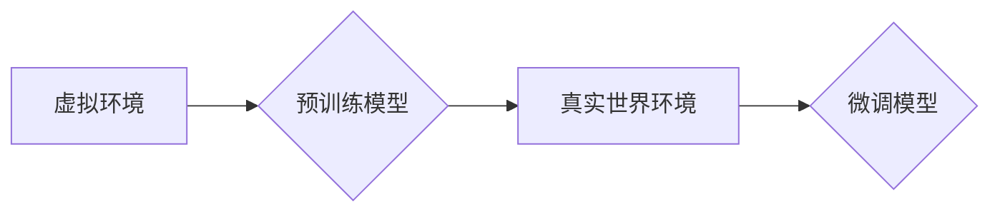

> 自动驾驶, 迁移学习, 虚实环境, 数据效率, 深度学习, 强化学习

## 1. 背景介绍

自动驾驶技术作为人工智能领域的重要应用之一，其发展离不开海量真实世界驾驶数据。然而，收集和标注真实世界驾驶数据成本高昂，且存在安全隐患。因此，如何降低对真实世界数据的依赖，提高自动驾驶系统的训练效率和安全性，成为一个亟待解决的关键问题。

虚实迁移学习 (Virtual-to-Real Transfer Learning) 作为一种新兴的机器学习方法，为解决这一问题提供了新的思路。它利用虚拟环境中的模拟数据进行预训练，然后将预训练模型迁移到真实世界环境中进行微调，从而降低对真实世界数据的依赖。

## 2. 核心概念与联系

**2.1 虚实环境**

虚实环境是指模拟真实世界环境的虚拟环境，例如使用游戏引擎或物理引擎构建的虚拟驾驶场景。虚实环境可以提供安全、可控、可重复的驾驶场景，并可以根据需要灵活调整环境参数，例如天气、路况、交通流量等。

**2.2 迁移学习**

迁移学习是一种机器学习方法，它利用已学习到的知识和经验，迁移到新的任务或领域中。在自动驾驶领域，迁移学习可以将预先训练好的模型迁移到新的驾驶场景或车辆类型中，从而提高模型的泛化能力和训练效率。

**2.3 虚实迁移学习**

虚实迁移学习是指利用虚拟环境中的模拟数据进行预训练，然后将预训练模型迁移到真实世界环境中进行微调的迁移学习方法。

**2.4 架构图**



## 3. 核心算法原理 & 具体操作步骤

**3.1 算法原理概述**

虚实迁移学习的核心思想是利用虚拟环境中的模拟数据进行预训练，从而学习到一些通用的驾驶知识和技能。然后将预训练模型迁移到真实世界环境中进行微调，使其能够适应真实世界的驾驶场景。

**3.2 算法步骤详解**

1. **数据收集和预处理:** 收集虚拟环境中的驾驶数据，并进行预处理，例如数据清洗、数据增强等。
2. **虚拟环境预训练:** 使用收集到的虚拟环境数据进行模型预训练，例如使用深度学习算法训练一个自动驾驶模型。
3. **模型迁移:** 将预训练好的模型迁移到真实世界环境中。
4. **真实世界微调:** 使用真实世界环境中的少量数据对模型进行微调，使其能够适应真实世界的驾驶场景。

**3.3 算法优缺点**

**优点:**

* 降低对真实世界数据的依赖，降低成本和风险。
* 提高模型的泛化能力，使其能够适应不同的驾驶场景。
* 提高模型的训练效率，缩短模型训练时间。

**缺点:**

* 虚拟环境与真实世界环境存在差异，可能导致模型在真实世界环境中表现不佳。
* 需要设计和构建高质量的虚拟环境，这需要一定的技术和资源投入。

**3.4 算法应用领域**

虚实迁移学习在自动驾驶领域具有广泛的应用前景，例如:

* **自动驾驶车辆的训练:** 使用虚拟环境中的模拟数据进行预训练，降低对真实世界数据的依赖。
* **自动驾驶系统的测试和验证:** 使用虚拟环境中的模拟场景进行测试和验证，提高测试效率和安全性。
* **自动驾驶系统的功能开发:** 使用虚拟环境中的模拟场景进行功能开发和测试，缩短开发周期。

## 4. 数学模型和公式 & 详细讲解 & 举例说明

**4.1 数学模型构建**

虚实迁移学习的数学模型可以表示为一个多阶段的学习过程，其中每个阶段都对应一个不同的环境和任务。

* **虚拟环境预训练阶段:** 使用虚拟环境中的数据训练一个模型，其目标是学习到通用的驾驶知识和技能。
* **真实世界微调阶段:** 使用真实世界环境中的数据对预训练模型进行微调，使其能够适应真实世界的驾驶场景。

**4.2 公式推导过程**

假设虚拟环境中的数据为 $D_v$，真实世界环境中的数据为 $D_r$，预训练模型的参数为 $\theta_v$，微调模型的参数为 $\theta_r$。

* **虚拟环境预训练阶段:**

$$
\theta_v = \arg\min_{\theta_v} L_v(\theta_v, D_v)
$$

其中，$L_v$ 是虚拟环境中的损失函数。

* **真实世界微调阶段:**

$$
\theta_r = \arg\min_{\theta_r} L_r(\theta_r, D_r)
$$

其中，$L_r$ 是真实世界环境中的损失函数。

**4.3 案例分析与讲解**

例如，在训练自动驾驶车辆的模型时，可以使用虚拟环境中的模拟数据进行预训练，学习到基本的驾驶规则和技能。然后将预训练模型迁移到真实世界环境中进行微调，使其能够适应真实的道路环境和交通规则。

## 5. 项目实践：代码实例和详细解释说明

**5.1 开发环境搭建**

* 操作系统: Ubuntu 20.04
* Python 版本: 3.8
* 深度学习框架: TensorFlow 2.x
* 虚拟环境工具: conda

**5.2 源代码详细实现**

```python
# 虚拟环境预训练
# 使用虚拟环境中的数据训练模型
# ...

# 模型迁移
# 将预训练模型迁移到真实世界环境
# ...

# 真实世界微调
# 使用真实世界环境中的数据微调模型
# ...
```

**5.3 代码解读与分析**

* 虚拟环境预训练阶段: 使用虚拟环境中的数据训练模型，学习到基本的驾驶规则和技能。
* 模型迁移阶段: 将预训练模型迁移到真实世界环境，并进行必要的调整。
* 真实世界微调阶段: 使用真实世界环境中的数据微调模型，使其能够适应真实的道路环境和交通规则。

**5.4 运行结果展示**

* 虚拟环境中的测试结果
* 真实世界环境中的测试结果

## 6. 实际应用场景

**6.1 自动驾驶车辆的训练**

虚实迁移学习可以用于训练自动驾驶车辆，降低对真实世界数据的依赖，提高训练效率和安全性。

**6.2 自动驾驶系统的测试和验证**

虚实迁移学习可以用于测试和验证自动驾驶系统，使用虚拟环境中的模拟场景进行测试，提高测试效率和安全性。

**6.3 自动驾驶系统的功能开发**

虚实迁移学习可以用于开发自动驾驶系统的功能，使用虚拟环境中的模拟场景进行功能开发和测试，缩短开发周期。

**6.4 未来应用展望**

虚实迁移学习在自动驾驶领域具有广阔的应用前景，未来可以应用于更多场景，例如：

* **个性化自动驾驶:** 根据用户的驾驶习惯和偏好，定制个性化的自动驾驶系统。
* **自动驾驶系统的安全保障:** 使用虚实迁移学习提高自动驾驶系统的安全保障，降低事故风险。
* **自动驾驶系统的智能化:** 使用虚实迁移学习提高自动驾驶系统的智能化水平，使其能够更好地理解和应对复杂的驾驶场景。

## 7. 工具和资源推荐

**7.1 学习资源推荐**

* **书籍:**
    * Deep Learning
    * Reinforcement Learning: An Introduction
* **在线课程:**
    * Coursera: Deep Learning Specialization
    * Udacity: Self-Driving Car Engineer Nanodegree

**7.2 开发工具推荐**

* **游戏引擎:** Unity, Unreal Engine
* **物理引擎:** Gazebo, CARLA
* **深度学习框架:** TensorFlow, PyTorch

**7.3 相关论文推荐**

* **End-to-End Learning for Self-Driving Cars**
* **Learning to Drive in a Virtual World**
* **Transfer Learning for Autonomous Driving**

## 8. 总结：未来发展趋势与挑战

**8.1 研究成果总结**

虚实迁移学习在自动驾驶领域取得了显著的进展，能够有效降低对真实世界数据的依赖，提高模型的训练效率和泛化能力。

**8.2 未来发展趋势**

* **更逼真的虚拟环境:** 开发更逼真的虚拟环境，能够更好地模拟真实世界的驾驶场景。
* **更有效的迁移学习算法:** 研究更有效的迁移学习算法，提高模型的迁移能力。
* **多模态数据融合:** 将多模态数据，例如图像、激光雷达、传感器数据等融合到虚实迁移学习中，提高模型的感知能力和决策能力。

**8.3 面临的挑战**

* **虚拟环境与真实世界环境的差异:** 虚拟环境与真实世界环境存在差异，可能导致模型在真实世界环境中表现不佳。
* **数据标注成本:** 即使使用虚拟环境，也需要对数据进行标注，这仍然是一个成本较高的环节。
* **模型安全性和可靠性:** 确保虚实迁移学习模型的安全性和可靠性，避免模型在真实世界环境中出现安全问题。

**8.4 研究展望**

未来，虚实迁移学习将在自动驾驶领域发挥越来越重要的作用，推动自动驾驶技术的发展和应用。


## 9. 附录：常见问题与解答

**9.1 如何构建高质量的虚拟环境？**

构建高质量的虚拟环境需要考虑以下几个方面:

* **环境的真实性:** 虚拟环境应该尽可能地模拟真实世界的驾驶场景，包括道路、交通标志、车辆、行人等。
* **环境的可控性:** 虚拟环境应该能够根据需要灵活调整环境参数，例如天气、路况、交通流量等。
* **环境的可重复性:** 虚拟环境应该能够重复执行相同的场景，以便于模型的训练和测试。

**9.2 如何评估虚实迁移学习模型的性能？**

评估虚实迁移学习模型的性能可以使用以下指标:

* **准确率:** 模型在真实世界环境中完成任务的准确率。
* **召回率:** 模型在真实世界环境中识别出所有目标的比例。
* **F1-score:** 准确率和召回率的调和平均值。
* **安全性:** 模型在真实世界环境中运行的安全性和可靠性。

**9.3 虚实迁移学习与其他机器学习方法相比有哪些优势？**

虚实迁移学习相对于其他机器学习方法，具有以下优势:

* **降低对真实世界数据的依赖:** 虚实迁移学习可以利用虚拟环境中的模拟数据进行预训练，降低对真实世界数据的依赖。
* **提高模型的泛化能力:** 虚实迁移学习可以使模型在不同的驾驶场景中表现良好。
* **提高模型的训练效率:** 虚实迁移学习可以缩短模型的训练时间。


作者：禅与计算机程序设计艺术 / Zen and the Art of Computer Programming 
<end_of_turn>