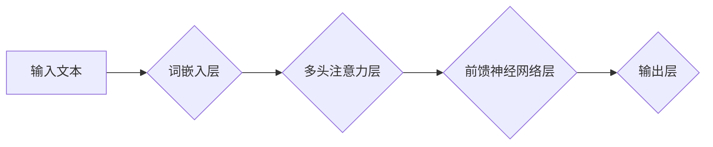

> 自然语言处理，上下文理解，语境感知，Transformer模型，BERT，GPT，XLNet，预训练模型，迁移学习

## 1. 背景介绍

自然语言处理（NLP）作为人工智能领域的重要分支，致力于使计算机能够理解、处理和生成人类语言。近年来，随着深度学习技术的飞速发展，NLP取得了显著进展，例如机器翻译、文本摘要、情感分析等任务取得了突破性进展。然而，传统的NLP方法往往局限于局部特征的提取，难以捕捉长距离依赖关系和复杂的语义信息，从而限制了其在理解上下文和语境方面的能力。

## 2. 核心概念与联系

**2.1 上下文理解**

上下文理解是指机器能够根据输入文本中的上下文信息，准确理解单词、短语或句子的含义。例如，在句子“我爱吃苹果”中，“苹果”的含义取决于“我”和“吃”这两个词语的上下文信息。

**2.2 语境感知**

语境感知是指机器能够根据输入文本的语境信息，判断其含义和意图。例如，在句子“今天天气真好”中，“真好”的含义取决于“今天天气”这个语境信息。

**2.3 Transformer模型**

Transformer模型是一种新型的深度学习架构，其核心思想是利用注意力机制来捕捉长距离依赖关系和复杂的语义信息。Transformer模型在NLP领域取得了显著成功，例如BERT、GPT、XLNet等模型都是基于Transformer架构构建的。

**2.4 Mermaid 流程图**



## 3. 核心算法原理 & 具体操作步骤

**3.1 算法原理概述**

Transformer模型的核心是注意力机制，它能够学习到输入文本中不同词语之间的关系，并根据这些关系来理解上下文和语境。注意力机制可以看作是一种加权求和操作，它将每个词语赋予一个权重，然后将这些权重加权求和得到最终的输出。

**3.2 算法步骤详解**

1. **词嵌入层:** 将输入文本中的每个词语映射到一个低维向量空间中，每个词语都对应一个唯一的向量表示。
2. **多头注意力层:** 利用多个注意力头来捕捉不同类型的词语关系，每个注意力头学习到不同的语义信息。
3. **前馈神经网络层:** 对每个词语的注意力输出进行非线性变换，进一步提取语义特征。
4. **输出层:** 将经过前馈神经网络层的输出进行分类或生成预测结果。

**3.3 算法优缺点**

**优点:**

* 能够捕捉长距离依赖关系，克服了传统RNN模型的短时记忆问题。
* 并行计算能力强，训练速度快。
* 在各种NLP任务中取得了优异的性能。

**缺点:**

* 参数量大，训练成本高。
* 对训练数据要求较高。

**3.4 算法应用领域**

* 机器翻译
* 文本摘要
* 情感分析
* 问答系统
* 代码生成

## 4. 数学模型和公式 & 详细讲解 & 举例说明

**4.1 数学模型构建**

Transformer模型的注意力机制可以表示为以下数学公式：

$$
Attention(Q, K, V) = softmax(\frac{QK^T}{\sqrt{d_k}})V
$$

其中：

* $Q$：查询矩阵
* $K$：键矩阵
* $V$：值矩阵
* $d_k$：键向量的维度
* $softmax$：softmax函数

**4.2 公式推导过程**

注意力机制的核心思想是计算每个词语与其他词语之间的相关性，然后根据这些相关性来加权求和得到最终的输出。

1. 计算查询矩阵 $Q$ 与键矩阵 $K$ 的点积，得到一个得分矩阵。
2. 对得分矩阵进行归一化，得到一个概率分布。
3. 将概率分布与值矩阵 $V$ 进行加权求和，得到最终的输出。

**4.3 案例分析与讲解**

假设我们有一个句子“我爱吃苹果”，其中每个词语都对应一个向量表示。

* $Q$：查询矩阵
* $K$：键矩阵
* $V$：值矩阵

计算 $Q$ 与 $K$ 的点积，得到一个得分矩阵，例如：

```
[0.8, 0.5, 0.2]
[0.6, 0.9, 0.3]
[0.4, 0.7, 0.6]
```

对得分矩阵进行归一化，得到一个概率分布，例如：

```
[0.4, 0.3, 0.3]
```

将概率分布与值矩阵 $V$ 进行加权求和，得到最终的输出，例如：

```
0.4 * V1 + 0.3 * V2 + 0.3 * V3
```

其中 $V1$, $V2$, $V3$ 分别是“我”， “爱”， “吃” 的向量表示。

## 5. 项目实践：代码实例和详细解释说明

**5.1 开发环境搭建**

* Python 3.6+
* TensorFlow 或 PyTorch
* CUDA 和 cuDNN

**5.2 源代码详细实现**

```python
import tensorflow as tf

# 定义Transformer模型
class Transformer(tf.keras.Model):
    def __init__(self, vocab_size, embedding_dim, num_heads, num_layers):
        super(Transformer, self).__init__()
        self.embedding = tf.keras.layers.Embedding(vocab_size, embedding_dim)
        self.transformer_layers = [
            tf.keras.layers.MultiHeadAttention(num_heads=num_heads, key_dim=embedding_dim)
            for _ in range(num_layers)
        ]
        self.feed_forward_layers = [
            tf.keras.layers.Dense(embedding_dim * 4, activation="relu")
            for _ in range(num_layers)
        ]
        self.output_layer = tf.keras.layers.Dense(vocab_size)

    def call(self, inputs):
        # 词嵌入
        embedded = self.embedding(inputs)
        # 多头注意力层
        for transformer_layer in self.transformer_layers:
            embedded = transformer_layer(embedded)
        # 前馈神经网络层
        for feed_forward_layer in self.feed_forward_layers:
            embedded = feed_forward_layer(embedded)
        # 输出层
        outputs = self.output_layer(embedded)
        return outputs

# 实例化模型
model = Transformer(vocab_size=10000, embedding_dim=128, num_heads=8, num_layers=6)

# 训练模型
# ...

```

**5.3 代码解读与分析**

* `Transformer` 类定义了Transformer模型的结构。
* `embedding` 层将词语映射到低维向量空间。
* `transformer_layers` 列表包含多个多头注意力层。
* `feed_forward_layers` 列表包含多个前馈神经网络层。
* `output_layer` 层将最终的输出映射到词语的维度。
* `call` 方法定义了模型的输入和输出关系。

**5.4 运行结果展示**

训练完成后，模型可以用于各种NLP任务，例如机器翻译、文本摘要、情感分析等。

## 6. 实际应用场景

**6.1 机器翻译**

Transformer模型在机器翻译领域取得了显著成果，例如Google Translate、DeepL等翻译工具都采用了Transformer架构。

**6.2 文本摘要**

Transformer模型可以用于自动生成文本摘要，例如新闻摘要、会议记录摘要等。

**6.3 情感分析**

Transformer模型可以用于分析文本的情感倾向，例如判断文本是正面、负面还是中性。

**6.4 未来应用展望**

Transformer模型在NLP领域具有广阔的应用前景，例如：

* 更准确、更流畅的机器翻译
* 更智能、更个性化的聊天机器人
* 更高效、更精准的文本生成
* 更深入、更全面的文本理解

## 7. 工具和资源推荐

**7.1 学习资源推荐**

* **论文:**
    * Attention Is All You Need (Vaswani et al., 2017)
    * BERT: Pre-training of Deep Bidirectional Transformers for Language Understanding (Devlin et al., 2018)
    * GPT: Generative Pre-trained Transformer (Radford et al., 2018)
    * XLNet: Generalized Autoregressive Pretraining for Language Understanding (Yang et al., 2019)
* **书籍:**
    * Deep Learning with Python (François Chollet)
    * Natural Language Processing with Python (Steven Bird, Ewan Klein, Edward Loper)

**7.2 开发工具推荐**

* TensorFlow
* PyTorch
* Hugging Face Transformers

**7.3 相关论文推荐**

* BERT: Pre-training of Deep Bidirectional Transformers for Language Understanding
* GPT: Generative Pre-trained Transformer
* XLNet: Generalized Autoregressive Pretraining for Language Understanding

## 8. 总结：未来发展趋势与挑战

**8.1 研究成果总结**

Transformer模型在NLP领域取得了显著进展，例如在机器翻译、文本摘要、情感分析等任务中取得了优异的性能。

**8.2 未来发展趋势**

* 更大规模的预训练模型
* 更高效的训练方法
* 更广泛的应用场景

**8.3 面临的挑战**

* 模型参数量大，训练成本高
* 对训练数据要求较高
* 缺乏对真实世界复杂语境的理解

**8.4 研究展望**

未来研究方向包括：

* 开发更小、更轻量级的Transformer模型
* 研究更有效的训练方法
* 探索Transformer模型在其他领域，例如计算机视觉、音频处理等方面的应用

## 9. 附录：常见问题与解答

**9.1 如何选择合适的Transformer模型？**

选择合适的Transformer模型取决于具体的应用场景和任务需求。例如，对于机器翻译任务，可以考虑使用BERT或XLNet模型；对于文本摘要任务，可以考虑使用T5或BART模型。

**9.2 如何训练Transformer模型？**

训练Transformer模型需要大量的文本数据和强大的计算资源。可以使用TensorFlow或PyTorch等深度学习框架进行训练。

**9.3 如何评估Transformer模型的性能？**

可以使用BLEU、ROUGE、PERPLEXITY等指标来评估Transformer模型的性能。

作者：禅与计算机程序设计艺术 / Zen and the Art of Computer Programming


<end_of_turn>