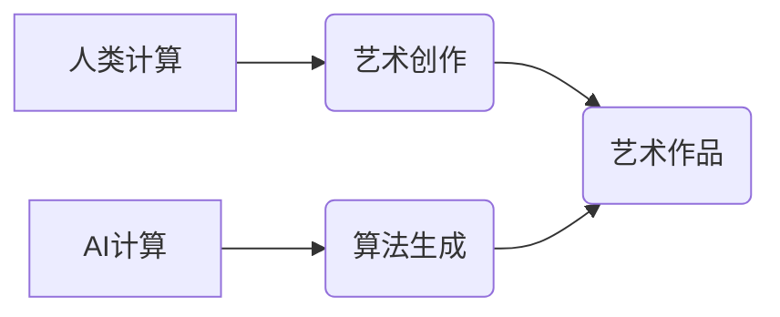

> 人工智能，创意，计算，艺术，人类计算，算法，数学模型，项目实践，应用场景

## 1. 背景介绍

在信息时代，科技与艺术的交融日益频繁，人工智能（AI）作为科技发展前沿，正在深刻地改变着艺术创作的模式和方式。从绘画、音乐到文学，AI技术的介入为艺术创作带来了新的可能性，也引发了人们对艺术本质和人类创造力的思考。

传统上，艺术被视为人类情感、思想和经验的表达，而科技则被视为理性、逻辑和工具的集合。然而，随着计算技术的进步，科技与艺术之间的界限逐渐模糊。AI算法能够学习和模仿人类的创作模式，生成出具有艺术性的作品，这使得“艺术”与“科技”这两个看似截然不同的领域，开始相互渗透和融合。

## 2. 核心概念与联系

**2.1 人类计算与AI计算**

人类计算是指人类利用自身的认知能力、经验和直觉进行思考、分析和解决问题的过程。而AI计算则是利用计算机程序和算法模拟人类的计算能力，进行数据处理、模式识别和决策等任务。

**2.2 艺术与算法的结合**

艺术创作往往需要灵感、想象力和情感的投入，而算法则依赖于逻辑、规则和数据。将艺术与算法结合起来，可以利用算法的精确性和效率，帮助艺术家探索新的创作思路，突破传统创作的局限性。

**2.3  核心概念关系图**



## 3. 核心算法原理 & 具体操作步骤

**3.1 算法原理概述**

生成艺术作品的AI算法通常基于深度学习技术，例如生成对抗网络（GAN）。GAN由两个网络组成：生成器和鉴别器。生成器负责生成新的艺术作品，鉴别器负责判断生成的艺术作品是否真实。这两个网络在对抗性的训练过程中不断迭代，最终生成出逼真的艺术作品。

**3.2 算法步骤详解**

1. **数据准备:** 收集大量艺术作品的图像数据，并进行预处理，例如裁剪、缩放和归一化。
2. **模型训练:** 使用深度学习框架，例如TensorFlow或PyTorch，训练GAN模型。
3. **生成艺术作品:** 将训练好的生成器网络输入随机噪声，即可生成新的艺术作品。
4. **作品评估:** 对生成的艺术作品进行评估，例如使用人类评价或客观指标，并根据评估结果进行模型调整。

**3.3 算法优缺点**

**优点:**

* 可以生成逼真的艺术作品，并探索新的艺术风格。
* 可以自动化艺术创作流程，提高创作效率。

**缺点:**

* 需要大量的训练数据和计算资源。
* 生成的艺术作品可能缺乏情感和独特性。

**3.4 算法应用领域**

* 艺术创作辅助工具
* 数字艺术品生成
* 游戏场景设计
* 电影特效制作

## 4. 数学模型和公式 & 详细讲解 & 举例说明

**4.1 数学模型构建**

GAN模型的核心是生成器和鉴别器之间的对抗性训练过程。

**4.2 公式推导过程**

* 生成器网络的损失函数：

$$L_G = E_{x \sim p_{data}(x)}[ \log(D(G(z))) ]$$

* 鉴别器网络的损失函数：

$$L_D = E_{x \sim p_{data}(x)}[ \log(D(x)) ] + E_{z \sim p_z(z)}[ \log(1 - D(G(z))) ]$$

其中：

* $G(z)$ 是生成器网络生成的图像，$z$ 是随机噪声。
* $D(x)$ 是鉴别器网络对图像 $x$ 的判别概率。
* $p_{data}(x)$ 是真实图像的分布。
* $p_z(z)$ 是随机噪声的分布。

**4.3 案例分析与讲解**

在训练过程中，生成器网络试图生成逼真的图像，以欺骗鉴别器网络。鉴别器网络则试图区分真实图像和生成图像。这两个网络在对抗性的训练过程中不断迭代，最终生成器网络能够生成逼真的艺术作品。

## 5. 项目实践：代码实例和详细解释说明

**5.1 开发环境搭建**

* Python 3.x
* TensorFlow 或 PyTorch 深度学习框架
* CUDA 和 cuDNN (可选，用于GPU加速)

**5.2 源代码详细实现**

```python
# 使用TensorFlow实现GAN模型

import tensorflow as tf

# 定义生成器网络
def generator(z):
  # ...

# 定义鉴别器网络
def discriminator(x):
  # ...

# 定义损失函数和优化器
optimizer_G = tf.keras.optimizers.Adam(learning_rate=0.0002)
optimizer_D = tf.keras.optimizers.Adam(learning_rate=0.0002)

# 训练循环
for epoch in range(num_epochs):
  for batch in dataset:
    # ...

```

**5.3 代码解读与分析**

* 代码中定义了生成器网络和鉴别器网络，并使用深度学习框架进行训练。
* 训练循环中，生成器网络生成图像，鉴别器网络对图像进行判别，并根据损失函数进行模型更新。

**5.4 运行结果展示**

训练完成后，可以使用生成器网络生成新的艺术作品，并展示结果。

## 6. 实际应用场景

**6.1 艺术创作辅助工具**

AI算法可以帮助艺术家快速生成创意草图、探索不同的艺术风格，并提高创作效率。

**6.2 数字艺术品生成**

AI算法可以生成独特的数字艺术品，并通过区块链技术进行版权保护和交易。

**6.3 游戏场景设计**

AI算法可以自动生成游戏场景，例如建筑、地形和人物，并根据游戏需求进行调整。

**6.4 未来应用展望**

随着AI技术的不断发展，艺术与科技的融合将更加深入，AI将成为艺术创作的重要工具，并为人类创造新的艺术体验。

## 7. 工具和资源推荐

**7.1 学习资源推荐**

* TensorFlow 官方文档：https://www.tensorflow.org/
* PyTorch 官方文档：https://pytorch.org/
* Deep Learning Specialization (Coursera)：https://www.coursera.org/specializations/deep-learning

**7.2 开发工具推荐**

* Jupyter Notebook
* Visual Studio Code
* PyCharm

**7.3 相关论文推荐**

* Generative Adversarial Networks (Goodfellow et al., 2014)
* Deep Convolutional Generative Adversarial Networks (Radford et al., 2015)

## 8. 总结：未来发展趋势与挑战

**8.1 研究成果总结**

AI算法在艺术创作领域取得了显著的成果，能够生成逼真的艺术作品，并探索新的艺术风格。

**8.2 未来发展趋势**

* AI算法将更加智能化和个性化，能够根据用户的需求生成定制化的艺术作品。
* AI与其他技术，例如虚拟现实和增强现实，将更加融合，为用户提供更加沉浸式的艺术体验。

**8.3 面临的挑战**

* 如何保证AI生成的艺术作品的原创性和独特性。
* 如何解决AI算法的偏见问题，确保艺术作品的公平性和包容性。

**8.4 研究展望**

未来，人工智能与艺术的融合将继续深入发展，为人类创造更加丰富多彩的艺术体验。

## 9. 附录：常见问题与解答

**9.1 如何训练自己的AI艺术生成模型？**

需要准备大量的艺术作品数据，并使用深度学习框架进行模型训练。

**9.2 AI生成的艺术作品是否具有艺术价值？**

这是一个值得探讨的哲学问题，目前还没有明确的答案。

**9.3 AI艺术是否会取代人类艺术家？**

AI艺术可以作为人类艺术家的辅助工具，但不会完全取代人类艺术家。


作者：禅与计算机程序设计艺术 / Zen and the Art of Computer Programming 
<end_of_turn>