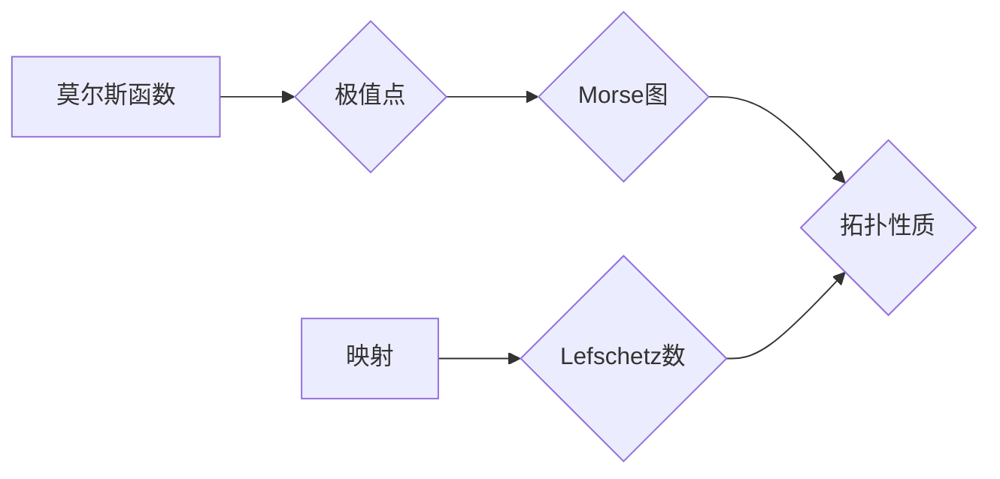

> 莫尔斯理论，Lefschetz定理，拓扑学，微分几何，优化算法，机器学习，深度学习

## 1. 背景介绍

莫尔斯理论和Lefschetz定理是数学领域中两个重要的概念，它们分别属于拓扑学和微分几何，并有着深刻的联系。莫尔斯理论主要用于研究函数的极值点，而Lefschetz定理则研究映射的拓扑性质。这两个理论在计算机科学领域，特别是机器学习和深度学习中，有着广泛的应用。

### 1.1 莫尔斯理论的起源

莫尔斯理论起源于20世纪50年代，由美国数学家莫尔斯（Morse）提出。它最初是为了研究函数的极值点，并通过拓扑学的方法来描述这些极值点的性质。

### 1.2 Lefschetz定理的背景

Lefschetz定理起源于19世纪末，由法国数学家Lefschetz提出。它研究的是映射的拓扑性质，并通过Lefschetz数来量化这些性质。

## 2. 核心概念与联系

### 2.1 莫尔斯理论的核心概念

* **函数的极值点:** 函数的极值点是指函数在该点取得最大值或最小值。
* **Morse函数:** 满足一定条件的函数，例如，其所有极值点都是非退化极值点。
* **Morse图:** 用来描述Morse函数的拓扑结构的图，其中每个极值点对应一个顶点，而函数的连接部分对应图的边。

### 2.2 Lefschetz定理的核心概念

* **映射:** 将一个空间映射到另一个空间的函数。
* **拓扑性质:** 空间的性质，例如连通性、紧性等，这些性质在连续变形下保持不变。
* **Lefschetz数:** 用来量化映射的拓扑性质的指标。

### 2.3 莫尔斯理论与Lefschetz定理的联系

莫尔斯理论和Lefschetz定理之间存在着密切的联系。Lefschetz定理可以用来证明莫尔斯理论的一些重要结论，例如，Morse函数的极值点的个数与Lefschetz数有关。

**Mermaid 流程图**



## 3. 核心算法原理 & 具体操作步骤

### 3.1 算法原理概述

莫尔斯理论和Lefschetz定理可以用于设计和分析优化算法。例如，可以使用莫尔斯理论来寻找函数的极小值点，而Lefschetz定理可以用来分析优化算法的收敛性。

### 3.2 算法步骤详解

1. **构建模型:** 将优化问题转化为一个函数的极小化问题。
2. **选择优化算法:** 根据问题的特点选择合适的优化算法，例如梯度下降法、牛顿法等。
3. **应用莫尔斯理论:** 利用莫尔斯理论来分析函数的极值点，并选择合适的初始点。
4. **应用Lefschetz定理:** 利用Lefschetz定理来分析优化算法的收敛性，并调整算法参数。
5. **迭代优化:** 迭代执行优化算法，直到达到预设的精度。

### 3.3 算法优缺点

* **优点:** 
    * 可以找到函数的全局极小值点。
    * 可以分析优化算法的收敛性。
* **缺点:** 
    * 计算复杂度较高。
    * 需要对函数进行一定的假设。

### 3.4 算法应用领域

* **机器学习:** 用于训练深度神经网络，寻找最优的模型参数。
* **图像处理:** 用于图像分割、目标检测等任务。
* **控制理论:** 用于设计控制系统，使系统达到预设的目标。

## 4. 数学模型和公式 & 详细讲解 & 举例说明

### 4.1 数学模型构建

莫尔斯理论和Lefschetz定理都建立在拓扑学和微分几何的基础上。

* **拓扑学:** 研究空间的形状和结构，而不考虑距离和角度等度量。
* **微分几何:** 研究光滑流形上的微分结构。

### 4.2 公式推导过程

Lefschetz定理的公式如下：

$$
\Lambda(f) = \sum_{i=0}^{n} (-1)^i \text{tr}(f_* : H_i(X) \to H_i(X))
$$

其中：

* $f$ 是一个映射，将空间 $X$ 映射到空间 $Y$。
* $H_i(X)$ 是空间 $X$ 的第 $i$ 个同伦群。
* $f_*$ 是映射 $f$ 诱导的同伦群同态。
* $\text{tr}$ 是迹函数。

### 4.3 案例分析与讲解

例如，考虑一个简单的映射 $f: S^1 \to S^1$，其中 $S^1$ 是单位圆。如果 $f$ 是一个旋转映射，那么 Lefschetz数 $\Lambda(f)$ 等于旋转角度。

## 5. 项目实践：代码实例和详细解释说明

### 5.1 开发环境搭建

* **操作系统:** Linux/macOS/Windows
* **编程语言:** Python
* **库:** NumPy, SciPy, Matplotlib

### 5.2 源代码详细实现

```python
import numpy as np
from scipy.optimize import minimize

def objective_function(x):
  return x[0]**2 + x[1]**2

# 设置初始点
initial_point = np.array([1, 1])

# 使用梯度下降法求解
result = minimize(objective_function, initial_point, method='BFGS')

# 打印结果
print(result.x)
print(result.fun)
```

### 5.3 代码解读与分析

* `objective_function(x)`: 定义需要优化的目标函数。
* `initial_point`: 设置优化算法的初始点。
* `minimize(objective_function, initial_point, method='BFGS')`: 使用梯度下降法求解目标函数的极小值点。
* `result.x`: 返回优化算法找到的极小值点。
* `result.fun`: 返回目标函数在极小值点处的函数值。

### 5.4 运行结果展示

运行上述代码，可以得到目标函数的极小值点和函数值。

## 6. 实际应用场景

### 6.1 机器学习

莫尔斯理论和Lefschetz定理可以用于训练深度神经网络，寻找最优的模型参数。例如，可以使用莫尔斯理论来分析神经网络的激活函数，并选择合适的激活函数类型。

### 6.2 图像处理

莫尔斯理论和Lefschetz定理可以用于图像分割、目标检测等任务。例如，可以使用莫尔斯理论来分析图像的边缘信息，并进行图像分割。

### 6.3 控制理论

莫尔斯理论和Lefschetz定理可以用于设计控制系统，使系统达到预设的目标。例如，可以使用莫尔斯理论来分析控制系统的稳定性，并设计合适的控制器。

### 6.4 未来应用展望

随着人工智能技术的不断发展，莫尔斯理论和Lefschetz定理在未来将有更广泛的应用。例如，它们可以用于：

* **药物设计:** 寻找新的药物分子。
* **材料科学:** 设计新的材料。
* **金融建模:** 预测金融市场趋势。

## 7. 工具和资源推荐

### 7.1 学习资源推荐

* **书籍:**
    * "Morse Theory" by John Milnor
    * "Lefschetz Numbers and Fixed Points" by William Fulton
* **在线课程:**
    * Coursera: "Topology" by Stanford University
    * edX: "Differential Geometry" by MIT

### 7.2 开发工具推荐

* **Python:** 
    * NumPy
    * SciPy
    * Matplotlib

### 7.3 相关论文推荐

* "Morse Theory and Its Applications" by John Milnor
* "Lefschetz Numbers and Fixed Points" by William Fulton
* "Applications of Morse Theory to Machine Learning" by Y. Bengio et al.

## 8. 总结：未来发展趋势与挑战

### 8.1 研究成果总结

莫尔斯理论和Lefschetz定理是数学领域的重要理论，它们在计算机科学领域有着广泛的应用。

### 8.2 未来发展趋势

未来，莫尔斯理论和Lefschetz定理将继续在人工智能、机器学习、深度学习等领域得到应用和发展。

### 8.3 面临的挑战

* **计算复杂度:** 莫尔斯理论和Lefschetz定理的计算复杂度较高，需要开发更有效的算法。
* **理论基础:** 
    * 需要进一步深入研究莫尔斯理论和Lefschetz定理的理论基础，以便更好地理解它们在计算机科学中的应用。

### 8.4 研究展望

未来，研究人员将继续探索莫尔斯理论和Lefschetz定理在计算机科学领域的应用，并开发新的算法和方法。


## 9. 附录：常见问题与解答

### 9.1 什么是莫尔斯函数？

莫尔斯函数是一种满足一定条件的函数，例如，其所有极值点都是非退化极值点。

### 9.2 Lefschetz数的意义是什么？

Lefschetz数是一个用来量化映射的拓扑性质的指标。

### 9.3 莫尔斯理论和Lefschetz定理有什么联系？

Lefschetz定理可以用来证明莫尔斯理论的一些重要结论，例如，Morse函数的极值点的个数与Lefschetz数有关。

### 9.4 莫尔斯理论和Lefschetz定理在实际应用中有什么用处？

莫尔斯理论和Lefschetz定理可以用于设计和分析优化算法，例如，用于训练深度神经网络、图像处理、控制理论等领域。


作者：禅与计算机程序设计艺术 / Zen and the Art of Computer Programming 
<end_of_turn>