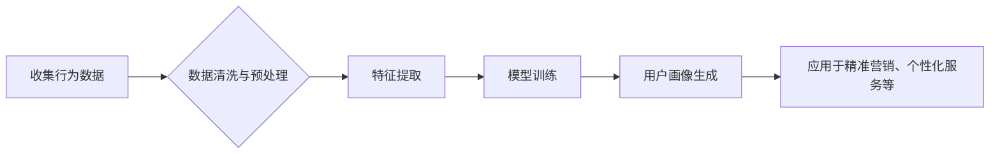

> 用户画像，行为数据，数据挖掘，机器学习，推荐系统，个性化服务

## 1. 背景介绍

在当今数据爆炸的时代，用户行为数据已成为企业洞察用户需求、精准营销、提供个性化服务的宝贵资源。用户画像作为一种基于数据分析的用户描述，通过收集和分析用户的行为数据，构建用户画像可以帮助企业更深入地了解用户的兴趣、偏好、需求等，从而实现精准营销、个性化服务等目标。

传统的用户画像主要依赖于用户填写的问卷调查、个人资料等静态数据，但这些数据往往缺乏真实性和全面性。随着互联网技术的快速发展，用户在网络上的行为数据日益丰富，例如浏览记录、搜索历史、购买记录、评论点赞等，这些行为数据能够更真实地反映用户的兴趣和需求。

## 2. 核心概念与联系

**2.1 用户画像**

用户画像是指通过对用户行为、人口统计、兴趣爱好等多方面数据的分析和挖掘，构建出一个用户特征的综合描述。用户画像可以帮助企业了解用户的基本信息、兴趣爱好、消费习惯、行为模式等，从而实现精准营销、个性化服务等目标。

**2.2 行为数据**

行为数据是指用户在使用产品或服务时所产生的各种动作和事件，例如：

* **浏览行为:** 用户访问网页、点击链接、停留时间等。
* **搜索行为:** 用户在搜索引擎中输入的关键词、搜索结果点击等。
* **购买行为:** 用户购买商品、支付方式、购买频率等。
* **评论行为:** 用户对商品或服务发表评论、点赞、分享等。
* **社交行为:** 用户在社交平台上的互动行为，例如关注、转发、评论等。

**2.3 数据挖掘与机器学习**

数据挖掘和机器学习是构建用户画像的关键技术。数据挖掘是指从海量数据中发现隐藏的模式和规律，而机器学习则是通过算法训练模型，从数据中学习知识，并用于预测和决策。

**2.4 流程图**



## 3. 核心算法原理 & 具体操作步骤

### 3.1 算法原理概述

构建用户画像的算法主要包括以下几种：

* **聚类算法:** 将用户根据相似度进行分组，每个分组代表一个用户画像。常用的聚类算法包括K-means、层次聚类等。
* **分类算法:** 根据用户的特征，将用户分类到不同的用户画像类别中。常用的分类算法包括决策树、支持向量机、神经网络等。
* **关联规则挖掘:** 发现用户行为之间的关联关系，例如哪些用户同时购买了哪些商品。常用的关联规则挖掘算法包括Apriori、FP-Growth等。

### 3.2 算法步骤详解

以K-means聚类算法为例，构建用户画像的具体步骤如下：

1. **数据收集:** 收集用户的行为数据，例如浏览记录、购买记录、评论记录等。
2. **数据预处理:** 对收集到的数据进行清洗、转换、归一化等处理，去除噪声数据，并将数据转换为算法可处理的格式。
3. **特征提取:** 从用户行为数据中提取特征，例如用户浏览过的商品类别、购买频率、评论内容等。
4. **聚类:** 使用K-means算法将用户根据特征相似度进行聚类，每个聚类代表一个用户画像。
5. **用户画像生成:** 对每个聚类进行分析，总结出该聚类用户的共同特征，并生成相应的用户画像描述。

### 3.3 算法优缺点

**优点:**

* 能够发现用户行为之间的隐性模式和规律。
* 可以根据用户的行为特征，将用户进行细分，构建更精准的用户画像。
* 可以帮助企业进行精准营销、个性化服务等。

**缺点:**

* 需要大量的用户行为数据作为训练样本。
* 算法的性能受数据质量和特征选择的影响较大。
* 难以解释算法的决策结果。

### 3.4 算法应用领域

* **电商:** 建立用户画像，进行精准营销、个性化推荐等。
* **金融:** 识别用户风险等级，进行精准授信、反欺诈等。
* **医疗:** 分析患者的病史和症状，进行精准诊断、个性化治疗等。
* **教育:** 分析学生的学习行为，进行个性化教学、学习推荐等。

## 4. 数学模型和公式 & 详细讲解 & 举例说明

### 4.1 数学模型构建

用户画像构建可以看作是一个特征工程和机器学习模型训练的过程。

**特征工程:**

* **用户行为特征:** 浏览记录、搜索历史、购买记录、评论点赞等。
* **人口统计特征:** 年龄、性别、地域、职业等。
* **兴趣爱好特征:** 用户关注的主题、喜欢的商品类别、阅读的书籍等。

**机器学习模型:**

* **聚类算法:** K-means、层次聚类等。
* **分类算法:** 决策树、支持向量机、神经网络等。

### 4.2 公式推导过程

**K-means聚类算法:**

目标函数:

$$
J = \sum_{i=1}^{k} \sum_{x \in C_i} ||x - \mu_i||^2
$$

其中:

* $k$ 是聚类数。
* $C_i$ 是第 $i$ 个聚类。
* $x$ 是一个数据点。
* $\mu_i$ 是第 $i$ 个聚类的中心点。

迭代步骤:

1. 随机初始化 $k$ 个中心点。
2. 将每个数据点分配到最近的中心点所在的聚类。
3. 计算每个聚类的中心点。
4. 重复步骤 2 和 3，直到中心点不再变化。

### 4.3 案例分析与讲解

假设我们有一个电商平台，想要构建用户的购买行为画像。我们可以收集用户的购买记录数据，提取特征，例如购买商品类别、购买频率、购买金额等。然后使用K-means聚类算法将用户进行聚类，每个聚类代表一个购买行为类型的用户画像。例如，我们可以发现一个聚类用户喜欢购买电子产品，另一个聚类用户喜欢购买服装。

## 5. 项目实践：代码实例和详细解释说明

### 5.1 开发环境搭建

* Python 3.x
* scikit-learn
* pandas
* matplotlib

### 5.2 源代码详细实现

```python
import pandas as pd
from sklearn.cluster import KMeans

# 加载数据
data = pd.read_csv('user_behavior_data.csv')

# 特征提取
features = data[['购买商品类别', '购买频率', '购买金额']]

# 训练K-means模型
kmeans = KMeans(n_clusters=3)
kmeans.fit(features)

# 获取聚类结果
labels = kmeans.labels_

# 将聚类结果添加到数据中
data['聚类'] = labels

# 分析每个聚类的特征
for i in range(3):
    print(f'聚类 {i} 的特征:')
    print(data[data['聚类'] == i][['购买商品类别', '购买频率', '购买金额']].describe())

# 可视化聚类结果
import matplotlib.pyplot as plt
plt.scatter(data['购买商品类别'], data['购买频率'], c=data['聚类'])
plt.xlabel('购买商品类别')
plt.ylabel('购买频率')
plt.title('用户购买行为聚类')
plt.show()
```

### 5.3 代码解读与分析

* 首先，我们加载用户行为数据，并提取相关的特征。
* 然后，我们使用K-means算法训练模型，将用户进行聚类。
* 接着，我们获取聚类结果，并将结果添加到数据中。
* 最后，我们分析每个聚类的特征，并使用可视化工具展示聚类结果。

### 5.4 运行结果展示

运行代码后，我们可以得到以下结果：

* 每个聚类的特征描述，例如平均购买商品类别、购买频率、购买金额等。
* 用户购买行为的聚类结果可视化图，可以直观地看到不同聚类的用户分布情况。

## 6. 实际应用场景

### 6.1 精准营销

* 根据用户画像，精准推送广告和促销信息，提高广告转化率。
* 为不同用户群体定制个性化营销方案，提高用户粘性。

### 6.2 个性化服务

* 根据用户的兴趣爱好和行为偏好，推荐个性化商品和服务。
* 提供个性化的用户体验，例如定制化新闻订阅、个性化音乐推荐等。

### 6.3 产品开发

* 通过分析用户行为数据，了解用户的需求和痛点，为产品开发提供参考。
* 根据用户画像，设计更符合用户需求的产品功能和界面。

### 6.4 未来应用展望

* **更精准的用户画像:** 利用更先进的机器学习算法和数据分析技术，构建更精准的用户画像。
* **多维度的用户画像:** 将用户行为数据与其他数据源，例如人口统计数据、社交数据等进行融合，构建更全面的用户画像。
* **实时更新的用户画像:** 利用实时数据流，实时更新用户画像，以便更好地应对用户的动态变化。

## 7. 工具和资源推荐

### 7.1 学习资源推荐

* **书籍:**
    * 《数据挖掘：概念与技术》
    * 《机器学习》
* **在线课程:**
    * Coursera: 数据挖掘与机器学习
    * edX: 人工智能与机器学习

### 7.2 开发工具推荐

* **Python:** 数据分析和机器学习的常用编程语言。
* **scikit-learn:** Python机器学习库。
* **pandas:** Python数据分析库。
* **matplotlib:** Python数据可视化库。

### 7.3 相关论文推荐

* **K-means聚类算法:**
    * MacQueen, J. (1967). Some methods for classification and analysis of multivariate observations.
* **用户画像构建:**
    * Chen, Y., & Liu, H. (2018). User profiling based on behavior data: A survey.

## 8. 总结：未来发展趋势与挑战

### 8.1 研究成果总结

行为数据在用户画像构建中发挥着越来越重要的作用，通过数据挖掘和机器学习技术，我们可以构建更精准、更全面的用户画像，为企业提供更有效的营销和服务策略。

### 8.2 未来发展趋势

* **更精准的用户画像:** 利用更先进的机器学习算法和数据分析技术，构建更精准的用户画像。
* **多维度的用户画像:** 将用户行为数据与其他数据源，例如人口统计数据、社交数据等进行融合，构建更全面的用户画像。
* **实时更新的用户画像:** 利用实时数据流，实时更新用户画像，以便更好地应对用户的动态变化。

### 8.3 面临的挑战

* **数据质量问题:** 行为数据往往存在噪声、缺失值等问题，需要进行有效的数据清洗和预处理。
* **隐私保护问题:** 用户行为数据包含敏感信息，需要采取有效措施保护用户隐私。
* **算法解释性问题:** 一些机器学习算法的决策结果难以解释，需要开发更可解释的算法模型。

### 8.4 研究展望

未来，用户画像构建的研究将更加注重以下几个方面:

* **个性化用户画像:** 构建更个性化的用户画像，满足不同用户群体的个性化需求。
* **跨平台用户画像:** 将不同平台的用户行为数据进行整合，构建更全面的跨平台用户画像。
* **动态用户画像:** 利用实时数据流，构建动态更新的用户画像，更好地应对用户的动态变化。

## 9. 附录：常见问题与解答

**1. 如何选择合适的聚类算法？**

选择合适的聚类算法需要根据数据的特点和应用场景进行选择。例如，对于数据分布较为均匀的情况，可以使用K-means算法；对于数据分布较为复杂的情况，可以使用层次聚类算法。

